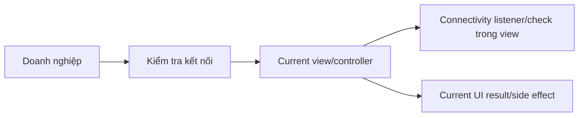

# Diagrams — WMB_CONNECTIVITY

```mermaid
flowchart LR
  A[Doanh nghiệp] --> V[Kiểm tra kết nối]
  V --> C[Current view/controller]
  C --> D[Connectivity listener/check trong view]
  C --> O[Current UI result/side effect]
```

Sơ đồ mô tả current behavior, không phải target architecture.

