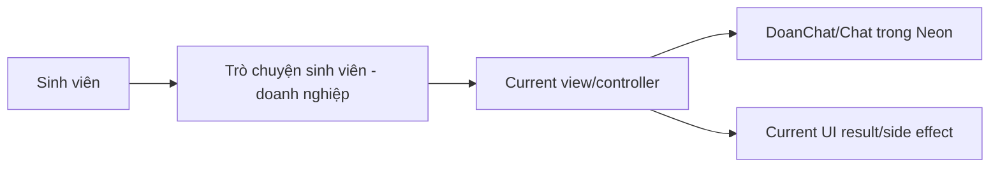

# Diagrams — WMS_CHAT

```mermaid
flowchart LR
  A[Sinh viên] --> V[Trò chuyện sinh viên - doanh nghiệp]
  V --> C[Current view/controller]
  C --> D[DoanChat/Chat trong Neon]
  C --> O[Current UI result/side effect]
```

Sơ đồ mô tả current behavior, không phải target architecture.

