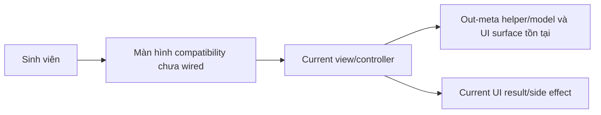

# Diagrams — WMS_COMPATIBILITY

```mermaid
flowchart LR
  A[Sinh viên] --> V[Màn hình compatibility chưa wired]
  V --> C[Current view/controller]
  C --> D[Out-meta helper/model và UI surface tồn tại]
  C --> O[Current UI result/side effect]
```

Sơ đồ mô tả current behavior, không phải target architecture.

