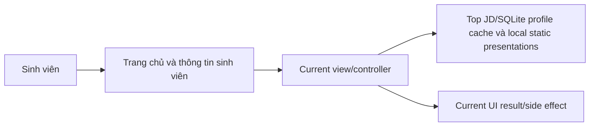

# Diagrams — WMS_HOME_DASHBOARD

```mermaid
flowchart LR
  A[Sinh viên] --> V[Trang chủ và thông tin sinh viên]
  V --> C[Current view/controller]
  C --> D[Top JD/SQLite profile cache và local static presentations]
  C --> O[Current UI result/side effect]
```

Sơ đồ mô tả current behavior, không phải target architecture.

