# 02. BIỂU ĐỒ HỆ THỐNG STUDY2WORK

> Phiên bản thiết kế: `V1-PILOT`
>
> Phạm vi: Platform Identity, Study, Work và các tích hợp VNPAY, MoMo, object storage, ClamAV, email, WebSocket và AI provider.
>
> Quy ước: tài liệu này sở hữu các ID `UC-*`, `AC-*`, `CLS-*`, `SEQ-*`; đặc tả API, bảng và màn hình chỉ được tham chiếu bằng ID, không được định nghĩa lặp lại tại đây.

## 1. Cách đọc và quy ước chung

- Mermaid không có cú pháp use-case UML chính thức. Các sơ đồ `UC-*` vì vậy dùng `flowchart LR`: tác nhân nằm ngoài subgraph hệ thống; các capability nằm trong đúng bounded context.
- Mũi tên liền biểu diễn lời gọi đồng bộ hoặc chuyển trạng thái trong cùng transaction. Mũi tên nét đứt biểu diễn event, hàng đợi, projection hoặc quan hệ logic không có khóa ngoại vật lý.
- Identity DB, Study DB và Work DB tách vật lý. Không sơ đồ nào được hiểu là cho phép join hoặc foreign key xuyên database.
- `Idempotency-Key` được kiểm tra trước mutation; `If-Match` được kiểm tra trước sửa draft hoặc review. Nhánh duplicate trả lại kết quả đã chốt; nhánh stale trả `VERSION_CONFLICT` hoặc mã nghiệp vụ chuyên biệt.
- REST là nguồn sự thật cho lịch sử chat và trạng thái nghiệp vụ. WebSocket chỉ phân phối sự kiện nhanh; client luôn reconcile bằng REST sau reconnect.
- Nhãn “AI đề xuất” không đồng nghĩa quyết định. AI không được tự publish, đổi trạng thái ATS, reject, offer hoặc hire.

### 1.1. Ranh giới hệ thống

| Khối | Sở hữu | Không sở hữu |
|---|---|---|
| Platform Identity | Email, credential, verification, session, refresh-token family, global role, account security | Hồ sơ học tập, tenant membership, ATS, payment ledger |
| Study | Hồ sơ học, content version, enrollment, progress, assessment, evidence, community, hỗ trợ | Credential, Work application, payment entitlement |
| Work | Candidate/CV, enterprise, university, job, application, ATS, interview, chat, AI job, billing và promotion | Password, Study progress nguồn, dữ liệu thẻ |
| Nhà cung cấp ngoài | Thanh toán, email, object storage, malware scan, AI inference | Quyết định nghiệp vụ cuối cùng và dữ liệu nguồn của ba dịch vụ |

### 1.2. Danh mục use case canonical

| ID | Use case | Kết quả nghiệp vụ |
|---|---|---|
| `UC-IAM-001` | Đăng ký và xác minh email | Tài khoản từ `PENDING_EMAIL_VERIFICATION` thành `ACTIVE` |
| `UC-IAM-002` | Đăng nhập, MFA và quản lý session | Cấp access/refresh token hợp lệ hoặc chặn an toàn |
| `UC-IAM-003` | RBAC và quản trị vòng đời account | Role/status thay đổi, session bị thu hồi và event được phát |
| `UC-STU-001` | Xem catalog và học course standalone | Learner enroll đúng published course version, không cần onboarding |
| `UC-STU-002` | Onboarding, gợi ý và primary path | Chỉ một primary path `ACTIVE`, cooldown đổi path đúng 168 giờ |
| `UC-STU-003` | Học lesson và ghi nhận progress | Fact tiến độ monotonic; snapshot course/path có thể rebuild |
| `UC-STU-004` | Làm và chấm assessment | Quiz auto-grade; text/link/file được review thủ công |
| `UC-STU-005` | Phát hành và thu hồi evidence | Evidence immutable, versioned, có trạng thái và audit |
| `UC-STU-006` | Soạn, kiểm tra và publish nội dung | Published revision bất biến; revision cũ tiếp tục phục vụ enrollment |
| `UC-STU-007` | Notification, community và support | Người học nhận thông tin, chấp thuận rule và được hỗ trợ có lịch sử |
| `UC-STU-008` | Báo cáo và vận hành Study | Operator xem aggregate, sửa sai qua adjustment có audit |
| `UC-WRK-001` | Quản lý candidate profile, CV và portfolio | Snapshot có version; profile mặc định private |
| `UC-WRK-002` | Candidate search và invitation | Chỉ index profile opt-in; không lộ contact/CV/evidence |
| `UC-WRK-003` | Quản trị enterprise tenant | Membership và quyền luôn được ràng buộc server-side theo tenant |
| `UC-WRK-004` | Soạn, duyệt và publish job | Job revision published bất biến, state transition hợp lệ |
| `UC-WRK-005` | Apply và quản lý ATS | Một application mỗi candidate/job; mọi chuyển trạng thái có history |
| `UC-WRK-006` | Chọn Study evidence khi apply | Work lưu consent/request/snapshot theo application, không lập kho toàn cục |
| `UC-WRK-007` | Lập và quản lý interview | Schedule version chống ghi đè; có confirm/reschedule/no-show/cancel |
| `UC-WRK-008` | Chat theo application | Một conversation 1–1, recruiter phải assigned, terminal thì read-only |
| `UC-WRK-009` | TopCV, TopJD và sponsored placement | Entitlement được tiêu thụ; kết quả tài trợ luôn gắn nhãn |
| `UC-WRK-010` | Moderation và báo cáo Work | Nội dung vi phạm được xử lý; báo cáo có tenant và privacy guard |
| `UC-UNI-001` | Tenant trường, affiliation và cohort | Membership/affiliation có kỳ hiệu lực và audit |
| `UC-UNI-002` | Internship, campus job và referral | Chương trình và referral được theo dõi end-to-end |
| `UC-UNI-003` | Consent và báo cáo trường | Chỉ xem PII khi consent còn hiệu lực; aggregate có nhóm tối thiểu 10 |
| `UC-PAY-001` | Tạo checkout VND | Payment intent immutable được gửi đến đúng provider adapter |
| `UC-PAY-002` | Webhook/IPN và entitlement | Chỉ callback xác thực, settled mới cấp entitlement đúng một lần |
| `UC-PAY-003` | Refund, chargeback và reconciliation | Ledger append-only, entitlement điều chỉnh có lịch sử |
| `UC-AIX-001` | Trợ lý soạn CV/JD | AI tạo draft có provenance; người dùng chọn áp dụng hoặc bỏ |
| `UC-AIX-002` | Match explanation và shortlist suggestion | AI chỉ đề xuất, không thay ATS status |
| `UC-AIX-003` | Governance và human approval | Prompt/model/version/input policy được audit; quyết định do người chịu trách nhiệm |
| `UC-OPS-001` | Moderation đa miền | Báo cáo được triage, quyết định và kháng nghị có audit |
| `UC-OPS-002` | Xóa/anonymize và legal hold | Grace 30 ngày, dữ liệu được xử lý theo ownership và retention |
| `UC-OPS-003` | Quan sát, retry và khôi phục | DLQ/reconciliation/backup bảo đảm RPO và RTO pilot |

## 2. Use-case maps

### Biểu đồ UC-IAM-001 — Bản đồ Platform Identity

- **Mục đích:** gom duy nhất mọi luồng credential, xác minh, session, MFA, role và account lifecycle.
- **Tác nhân:** Guest, User, Privileged User, Platform Admin, Study, Work, Email Provider.
- **Tiền điều kiện:** client dùng HTTPS; issuer/audience và JWKS đã cấu hình; email normalized trước khi tra cứu.
- **Kết thúc:** account/session được cập nhật nhất quán; security event được ghi audit và phát qua outbox nếu có thay đổi liên dịch vụ.
- **Liên kết:** đăng ký/xác minh/đăng nhập/refresh/admin `API-IAM-001`, `API-IAM-002`, `API-IAM-004`, `API-IAM-006`, `API-IAM-022`; user/credential/session/audit/outbox `TBL-IAM-001`, `TBL-IAM-003`, `TBL-IAM-009`, `TBL-IAM-010`, `TBL-IAM-017`, `TBL-IAM-018`; `SCR-IAM-001`, `SCR-IAM-002`, `SCR-IAM-003`, `SCR-IAM-005`, `SCR-IAM-006`, `SCR-OPS-001`; `SEQ-IAM-001`, `SEQ-IAM-002`.

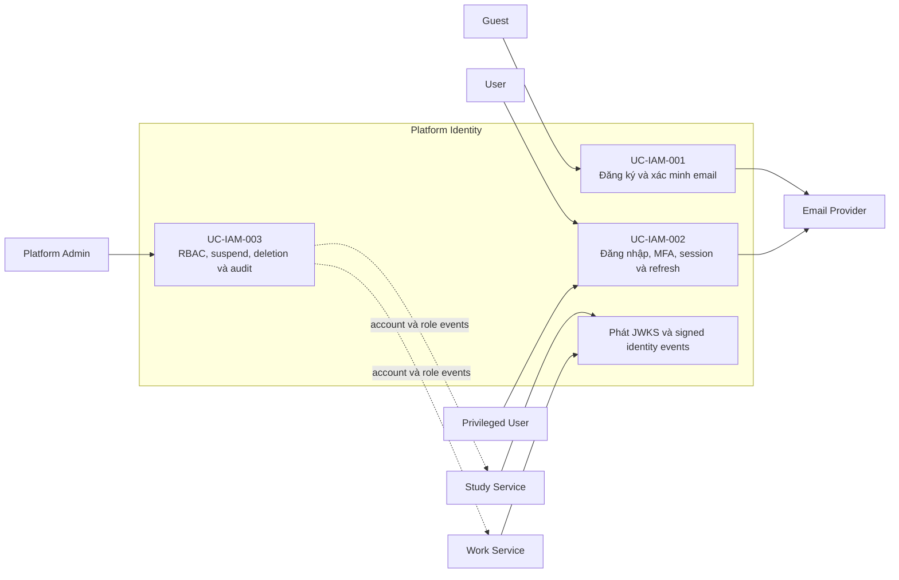
```mermaid
flowchart LR
    Guest[Guest]
    User[User]
    Priv[Privileged User]
    Admin[Platform Admin]
    Study[Study Service]
    Work[Work Service]
    Mail[Email Provider]

    subgraph IAM[Platform Identity]
        Reg["UC-IAM-001<br/>Đăng ký và xác minh email"]
        Login["UC-IAM-002<br/>Đăng nhập, MFA, session và refresh"]
        Life["UC-IAM-003<br/>RBAC, suspend, deletion và audit"]
        JWKS["Phát JWKS và signed identity events"]
    end

    Guest --> Reg
    User --> Login
    Priv --> Login
    Admin --> Life
    Reg --> Mail
    Login --> Mail
    Life -. account và role events .-> Study
    Life -. account và role events .-> Work
    Study --> JWKS
    Work --> JWKS
```

### Biểu đồ UC-STU-001 — Bản đồ Study

- **Mục đích:** thể hiện toàn bộ vòng đời học tập từ catalog đến completion/evidence và vận hành nội dung.
- **Tác nhân:** Guest, Learner, Content Author, Trusted Publisher, Reviewer, Support, Moderator, Study Admin, Work Service.
- **Tiền điều kiện:** nội dung public phải có published version; thao tác learner yêu cầu Identity account `ACTIVE`; chọn primary path yêu cầu onboarding hoàn tất.
- **Kết thúc:** learning fact và lịch sử bất biến được lưu; side effect chạy qua outbox; published content không bị sửa tại chỗ.
- **Liên kết:** catalog/enroll/path/progress/attempt/publish/evidence `API-STU-001`, `API-STU-016`, `API-STU-014`, `API-STU-020`, `API-STU-027`, `API-STU-056`, `API-STU-061`; `TBL-STU-001`, `TBL-STU-012`, `TBL-STU-027`, `TBL-STU-033`, `TBL-STU-040`; `SCR-STU-002`, `SCR-STU-005`, `SCR-STU-013`, `SCR-STU-016`, `SCR-STU-017`, `SCR-OPS-007`, `SCR-WRK-017`; `AC-STU-001..003`, `SEQ-STU-001..004`.

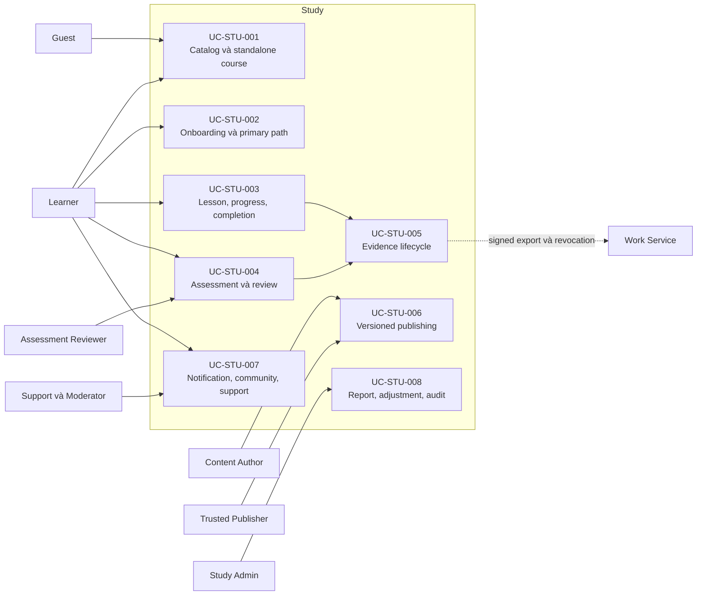
```mermaid
flowchart LR
    Guest[Guest]
    Learner[Learner]
    Author[Content Author]
    Publisher[Trusted Publisher]
    Reviewer[Assessment Reviewer]
    Support[Support và Moderator]
    Admin[Study Admin]
    Work[Work Service]

    subgraph STUDY[Study]
        Catalog["UC-STU-001<br/>Catalog và standalone course"]
        Path["UC-STU-002<br/>Onboarding và primary path"]
        Learn["UC-STU-003<br/>Lesson, progress, completion"]
        Assess["UC-STU-004<br/>Assessment và review"]
        Evidence["UC-STU-005<br/>Evidence lifecycle"]
        Publish["UC-STU-006<br/>Versioned publishing"]
        Engage["UC-STU-007<br/>Notification, community, support"]
        Operate["UC-STU-008<br/>Report, adjustment, audit"]
    end

    Guest --> Catalog
    Learner --> Catalog
    Learner --> Path
    Learner --> Learn
    Learner --> Assess
    Learner --> Engage
    Author --> Publish
    Publisher --> Publish
    Reviewer --> Assess
    Support --> Engage
    Admin --> Operate
    Learn --> Evidence
    Assess --> Evidence
    Evidence -. signed export và revocation .-> Work
```

### Biểu đồ UC-WRK-001 — Bản đồ Work

- **Mục đích:** mô tả chuỗi tuyển dụng từ hồ sơ ứng viên, job, sourcing, application đến interview/chat và sản phẩm premium.
- **Tác nhân:** Candidate, Recruiter, Enterprise Admin, Hiring Manager, Moderator, Study Service, Payment Service, AI Provider.
- **Tiền điều kiện:** candidate và enterprise member đã xác thực; tenant context được resolve từ membership server-side; job/application phải thuộc tenant hiện hành.
- **Kết thúc:** snapshot tuyển dụng và history được giữ bất biến; chỉ con người có quyền mới chuyển trạng thái ATS; contact/evidence không đi vào candidate-search index.
- **Liên kết:** profile/search/job/apply/ATS/interview/chat `API-WRK-005`, `API-WRK-051`, `API-WRK-043`, `API-WRK-023`, `API-WRK-058`, `API-WRK-060`, `API-WRK-032`; `TBL-WRK-004`, `TBL-WRK-016`, `TBL-WRK-033`, `TBL-WRK-041`, `TBL-WRK-049`, `TBL-WRK-053`, `TBL-WRK-054`; `SCR-WRK-011`, `SCR-WRK-036`, `SCR-WRK-034`, `SCR-WRK-017`, `SCR-WRK-040`, `SCR-WRK-041`, `SCR-WRK-021`; `AC-WRK-001..003`, `AC-INT-001`, `SEQ-WRK-001..005`, `SEQ-INT-001`.

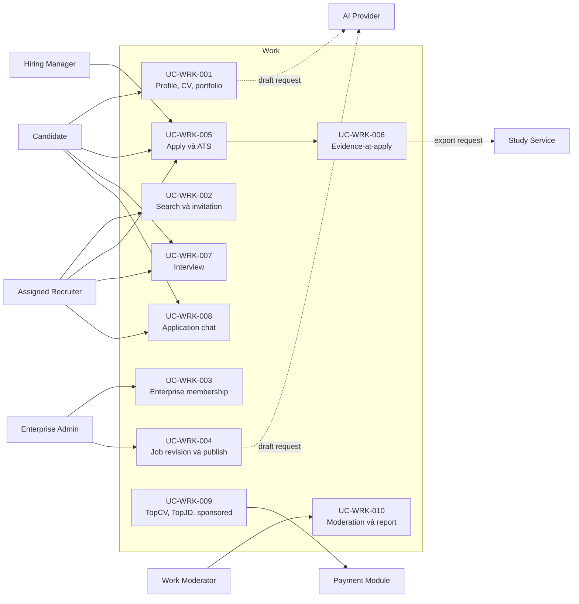
```mermaid
flowchart LR
    Candidate[Candidate]
    Recruiter[Assigned Recruiter]
    EntAdmin[Enterprise Admin]
    Hiring[Hiring Manager]
    Moderator[Work Moderator]
    Study[Study Service]
    Pay[Payment Module]
    AI[AI Provider]

    subgraph WORK[Work]
        Profile["UC-WRK-001<br/>Profile, CV, portfolio"]
        Search["UC-WRK-002<br/>Search và invitation"]
        Tenant["UC-WRK-003<br/>Enterprise membership"]
        Job["UC-WRK-004<br/>Job revision và publish"]
        ATS["UC-WRK-005<br/>Apply và ATS"]
        Ev["UC-WRK-006<br/>Evidence-at-apply"]
        Interview["UC-WRK-007<br/>Interview"]
        Chat["UC-WRK-008<br/>Application chat"]
        Premium["UC-WRK-009<br/>TopCV, TopJD, sponsored"]
        Ops["UC-WRK-010<br/>Moderation và report"]
    end

    Candidate --> Profile
    Candidate --> ATS
    Candidate --> Interview
    Candidate --> Chat
    Recruiter --> Search
    Recruiter --> ATS
    Recruiter --> Interview
    Recruiter --> Chat
    EntAdmin --> Tenant
    EntAdmin --> Job
    Hiring --> ATS
    Moderator --> Ops
    ATS --> Ev
    Ev -. export request .-> Study
    Premium --> Pay
    Profile -. draft request .-> AI
    Job -. draft request .-> AI
```

### Biểu đồ UC-UNI-001 — Bản đồ University

- **Mục đích:** xác định đúng quyền và luồng phối hợp giữa trường, sinh viên và doanh nghiệp mà không biến trường thành người xem mặc định mọi PII.
- **Tác nhân:** University Admin, Career Officer, Student/Candidate, Enterprise Recruiter, Platform Operator.
- **Tiền điều kiện:** university tenant đã được xác minh; membership, affiliation và consent còn hiệu lực.
- **Kết thúc:** program/referral được ghi nhận; báo cáo cá nhân bị chặn nếu thiếu consent; aggregate dưới 10 người không được hiển thị.
- **Liên kết:** affiliation/program/referral/report `API-UNI-005`, `API-UNI-010`, `API-UNI-014`, `API-UNI-015`; `TBL-WRK-019`, `TBL-WRK-023`, `TBL-WRK-026`, `TBL-WRK-029`, `TBL-WRK-030`, `TBL-WRK-031`; `SCR-UNI-004`, `SCR-UNI-007`, `SCR-UNI-010`, `SCR-UNI-011`; `AC-UNI-001`, `SEQ-UNI-001`.

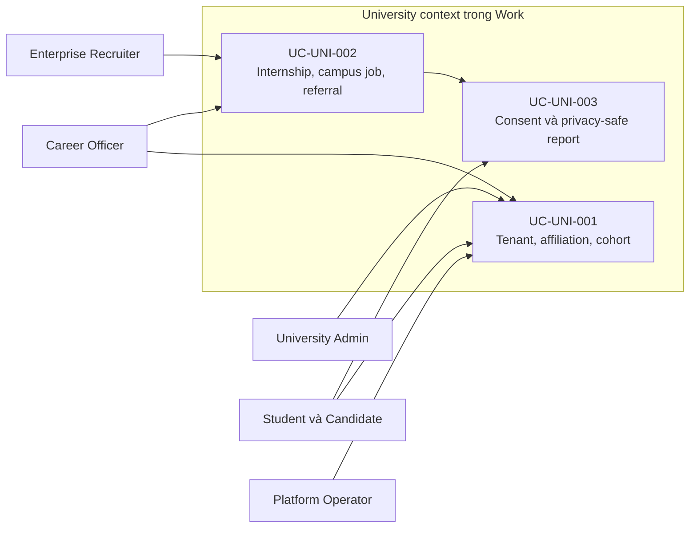
```mermaid
flowchart LR
    UA[University Admin]
    CO[Career Officer]
    Student[Student và Candidate]
    Recruiter[Enterprise Recruiter]
    PO[Platform Operator]

    subgraph UNI[University context trong Work]
        Tenant["UC-UNI-001<br/>Tenant, affiliation, cohort"]
        Program["UC-UNI-002<br/>Internship, campus job, referral"]
        Consent["UC-UNI-003<br/>Consent và privacy-safe report"]
    end

    UA --> Tenant
    CO --> Tenant
    CO --> Program
    Student --> Tenant
    Student --> Consent
    Recruiter --> Program
    PO --> Tenant
    Program --> Consent
```

### Biểu đồ UC-PAY-001 — Bản đồ Payment và entitlement

- **Mục đích:** tách payment intent, provider callback, ledger và entitlement; return URL không được cấp quyền sử dụng.
- **Tác nhân:** Student, Enterprise Buyer, Finance Operator, VNPAY, MoMo.
- **Tiền điều kiện:** order hợp lệ bằng VND; product/price version còn hiệu lực; idempotency key và provider credential đã có.
- **Kết thúc:** payment được đối soát; chỉ trạng thái `SETTLED` cấp entitlement đúng một lần; refund/chargeback không xóa lịch sử.
- **Liên kết:** checkout/VNPAY/MoMo/refund/reconcile `API-PAY-002`, `API-PAY-014`, `API-PAY-015`, `API-PAY-006`, `API-PAY-009`; `TBL-PAY-003`, `TBL-PAY-005`, `TBL-PAY-006`, `TBL-PAY-007`, `TBL-PAY-008`, `TBL-PAY-010`; `SCR-WRK-022`, `SCR-WRK-023`, `SCR-WRK-043`, `SCR-WRK-044`, `SCR-OPS-019`, `SCR-OPS-020`; `AC-PAY-001`, `SEQ-PAY-001`, `SEQ-PAY-002`.

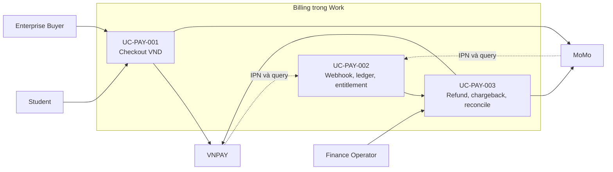
```mermaid
flowchart LR
    Student[Student]
    Buyer[Enterprise Buyer]
    Finance[Finance Operator]
    VNPAY[VNPAY]
    MoMo[MoMo]

    subgraph PAY[Billing trong Work]
        Checkout["UC-PAY-001<br/>Checkout VND"]
        Settle["UC-PAY-002<br/>Webhook, ledger, entitlement"]
        Reverse["UC-PAY-003<br/>Refund, chargeback, reconcile"]
    end

    Student --> Checkout
    Buyer --> Checkout
    Checkout --> VNPAY
    Checkout --> MoMo
    VNPAY -. IPN và query .-> Settle
    MoMo -. IPN và query .-> Settle
    Finance --> Reverse
    Reverse --> VNPAY
    Reverse --> MoMo
    Settle --> Reverse
```

### Biểu đồ UC-AIX-001 — Bản đồ AI có human-in-the-loop

- **Mục đích:** khoanh AI vào vai trò trợ lý tạo draft/giải thích/đề xuất, không trao quyền quyết định tuyển dụng.
- **Tác nhân:** Candidate, Recruiter, Hiring Manager, AI Operator, Ollama hoặc provider thay thế.
- **Tiền điều kiện:** người dùng đã đồng ý gửi dữ liệu được phép; excluded field đã được loại; prompt policy và model version đang active.
- **Kết thúc:** output, provenance và review được lưu; chỉ bản do người dùng áp dụng mới ảnh hưởng draft; ATS không tự đổi trạng thái.
- **Liên kết:** CV/JD/match/shortlist job, output và human review `API-AIX-001`, `API-AIX-002`, `API-AIX-003`, `API-AIX-004`, `API-AIX-005`, `API-AIX-006`; `TBL-AIX-001`, `TBL-AIX-002`, `TBL-AIX-003`, `TBL-AIX-004`, `TBL-AIX-005`, `TBL-AIX-006`; `SCR-WRK-013`, `SCR-WRK-034`, `SCR-WRK-039`, `SCR-WRK-040`; `AC-AIX-001`, `SEQ-AIX-001`.

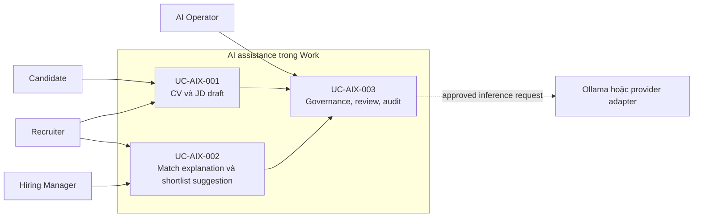
```mermaid
flowchart LR
    Candidate[Candidate]
    Recruiter[Recruiter]
    Hiring[Hiring Manager]
    AIOps[AI Operator]
    Provider[Ollama hoặc provider adapter]

    subgraph AIX[AI assistance trong Work]
        Draft["UC-AIX-001<br/>CV và JD draft"]
        Match["UC-AIX-002<br/>Match explanation và shortlist suggestion"]
        Govern["UC-AIX-003<br/>Governance, review, audit"]
    end

    Candidate --> Draft
    Recruiter --> Draft
    Recruiter --> Match
    Hiring --> Match
    AIOps --> Govern
    Draft --> Govern
    Match --> Govern
    Govern -. approved inference request .-> Provider
```

### Biểu đồ UC-OPS-001 — Bản đồ vận hành, moderation và dữ liệu cá nhân

- **Mục đích:** mô tả các luồng xuyên miền cần kiểm soát đặc biệt: report/appeal, xóa dữ liệu, legal hold, retry, backup và khôi phục.
- **Tác nhân:** Reporter, Moderator, Privacy Operator, Security Operator, System Worker.
- **Tiền điều kiện:** operator có permission phù hợp và MFA; mọi break-glass access có reason, expiry và audit.
- **Kết thúc:** quyết định có thể truy vết; deletion fan-out idempotent; legal hold thắng retention; DLQ không bị bỏ quên.
- **Liên kết:** job moderation/report/deletion/event replay `API-OPS-003`, `API-OPS-004`, `API-OPS-010`, `API-IAM-019`, `API-INT-006`, `API-INT-007`; `TBL-WRK-060`, `TBL-WRK-061`, `TBL-IAM-017`, `TBL-IAM-018`, `TBL-STU-053`, `TBL-WRK-064`; `SCR-OPS-009`, `SCR-OPS-010`, `SCR-OPS-021`, `SCR-IAM-006`; `AC-OPS-001`, `SEQ-OPS-001`.

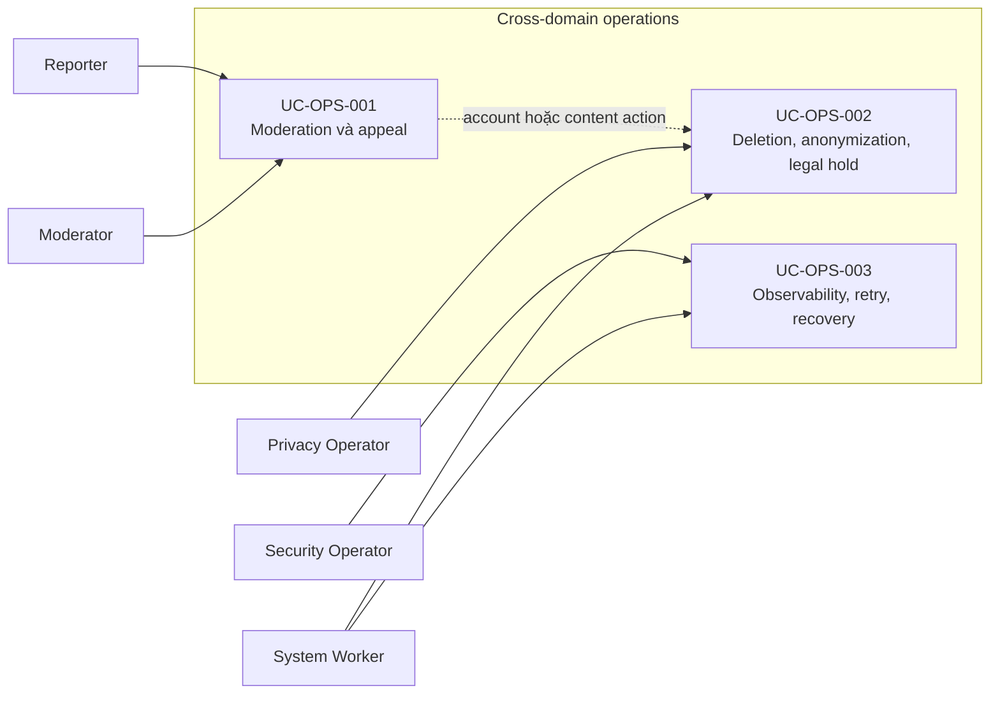
```mermaid
flowchart LR
    Reporter[Reporter]
    Moderator[Moderator]
    Privacy[Privacy Operator]
    Security[Security Operator]
    Worker[System Worker]

    subgraph OPS[Cross-domain operations]
        Mod["UC-OPS-001<br/>Moderation và appeal"]
        Delete["UC-OPS-002<br/>Deletion, anonymization, legal hold"]
        Recover["UC-OPS-003<br/>Observability, retry, recovery"]
    end

    Reporter --> Mod
    Moderator --> Mod
    Privacy --> Delete
    Security --> Recover
    Worker --> Delete
    Worker --> Recover
    Mod -. account hoặc content action .-> Delete
```

## 3. Activity diagrams

### AC-IAM-001 — Đăng ký, xác minh, đăng nhập, MFA và refresh

- **Mục đích:** bao phủ happy path cùng duplicate email, token hết hạn, resend, credential lock, suspension, MFA và refresh-token reuse.
- **Tác nhân:** Guest/User, Platform Identity, Email Provider.
- **Tiền điều kiện:** request qua HTTPS; email/password qua validation; privileged role bắt buộc đã enroll MFA.
- **Kết thúc:** session hợp lệ được cấp hoặc yêu cầu bị từ chối mà không lộ account enumeration; reuse thu hồi toàn session family.
- **Liên kết:** `UC-IAM-001..003`; `API-IAM-001`, `API-IAM-002`, `API-IAM-004`, `API-IAM-005`, `API-IAM-006`; `TBL-IAM-001`, `TBL-IAM-003`, `TBL-IAM-004`, `TBL-IAM-009`, `TBL-IAM-010`; `SCR-IAM-001`, `SCR-IAM-002`, `SCR-IAM-003`, `SCR-IAM-005`, `SCR-IAM-006`; `SEQ-IAM-001..002`.

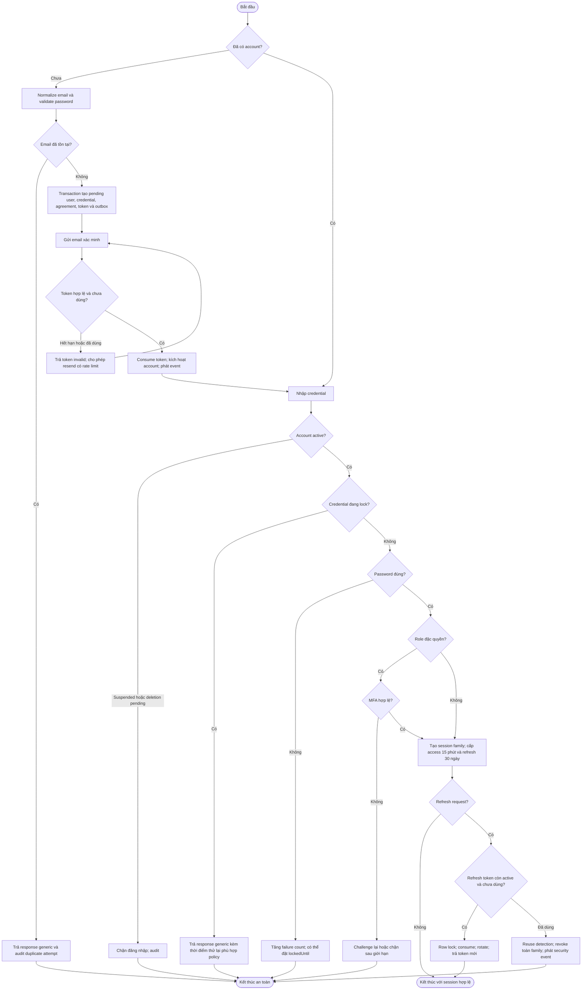
```mermaid
flowchart TD
    A([Bắt đầu]) --> B{Đã có account?}
    B -- Chưa --> C[Normalize email và validate password]
    C --> D{Email đã tồn tại?}
    D -- Có --> E[Trả response generic và audit duplicate attempt]
    D -- Không --> F[Transaction tạo pending user, credential, agreement, token và outbox]
    F --> G[Gửi email xác minh]
    G --> H{Token hợp lệ và chưa dùng?}
    H -- Hết hạn hoặc đã dùng --> I[Trả token invalid; cho phép resend có rate limit]
    I --> G
    H -- Có --> J[Consume token; kích hoạt account; phát event]
    B -- Có --> K[Nhập credential]
    J --> K
    K --> L{Account active?}
    L -- Suspended hoặc deletion pending --> M[Chặn đăng nhập; audit]
    L -- Có --> N{Credential đang lock?}
    N -- Có --> O[Trả response generic kèm thời điểm thử lại phù hợp policy]
    N -- Không --> P{Password đúng?}
    P -- Không --> Q[Tăng failure count; có thể đặt lockedUntil]
    P -- Có --> R{Role đặc quyền?}
    R -- Có --> S{MFA hợp lệ?}
    S -- Không --> T[Challenge lại hoặc chặn sau giới hạn]
    S -- Có --> U[Tạo session family; cấp access 15 phút và refresh 30 ngày]
    R -- Không --> U
    U --> V{Refresh request?}
    V -- Không --> Z([Kết thúc với session hợp lệ])
    V -- Có --> W{Refresh token còn active và chưa dùng?}
    W -- Có --> X[Row lock; consume; rotate; trả token mới]
    X --> Z
    W -- Đã dùng --> Y[Reuse detection; revoke toàn family; phát security event]
    E --> ZZ([Kết thúc an toàn])
    M --> ZZ
    O --> ZZ
    Q --> ZZ
    T --> ZZ
    Y --> ZZ
```

### AC-STU-001 — Standalone course, onboarding và primary-path switch

- **Mục đích:** phân biệt rõ standalone enrollment không cần onboarding với primary path có onboarding và cooldown.
- **Tác nhân:** Learner, Study API, Study Worker.
- **Tiền điều kiện:** Identity account `ACTIVE`; course/path có current published version.
- **Kết thúc:** enrollment pin đúng version; tối đa một primary path `ACTIVE`; switch giữ toàn bộ progress/attempt và tạo audit/outbox.
- **Liên kết:** `UC-STU-001..003`; catalog/enroll/path `API-STU-001`, `API-STU-016`, `API-STU-014`; `TBL-STU-001`, `TBL-STU-012`, `TBL-STU-026`, `TBL-STU-027`; `SCR-STU-002`, `SCR-STU-005`, `SCR-STU-011`, `SCR-STU-013`, `SCR-STU-014`; `SEQ-STU-001`.

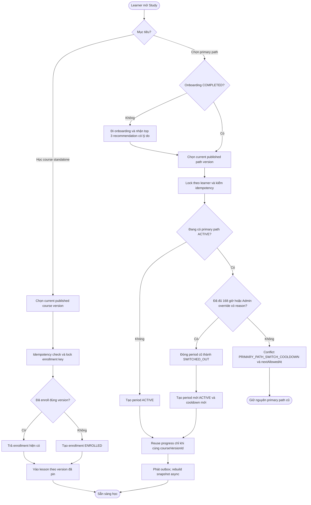
```mermaid
flowchart TD
    A([Learner mở Study]) --> B{Mục tiêu?}
    B -- Học course standalone --> C[Chọn current published course version]
    C --> D[Idempotency check và lock enrollment key]
    D --> E{Đã enroll đúng version?}
    E -- Có --> F[Trả enrollment hiện có]
    E -- Không --> G[Tạo enrollment ENROLLED]
    F --> H[Vào lesson theo version đã pin]
    G --> H
    B -- Chọn primary path --> I{Onboarding COMPLETED?}
    I -- Không --> J[Đi onboarding và nhận top 3 recommendation có lý do]
    J --> K[Chọn current published path version]
    I -- Có --> K
    K --> L[Lock theo learner và kiểm idempotency]
    L --> M{Đang có primary path ACTIVE?}
    M -- Không --> N[Tạo period ACTIVE]
    M -- Có --> O{Đã đủ 168 giờ hoặc Admin override có reason?}
    O -- Không --> P[Conflict PRIMARY_PATH_SWITCH_COOLDOWN và nextAllowedAt]
    O -- Có --> Q[Đóng period cũ thành SWITCHED_OUT]
    Q --> R[Tạo period mới ACTIVE và cooldown mới]
    N --> S[Reuse progress chỉ khi cùng courseVersionId]
    R --> S
    S --> T[Phát outbox; rebuild snapshot async]
    H --> U([Sẵn sàng học])
    T --> U
    P --> V([Giữ nguyên primary path cũ])
```

### AC-STU-002 — Học bài, assessment, file scan và completion

- **Mục đích:** nối source-of-truth progress với bốn loại assessment, scan file và evidence.
- **Tác nhân:** Learner, Study API, ClamAV Worker, Reviewer.
- **Tiền điều kiện:** learner có enrollment đúng course version; assessment placement có đúng một scope; attempt limit chưa hết.
- **Kết thúc:** fact completion monotonic; attempt submitted bất biến; course completion/evidence chỉ phát khi rule thỏa.
- **Liên kết:** `UC-STU-003..005`; progress/upload/attempt/review `API-STU-020`, `API-STU-030`, `API-STU-031`, `API-STU-032`, `API-STU-027`, `API-STU-048`; `TBL-STU-029`, `TBL-STU-033`, `TBL-STU-035`, `TBL-STU-036`, `TBL-STU-038`, `TBL-STU-040`; `SCR-STU-016`, `SCR-STU-017`, `SCR-STU-018`, `SCR-OPS-013`; `SEQ-STU-002`, `SEQ-STU-003`.

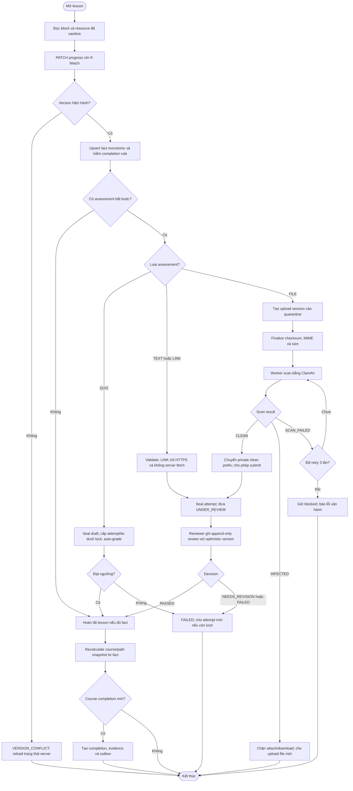
```mermaid
flowchart TD
    A([Mở lesson]) --> B[Đọc block và resource đã sanitize]
    B --> C[PATCH progress với If-Match]
    C --> D{Version hiện hành?}
    D -- Không --> E[VERSION_CONFLICT; reload trạng thái server]
    D -- Có --> F[Upsert fact monotonic và kiểm completion rule]
    F --> G{Có assessment bắt buộc?}
    G -- Không --> H[Hoàn tất lesson nếu đủ fact]
    G -- Có --> I{Loại assessment?}
    I -- QUIZ --> J[Seal draft; cấp attemptNo dưới lock; auto-grade]
    J --> K{Đạt ngưỡng?}
    K -- Có --> H
    K -- Không --> L[FAILED; cho attempt mới nếu còn lượt]
    I -- TEXT hoặc LINK --> M[Validate; LINK chỉ HTTPS và không server fetch]
    M --> N[Seal attempt; đưa UNDER_REVIEW]
    I -- FILE --> O[Tạo upload session vào quarantine]
    O --> P[Finalize checksum, MIME và size]
    P --> Q[Worker scan bằng ClamAV]
    Q --> R{Scan result}
    R -- CLEAN --> S[Chuyển private clean prefix; cho phép submit]
    R -- INFECTED --> T[Chặn attach/download; cho upload file mới]
    R -- SCAN_FAILED --> U{Đã retry 3 lần?}
    U -- Chưa --> Q
    U -- Rồi --> V[Giữ blocked; báo lỗi vận hành]
    S --> N
    N --> W[Reviewer ghi append-only review với optimistic version]
    W --> X{Decision}
    X -- PASSED --> H
    X -- NEEDS_REVISION hoặc FAILED --> L
    H --> Y[Recalculate course/path snapshot từ fact]
    Y --> Z{Course completion mới?}
    Z -- Có --> AA[Tạo completion, evidence và outbox]
    Z -- Không --> AB([Kết thúc])
    AA --> AB
    E --> AB
    L --> AB
    T --> AB
    V --> AB
```

### AC-STU-003 — Soạn và publish content version

- **Mục đích:** bảo đảm author không sửa published revision và publisher không bypass rights, sanitization, file scan hoặc validation.
- **Tác nhân:** Content Author, Trusted Publisher, Study API, Scan Worker.
- **Tiền điều kiện:** stable content entity tồn tại; author/publisher có local permission tương ứng.
- **Kết thúc:** draft được publish atomically hoặc giữ nguyên để sửa; version cũ chuyển `SUPERSEDED` nhưng vẫn truy cập bởi enrollment đã pin.
- **Liên kết:** `UC-STU-006`; draft/check/publish `API-STU-054`, `API-STU-055`, `API-STU-056`; `TBL-STU-010`, `TBL-STU-012`, `TBL-STU-017`, `TBL-STU-018`; `SCR-OPS-004`, `SCR-OPS-005`, `SCR-OPS-007`; `SEQ-STU-004`.

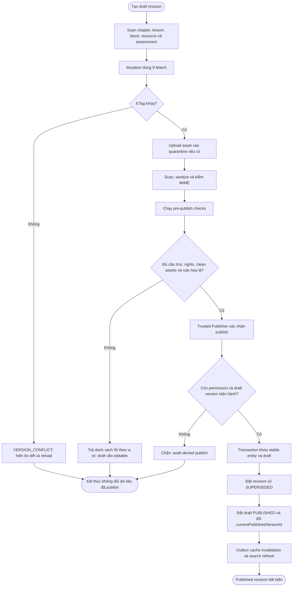
```mermaid
flowchart TD
    A([Tạo draft revision]) --> B[Soạn chapter, lesson, block, resource và assessment]
    B --> C[Mutation dùng If-Match]
    C --> D{ETag khớp?}
    D -- Không --> E[VERSION_CONFLICT; hiển thị diff và reload]
    D -- Có --> F[Upload asset vào quarantine nếu có]
    F --> G[Scan, sanitize và kiểm MIME]
    G --> H[Chạy pre-publish checks]
    H --> I{Đủ cấu trúc, rights, clean assets và rule hợp lệ?}
    I -- Không --> J[Trả danh sách lỗi theo vị trí; draft vẫn editable]
    I -- Có --> K[Trusted Publisher xác nhận publish]
    K --> L{Còn permission và draft version hiện hành?}
    L -- Không --> M[Chặn; audit denied publish]
    L -- Có --> N[Transaction khóa stable entity và draft]
    N --> O[Đặt revision cũ SUPERSEDED]
    O --> P[Đặt draft PUBLISHED và đổi currentPublishedVersionId]
    P --> Q[Outbox cache invalidation và search refresh]
    Q --> R([Published revision bất biến])
    E --> S([Kết thúc không đổi dữ liệu đã publish])
    J --> S
    M --> S
```

### AC-STU-004 — Notification, community, support và Study operations

- **Mục đích:** bao phủ các luồng engagement còn lại mà không cho notification/community/support sửa trực tiếp learning fact.
- **Tác nhân:** Learner, Study Worker, Community Moderator, Support Agent, Study Admin.
- **Tiền điều kiện:** learner active; community eligibility được tính từ enrollment/path; operator có local permission và MFA khi điều chỉnh dữ liệu.
- **Kết thúc:** notification deduplicated có delivery history; link cộng đồng chỉ mở sau khi chấp thuận rule hiện hành; support/adjustment có event/audit; report dùng snapshot aggregate.
- **Liên kết:** `UC-STU-007..008`; `API-STU-034`, `API-STU-039`, `API-STU-040`, `API-STU-041`, `API-STU-043`, `API-STU-045`, `API-STU-050`, `API-OPS-010`; `TBL-STU-042`, `TBL-STU-043`, `TBL-STU-044`, `TBL-STU-045`, `TBL-STU-046`, `TBL-STU-047`, `TBL-STU-048`, `TBL-STU-049`, `TBL-STU-050`, `TBL-STU-054`; `SCR-STU-020`, `SCR-STU-021`, `SCR-STU-022`, `SCR-OPS-014`, `SCR-OPS-015`, `SCR-OPS-021`; `SEQ-STU-005`.

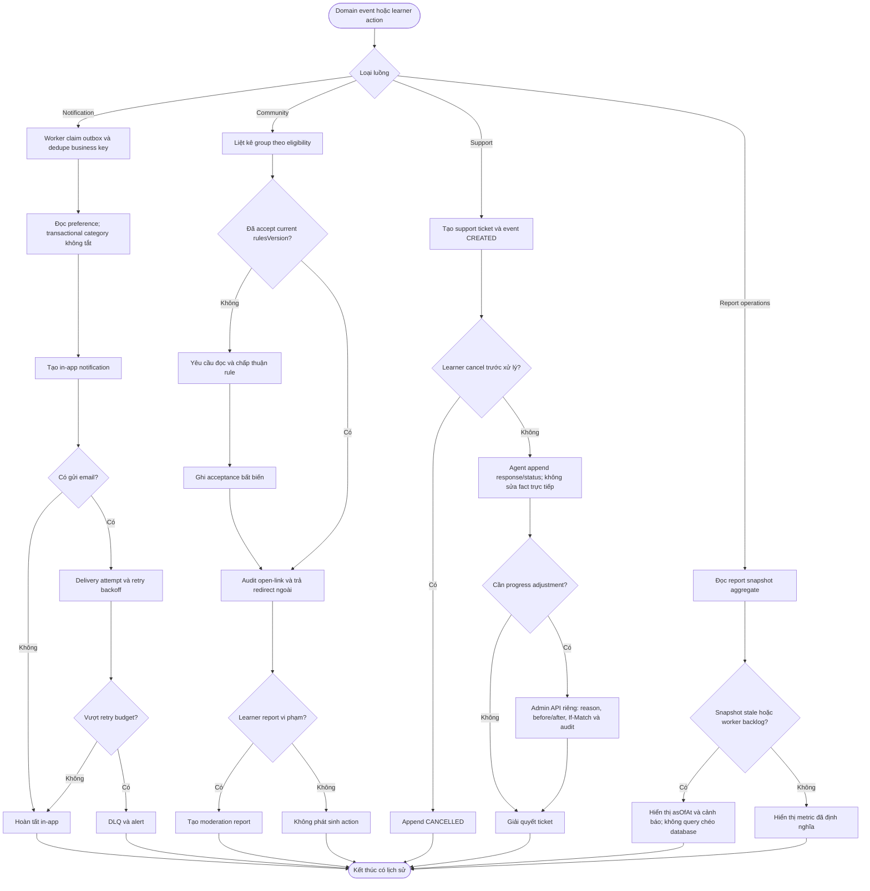
```mermaid
flowchart TD
    A([Domain event hoặc learner action]) --> B{Loại luồng}
    B -- Notification --> C[Worker claim outbox và dedupe business key]
    C --> D[Đọc preference; transactional category không tắt]
    D --> E[Tạo in-app notification]
    E --> F{Có gửi email?}
    F -- Có --> G[Delivery attempt và retry backoff]
    F -- Không --> H[Hoàn tất in-app]
    G --> I{Vượt retry budget?}
    I -- Có --> J[DLQ và alert]
    I -- Không --> H
    B -- Community --> K[Liệt kê group theo eligibility]
    K --> L{Đã accept current rulesVersion?}
    L -- Không --> M[Yêu cầu đọc và chấp thuận rule]
    M --> N[Ghi acceptance bất biến]
    N --> O[Audit open-link và trả redirect ngoài]
    L -- Có --> O
    O --> P{Learner report vi phạm?}
    P -- Có --> Q[Tạo moderation report]
    P -- Không --> R[Không phát sinh action]
    B -- Support --> S[Tạo support ticket và event CREATED]
    S --> T{Learner cancel trước xử lý?}
    T -- Có --> U[Append CANCELLED]
    T -- Không --> V[Agent append response/status; không sửa fact trực tiếp]
    V --> W{Cần progress adjustment?}
    W -- Có --> X[Admin API riêng: reason, before/after, If-Match và audit]
    W -- Không --> Y[Giải quyết ticket]
    X --> Y
    B -- Report operations --> Z[Đọc report snapshot aggregate]
    Z --> AA{Snapshot stale hoặc worker backlog?}
    AA -- Có --> AB[Hiển thị asOfAt và cảnh báo; không query chéo database]
    AA -- Không --> AC[Hiển thị metric đã định nghĩa]
    H --> AD([Kết thúc có lịch sử])
    J --> AD
    Q --> AD
    R --> AD
    U --> AD
    Y --> AD
    AB --> AD
    AC --> AD
```

### AC-WRK-001 — Candidate privacy, search, invitation và opt-out

- **Mục đích:** giữ profile private theo mặc định và bảo đảm candidate search không rò contact, CV hay evidence.
- **Tác nhân:** Candidate, Recruiter, Search Index Worker.
- **Tiền điều kiện:** candidate profile có version; recruiter thuộc enterprise tenant hợp lệ và có sourcing permission.
- **Kết thúc:** chỉ profile opt-in xuất hiện; opt-out bị loại khỏi index trong tối đa 5 phút; invitation không tự mở chat.
- **Liên kết:** `UC-WRK-001..003`; profile/consent/search/invitation `API-WRK-006`, `API-WRK-007`, `API-WRK-051`, `API-WRK-053`; `TBL-WRK-004`, `TBL-WRK-005`, `TBL-WRK-037`, `TBL-WRK-038`; `SCR-WRK-011`, `SCR-WRK-012`, `SCR-WRK-036`, `SCR-WRK-037`; `SEQ-WRK-001`.

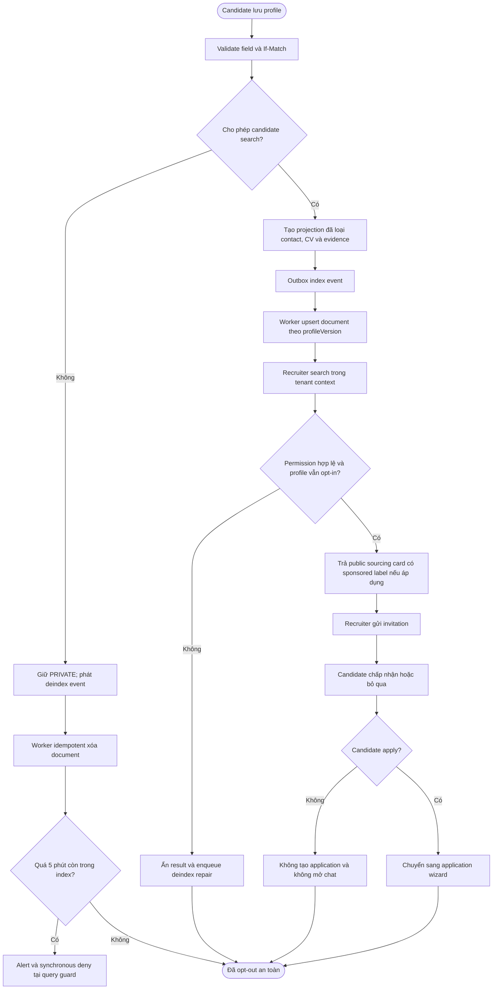
```mermaid
flowchart TD
    A([Candidate lưu profile]) --> B[Validate field và If-Match]
    B --> C{Cho phép candidate search?}
    C -- Không --> D[Giữ PRIVATE; phát deindex event]
    C -- Có --> E[Tạo projection đã loại contact, CV và evidence]
    E --> F[Outbox index event]
    D --> G[Worker idempotent xóa document]
    F --> H[Worker upsert document theo profileVersion]
    H --> I[Recruiter search trong tenant context]
    I --> J{Permission hợp lệ và profile vẫn opt-in?}
    J -- Không --> K[Ẩn result và enqueue deindex repair]
    J -- Có --> L[Trả public sourcing card có sponsored label nếu áp dụng]
    L --> M[Recruiter gửi invitation]
    M --> N[Candidate chấp nhận hoặc bỏ qua]
    N --> O{Candidate apply?}
    O -- Không --> P[Không tạo application và không mở chat]
    O -- Có --> Q[Chuyển sang application wizard]
    G --> R{Quá 5 phút còn trong index?}
    R -- Có --> S[Alert và synchronous deny tại query guard]
    R -- Không --> T([Đã opt-out an toàn])
    K --> T
    P --> T
    Q --> T
```

### AC-WRK-002 — Job revision, apply và ATS

- **Mục đích:** mô tả lifecycle job/application, immutable snapshot, tenant authorization và chuyển ATS có human decision.
- **Tác nhân:** Candidate, Recruiter, Hiring Manager, Enterprise Admin, Moderator.
- **Tiền điều kiện:** enterprise active; job revision `PUBLISHED`; candidate chưa có application cho job; actor ATS được assign hoặc có quyền quản trị.
- **Kết thúc:** application duy nhất được tạo với snapshots; transition hợp lệ được append history; terminal state khóa chat và mutation không phù hợp.
- **Liên kết:** `UC-WRK-003..005`; job/publish/apply/ATS `API-WRK-043`, `API-WRK-047`, `API-WRK-023`, `API-WRK-058`; `TBL-WRK-033`, `TBL-WRK-035`, `TBL-WRK-041`, `TBL-WRK-042`, `TBL-WRK-046`; `SCR-WRK-034`, `SCR-WRK-035`, `SCR-WRK-017`, `SCR-WRK-040`; `SEQ-WRK-002`, `SEQ-WRK-003`.

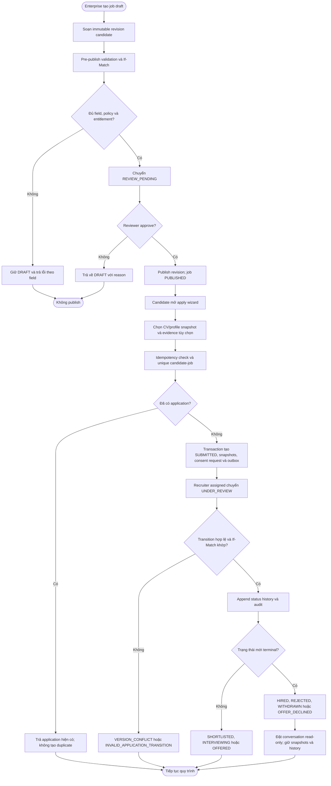
```mermaid
flowchart TD
    A([Enterprise tạo job draft]) --> B[Soạn immutable revision candidate]
    B --> C[Pre-publish validation và If-Match]
    C --> D{Đủ field, policy và entitlement?}
    D -- Không --> E[Giữ DRAFT và trả lỗi theo field]
    D -- Có --> F[Chuyển REVIEW_PENDING]
    F --> G{Reviewer approve?}
    G -- Không --> H[Trả về DRAFT với reason]
    G -- Có --> I[Publish revision; job PUBLISHED]
    I --> J[Candidate mở apply wizard]
    J --> K[Chọn CV/profile snapshot và evidence tùy chọn]
    K --> L[Idempotency check và unique candidate-job]
    L --> M{Đã có application?}
    M -- Có --> N[Trả application hiện có; không tạo duplicate]
    M -- Không --> O[Transaction tạo SUBMITTED, snapshots, consent request và outbox]
    O --> P[Recruiter assigned chuyển UNDER_REVIEW]
    P --> Q{Transition hợp lệ và If-Match khớp?}
    Q -- Không --> R[VERSION_CONFLICT hoặc INVALID_APPLICATION_TRANSITION]
    Q -- Có --> S[Append status history và audit]
    S --> T{Trạng thái mới terminal?}
    T -- Không --> U[SHORTLISTED, INTERVIEWING hoặc OFFERED]
    T -- Có --> V[HIRED, REJECTED, WITHDRAWN hoặc OFFER_DECLINED]
    V --> W[Đặt conversation read-only; giữ snapshots và history]
    U --> X([Tiếp tục quy trình])
    W --> X
    E --> Y([Không publish])
    H --> Y
    N --> X
    R --> X
```

### AC-WRK-003 — Interview và chat theo application

- **Mục đích:** phối hợp lịch nội bộ/ICS với chat realtime nhưng giữ REST và versioned state làm nguồn sự thật.
- **Tác nhân:** Candidate, Assigned Recruiter, Hiring Manager, Notification Worker, WebSocket Gateway.
- **Tiền điều kiện:** application chưa terminal; recruiter được assigned; một conversation đã hoặc sẽ được tạo đúng một lần.
- **Kết thúc:** schedule/message có idempotency và audit; reconnect không mất lịch sử; terminal application làm chat read-only.
- **Liên kết:** `UC-WRK-007..008`; interview/chat/history `API-WRK-028`, `API-WRK-029`, `API-WRK-060`, `API-WRK-061`, `API-WRK-062`, `API-WRK-031`, `API-WRK-032`; `TBL-WRK-049`, `TBL-WRK-050`, `TBL-WRK-053`, `TBL-WRK-054`, `TBL-WRK-055`; `SCR-WRK-020`, `SCR-WRK-021`, `SCR-WRK-041`, `SCR-WRK-042`; `SEQ-WRK-004`, `SEQ-WRK-005`.

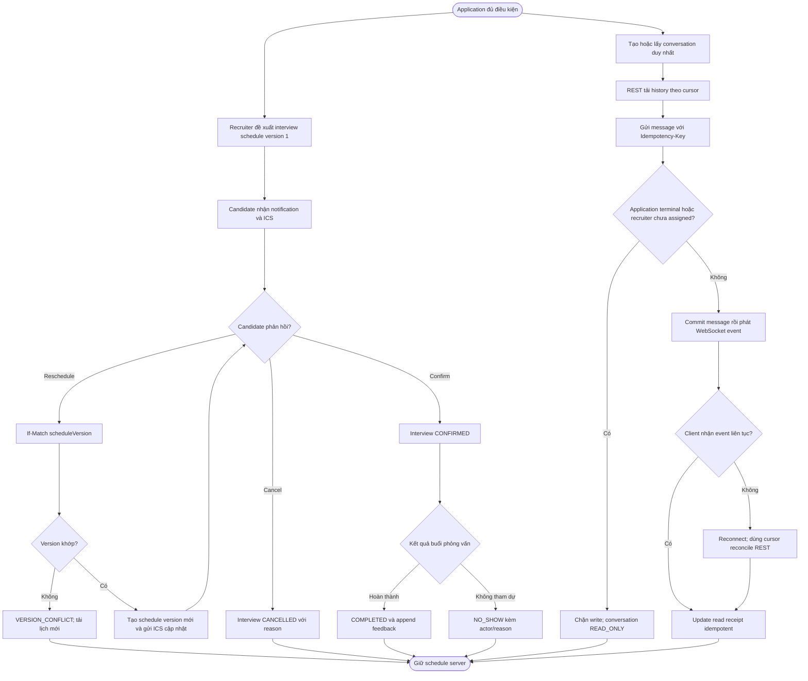
```mermaid
flowchart TD
    A([Application đủ điều kiện]) --> B[Recruiter đề xuất interview schedule version 1]
    B --> C[Candidate nhận notification và ICS]
    C --> D{Candidate phản hồi?}
    D -- Confirm --> E[Interview CONFIRMED]
    D -- Reschedule --> F[If-Match scheduleVersion]
    F --> G{Version khớp?}
    G -- Không --> H[VERSION_CONFLICT; tải lịch mới]
    G -- Có --> I[Tạo schedule version mới và gửi ICS cập nhật]
    I --> D
    D -- Cancel --> J[Interview CANCELLED với reason]
    E --> K{Kết quả buổi phỏng vấn}
    K -- Hoàn thành --> L[COMPLETED và append feedback]
    K -- Không tham dự --> M[NO_SHOW kèm actor/reason]
    A --> N[Tạo hoặc lấy conversation duy nhất]
    N --> O[REST tải history theo cursor]
    O --> P[Gửi message với Idempotency-Key]
    P --> Q{Application terminal hoặc recruiter chưa assigned?}
    Q -- Có --> R[Chặn write; conversation READ_ONLY]
    Q -- Không --> S[Commit message rồi phát WebSocket event]
    S --> T{Client nhận event liên tục?}
    T -- Không --> U[Reconnect; dùng cursor reconcile REST]
    T -- Có --> V[Update read receipt idempotent]
    U --> V
    H --> W([Giữ schedule server])
    J --> W
    L --> W
    M --> W
    R --> W
    V --> W
```

### AC-INT-001 — Chọn evidence khi apply và đồng bộ bất đồng bộ

- **Mục đích:** cho candidate chọn evidence của chính mình mà Work không đọc Study DB và không tạo kho evidence toàn cục.
- **Tác nhân:** Candidate, Work API/Worker, Study API/Worker, Recruiter.
- **Tiền điều kiện:** candidate có access token audience Study; evidence selection rõ ràng; application transaction chưa được commit cùng idempotency key.
- **Kết thúc:** application không phụ thuộc Study availability; snapshot tối thiểu có trạng thái `PENDING`, `READY`, `UNAVAILABLE`, `WITHDRAWN` hoặc `REVOKED`.
- **Liên kết:** `UC-STU-005`, `UC-WRK-005..006`; signed evidence export/result/revocation `API-INT-002`, `API-INT-004`, `API-INT-005`; `TBL-STU-040`, `TBL-STU-041`, `TBL-WRK-043`, `TBL-WRK-044`, `TBL-WRK-045`, `TBL-WRK-069`; `SCR-WRK-017`, `SCR-WRK-019`, `SCR-WRK-040`; `SEQ-INT-001`.

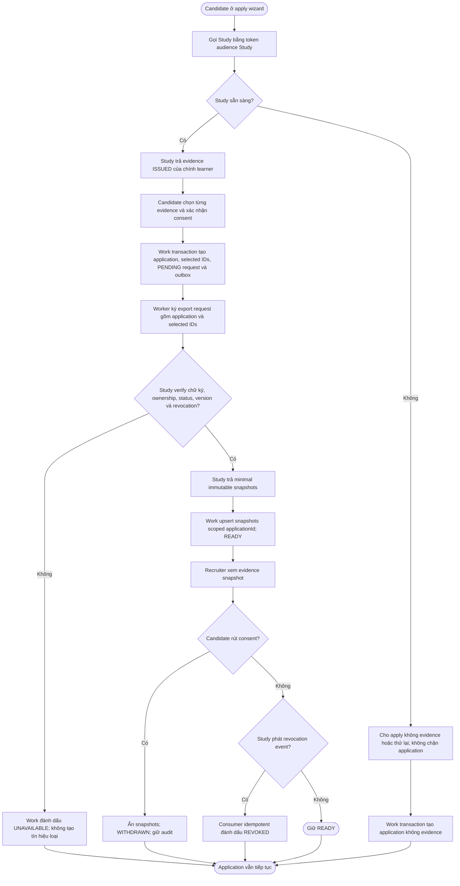
```mermaid
flowchart TD
    A([Candidate ở apply wizard]) --> B[Gọi Study bằng token audience Study]
    B --> C{Study sẵn sàng?}
    C -- Không --> D[Cho apply không evidence hoặc thử lại; không chặn application]
    C -- Có --> E[Study trả evidence ISSUED của chính learner]
    E --> F[Candidate chọn từng evidence và xác nhận consent]
    F --> G[Work transaction tạo application, selected IDs, PENDING request và outbox]
    D --> H[Work transaction tạo application không evidence]
    G --> I[Worker ký export request gồm application và selected IDs]
    I --> J{Study verify chữ ký, ownership, status, version và revocation?}
    J -- Không --> K[Work đánh dấu UNAVAILABLE; không tạo tín hiệu loại]
    J -- Có --> L[Study trả minimal immutable snapshots]
    L --> M[Work upsert snapshots scoped applicationId; READY]
    M --> N[Recruiter xem evidence snapshot]
    N --> O{Candidate rút consent?}
    O -- Có --> P[Ẩn snapshots; WITHDRAWN; giữ audit]
    O -- Không --> Q{Study phát revocation event?}
    Q -- Có --> R[Consumer idempotent đánh dấu REVOKED]
    Q -- Không --> S([Giữ READY])
    K --> T([Application vẫn tiếp tục])
    P --> T
    R --> T
    S --> T
    H --> T
```

### AC-UNI-001 — University affiliation, program, referral và privacy-safe report

- **Mục đích:** bảo đảm tenant trường chỉ thao tác trên membership của mình và không dùng báo cáo để suy ra cá nhân thiếu consent.
- **Tác nhân:** Student, University Admin, Career Officer, Enterprise Recruiter.
- **Tiền điều kiện:** university tenant verified; operator membership active; program và enterprise partnership còn hiệu lực.
- **Kết thúc:** affiliation/referral có history; PII chỉ hiện khi consent active; report aggregate dưới ngưỡng bị suppression.
- **Liên kết:** `UC-UNI-001..003`; `API-UNI-005`, `API-UNI-010`, `API-UNI-014`, `API-UNI-015`; `TBL-WRK-019`, `TBL-WRK-023`, `TBL-WRK-026`, `TBL-WRK-029`, `TBL-WRK-030`, `TBL-WRK-031`; `SCR-UNI-004`, `SCR-UNI-007`, `SCR-UNI-010`, `SCR-UNI-011`; `SEQ-UNI-001`.

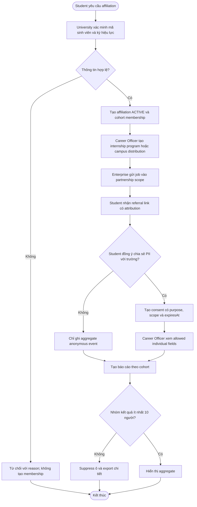
```mermaid
flowchart TD
    A([Student yêu cầu affiliation]) --> B[University xác minh mã sinh viên và kỳ hiệu lực]
    B --> C{Thông tin hợp lệ?}
    C -- Không --> D[Từ chối với reason; không tạo membership]
    C -- Có --> E[Tạo affiliation ACTIVE và cohort membership]
    E --> F[Career Officer tạo internship program hoặc campus distribution]
    F --> G[Enterprise gửi job vào partnership scope]
    G --> H[Student nhận referral link có attribution]
    H --> I{Student đồng ý chia sẻ PII với trường?}
    I -- Có --> J[Tạo consent có purpose, scope và expiresAt]
    I -- Không --> K[Chỉ ghi aggregate anonymous event]
    J --> L[Career Officer xem allowed individual fields]
    K --> M[Tạo báo cáo theo cohort]
    L --> M
    M --> N{Nhóm kết quả ít nhất 10 người?}
    N -- Không --> O[Suppress ô và export chi tiết]
    N -- Có --> P[Hiển thị aggregate]
    D --> Q([Kết thúc])
    O --> Q
    P --> Q
```

### AC-PAY-001 — Checkout, callback, entitlement và reversal

- **Mục đích:** xử lý VNPAY/MoMo an toàn trước duplicate/out-of-order callback và tách return URL khỏi nguồn xác nhận.
- **Tác nhân:** Buyer, Work Billing, VNPAY/MoMo, Finance Operator, Reconciliation Worker.
- **Tiền điều kiện:** product/price hợp lệ, VND amount nguyên dương, buyer có tenant hoặc student context phù hợp.
- **Kết thúc:** ledger cân bằng; entitlement chỉ cấp sau settled callback đã xác thực; refund/chargeback được điều chỉnh append-only.
- **Liên kết:** `UC-PAY-001..003`; `API-PAY-002`, `API-PAY-014`, `API-PAY-015`, `API-PAY-006`, `API-PAY-007`, `API-PAY-008`, `API-PAY-009`; `TBL-PAY-003`, `TBL-PAY-005`, `TBL-PAY-006`, `TBL-PAY-007`, `TBL-PAY-008`, `TBL-PAY-009`, `TBL-PAY-010`; `SCR-WRK-022`, `SCR-WRK-023`, `SCR-WRK-043`, `SCR-WRK-044`, `SCR-OPS-019`, `SCR-OPS-020`; `SEQ-PAY-001..002`.

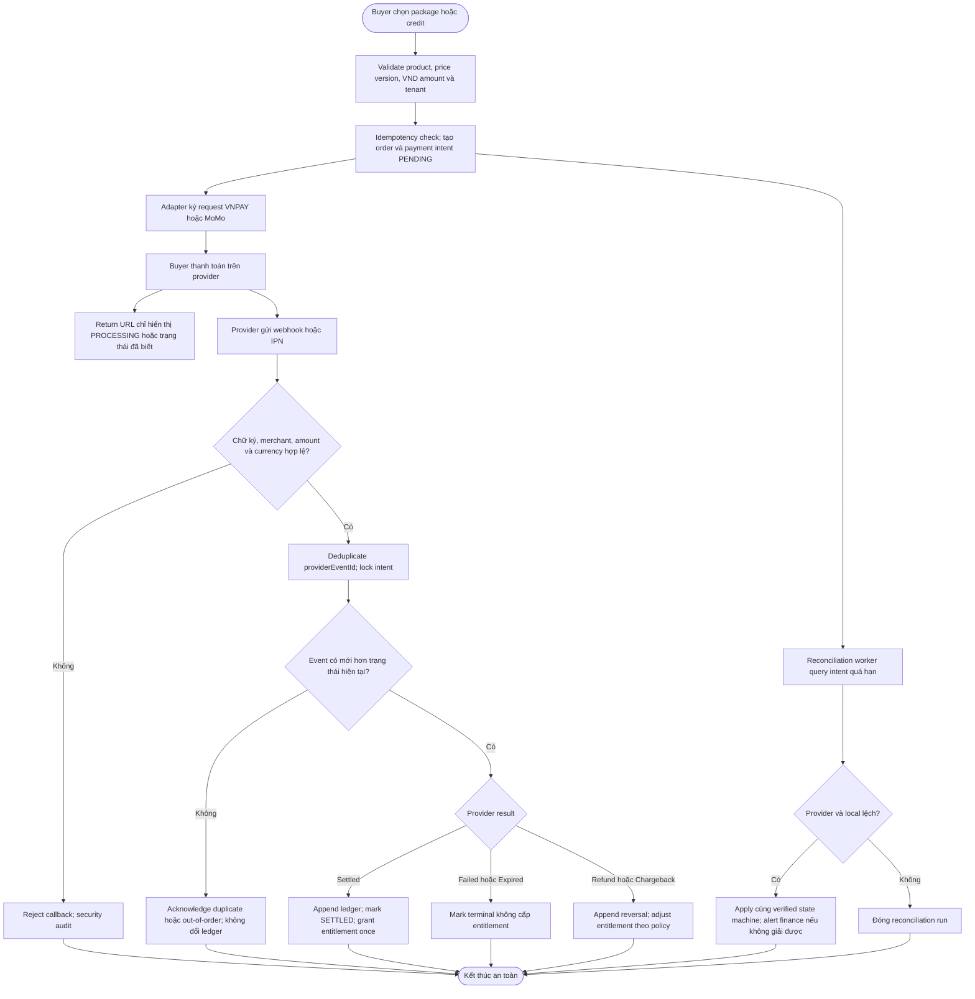
```mermaid
flowchart TD
    A([Buyer chọn package hoặc credit]) --> B[Validate product, price version, VND amount và tenant]
    B --> C[Idempotency check; tạo order và payment intent PENDING]
    C --> D[Adapter ký request VNPAY hoặc MoMo]
    D --> E[Buyer thanh toán trên provider]
    E --> F[Return URL chỉ hiển thị PROCESSING hoặc trạng thái đã biết]
    E --> G[Provider gửi webhook hoặc IPN]
    G --> H{Chữ ký, merchant, amount và currency hợp lệ?}
    H -- Không --> I[Reject callback; security audit]
    H -- Có --> J[Deduplicate providerEventId; lock intent]
    J --> K{Event có mới hơn trạng thái hiện tại?}
    K -- Không --> L[Acknowledge duplicate hoặc out-of-order; không đổi ledger]
    K -- Có --> M{Provider result}
    M -- Settled --> N[Append ledger; mark SETTLED; grant entitlement once]
    M -- Failed hoặc Expired --> O[Mark terminal không cấp entitlement]
    M -- Refund hoặc Chargeback --> P[Append reversal; adjust entitlement theo policy]
    C --> Q[Reconciliation worker query intent quá hạn]
    Q --> R{Provider và local lệch?}
    R -- Có --> S[Apply cùng verified state machine; alert finance nếu không giải được]
    R -- Không --> T[Đóng reconciliation run]
    I --> U([Kết thúc an toàn])
    L --> U
    N --> U
    O --> U
    P --> U
    S --> U
    T --> U
```

### AC-AIX-001 — AI request, policy guard và human approval

- **Mục đích:** thể hiện rõ provenance, dữ liệu loại trừ, xử lý prompt injection, timeout và thao tác áp dụng của con người.
- **Tác nhân:** Candidate/Recruiter, Work AI Worker, AI Provider, Human Reviewer.
- **Tiền điều kiện:** use case được allowlist; consent phù hợp; prompt policy/model version active; không gửi protected/excluded fields.
- **Kết thúc:** output là draft hoặc suggestion có nhãn; apply/reject do người dùng; ATS status không bị worker sửa.
- **Liên kết:** `UC-AIX-001..003`; `API-AIX-001`, `API-AIX-002`, `API-AIX-003`, `API-AIX-004`, `API-AIX-005`, `API-AIX-006`; `TBL-AIX-001`, `TBL-AIX-002`, `TBL-AIX-003`, `TBL-AIX-004`, `TBL-AIX-005`, `TBL-AIX-006`; `SCR-WRK-013`, `SCR-WRK-034`, `SCR-WRK-039`, `SCR-WRK-040`; `SEQ-AIX-001`.

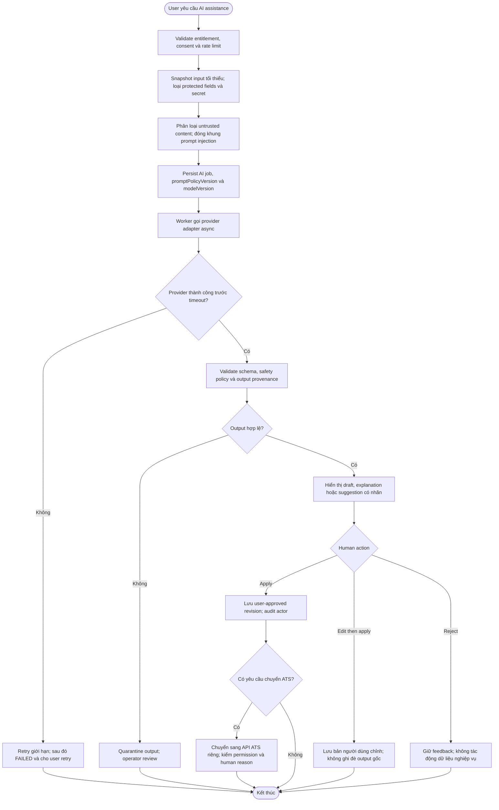
```mermaid
flowchart TD
    A([User yêu cầu AI assistance]) --> B[Validate entitlement, consent và rate limit]
    B --> C[Snapshot input tối thiểu; loại protected fields và secret]
    C --> D[Phân loại untrusted content; đóng khung prompt injection]
    D --> E[Persist AI job, promptPolicyVersion và modelVersion]
    E --> F[Worker gọi provider adapter async]
    F --> G{Provider thành công trước timeout?}
    G -- Không --> H[Retry giới hạn; sau đó FAILED và cho user retry]
    G -- Có --> I[Validate schema, safety policy và output provenance]
    I --> J{Output hợp lệ?}
    J -- Không --> K[Quarantine output; operator review]
    J -- Có --> L[Hiển thị draft, explanation hoặc suggestion có nhãn]
    L --> M{Human action}
    M -- Apply --> N[Lưu user-approved revision; audit actor]
    M -- Edit then apply --> O[Lưu bản người dùng chỉnh; không ghi đè output gốc]
    M -- Reject --> P[Giữ feedback; không tác động dữ liệu nghiệp vụ]
    N --> Q{Có yêu cầu chuyển ATS?}
    Q -- Có --> R[Chuyển sang API ATS riêng; kiểm permission và human reason]
    Q -- Không --> S([Kết thúc])
    O --> S
    P --> S
    H --> S
    K --> S
    R --> S
```

### AC-OPS-001 — Moderation, deletion, legal hold và recovery

- **Mục đích:** bao phủ quyết định moderation, appeal, account deletion fan-out, retention/legal hold và retry vận hành.
- **Tác nhân:** Reporter, Moderator, Privacy Operator, Identity/Study/Work Worker, Security Operator.
- **Tiền điều kiện:** operator có MFA và permission; resource/subject được định danh; reason code bắt buộc.
- **Kết thúc:** action có audit; dữ liệu thuộc đúng service được anonymize sau grace period nếu không có legal hold; lỗi vào retry/DLQ có cảnh báo.
- **Liên kết:** `UC-OPS-001..003`; `API-OPS-003`, `API-OPS-004`, `API-OPS-010`, `API-IAM-019`, `API-INT-006`, `API-INT-007`; `TBL-WRK-060`, `TBL-WRK-061`, `TBL-IAM-017`, `TBL-IAM-018`, `TBL-STU-053`, `TBL-WRK-064`; `SCR-OPS-009`, `SCR-OPS-010`, `SCR-OPS-021`, `SCR-IAM-006`; `SEQ-OPS-001`.

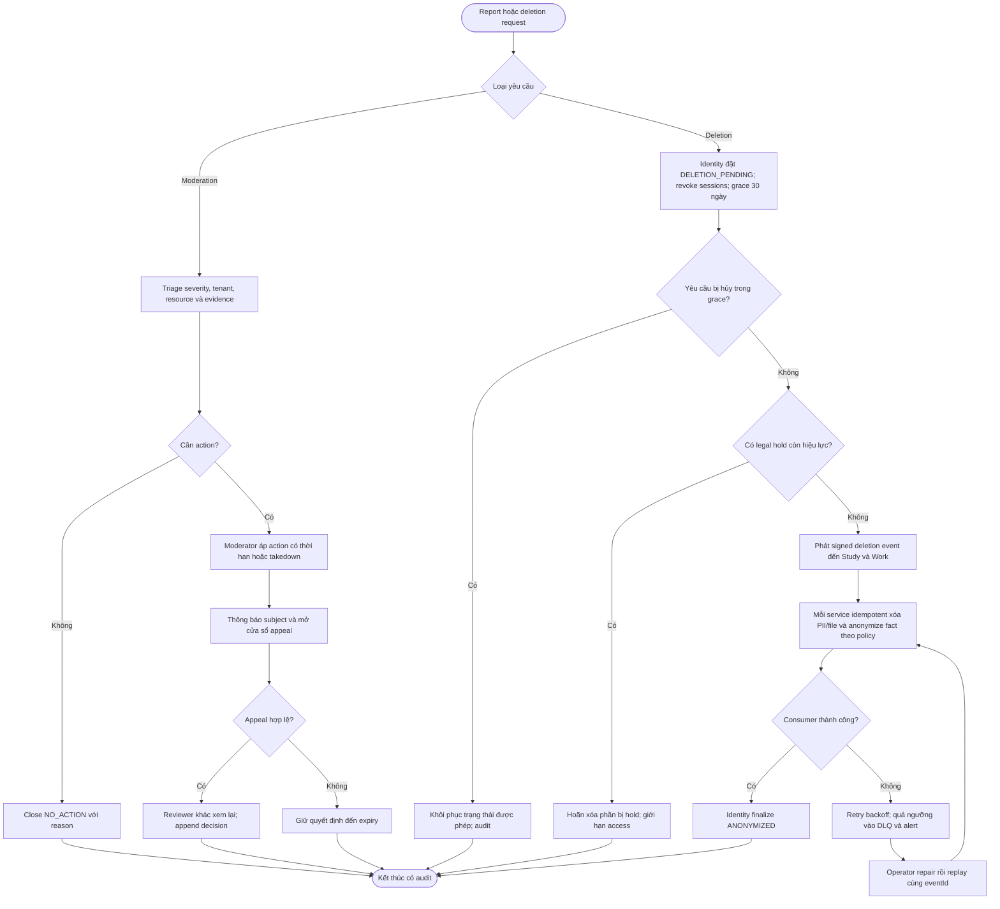
```mermaid
flowchart TD
    A([Report hoặc deletion request]) --> B{Loại yêu cầu}
    B -- Moderation --> C[Triage severity, tenant, resource và evidence]
    C --> D{Cần action?}
    D -- Không --> E[Close NO_ACTION với reason]
    D -- Có --> F[Moderator áp action có thời hạn hoặc takedown]
    F --> G[Thông báo subject và mở cửa sổ appeal]
    G --> H{Appeal hợp lệ?}
    H -- Có --> I[Reviewer khác xem lại; append decision]
    H -- Không --> J[Giữ quyết định đến expiry]
    B -- Deletion --> K[Identity đặt DELETION_PENDING; revoke sessions; grace 30 ngày]
    K --> L{Yêu cầu bị hủy trong grace?}
    L -- Có --> M[Khôi phục trạng thái được phép; audit]
    L -- Không --> N{Có legal hold còn hiệu lực?}
    N -- Có --> O[Hoãn xóa phần bị hold; giới hạn access]
    N -- Không --> P[Phát signed deletion event đến Study và Work]
    P --> Q[Mỗi service idempotent xóa PII/file và anonymize fact theo policy]
    Q --> R{Consumer thành công?}
    R -- Không --> S[Retry backoff; quá ngưỡng vào DLQ và alert]
    R -- Có --> T[Identity finalize ANONYMIZED]
    S --> U[Operator repair rồi replay cùng eventId]
    U --> Q
    E --> V([Kết thúc có audit])
    I --> V
    J --> V
    M --> V
    O --> V
    T --> V
```

## 4. Class diagrams

Các class dưới đây biểu diễn entity và aggregate ở mức thiết kế. Tên class dùng PascalCase, tương ứng với bảng snake_case trong `03_THIET_KE_CO_SO_DU_LIEU.md`. Thuộc tính chỉ nêu khóa, version, status và dữ liệu quyết định quan hệ; danh mục cột đầy đủ nằm trong tài liệu cơ sở dữ liệu.

### CLS-IAM-001 — Identity, credential, session và security event

- **Mục đích:** xác định aggregate Platform User và các bản ghi bảo mật append-only/token một lần.
- **Tác nhân:** Identity API, Platform Admin, Identity Worker.
- **Tiền điều kiện:** email được normalize; raw password/token không bao giờ được persist.
- **Kết thúc:** credential/session thuộc duy nhất Identity DB; outbox/audit giữ đầy đủ nguyên nhân và actor.
- **Liên kết:** `UC-IAM-001..003`; `API-IAM-001`, `API-IAM-002`, `API-IAM-004`, `API-IAM-006`, `API-IAM-022`; `TBL-IAM-001`, `TBL-IAM-003`, `TBL-IAM-004`, `TBL-IAM-009`, `TBL-IAM-010`, `TBL-IAM-012`, `TBL-IAM-015`, `TBL-IAM-017`, `TBL-IAM-018`; `SCR-IAM-001`, `SCR-IAM-002`, `SCR-IAM-003`, `SCR-IAM-005`, `SCR-IAM-006`, `SCR-OPS-001`; `SEQ-IAM-001..002`.

```mermaid
classDiagram
    class PlatformUser {
        +UUID id
        +string normalizedEmail
        +AccountStatus status
        +int authVersion
        +datetime emailVerifiedAt
    }
    class PasswordCredential {
        +UUID userId
        +string argon2Hash
        +int failureCount
        +datetime lockedUntil
    }
    class OneTimeToken {
        +UUID id
        +TokenPurpose purpose
        +string tokenHash
        +datetime expiresAt
        +datetime consumedAt
    }
    class AuthSession {
        +UUID id
        +UUID userId
        +UUID familyId
        +datetime expiresAt
        +datetime revokedAt
    }
    class RefreshToken {
        +UUID id
        +UUID sessionId
        +string tokenHash
        +UUID parentTokenId
        +datetime usedAt
    }
    class GlobalRole {
        +UUID id
        +string code
    }
    class PlatformUserRole {
        +UUID userId
        +UUID roleId
        +datetime grantedAt
    }
    class AgreementAcceptance {
        +UUID id
        +string documentCode
        +string documentVersion
        +datetime acceptedAt
    }
    class IdentityAuditLog {
        +UUID id
        +UUID actorId
        +string action
        +string reasonCode
        +datetime occurredAt
    }
    class IdentityOutboxEvent {
        +UUID id
        +string eventType
        +UUID aggregateId
        +int aggregateVersion
        +datetime publishedAt
    }

    PlatformUser "1" *-- "1" PasswordCredential
    PlatformUser "1" *-- "0..*" OneTimeToken
    PlatformUser "1" *-- "0..*" AuthSession
    AuthSession "1" *-- "1..*" RefreshToken
    RefreshToken "0..1" --> "0..1" RefreshToken : rotates to
    PlatformUser "1" --> "0..*" PlatformUserRole
    GlobalRole "1" --> "0..*" PlatformUserRole
    PlatformUser "1" --> "0..*" AgreementAcceptance
    PlatformUser "1" --> "0..*" IdentityAuditLog : subject
    PlatformUser "1" --> "0..*" IdentityOutboxEvent : aggregate
```

### CLS-STU-001 — Study profile, RBAC và curriculum versioning

- **Mục đích:** mô tả projection danh tính logic, local RBAC và content tree bất biến sau publish.
- **Tác nhân:** Study API, Content Author, Trusted Publisher, Identity Event Consumer.
- **Tiền điều kiện:** StudyUser được reconcile theo platformUserId; path version pin trực tiếp course version.
- **Kết thúc:** không có credential trong Study; published revision không đổi; mỗi assessment placement có đúng một scope.
- **Liên kết:** `UC-STU-001..002`, `UC-STU-006`; `API-STU-001`, `API-STU-016`, `API-STU-014`, `API-STU-054`, `API-STU-056`; `TBL-STU-001`, `TBL-STU-009`, `TBL-STU-010`, `TBL-STU-011`, `TBL-STU-012`, `TBL-STU-017`, `TBL-STU-020`; `SCR-STU-002`, `SCR-STU-005`, `SCR-STU-013`, `SCR-OPS-004`, `SCR-OPS-005`, `SCR-OPS-007`; `SEQ-STU-001`, `SEQ-STU-004`.

```mermaid
classDiagram
    class PlatformUserReference {
        +UUID platformUserId
        +string identityStatus
        +int identityVersion
    }
    class StudyUser {
        +UUID id
        +UUID platformUserId
        +string projectedEmail
        +string identityStatus
    }
    class LearnerProfile {
        +UUID studyUserId
        +string displayName
        +int version
    }
    class OnboardingRecord {
        +UUID studyUserId
        +OnboardingStatus status
        +datetime completedAt
    }
    class StudyRole {
        +UUID id
        +string code
    }
    class StudyPermission {
        +UUID id
        +string code
    }
    class StudyRolePermission {
        +UUID roleId
        +UUID permissionId
    }
    class StudyUserRoleAssignment {
        +UUID studyUserId
        +UUID roleId
        +datetime expiresAt
    }
    class LearningPath {
        +UUID id
        +string slug
        +EntityStatus status
        +UUID currentPublishedVersionId
    }
    class LearningPathVersion {
        +UUID id
        +UUID learningPathId
        +int versionNo
        +ContentVersionStatus status
    }
    class PathVersionCourse {
        +UUID pathVersionId
        +UUID courseVersionId
        +int position
    }
    class Course {
        +UUID id
        +string slug
        +EntityStatus status
        +UUID currentPublishedVersionId
    }
    class CourseVersion {
        +UUID id
        +UUID courseId
        +int versionNo
        +ContentVersionStatus status
    }
    class Chapter {
        +UUID id
        +UUID courseVersionId
        +int position
    }
    class Lesson {
        +UUID id
        +UUID chapterId
        +int position
    }
    class LessonContentBlock {
        +UUID id
        +UUID lessonId
        +ContentBlockType type
        +int position
    }
    class Assessment {
        +UUID id
        +AssessmentType type
        +int maxAttempts
    }
    class AssessmentPlacement {
        +UUID assessmentId
        +PlacementScope scope
        +UUID scopeId
    }
    class ContentPublishCheck {
        +UUID id
        +UUID contentVersionId
        +PublishCheckStatus status
    }

    PlatformUserReference ..> StudyUser : logical mapping only, no FK
    StudyUser "1" *-- "1" LearnerProfile
    StudyUser "1" *-- "1" OnboardingRecord
    StudyUser "1" --> "0..*" StudyUserRoleAssignment
    StudyRole "1" --> "0..*" StudyUserRoleAssignment
    StudyRole "1" --> "0..*" StudyRolePermission
    StudyPermission "1" --> "0..*" StudyRolePermission
    LearningPath "1" *-- "1..*" LearningPathVersion
    LearningPathVersion "1" *-- "1..*" PathVersionCourse
    CourseVersion "1" --> "0..*" PathVersionCourse
    Course "1" *-- "1..*" CourseVersion
    CourseVersion "1" *-- "1..*" Chapter
    Chapter "1" *-- "1..*" Lesson
    Lesson "1" *-- "1..*" LessonContentBlock
    Assessment "1" *-- "1" AssessmentPlacement
    CourseVersion "1" --> "0..*" ContentPublishCheck
    LearningPathVersion "1" --> "0..*" ContentPublishCheck
```

### CLS-STU-002 — Enrollment, progress, assessment, file và evidence

- **Mục đích:** tách learning facts khỏi snapshot có thể rebuild, đồng thời giữ attempt/review/evidence bất biến.
- **Tác nhân:** Learner, Study API/Worker, Reviewer, Work Integration Worker.
- **Tiền điều kiện:** mọi enrollment và primary path period pin published version; file nằm trong private storage.
- **Kết thúc:** completion chỉ reuse cùng version; attempt/review không bị ghi đè; evidence export không làm phát sinh FK sang Work.
- **Liên kết:** `UC-STU-002..005`; `API-STU-014`, `API-STU-020`, `API-STU-027`, `API-STU-030`, `API-INT-002`; `TBL-STU-026`, `TBL-STU-027`, `TBL-STU-029`, `TBL-STU-033`, `TBL-STU-035`, `TBL-STU-036`, `TBL-STU-038`, `TBL-STU-040`, `TBL-STU-041`; `SCR-STU-013`, `SCR-STU-016`, `SCR-STU-017`, `SCR-STU-018`, `SCR-WRK-017`; `SEQ-STU-001..003`, `SEQ-INT-001`.

```mermaid
classDiagram
    class StudyUser {
        +UUID id
    }
    class PrimaryPathPeriod {
        +UUID id
        +UUID learnerId
        +UUID pathVersionId
        +PrimaryPathStatus status
        +datetime nextSwitchAllowedAt
        +int version
    }
    class PrimaryPathChangeEvent {
        +UUID id
        +UUID fromPeriodId
        +UUID toPeriodId
        +string reasonCode
    }
    class CourseEnrollment {
        +UUID id
        +UUID learnerId
        +UUID courseVersionId
        +EnrollmentStatus status
    }
    class ContentBlockProgress {
        +UUID enrollmentId
        +UUID blockId
        +ProgressStatus status
        +int version
    }
    class LessonProgress {
        +UUID enrollmentId
        +UUID lessonId
        +ProgressStatus status
        +datetime completedAt
    }
    class CourseProgressSnapshot {
        +UUID enrollmentId
        +decimal percent
        +int sourceVersion
    }
    class CompletionRecord {
        +UUID id
        +UUID learnerId
        +CompletionTargetType targetType
        +UUID targetVersionId
        +datetime completedAt
    }
    class AssessmentDraft {
        +UUID learnerId
        +UUID assessmentId
        +int version
    }
    class AssessmentAttempt {
        +UUID id
        +UUID assessmentId
        +UUID learnerId
        +int attemptNo
        +AttemptStatus status
    }
    class AssessmentReview {
        +UUID id
        +UUID attemptId
        +ReviewDecision decision
        +int reviewVersion
    }
    class UploadSession {
        +UUID id
        +UUID ownerId
        +datetime expiresAt
    }
    class FileAsset {
        +UUID id
        +string privateObjectKey
        +FileScanStatus scanStatus
        +string checksum
    }
    class FileScanResult {
        +UUID id
        +UUID fileAssetId
        +FileScanStatus result
        +int scanAttemptNo
    }
    class StudyEvidence {
        +UUID id
        +UUID learnerId
        +UUID completionId
        +EvidenceStatus status
        +int version
    }
    class IntegrationDeliveryLog {
        +UUID eventId
        +string destination
        +DeliveryStatus status
    }

    StudyUser "1" --> "0..*" PrimaryPathPeriod
    PrimaryPathPeriod "1" --> "0..*" PrimaryPathChangeEvent
    StudyUser "1" --> "0..*" CourseEnrollment
    CourseEnrollment "1" *-- "0..*" ContentBlockProgress
    CourseEnrollment "1" *-- "0..*" LessonProgress
    CourseEnrollment "1" *-- "1" CourseProgressSnapshot
    StudyUser "1" --> "0..*" CompletionRecord
    StudyUser "1" --> "0..*" AssessmentDraft
    StudyUser "1" --> "0..*" AssessmentAttempt
    AssessmentAttempt "1" --> "0..*" AssessmentReview
    UploadSession "1" --> "0..1" FileAsset
    FileAsset "1" --> "1..*" FileScanResult
    AssessmentAttempt "0..1" --> "0..1" FileAsset : file answer
    CompletionRecord "1" --> "0..1" StudyEvidence
    StudyEvidence "1" --> "0..*" IntegrationDeliveryLog
```

### CLS-STU-003 — Engagement, support, adjustment, audit và report snapshot

- **Mục đích:** mô tả delivery/engagement/operations mà không biến phần trăm snapshot thành learning source-of-truth.
- **Tác nhân:** Learner, Notification Worker, Moderator, Support Agent, Study Admin.
- **Tiền điều kiện:** mọi resource dùng StudyUser local ID; adjustment bắt buộc before/after, actor và reason.
- **Kết thúc:** delivery/support/audit append history; report snapshot ghi `asOfAt`; community mapping dùng FK/join hợp lệ.
- **Liên kết:** `UC-STU-007..008`; `API-STU-034`, `API-STU-039`, `API-STU-040`, `API-STU-041`, `API-STU-043`, `API-STU-050`, `API-OPS-010`; `TBL-STU-042`, `TBL-STU-043`, `TBL-STU-044`, `TBL-STU-045`, `TBL-STU-046`, `TBL-STU-047`, `TBL-STU-048`, `TBL-STU-049`, `TBL-STU-050`, `TBL-STU-054`; `SCR-STU-020`, `SCR-STU-021`, `SCR-STU-022`, `SCR-OPS-014`, `SCR-OPS-015`, `SCR-OPS-021`; `AC-STU-004`, `SEQ-STU-005`.

```mermaid
classDiagram
    class StudyUser {
        +UUID id
    }
    class NotificationPreference {
        +UUID learnerId
        +string category
        +bool emailEnabled
    }
    class Notification {
        +UUID id
        +UUID learnerId
        +string dedupeKey
        +datetime readAt
    }
    class NotificationDelivery {
        +UUID id
        +UUID notificationId
        +DeliveryStatus status
        +int attemptNo
    }
    class CommunityChannel {
        +UUID id
        +string rulesVersion
        +CommunityStatus status
    }
    class CommunityAcceptance {
        +UUID learnerId
        +UUID channelId
        +string rulesVersion
        +datetime acceptedAt
    }
    class SupportTicket {
        +UUID id
        +UUID learnerId
        +SupportStatus status
        +int version
    }
    class SupportMessage {
        +UUID id
        +UUID ticketId
        +UUID authorId
        +datetime createdAt
    }
    class AdminAdjustment {
        +UUID id
        +UUID learnerId
        +string targetType
        +string reasonCode
        +int beforeVersion
        +int afterVersion
    }
    class StudyAuditEvent {
        +UUID id
        +UUID actorId
        +string action
        +datetime occurredAt
    }
    class ReportSnapshot {
        +UUID id
        +string metricSet
        +datetime asOfAt
    }

    StudyUser "1" --> "0..*" NotificationPreference
    StudyUser "1" --> "0..*" Notification
    Notification "1" --> "0..*" NotificationDelivery
    StudyUser "1" --> "0..*" CommunityAcceptance
    CommunityChannel "1" --> "0..*" CommunityAcceptance
    StudyUser "1" --> "0..*" SupportTicket
    SupportTicket "1" *-- "0..*" SupportMessage
    StudyUser "1" --> "0..*" AdminAdjustment
    AdminAdjustment "1" --> "1..*" StudyAuditEvent
    ReportSnapshot ..> StudyAuditEvent : aggregate from authorized facts
```

### CLS-WRK-001 — Candidate, tenant, job, application và ATS snapshots

- **Mục đích:** thể hiện composite tenant ownership, immutable job/profile/application snapshots và sourcing privacy.
- **Tác nhân:** Candidate, Enterprise Member, Recruiter, Hiring Manager, Search Worker.
- **Tiền điều kiện:** membership resolve từ access context; không nhận tenantId do client cung cấp làm nguồn authorization.
- **Kết thúc:** một application mỗi candidate/job; job revision và apply snapshots bất biến; search projection không chứa dữ liệu nhạy cảm.
- **Liên kết:** `UC-WRK-001..006`; `API-WRK-005`, `API-WRK-051`, `API-WRK-053`, `API-WRK-043`, `API-WRK-047`, `API-WRK-023`, `API-WRK-058`, `API-INT-002`; `TBL-WRK-004`, `TBL-WRK-016`, `TBL-WRK-033`, `TBL-WRK-037`, `TBL-WRK-038`, `TBL-WRK-041`, `TBL-WRK-042`, `TBL-WRK-044`, `TBL-WRK-045`; `SCR-WRK-011`, `SCR-WRK-036`, `SCR-WRK-034`, `SCR-WRK-017`, `SCR-WRK-040`; `SEQ-WRK-001..003`, `SEQ-INT-001`.

```mermaid
classDiagram
    class CandidateProfile {
        +UUID id
        +UUID platformUserId
        +ProfileVisibility visibility
        +bool searchOptIn
        +int version
    }
    class CvDocument {
        +UUID id
        +UUID candidateId
        +int versionNo
        +UUID fileAssetId
    }
    class PortfolioItem {
        +UUID id
        +UUID candidateId
        +string kind
    }
    class CandidateSearchProjection {
        +UUID candidateId
        +int profileVersion
        +SearchIndexStatus status
    }
    class Enterprise {
        +UUID id
        +TenantStatus status
    }
    class EnterpriseMembership {
        +UUID id
        +UUID enterpriseId
        +UUID platformUserId
        +EnterpriseRole role
        +MembershipStatus status
    }
    class Job {
        +UUID id
        +UUID enterpriseId
        +JobStatus status
        +UUID currentPublishedRevisionId
    }
    class JobRevision {
        +UUID id
        +UUID jobId
        +int revisionNo
        +RevisionStatus status
    }
    class CandidateInvitation {
        +UUID id
        +UUID enterpriseId
        +UUID candidateId
        +InvitationStatus status
    }
    class Application {
        +UUID id
        +UUID enterpriseId
        +UUID jobId
        +UUID candidateId
        +ApplicationStatus status
        +int version
    }
    class ApplicationStatusHistory {
        +UUID id
        +UUID applicationId
        +ApplicationStatus fromStatus
        +ApplicationStatus toStatus
        +UUID actorId
    }
    class ApplicationProfileSnapshot {
        +UUID applicationId
        +int sourceProfileVersion
    }
    class ApplicationCvSnapshot {
        +UUID applicationId
        +UUID sourceCvId
        +int sourceCvVersion
    }
    class EvidenceExportRequest {
        +UUID id
        +UUID applicationId
        +EvidenceSyncStatus status
        +datetime consentedAt
    }
    class ApplicationEvidenceSnapshot {
        +UUID id
        +UUID applicationId
        +UUID sourceEvidenceId
        +int sourceVersion
        +EvidenceSyncStatus status
    }

    CandidateProfile "1" *-- "0..*" CvDocument
    CandidateProfile "1" *-- "0..*" PortfolioItem
    CandidateProfile "1" --> "0..1" CandidateSearchProjection
    Enterprise "1" *-- "1..*" EnterpriseMembership
    Enterprise "1" *-- "0..*" Job
    Job "1" *-- "1..*" JobRevision
    Enterprise "1" --> "0..*" CandidateInvitation
    CandidateProfile "1" --> "0..*" CandidateInvitation
    Job "1" --> "0..*" Application
    CandidateProfile "1" --> "0..*" Application
    Enterprise "1" --> "0..*" Application
    Application "1" *-- "1..*" ApplicationStatusHistory
    Application "1" *-- "1" ApplicationProfileSnapshot
    Application "1" *-- "1" ApplicationCvSnapshot
    Application "1" *-- "0..1" EvidenceExportRequest
    Application "1" *-- "0..*" ApplicationEvidenceSnapshot
```

### CLS-WRK-002 — Interview, chat, university và moderation

- **Mục đích:** nối các aggregate cộng tác quanh application nhưng giữ tenant/privacy guard ở mọi quan hệ.
- **Tác nhân:** Candidate, Assigned Recruiter, University Officer, Moderator, Notification/WebSocket Worker.
- **Tiền điều kiện:** application và tenant còn truy cập được; conversation chỉ tạo sau application; university PII cần consent.
- **Kết thúc:** schedule/message/referral/moderation history không bị xóa cascade; report trường tuân ngưỡng 10.
- **Liên kết:** `UC-WRK-007..010`, `UC-UNI-001..003`; `API-WRK-060`, `API-WRK-031`, `API-OPS-003`, `API-UNI-005`, `API-UNI-010`, `API-UNI-014`, `API-UNI-015`; `TBL-WRK-049`, `TBL-WRK-050`, `TBL-WRK-053`, `TBL-WRK-054`, `TBL-WRK-019`, `TBL-WRK-023`, `TBL-WRK-026`, `TBL-WRK-029`, `TBL-WRK-030`, `TBL-WRK-060`; `SCR-WRK-020`, `SCR-WRK-021`, `SCR-WRK-041`, `SCR-UNI-004`, `SCR-UNI-007`, `SCR-UNI-010`, `SCR-UNI-011`, `SCR-OPS-009`; `SEQ-WRK-004..005`, `SEQ-UNI-001`, `SEQ-OPS-001`.

```mermaid
classDiagram
    class Application {
        +UUID id
        +UUID enterpriseId
        +ApplicationStatus status
    }
    class RecruiterAssignment {
        +UUID applicationId
        +UUID membershipId
        +datetime assignedAt
    }
    class Interview {
        +UUID id
        +UUID applicationId
        +InterviewStatus status
        +int scheduleVersion
    }
    class InterviewScheduleHistory {
        +UUID id
        +UUID interviewId
        +int versionNo
        +datetime startsAt
        +string timezone
    }
    class InterviewFeedback {
        +UUID id
        +UUID interviewId
        +UUID authorMembershipId
        +int version
    }
    class Conversation {
        +UUID id
        +UUID applicationId
        +ConversationStatus status
    }
    class ChatMessage {
        +UUID id
        +UUID conversationId
        +UUID senderPlatformUserId
        +datetime sentAt
    }
    class MessageReceipt {
        +UUID messageId
        +UUID readerPlatformUserId
        +datetime readAt
    }
    class University {
        +UUID id
        +TenantStatus status
    }
    class UniversityMembership {
        +UUID universityId
        +UUID platformUserId
        +UniversityRole role
    }
    class StudentAffiliation {
        +UUID id
        +UUID universityId
        +UUID candidateId
        +AffiliationStatus status
    }
    class InternshipProgram {
        +UUID id
        +UUID universityId
        +datetime startsAt
        +datetime endsAt
    }
    class CandidateReferral {
        +UUID id
        +UUID programId
        +UUID applicationId
    }
    class DataSharingConsent {
        +UUID id
        +UUID candidateId
        +UUID universityId
        +string purpose
        +datetime expiresAt
    }
    class ModerationCase {
        +UUID id
        +string resourceType
        +UUID resourceId
        +ModerationStatus status
    }
    class ModerationDecision {
        +UUID id
        +UUID caseId
        +string action
        +string reasonCode
    }

    Application "1" --> "0..*" RecruiterAssignment
    Application "1" *-- "0..*" Interview
    Interview "1" *-- "1..*" InterviewScheduleHistory
    Interview "1" *-- "0..*" InterviewFeedback
    Application "1" *-- "0..1" Conversation
    Conversation "1" *-- "0..*" ChatMessage
    ChatMessage "1" --> "0..*" MessageReceipt
    University "1" *-- "1..*" UniversityMembership
    University "1" --> "0..*" StudentAffiliation
    University "1" --> "0..*" InternshipProgram
    InternshipProgram "1" --> "0..*" CandidateReferral
    Application "0..1" --> "0..1" CandidateReferral
    University "1" --> "0..*" DataSharingConsent
    ModerationCase "1" *-- "0..*" ModerationDecision
```

### CLS-PAY-001 — Order, provider event, ledger, entitlement và promotion

- **Mục đích:** tách ý định mua, xác nhận provider, kế toán append-only và quyền sử dụng TopCV/TopJD/sponsored.
- **Tác nhân:** Buyer, Billing API/Worker, Finance Operator, VNPAY/MoMo.
- **Tiền điều kiện:** product và price version tồn tại; một order dùng đúng một buyer scope; provider event có natural key duy nhất.
- **Kết thúc:** tổng ledger có thể reconcile; entitlement grant/consume/adjust có lịch sử; sponsored placement không sửa organic/match score.
- **Liên kết:** `UC-WRK-009`, `UC-PAY-001..003`; `API-PAY-002`, `API-PAY-014`, `API-PAY-015`, `API-PAY-006`, `API-PAY-009`, `API-PAY-010`, `API-PAY-011`; `TBL-PAY-001`, `TBL-PAY-002`, `TBL-PAY-003`, `TBL-PAY-005`, `TBL-PAY-006`, `TBL-PAY-007`, `TBL-PAY-008`, `TBL-PAY-009`, `TBL-PAY-010`, `TBL-PAY-011`, `TBL-PAY-012`, `TBL-PAY-013`; `SCR-WRK-022`, `SCR-WRK-023`, `SCR-WRK-043`, `SCR-WRK-044`, `SCR-OPS-019`, `SCR-OPS-020`; `SEQ-PAY-001..002`.

```mermaid
classDiagram
    class BillableProduct {
        +UUID id
        +string code
        +ProductStatus status
    }
    class ProductPriceVersion {
        +UUID id
        +UUID productId
        +long amountVnd
        +datetime effectiveFrom
    }
    class Order {
        +UUID id
        +BuyerType buyerType
        +UUID buyerId
        +OrderStatus status
        +long amountVnd
    }
    class PaymentIntent {
        +UUID id
        +UUID orderId
        +PaymentProvider provider
        +PaymentStatus status
    }
    class PaymentProviderEvent {
        +UUID id
        +string providerEventId
        +PaymentEventType eventType
        +datetime providerOccurredAt
    }
    class BillingLedgerEntry {
        +UUID id
        +UUID orderId
        +LedgerEntryType type
        +long amountVnd
    }
    class EntitlementGrant {
        +UUID id
        +UUID orderId
        +UUID ownerId
        +EntitlementType type
        +long quantity
    }
    class EntitlementUsage {
        +UUID id
        +UUID grantId
        +UUID targetId
        +long quantity
    }
    class SponsoredPlacement {
        +UUID id
        +UUID entitlementUsageId
        +SponsoredTargetType targetType
        +UUID targetId
        +datetime endsAt
    }
    class ReconciliationRun {
        +UUID id
        +PaymentProvider provider
        +ReconciliationStatus status
    }

    BillableProduct "1" *-- "1..*" ProductPriceVersion
    ProductPriceVersion "1" --> "0..*" Order
    Order "1" *-- "1..*" PaymentIntent
    PaymentIntent "1" --> "0..*" PaymentProviderEvent
    Order "1" --> "0..*" BillingLedgerEntry
    Order "1" --> "0..*" EntitlementGrant
    EntitlementGrant "1" --> "0..*" EntitlementUsage
    EntitlementUsage "1" --> "0..1" SponsoredPlacement
    ReconciliationRun "1" --> "0..*" PaymentProviderEvent : resolves
```

### CLS-AIX-001 — AI job, provenance, review và human-applied revision

- **Mục đích:** chứng minh output AI không phải nguồn dữ liệu nghiệp vụ cho tới khi human action được ghi nhận.
- **Tác nhân:** Candidate/Recruiter, AI Worker, AI Operator, Provider Adapter.
- **Tiền điều kiện:** AI policy allowlist, consent và entitlement đã qua guard.
- **Kết thúc:** mọi inference truy được prompt/model/input policy; output gốc bất biến; human-applied revision là bản ghi riêng.
- **Liên kết:** `UC-AIX-001..003`; `API-AIX-001`, `API-AIX-002`, `API-AIX-003`, `API-AIX-004`, `API-AIX-005`, `API-AIX-006`; `TBL-AIX-001`, `TBL-AIX-002`, `TBL-AIX-003`, `TBL-AIX-004`, `TBL-AIX-005`, `TBL-AIX-006`; `SCR-WRK-013`, `SCR-WRK-034`, `SCR-WRK-039`, `SCR-WRK-040`; `SEQ-AIX-001`.

```mermaid
classDiagram
    class AiProviderConfiguration {
        +UUID id
        +string providerCode
        +string modelVersion
        +ProviderStatus status
    }
    class PromptPolicyVersion {
        +UUID id
        +string useCaseCode
        +int versionNo
        +PolicyStatus status
    }
    class AiJob {
        +UUID id
        +UUID requesterId
        +string useCaseCode
        +AiJobStatus status
        +UUID promptPolicyVersionId
    }
    class AiInputSnapshot {
        +UUID id
        +UUID jobId
        +string checksum
        +string exclusionPolicyVersion
    }
    class AiOutput {
        +UUID id
        +UUID jobId
        +string outputSchemaVersion
        +string checksum
    }
    class AiSafetyReview {
        +UUID id
        +UUID outputId
        +SafetyDecision decision
        +string reasonCode
    }
    class HumanAiDecision {
        +UUID id
        +UUID outputId
        +UUID actorId
        +HumanDecision decision
    }
    class HumanAppliedRevision {
        +UUID id
        +UUID humanDecisionId
        +string targetType
        +UUID targetId
        +int targetVersion
    }

    AiProviderConfiguration "1" --> "0..*" AiJob
    PromptPolicyVersion "1" --> "0..*" AiJob
    AiJob "1" *-- "1" AiInputSnapshot
    AiJob "1" *-- "0..1" AiOutput
    AiOutput "1" --> "0..*" AiSafetyReview
    AiOutput "1" --> "0..1" HumanAiDecision
    HumanAiDecision "1" --> "0..1" HumanAppliedRevision
```

### CLS-INT-001 — Liên kết logic giữa ba database

- **Mục đích:** làm rõ mọi cross-service link đều qua immutable identifier, signed event/request và local projection; không có FK xuyên database.
- **Tác nhân:** Identity/Study/Work Outbox Publisher và idempotent Consumer.
- **Tiền điều kiện:** contract version được hỗ trợ; chữ ký, issuer, audience, timestamp và eventId hợp lệ.
- **Kết thúc:** projection đạt eventual consistency; duplicate/stale event không ghi đè version mới; lỗi vào retry/DLQ.
- **Liên kết:** `UC-IAM-003`, `UC-STU-005`, `UC-WRK-006`, `UC-OPS-002..003`; identity/evidence signed contracts `API-INT-001`, `API-INT-002`, `API-INT-004`, `API-INT-005`, `API-INT-006`, `API-INT-007`; `TBL-IAM-018`, `TBL-IAM-019`, `TBL-STU-040`, `TBL-STU-041`, `TBL-STU-053`, `TBL-WRK-044`, `TBL-WRK-045`, `TBL-WRK-064`, `TBL-WRK-069`; `SEQ-INT-001`, `SEQ-OPS-001`.

```mermaid
classDiagram
    class IdentityPlatformUser {
        +UUID platformUserId
        +int authVersion
        +AccountStatus status
    }
    class IdentityOutboxEvent {
        +UUID eventId
        +string eventType
        +int aggregateVersion
        +string signature
    }
    class StudyUserProjection {
        +UUID studyUserId
        +UUID platformUserId
        +int identityVersion
    }
    class WorkUserProjection {
        +UUID workUserId
        +UUID platformUserId
        +int identityVersion
    }
    class StudyEvidence {
        +UUID evidenceId
        +UUID learnerId
        +int version
        +EvidenceStatus status
    }
    class SignedEvidenceExportRequest {
        +UUID requestId
        +UUID applicationId
        +UUID candidatePlatformUserId
    }
    class ApplicationEvidenceSnapshot {
        +UUID applicationId
        +UUID sourceEvidenceId
        +int sourceVersion
        +EvidenceSyncStatus status
    }
    class ConsumerReceipt {
        +UUID eventId
        +string consumerName
        +int appliedVersion
    }

    IdentityPlatformUser "1" --> "0..*" IdentityOutboxEvent
    IdentityOutboxEvent ..> StudyUserProjection : signed event, no FK
    IdentityOutboxEvent ..> WorkUserProjection : signed event, no FK
    StudyEvidence ..> SignedEvidenceExportRequest : validated source
    SignedEvidenceExportRequest ..> ApplicationEvidenceSnapshot : minimal snapshot, no FK
    IdentityOutboxEvent ..> ConsumerReceipt : deduplication
    SignedEvidenceExportRequest ..> ConsumerReceipt : deduplication
```

## 5. Sequence diagrams

### SEQ-IAM-001 — Register, verify, login/MFA và tạo projection

- **Mục đích:** mô tả transaction đăng ký, one-time verification, đăng nhập privileged có MFA và propagation sang hai domain.
- **Tác nhân:** Guest/User, Identity API/DB/Worker, Email Provider, Study/Work Consumer.
- **Tiền điều kiện:** `Idempotency-Key` có ở register; raw token chỉ tồn tại trong response nội bộ gửi mail; signing key lấy từ secret manager/KMS.
- **Kết thúc:** user active có session hoặc bị chặn an toàn; Study/Work projection áp đúng aggregate version.
- **Liên kết:** `UC-IAM-001..003`; `API-IAM-001`, `API-IAM-002`, `API-IAM-004`, `API-IAM-005`; `TBL-IAM-001`, `TBL-IAM-003`, `TBL-IAM-004`, `TBL-IAM-009`, `TBL-IAM-018`; `SCR-IAM-001`, `SCR-IAM-002`, `SCR-IAM-003`, `SCR-IAM-005`; `AC-IAM-001`, `CLS-IAM-001`, `CLS-INT-001`.

```mermaid
sequenceDiagram
    autonumber
    actor U as Guest hoặc User
    participant I as Identity API
    participant IDB as Identity DB
    participant M as Email Provider
    participant OW as Identity Outbox Worker
    participant S as Study Consumer
    participant W as Work Consumer

    U->>I: POST register với Idempotency-Key
    I->>IDB: BEGIN; check idempotency và normalized email
    alt Email mới
        I->>IDB: Insert pending user, Argon2id credential, agreement, hashed verify token, outbox
        I->>IDB: COMMIT và lưu response idempotent
        I-->>U: Generic registration accepted
        OW->>IDB: Claim email delivery event
        OW->>M: Send verification link chứa raw token
        M-->>OW: Delivery result
    else Duplicate email hoặc duplicate request
        I-->>U: Cùng generic response hoặc replay response đã lưu
    end

    U->>I: POST verify-email với raw token
    I->>IDB: Lock hashed one-time token
    alt Token active và chưa dùng
        I->>IDB: Consume token; activate user; increment version; append outbox
        I-->>U: Email verified
        OW-->>S: Signed identity.verified event
        OW-->>W: Signed identity.verified event
        S->>S: Deduplicate và upsert projection nếu version mới hơn
        W->>W: Deduplicate và upsert projection nếu version mới hơn
    else Token sai, hết hạn hoặc đã dùng
        I-->>U: VERIFY_TOKEN_INVALID
    end

    U->>I: POST login
    I->>IDB: Read account và credential; verify password
    alt Suspended, locked hoặc credential sai
        I->>IDB: Append security audit; update failure policy nếu cần
        I-->>U: Generic authentication failure
    else Privileged role
        I-->>U: MFA challenge
        U->>I: Submit TOTP hoặc recovery code
        I->>IDB: Verify MFA; create session family và refresh token hash
        I-->>U: Access token 15 phút và rotating refresh token
    else Regular role
        I->>IDB: Create session family và refresh token hash
        I-->>U: Access token 15 phút và rotating refresh token
    end
```

### SEQ-IAM-002 — Refresh rotation, reuse detection và suspension propagation

- **Mục đích:** chứng minh refresh token one-use được khóa khi rotate và mọi session bị thu hồi khi reuse/suspend.
- **Tác nhân:** Client, Identity API/Admin/DB/Worker, Study và Work.
- **Tiền điều kiện:** refresh token thuộc session family chưa hết hạn; Admin có MFA và permission suspend.
- **Kết thúc:** chỉ một concurrent refresh thành công; reuse revoke family; suspension tăng authVersion và chặn cả local projection.
- **Liên kết:** `UC-IAM-002..003`; `API-IAM-006`, `API-IAM-022`; `TBL-IAM-001`, `TBL-IAM-009`, `TBL-IAM-010`, `TBL-IAM-017`, `TBL-IAM-018`; `SCR-IAM-006`, `SCR-OPS-001`; `AC-IAM-001`, `CLS-IAM-001`, `CLS-INT-001`.

```mermaid
sequenceDiagram
    autonumber
    actor C as Client
    actor A as Platform Admin
    participant I as Identity API
    participant IDB as Identity DB
    participant OW as Outbox Worker
    participant S as Study
    participant W as Work

    par Hai refresh đồng thời cùng token
        C->>I: POST refresh token R1
    and
        C->>I: POST refresh token R1
    end
    I->>IDB: SELECT R1 FOR UPDATE
    alt Request giữ lock đầu tiên
        I->>IDB: Mark R1 used; insert child R2; COMMIT
        I-->>C: Access mới và R2
    else Request sau thấy R1 đã used
        I->>IDB: Revoke toàn session family; append reuse event; COMMIT
        I-->>C: REFRESH_TOKEN_REUSED và buộc login lại
    end

    A->>I: Suspend user với reason và If-Match
    I->>IDB: Lock user; set SUSPENDED; increment authVersion; revoke all sessions; append audit/outbox
    I-->>A: Suspended
    OW-->>S: Signed identity.status-changed version N
    OW-->>W: Signed identity.status-changed version N
    par Consumers nhận duplicate hoặc sai thứ tự
        S->>S: Deduplicate eventId; chỉ apply version lớn hơn
    and
        W->>W: Deduplicate eventId; chỉ apply version lớn hơn
    end
    C->>S: Request bằng access token cũ
    S->>S: Check projected status và authVersion
    S-->>C: 403 ACCOUNT_SUSPENDED
```

### SEQ-STU-001 — Standalone enrollment và primary-path switch cạnh tranh

- **Mục đích:** phân biệt hai luồng enrollment, xử lý hai switch đồng thời và giữ progress theo version.
- **Tác nhân:** Learner, Study API/DB/Worker.
- **Tiền điều kiện:** learner active; target course/path revision published; `Idempotency-Key` có ở enroll/switch.
- **Kết thúc:** enrollment duy nhất theo learner/courseVersion; tối đa một active path period; switch loser nhận replay/conflict.
- **Liên kết:** `UC-STU-001..003`; `API-STU-016`, `API-STU-014`; `TBL-STU-012`, `TBL-STU-026`, `TBL-STU-027`, `TBL-STU-029`; `SCR-STU-005`, `SCR-STU-011`, `SCR-STU-013`, `SCR-STU-014`; `AC-STU-001`, `CLS-STU-001..002`.

```mermaid
sequenceDiagram
    autonumber
    actor L as Learner
    participant S as Study API
    participant DB as Study DB
    participant Q as Study Worker

    L->>S: POST enroll standalone course với Idempotency-Key
    S->>DB: Resolve current published courseVersionId
    S->>DB: Insert enrollment on unique learner-courseVersion
    alt Enrollment đã có hoặc request duplicate
        DB-->>S: Existing enrollment
    else Enrollment mới
        DB-->>S: ENROLLED
    end
    S-->>L: Enrollment pin courseVersionId

    L->>S: PUT primary-path targetPath với Idempotency-Key
    S->>DB: BEGIN; lock learner coordination row
    S->>DB: Validate onboarding, published target và current ACTIVE period
    alt Chưa onboarding
        S->>DB: ROLLBACK
        S-->>L: ONBOARDING_REQUIRED
    else Cooldown chưa đủ 168 giờ
        S->>DB: ROLLBACK
        S-->>L: PRIMARY_PATH_SWITCH_COOLDOWN và nextAllowedAt
    else Hợp lệ
        S->>DB: Close old period; insert new ACTIVE period; change event; outbox
        S->>DB: COMMIT
        S-->>L: Primary path mới và retained progress summary
        S-->>Q: Snapshot rebuild event
        Q->>DB: Reuse completion chỉ khi courseVersionId trùng
    end

    par Hai switch khác target cùng lúc
        L->>S: PUT path B với key K1
    and
        L->>S: PUT path C với key K2
    end
    S->>DB: Serialize bằng learner lock và partial unique ACTIVE index
    DB-->>S: Một commit; request sau thấy cooldown hoặc version mới
    S-->>L: Một success, một conflict; không có hai ACTIVE period
```

### SEQ-STU-002 — Lesson progress và quiz auto-grade

- **Mục đích:** minh họa optimistic concurrency, progress monotonic, attempt number dưới lock và completion synchronous.
- **Tác nhân:** Learner, Study API/DB, Notification/Evidence Worker.
- **Tiền điều kiện:** enrollment pin course version; learner được phép mở lesson; quiz question version thuộc assessment đang pin.
- **Kết thúc:** client stale không ghi đè; answer seal bất biến; pass cập nhật completion một lần và side effect async.
- **Liên kết:** `UC-STU-003..005`; `API-STU-020`, `API-STU-027`; `TBL-STU-027`, `TBL-STU-029`, `TBL-STU-033`, `TBL-STU-040`; `SCR-STU-016`, `SCR-STU-017`, `SCR-STU-019`; `AC-STU-002`, `CLS-STU-002`.

```mermaid
sequenceDiagram
    autonumber
    actor L as Learner
    participant S as Study API
    participant DB as Study DB
    participant W as Study Worker

    L->>S: PATCH lesson progress với If-Match V5
    S->>DB: Lock progress fact; compare version
    alt Server đã V6
        S-->>L: VERSION_CONFLICT với current representation
    else Khớp V5
        S->>DB: Upsert monotonic block/lesson fact; recalculate snapshot
        S-->>L: Progress V6
    end

    L->>S: POST quiz attempt với Idempotency-Key
    S->>DB: BEGIN; lock learner-assessment attempt counter
    S->>DB: Validate limit; assign attemptNo; seal answers
    S->>DB: Grade server-side theo pinned question/options
    alt Passed
        S->>DB: Mark PASSED; update lesson/course completion; append outbox; COMMIT
        S-->>L: Result, score và permitted feedback
        W->>DB: Claim notification/evidence/report events
    else Failed còn lượt
        S->>DB: Mark FAILED; COMMIT
        S-->>L: Result và remainingAttempts
    else Attempt limit reached
        S->>DB: ROLLBACK
        S-->>L: ATTEMPT_LIMIT_REACHED
    end
```

### SEQ-STU-003 — Upload quarantine, scan, submit và hai reviewer cạnh tranh

- **Mục đích:** bảo đảm file chưa `CLEAN` không thể attach/download/review và chỉ một optimistic review version thắng.
- **Tác nhân:** Learner, Study API/DB, Object Storage, ClamAV Worker, Reviewer.
- **Tiền điều kiện:** file thuộc allowlist, tối đa 25 MiB, upload session còn hạn; assessment là FILE.
- **Kết thúc:** infected/scan-failed bị giữ blocked; clean file có immutable attempt; review history append-only.
- **Liên kết:** `UC-STU-004..005`; `API-STU-030`, `API-STU-031`, `API-STU-032`, `API-STU-027`, `API-STU-048`; `TBL-STU-033`, `TBL-STU-035`, `TBL-STU-036`, `TBL-STU-038`; `SCR-STU-017`, `SCR-STU-018`, `SCR-OPS-013`; `AC-STU-002`, `CLS-STU-002`.

```mermaid
sequenceDiagram
    autonumber
    actor L as Learner
    actor R1 as Reviewer 1
    actor R2 as Reviewer 2
    participant S as Study API
    participant DB as Study DB
    participant O as Private Object Storage
    participant C as ClamAV Worker

    L->>S: POST upload session với name, size, MIME, checksum
    S->>DB: Insert expiring upload session
    S-->>L: Signed upload URL vào quarantine
    L->>O: PUT bytes
    L->>S: POST finalize
    S->>O: HEAD object và verify size/checksum
    S->>DB: Create file asset SCANNING
    S-->>C: Scan job
    C->>O: Read quarantine object
    C->>C: Detect MIME và malware
    alt CLEAN
        C->>O: Move to private clean prefix
        C->>DB: Append scan result; file CLEAN
        L->>S: POST file attempt với Idempotency-Key
        S->>DB: Verify ownership và CLEAN; seal attempt UNDER_REVIEW
        S-->>L: Attempt accepted
    else INFECTED
        C->>DB: Append result; file INFECTED
        L->>S: POST file attempt
        S-->>L: FILE_NOT_CLEAN; upload lại không mất attempt
    else SCAN_FAILED ba lần
        C->>DB: Append attempts; file SCAN_FAILED
        S-->>L: FILE_SCAN_UNAVAILABLE; chưa thể submit
    end

    par Review cùng If-Match R0
        R1->>S: POST review PASSED, If-Match R0
    and
        R2->>S: POST review NEEDS_REVISION, If-Match R0
    end
    S->>DB: Serialize optimistic review version
    DB-->>S: Một append success; request còn lại stale
    S-->>R1: Success hoặc REVIEW_CONFLICT
    S-->>R2: Success hoặc REVIEW_CONFLICT
```

### SEQ-STU-004 — Pre-publish, atomic version swap và cache invalidation

- **Mục đích:** mô tả concurrent author/publisher, validation đầy đủ và việc enrollment cũ tiếp tục dùng superseded revision.
- **Tác nhân:** Author, Trusted Publisher, Study API/DB, Cache/Search Worker.
- **Tiền điều kiện:** draft revision editable; publisher permission active; rights/sanitization/asset/assessment checks có thể chạy lại.
- **Kết thúc:** chỉ một publish thắng; current pointer đổi atomically; cache/search eventual consistency nhưng catalog query luôn guard published state.
- **Liên kết:** `UC-STU-006`; `API-STU-054`, `API-STU-055`, `API-STU-056`; `TBL-STU-009`, `TBL-STU-010`, `TBL-STU-012`, `TBL-STU-017`, `TBL-STU-018`; `SCR-OPS-004`, `SCR-OPS-005`, `SCR-OPS-007`; `AC-STU-003`, `CLS-STU-001`.

```mermaid
sequenceDiagram
    autonumber
    actor A as Content Author
    actor P as Trusted Publisher
    participant S as Study API
    participant DB as Study DB
    participant W as Cache và Search Worker

    A->>S: PATCH draft với If-Match V7
    S->>DB: Compare draft version
    alt Draft stale hoặc đã publish
        S-->>A: VERSION_CONFLICT hoặc CONTENT_VERSION_NOT_EDITABLE
    else Editable
        S->>DB: Save draft V8 và append audit
        S-->>A: Draft V8
    end
    P->>S: POST pre-publish-check
    S->>DB: Evaluate structure, rights, CLEAN assets, placement và rule
    alt Có lỗi
        S-->>P: Validation report theo resource
    else Pass
        P->>S: POST publish với Idempotency-Key và If-Match V8
        S->>DB: BEGIN; lock stable entity và draft
        alt Pointer hoặc draft đã đổi bởi publisher khác
            S->>DB: ROLLBACK
            S-->>P: VERSION_CONFLICT hoặc replay publish response
        else Hợp lệ
            S->>DB: Supersede old revision; publish V8; swap current pointer; outbox
            S->>DB: COMMIT
            S-->>P: Published V8
            S-->>W: Cache invalidate và search refresh event
            W->>DB: Read current published pointer và version
        end
    end
    Note over DB: Enrollment cũ vẫn pin revision cũ; enrollment mới dùng current revision
```

### SEQ-STU-005 — Notification dedupe, community rule và support adjustment

- **Mục đích:** minh họa ba invariant vận hành: delivery không nhân đôi, link ngoài cần current rule acceptance và hỗ trợ không sửa progress ngoài adjustment API.
- **Tác nhân:** Learner, Study API/DB/Worker, Email Provider, Support Agent, Study Admin.
- **Tiền điều kiện:** domain event đã commit qua outbox; learner eligible với community; support actor có permission.
- **Kết thúc:** notification có một business occurrence dù worker retry; acceptance pin rule version; adjustment giữ before/after và audit.
- **Liên kết:** `UC-STU-007..008`; `API-STU-034`, `API-STU-040`, `API-STU-041`, `API-STU-043`, `API-STU-045`, `API-STU-050`; `TBL-STU-042`, `TBL-STU-043`, `TBL-STU-044`, `TBL-STU-045`, `TBL-STU-046`, `TBL-STU-047`, `TBL-STU-048`, `TBL-STU-049`, `TBL-STU-050`; `SCR-STU-020`, `SCR-STU-021`, `SCR-STU-022`, `SCR-OPS-014`, `SCR-OPS-015`; `AC-STU-004`, `CLS-STU-003`.

```mermaid
sequenceDiagram
    autonumber
    actor L as Learner
    actor A as Support Agent hoặc Study Admin
    participant S as Study API
    participant DB as Study DB
    participant Q as Study Worker
    participant M as Email Provider

    Q->>DB: Claim domain outbox event E
    Q->>DB: Insert notification on unique learner-businessDedupeKey
    alt Worker retry hoặc duplicate E
        DB-->>Q: Existing notification; no duplicate
    else Notification mới và email enabled
        Q->>DB: Append delivery attempt
        Q->>M: Send email
        M-->>Q: Accepted hoặc transient failure
        Q->>DB: Append delivery result; retry bounded nếu cần
    else In-app only
        Q->>DB: Notification ready
    end

    L->>S: POST community open-link
    S->>DB: Check eligibility và acceptance for current rulesVersion
    alt Chưa accept version hiện hành
        S-->>L: COMMUNITY_RULE_ACCEPTANCE_REQUIRED
        L->>S: POST rule acceptance current version
        S->>DB: Insert immutable acceptance
        S-->>L: Accepted
    end
    L->>S: POST community open-link lần nữa
    S->>DB: Append link audit
    S-->>L: Short-lived redirect tới external community

    L->>S: POST support request
    S->>DB: Insert ticket và CREATED event
    S-->>L: Ticket opened
    A->>S: Review ticket và learner facts
    alt Chỉ cần trả lời
        S->>DB: Append support message/status
    else Cần sửa sai progress
        A->>S: POST progress adjustment với reason và If-Match
        S->>DB: Verify permission; append before/after adjustment, fact correction, audit và outbox trong transaction
        S-->>A: Adjustment committed
    end
```

### SEQ-WRK-001 — Candidate opt-in/search, sponsored label và opt-out SLA

- **Mục đích:** chỉ rõ eventual index không phải authorization source và sponsored placement không can thiệp organic score.
- **Tác nhân:** Candidate, Recruiter, Work API/DB, Search Worker.
- **Tiền điều kiện:** candidate profile version hợp lệ; recruiter membership/permission active trong tenant.
- **Kết thúc:** search card không có PII nhạy cảm; opt-out bị deny ngay ở query guard và deindex trong 5 phút.
- **Liên kết:** `UC-WRK-001..003`, `UC-WRK-009`; `API-WRK-006`, `API-WRK-007`, `API-WRK-051`, `API-WRK-053`, `API-PAY-010`, `API-PAY-011`; `TBL-WRK-004`, `TBL-WRK-005`, `TBL-WRK-037`, `TBL-WRK-038`, `TBL-PAY-012`, `TBL-PAY-013`; `SCR-WRK-011`, `SCR-WRK-012`, `SCR-WRK-036`, `SCR-WRK-037`; `AC-WRK-001`, `CLS-WRK-001`, `CLS-PAY-001`.

```mermaid
sequenceDiagram
    autonumber
    actor C as Candidate
    actor R as Recruiter
    participant W as Work API
    participant DB as Work DB
    participant X as Search Worker và PostgreSQL FTS

    C->>W: PATCH profile searchOptIn true với If-Match
    W->>DB: Save version N; build safe projection event
    W-->>X: Index candidate version N
    X->>DB: Read allowed skills/title/location và active sponsorship
    X->>X: Upsert document; organicScore tách sponsored flag

    R->>W: GET candidate-search trong enterprise context
    W->>DB: Resolve membership và permission server-side
    W->>X: Search safe projection
    X-->>W: Candidate IDs, organic score, sponsored flag
    W->>DB: Recheck current opt-in/status cho returned IDs
    W-->>R: Cards không contact/CV/evidence; tài trợ có nhãn

    C->>W: PATCH profile searchOptIn false
    W->>DB: Commit opt-out và deindex event tại T0
    W-->>X: Deindex version N+1
    R->>W: Search trước khi worker xong
    W->>DB: Recheck opt-in false
    W-->>R: Không trả candidate dù index còn stale
    X->>X: Delete document trước T0 cộng 5 phút
```

### SEQ-WRK-002 — Job revision, review và publish cạnh tranh

- **Mục đích:** bảo đảm job published immutable, tenant permission đầy đủ và hai publisher không ghi đè.
- **Tác nhân:** Recruiter, Enterprise Reviewer, Work API/DB, Search Worker.
- **Tiền điều kiện:** enterprise active; actor thuộc cùng tenant; draft revision dùng `If-Match`; entitlement TopJD nếu feature premium được chọn.
- **Kết thúc:** state hợp lệ `DRAFT → REVIEW_PENDING → PUBLISHED`; old revision giữ nguyên; search chỉ index current published revision.
- **Liên kết:** `UC-WRK-003..004`, `UC-WRK-009`; `API-WRK-043`, `API-WRK-044`, `API-WRK-045`, `API-WRK-047`; `TBL-WRK-014`, `TBL-WRK-016`, `TBL-WRK-032`, `TBL-WRK-033`, `TBL-WRK-035`; `SCR-WRK-034`, `SCR-WRK-035`; `AC-WRK-002`, `CLS-WRK-001`.

```mermaid
sequenceDiagram
    autonumber
    actor R as Recruiter
    actor V as Enterprise Reviewer
    participant W as Work API
    participant DB as Work DB
    participant X as Job Search Worker

    R->>W: PATCH job draft với If-Match J4
    W->>DB: Authorize membership in job.enterpriseId; save J5
    W-->>R: Draft revision J5
    R->>W: POST submit-review với Idempotency-Key
    W->>DB: Validate required fields, policy và entitlement; set REVIEW_PENDING
    V->>W: POST approve-publish với If-Match J5
    W->>DB: BEGIN; lock job và revision; recheck tenant permission
    alt Revision stale hoặc job no longer publishable
        W->>DB: ROLLBACK
        W-->>V: VERSION_CONFLICT hoặc INVALID_JOB_TRANSITION
    else Hợp lệ
        W->>DB: Supersede old revision; publish J5; update job state; append history/outbox
        W->>DB: COMMIT
        W-->>V: PUBLISHED
        W-->>X: Refresh job current revision
        X->>DB: Read published revision và sponsored entitlement separately
    end
    Note over W,DB: PAUSED có thể trở lại PUBLISHED; CLOSED, EXPIRED, TAKEN_DOWN là terminal
```

### SEQ-WRK-003 — Apply, immutable snapshots và ATS transition

- **Mục đích:** giữ application transaction độc lập với Study/AI, chống apply trùng và kiểm mọi ATS transition bằng human permission.
- **Tác nhân:** Candidate, Assigned Recruiter/Hiring Manager, Work API/DB, Work Worker.
- **Tiền điều kiện:** job current state `PUBLISHED`; candidate account active; unique candidate-job chưa bị vi phạm.
- **Kết thúc:** application `SUBMITTED` có job/profile/CV snapshot; history append-only; terminal state làm conversation read-only.
- **Liên kết:** `UC-WRK-004..006`; `API-WRK-023`, `API-WRK-058`; `TBL-WRK-033`, `TBL-WRK-041`, `TBL-WRK-042`, `TBL-WRK-043`, `TBL-WRK-044`, `TBL-WRK-046`; `SCR-WRK-017`, `SCR-WRK-019`, `SCR-WRK-040`; `AC-WRK-002`, `CLS-WRK-001`.

```mermaid
sequenceDiagram
    autonumber
    actor C as Candidate
    actor R as Assigned Recruiter
    participant W as Work API
    participant DB as Work DB
    participant Q as Work Worker

    C->>W: POST application với Idempotency-Key
    W->>DB: BEGIN; resolve published job revision và active candidate versions
    W->>DB: Lock unique candidate-job key
    alt Application đã tồn tại hoặc key đã dùng
        W->>DB: ROLLBACK hoặc replay stored response
        W-->>C: Existing application representation
    else Job đóng hoặc account không hợp lệ
        W->>DB: ROLLBACK
        W-->>C: JOB_NOT_APPLYABLE hoặc ACCOUNT_RESTRICTED
    else Hợp lệ
        W->>DB: Insert SUBMITTED application, job/profile/CV snapshots, optional evidence request, outbox
        W->>DB: COMMIT
        W-->>C: Application submitted; evidence có thể PENDING
        W-->>Q: Notification và evidence-export jobs
    end

    R->>W: PATCH application status với If-Match A3 và reason
    W->>DB: Resolve recruiter assignment, tenant membership và current A3
    alt Không assigned hoặc sai tenant
        W-->>R: 403 PERMISSION_DENIED
    else Stale version
        W-->>R: VERSION_CONFLICT với trạng thái hiện tại
    else Transition không nằm trong state machine
        W-->>R: INVALID_APPLICATION_TRANSITION
    else Human transition hợp lệ
        W->>DB: Append status history, update A4, audit và outbox
        alt New status terminal
            W->>DB: Mark conversation READ_ONLY; cancel pending interview actions theo policy
        end
        W-->>R: Application A4
    end
```

### SEQ-INT-001 — Evidence selected-at-apply khi Study sẵn sàng hoặc gián đoạn

- **Mục đích:** chỉ rõ application commit trước export, service contract có chữ ký và snapshot chỉ thuộc application.
- **Tác nhân:** Candidate, Work API/DB/Worker, Study API/DB, Recruiter.
- **Tiền điều kiện:** candidate chọn rõ evidence và consent; service credential hỗ trợ ký request; selected IDs không do recruiter cung cấp.
- **Kết thúc:** Study outage không làm mất application; result duplicate/stale được deduplicate; withdrawal/revocation ẩn dữ liệu nhưng giữ audit.
- **Liên kết:** `UC-STU-005`, `UC-WRK-005..006`; `API-INT-002`, `API-INT-004`, `API-INT-005`; `TBL-STU-040`, `TBL-STU-041`, `TBL-WRK-043`, `TBL-WRK-044`, `TBL-WRK-045`, `TBL-WRK-069`; `SCR-WRK-017`, `SCR-WRK-019`, `SCR-WRK-040`; `AC-INT-001`, `CLS-STU-002`, `CLS-WRK-001`, `CLS-INT-001`.

```mermaid
sequenceDiagram
    autonumber
    actor C as Candidate
    actor R as Recruiter
    participant W as Work API
    participant WDB as Work DB
    participant Q as Work Evidence Worker
    participant S as Study API
    participant SDB as Study DB

    C->>S: GET my issued evidence bằng token audience Study
    alt Study unavailable
        S--xC: Timeout hoặc 5xx
        C->>W: Apply không evidence hoặc lưu lựa chọn retry phía client
    else Study available
        S->>SDB: Query own ISSUED evidence only
        S-->>C: Allowed evidence summaries
        C->>W: Apply với selectedEvidenceIds và explicit consent
    end
    W->>WDB: Transaction application plus PENDING export request plus outbox
    W-->>C: Application accepted ngay
    Q->>WDB: Claim export request
    Q->>S: POST signed export request gồm applicationId, subject, IDs, nonce, timestamp
    alt Signature, audience hoặc replay không hợp lệ
        S-->>Q: INTEGRATION_REQUEST_INVALID
        Q->>WDB: Mark UNAVAILABLE; schedule bounded retry nếu retryable
    else Ownership/status/version/revocation không hợp lệ
        S->>SDB: Append denied integration audit
        S-->>Q: EVIDENCE_NOT_EXPORTABLE theo từng item
        Q->>WDB: Mark item UNAVAILABLE; không đổi ATS
    else Hợp lệ
        S->>SDB: Record export delivery receipt
        S-->>Q: Minimal signed immutable snapshots
        Q->>WDB: Upsert by application-sourceEvidence-version; READY; consumer receipt
    end
    R->>W: GET application evidence
    W->>WDB: Authorize assigned recruiter và current visibility
    W-->>R: PENDING, READY hoặc UNAVAILABLE; lỗi không tạo rejection signal

    opt Candidate rút consent
        C->>W: DELETE application evidence consent
        W->>WDB: Mark WITHDRAWN và hide snapshots; append audit
    end
    opt Study phát evidence.revoked event
        S-->>Q: Signed revocation event
        Q->>WDB: Deduplicate; mark matching application snapshots REVOKED
    end
```

### SEQ-WRK-004 — Interview scheduling với version, ICS và no-show

- **Mục đích:** chống lost update khi reschedule và giữ lịch nội bộ là nguồn sự thật, ICS chỉ là bản phân phối.
- **Tác nhân:** Assigned Recruiter, Candidate, Work API/DB, Notification Worker.
- **Tiền điều kiện:** application chưa terminal và transition cho phép interview; actor thuộc application.
- **Kết thúc:** mỗi thay đổi tạo schedule history/version; email/ICS retry không tạo lịch nghiệp vụ trùng.
- **Liên kết:** `UC-WRK-005`, `UC-WRK-007`; `API-WRK-028`, `API-WRK-029`, `API-WRK-030`, `API-WRK-060`, `API-WRK-061`, `API-WRK-062`; `TBL-WRK-049`, `TBL-WRK-050`, `TBL-WRK-051`, `TBL-WRK-052`; `SCR-WRK-020`, `SCR-WRK-041`; `AC-WRK-003`, `CLS-WRK-002`.

```mermaid
sequenceDiagram
    autonumber
    actor R as Assigned Recruiter
    actor C as Candidate
    participant W as Work API
    participant DB as Work DB
    participant N as Notification Worker

    R->>W: POST interview với Idempotency-Key
    W->>DB: Check assignment, application state và time constraints
    W->>DB: Insert interview PROPOSED, schedule history V1, outbox
    W-->>R: Interview V1
    N->>DB: Claim notification event
    N-->>C: Proposal notification và ICS V1
    C->>W: POST confirm với If-Match V1
    W->>DB: Update CONFIRMED và append history V2
    W-->>C: Confirmed V2

    par Recruiter và Candidate cùng reschedule từ V2
        R->>W: POST reschedule A, If-Match V2
    and
        C->>W: POST reschedule B, If-Match V2
    end
    W->>DB: Serialize interview row/version
    DB-->>W: Một V3 được commit; request kia stale
    W-->>R: Success V3 hoặc VERSION_CONFLICT
    W-->>C: Success V3 hoặc VERSION_CONFLICT
    N-->>R: ICS V3 thay thế V2
    N-->>C: ICS V3 thay thế V2

    alt Buổi phỏng vấn diễn ra
        R->>W: POST complete và feedback
        W->>DB: Set COMPLETED; append feedback/audit
    else Candidate hoặc recruiter không tham dự
        R->>W: POST no-show với actor và reason
        W->>DB: Set NO_SHOW; append audit
    else Một bên hủy hợp lệ
        C->>W: POST cancel với reason
        W->>DB: Set CANCELLED; outbox ICS cancellation
    end
```

### SEQ-WRK-005 — Chat commit-before-publish, duplicate send và reconnect

- **Mục đích:** giữ một conversation/application, message idempotent và REST history nhất quán khi WebSocket rớt mạng.
- **Tác nhân:** Candidate, Assigned Recruiter, Work Chat API/DB, WebSocket Gateway.
- **Tiền điều kiện:** application tồn tại và chưa terminal; recruiter assigned; sender có access tới conversation.
- **Kết thúc:** duplicate send chỉ có một message; event chỉ phát sau commit; terminal application từ chối write.
- **Liên kết:** `UC-WRK-005`, `UC-WRK-008`; `API-WRK-031`, `API-WRK-032`, `API-WRK-033`, `API-INT-011`; `TBL-WRK-053`, `TBL-WRK-054`, `TBL-WRK-055`, `TBL-WRK-056`; `SCR-WRK-021`, `SCR-WRK-042`; `AC-WRK-003`, `CLS-WRK-002`.

```mermaid
sequenceDiagram
    autonumber
    actor C as Candidate
    actor R as Assigned Recruiter
    participant A as Chat REST API
    participant DB as Work DB
    participant G as WebSocket Gateway

    C->>A: GET conversation history cursor P0
    A->>DB: Authorize application participant; query ordered page
    A-->>C: Messages và nextCursor P1
    R->>G: Connect JWT, conversation subscription
    G->>DB: Verify current assignment và conversation access
    G-->>R: Subscribed

    par Client retry cùng idempotency key K
        C->>A: POST message K
    and
        C->>A: POST message K
    end
    A->>DB: BEGIN; check application non-terminal, sender, K
    alt First request
        A->>DB: Insert message; store idempotent response; COMMIT
        A-->>G: Publish message-created after commit
        G-->>R: WebSocket event
        A-->>C: Message accepted
    else Duplicate K
        A-->>C: Replay cùng messageId
    end

    G--xR: Network disconnected
    C->>A: POST message mới trong lúc recruiter offline
    A->>DB: Commit message
    R->>G: Reconnect
    R->>A: GET history after lastCursor
    A->>DB: Query missing messages
    A-->>R: Canonical missed history

    R->>A: POST message sau khi application terminal
    A->>DB: Read terminal status và READ_ONLY conversation
    A-->>R: CONVERSATION_READ_ONLY
```

### SEQ-UNI-001 — Affiliation, referral consent và báo cáo ngưỡng 10

- **Mục đích:** minh họa tenant guard, consent purpose/expiry và suppression trước khi trả/export báo cáo.
- **Tác nhân:** Student, University Officer, Enterprise Recruiter, Work API/DB.
- **Tiền điều kiện:** university verified; officer membership active; partnership/program còn hiệu lực.
- **Kết thúc:** affiliation/referral có attribution; PII chỉ trả trong consent scope; nhóm nhỏ không thể drill-down/export.
- **Liên kết:** `UC-UNI-001..003`; `API-UNI-005`, `API-UNI-006`, `API-UNI-007`, `API-UNI-010`, `API-UNI-014`, `API-UNI-015`; `TBL-WRK-019`, `TBL-WRK-023`, `TBL-WRK-026`, `TBL-WRK-029`, `TBL-WRK-030`, `TBL-WRK-031`; `SCR-UNI-004`, `SCR-UNI-005`, `SCR-UNI-007`, `SCR-UNI-010`, `SCR-UNI-011`; `AC-UNI-001`, `CLS-WRK-002`.

```mermaid
sequenceDiagram
    autonumber
    actor S as Student
    actor O as University Officer
    actor R as Enterprise Recruiter
    participant W as Work API
    participant DB as Work DB

    S->>W: Request affiliation với university và student proof
    W->>DB: Create PENDING affiliation scoped university
    O->>W: Verify affiliation
    W->>DB: Resolve officer membership in same university
    alt Sai tenant hoặc membership inactive
        W-->>O: 403 TENANT_ACCESS_DENIED
    else Proof hợp lệ
        W->>DB: Activate affiliation và cohort membership; append history
        W-->>S: Affiliation ACTIVE
    end

    O->>W: Create internship program và campus distribution
    W->>DB: Persist under university tenant
    R->>W: Attach eligible job qua active partnership
    W->>DB: Validate enterprise-university partnership
    S->>W: Open referral và apply
    W->>DB: Store referral attribution to application
    S->>W: Grant data-sharing consent với purpose, fields, expiry
    W->>DB: Store consent version

    O->>W: Request cohort report hoặc individual detail
    W->>DB: Resolve tenant, permission, purpose và current consent
    alt Individual view thiếu hoặc hết consent
        W-->>O: 403 CONSENT_REQUIRED
    else Aggregate group nhỏ hơn 10
        W-->>O: Suppressed metrics; no drill-down/export
    else Allowed individual hoặc aggregate đủ ngưỡng
        W-->>O: Chỉ fields/metrics trong scope
    end
```

### SEQ-PAY-001 — Checkout VNPAY/MoMo, IPN/webhook và entitlement once

- **Mục đích:** khẳng định return URL chỉ hiển thị, còn verified server callback mới cập nhật settled state và cấp quyền.
- **Tác nhân:** Buyer, Work Billing API/DB/Worker, VNPAY hoặc MoMo.
- **Tiền điều kiện:** price version active, amount VND khớp server, provider adapter credential active, `Idempotency-Key` có ở checkout.
- **Kết thúc:** duplicate/out-of-order callback được acknowledge không nhân đôi ledger/entitlement; intent pending được reconcile.
- **Liên kết:** `UC-PAY-001..002`, `UC-WRK-009`; `API-PAY-002`, `API-PAY-014`, `API-PAY-015`, `API-PAY-016`; `TBL-PAY-001`, `TBL-PAY-002`, `TBL-PAY-003`, `TBL-PAY-005`, `TBL-PAY-006`, `TBL-PAY-010`; `SCR-WRK-022`, `SCR-WRK-023`, `SCR-WRK-043`, `SCR-WRK-044`; `AC-PAY-001`, `CLS-PAY-001`.

```mermaid
sequenceDiagram
    autonumber
    actor B as Buyer
    participant A as Billing API
    participant DB as Work DB
    participant P as VNPAY hoặc MoMo Adapter
    participant Q as Billing Worker

    B->>A: POST checkout productId, provider, Idempotency-Key
    A->>DB: Resolve server price VND; create order và PENDING intent
    A->>P: Create signed provider payment request
    P-->>A: Redirect/pay URL và provider reference
    A->>DB: Store provider reference
    A-->>B: Redirect/pay URL
    B->>P: Complete provider payment
    P-->>B: Redirect về return URL
    B->>A: GET payment result page
    A->>DB: Read local status only
    A-->>B: PROCESSING hoặc current known state; không grant

    P->>A: Server IPN/webhook
    A->>A: Verify signature, merchant, reference, amount và VND
    A->>DB: BEGIN; dedupe providerEventId; lock intent
    alt Invalid callback
        A->>DB: Append security log; ROLLBACK
        A-->>P: Provider-specific failure acknowledgement
    else Duplicate hoặc state đã terminal mới hơn
        A->>DB: Store receipt if absent; no state regression; COMMIT
        A-->>P: Success acknowledgement
    else Settled hợp lệ
        A->>DB: Append provider event và ledger; set SETTLED; insert entitlement grant on unique source; outbox; COMMIT
        A-->>P: Success acknowledgement
        A-->>Q: Entitlement notification/index refresh event
    else Failed hoặc expired hợp lệ
        A->>DB: Append event; set terminal; COMMIT
        A-->>P: Success acknowledgement
    end
```

### SEQ-PAY-002 — Refund, chargeback và reconciliation

- **Mục đích:** không sửa/xóa ledger cũ; provider discrepancy và reversal đều đi qua cùng verified state machine.
- **Tác nhân:** Finance Operator, Billing API/DB/Worker, VNPAY/MoMo.
- **Tiền điều kiện:** order từng settled; operator có MFA/permission; amount reversal không vượt số có thể hoàn.
- **Kết thúc:** refund/chargeback append reversal, entitlement adjustment có reason; unresolved discrepancy phát alert.
- **Liên kết:** `UC-PAY-003`; `API-PAY-006`, `API-PAY-007`, `API-PAY-008`, `API-PAY-009`; `TBL-PAY-005`, `TBL-PAY-006`, `TBL-PAY-007`, `TBL-PAY-008`, `TBL-PAY-009`, `TBL-PAY-010`, `TBL-PAY-011`; `SCR-OPS-019`, `SCR-OPS-020`; `AC-PAY-001`, `CLS-PAY-001`.

```mermaid
sequenceDiagram
    autonumber
    actor F as Finance Operator
    participant A as Billing API
    participant DB as Work DB
    participant P as VNPAY hoặc MoMo Adapter
    participant Q as Reconciliation Worker

    F->>A: POST refund với Idempotency-Key, amount và reason
    A->>DB: Lock order; validate settled balance và permission
    A->>P: Signed refund request
    alt Provider rejects hoặc timeout
        P-->>A: Error hoặc unknown
        A->>DB: Keep REFUND_PENDING; schedule query; audit
        A-->>F: Processing, không giả định thất bại
    else Provider accepts
        P-->>A: Provider refund reference
        A->>DB: Store pending provider operation
        A-->>F: Refund requested
    end
    P->>A: Verified refund hoặc chargeback callback
    A->>DB: Deduplicate event; append reversal ledger; update payment state
    A->>DB: Append entitlement adjustment, không xóa usage/history

    Q->>DB: Select stale pending intents và operations
    Q->>P: Query provider status by merchant reference
    P-->>Q: Authoritative provider result
    Q->>DB: Apply verified transition idempotently
    alt Local và provider vẫn không reconcile được
        Q->>DB: Mark manual-review discrepancy
        Q-->>F: Alert với references và last known states
    else Reconciled
        Q->>DB: Close reconciliation item
    end
```

### SEQ-AIX-001 — AI async inference, safety gate và human-applied revision

- **Mục đích:** tách enqueue/inference/output khỏi dữ liệu CV/JD/ATS và ghi đầy đủ provenance.
- **Tác nhân:** Candidate/Recruiter, Work API/DB, AI Worker/Provider, Human Reviewer.
- **Tiền điều kiện:** use case, entitlement, consent, model/prompt policy đều active; input minimization chạy trước enqueue.
- **Kết thúc:** output invalid bị quarantine; output hợp lệ vẫn chỉ là suggestion; apply tạo human-authored revision riêng.
- **Liên kết:** `UC-AIX-001..003`; `API-AIX-001`, `API-AIX-002`, `API-AIX-003`, `API-AIX-004`, `API-AIX-005`, `API-AIX-006`; `TBL-AIX-001`, `TBL-AIX-002`, `TBL-AIX-003`, `TBL-AIX-004`, `TBL-AIX-005`, `TBL-AIX-006`; `SCR-WRK-013`, `SCR-WRK-034`, `SCR-WRK-039`, `SCR-WRK-040`; `AC-AIX-001`, `CLS-AIX-001`.

```mermaid
sequenceDiagram
    autonumber
    actor H as Candidate hoặc Recruiter
    participant W as Work API
    participant DB as Work DB
    participant Q as AI Worker
    participant P as Ollama hoặc Provider Adapter

    H->>W: POST AI assistance request với Idempotency-Key
    W->>DB: Check entitlement, consent, rate limit và use-case allowlist
    W->>W: Remove protected/excluded fields; frame untrusted content
    W->>DB: Insert AI job, input checksum, promptPolicyVersion, modelVersion
    W-->>H: 202 job queued
    Q->>DB: Claim job
    Q->>P: Inference request với bounded prompt và timeout
    alt Timeout hoặc retryable provider error
        P--xQ: Error
        Q->>DB: Retry bounded; then mark FAILED
        H->>W: GET job
        W-->>H: FAILED và retry option
    else Output returned
        P-->>Q: Structured output
        Q->>Q: Validate schema, provenance và safety policy
        alt Invalid hoặc unsafe
            Q->>DB: Quarantine output; mark REVIEW_REQUIRED
            W-->>H: Không hiển thị output chưa duyệt
        else Valid
            Q->>DB: Persist immutable output; mark READY
            H->>W: GET job output
            W-->>H: Labeled draft/explanation/suggestion
            H->>W: POST human decision APPLY, EDIT_APPLY hoặc REJECT
            W->>DB: Append decision và optional human-applied target revision
            W-->>H: Updated user-owned draft; ATS state unchanged
        end
    end
```

### SEQ-OPS-001 — Moderation action, deletion fan-out và DLQ replay

- **Mục đích:** thể hiện separation-of-duty cho moderation/appeal, Identity điều phối deletion và retry không lặp side effect.
- **Tác nhân:** Reporter, Moderator/Appeal Reviewer, User, Identity/Study/Work Worker, Privacy Operator.
- **Tiền điều kiện:** operator có MFA và scoped permission; deletion grace 30 ngày; legal hold query được kiểm tra trước anonymization.
- **Kết thúc:** moderation decision/appeal append-only; deletion receipt đầy đủ theo service hoặc hold; replay cùng eventId idempotent.
- **Liên kết:** `UC-OPS-001..003`; `API-OPS-003`, `API-OPS-004`, `API-OPS-010`, `API-IAM-019`, `API-INT-006`, `API-INT-007`; `TBL-WRK-060`, `TBL-WRK-061`, `TBL-IAM-017`, `TBL-IAM-018`, `TBL-STU-053`, `TBL-WRK-064`; `SCR-OPS-009`, `SCR-OPS-010`, `SCR-OPS-021`, `SCR-IAM-006`; `AC-OPS-001`, `CLS-INT-001`.

```mermaid
sequenceDiagram
    autonumber
    actor U as User hoặc Reporter
    actor M as Moderator
    actor A as Appeal Reviewer
    actor P as Privacy Operator
    participant I as Identity
    participant S as Study Consumer
    participant W as Work Consumer

    U->>M: Submit content/profile report
    M->>M: Triage resource, severity và evidence
    alt Action required
        M-->>U: Decision, reason, duration và appeal deadline
        U->>A: Submit appeal
        A->>A: Independent review; append uphold/modify/reverse decision
        A-->>U: Appeal result
    else No action
        M-->>U: Case closed với reason
    end

    U->>I: Request account deletion
    I->>I: Set DELETION_PENDING; revoke sessions; start 30-day grace; audit
    alt User cancels within grace và policy allows
        U->>I: Cancel deletion
        I-->>U: Restored allowed status
    else Grace elapsed
        P->>I: Run deletion coordinator
        I->>I: Check legal holds
        alt Active legal hold
            I-->>P: Hold scoped data; restrict access; defer finalization
        else No hold
            I-->>S: Signed deletion event E, subject pseudonymous key
            I-->>W: Signed deletion event E, subject pseudonymous key
            par Study processing
                S->>S: Deduplicate E; delete PII/private files; revoke evidence; anonymize retained facts
                S-->>I: Signed receipt
            and Work processing
                W->>W: Deduplicate E; delete PII/private files; anonymize retained hiring facts
                W-->>I: Signed receipt
            end
            alt Một consumer lỗi quá retry budget
                I->>I: Put E in DLQ; alert; do not finalize
                P->>I: Repair cause và replay E
                I-->>S: Replay same E if Study missing receipt
                I-->>W: Replay same E if Work missing receipt
            else Đủ receipts
                I->>I: Finalize ANONYMIZED; retain lawful audit/payment records
            end
        end
    end
```

## 6. Ma trận coverage end-to-end

Ma trận này là index điều hướng, không thay thế master traceability matrix ở `01_TONG_QUAN_DU_AN.md`. “Contract anchors” chỉ liệt kê điểm neo tối thiểu có ý nghĩa; endpoint/bảng/màn hình liên quan còn lại nằm trong tài liệu sở hữu tương ứng.

| Capability | Use case | Activity | Class | Sequence | Contract anchors | Kịch bản nghiệm thu chính |
|---|---|---|---|---|---|---|
| Đăng ký, xác minh, session, MFA | `UC-IAM-001`, `UC-IAM-002` | `AC-IAM-001` | `CLS-IAM-001` | `SEQ-IAM-001`, `SEQ-IAM-002` | `API-IAM-001`, `API-IAM-002`, `API-IAM-004`, `API-IAM-006`; `TBL-IAM-001`, `TBL-IAM-009`, `TBL-IAM-010`; `SCR-IAM-001`, `SCR-IAM-003`, `SCR-IAM-005` | Duplicate register an toàn; token hết hạn; credential lock; privileged MFA; hai refresh chỉ một token sống |
| Account status, role và projection | `UC-IAM-003`, `UC-OPS-003` | `AC-IAM-001`, `AC-OPS-001` | `CLS-IAM-001`, `CLS-INT-001` | `SEQ-IAM-002`, `SEQ-OPS-001` | `API-IAM-022`, `API-INT-006`, `API-INT-007`; `TBL-IAM-017`, `TBL-IAM-018`; `SCR-OPS-001` | Suspend revoke session; duplicate/stale event no-op; projection chặn token cũ |
| Catalog và standalone course | `UC-STU-001`, `UC-STU-003` | `AC-STU-001`, `AC-STU-002` | `CLS-STU-001`, `CLS-STU-002` | `SEQ-STU-001`, `SEQ-STU-002` | `API-STU-001`, `API-STU-016`, `API-STU-020`; `TBL-STU-012`, `TBL-STU-027`, `TBL-STU-029`; `SCR-STU-005`, `SCR-STU-016` | Learner chưa onboarding vẫn enroll standalone; duplicate enroll trả cùng enrollment; progress monotonic |
| Onboarding và primary path | `UC-STU-002` | `AC-STU-001` | `CLS-STU-001`, `CLS-STU-002` | `SEQ-STU-001` | `API-STU-014`; `TBL-STU-026`; `SCR-STU-011`, `SCR-STU-013` | Chưa onboarding bị chặn; cooldown đủ 168 giờ; hai switch chỉ một `ACTIVE`; progress không mất |
| Assessment và file security | `UC-STU-004` | `AC-STU-002` | `CLS-STU-002` | `SEQ-STU-002`, `SEQ-STU-003` | `API-STU-027`, `API-STU-030`, `API-STU-032`, `API-STU-048`; `TBL-STU-033`, `TBL-STU-035`, `TBL-STU-036`, `TBL-STU-038`; `SCR-STU-017`, `SCR-OPS-013` | Quiz auto-grade; link không fetch; pending/infected file không submit; hai reviewer chỉ một decision thắng |
| Completion và Study evidence | `UC-STU-003`, `UC-STU-005` | `AC-STU-002`, `AC-INT-001` | `CLS-STU-002`, `CLS-INT-001` | `SEQ-STU-002`, `SEQ-INT-001` | `API-STU-061`, `API-INT-002`, `API-INT-004`, `API-INT-005`; `TBL-STU-040`, `TBL-STU-041`, `TBL-WRK-045`; `SCR-WRK-017`, `SCR-WRK-040` | Completion reuse đúng cùng version; export đúng owner/status; consent withdrawal/revocation ẩn snapshot |
| Trusted versioned publishing | `UC-STU-006` | `AC-STU-003` | `CLS-STU-001` | `SEQ-STU-004` | `API-STU-054`, `API-STU-055`, `API-STU-056`; `TBL-STU-010`, `TBL-STU-012`, `TBL-STU-017`; `SCR-OPS-004`, `SCR-OPS-007` | Thiếu rights/clean asset bị chặn; hai publisher chỉ một swap; enrollment cũ giữ revision cũ |
| Notification, community, support, report | `UC-STU-007`, `UC-STU-008` | `AC-STU-004` | `CLS-STU-003` | `SEQ-STU-005` | `API-STU-034`, `API-STU-041`, `API-STU-043`, `API-STU-050`, `API-OPS-010`; `TBL-STU-043`, `TBL-STU-045`, `TBL-STU-047`, `TBL-STU-049`, `TBL-STU-054`; `SCR-STU-020`, `SCR-STU-021`, `SCR-STU-022`, `SCR-OPS-021` | Notification dedupe; current rule acceptance; support history; progress sửa qua adjustment; report có `asOfAt` |
| Candidate profile và sourcing privacy | `UC-WRK-001`, `UC-WRK-002`, `UC-WRK-003` | `AC-WRK-001` | `CLS-WRK-001` | `SEQ-WRK-001` | `API-WRK-006`, `API-WRK-007`, `API-WRK-051`, `API-WRK-053`; `TBL-WRK-004`, `TBL-WRK-005`, `TBL-WRK-037`; `SCR-WRK-011`, `SCR-WRK-012`, `SCR-WRK-036` | Default private; card không contact/CV/evidence; opt-out deny ngay và deindex dưới 5 phút; invitation không mở chat |
| Enterprise job revision và publish | `UC-WRK-003`, `UC-WRK-004` | `AC-WRK-002` | `CLS-WRK-001` | `SEQ-WRK-002` | `API-WRK-043`, `API-WRK-045`, `API-WRK-047`; `TBL-WRK-016`, `TBL-WRK-033`, `TBL-WRK-035`; `SCR-WRK-034`, `SCR-WRK-035` | Cross-tenant trả 404/403 theo policy; stale revision conflict; published revision immutable |
| Apply, immutable snapshot và ATS | `UC-WRK-005`, `UC-WRK-006` | `AC-WRK-002`, `AC-INT-001` | `CLS-WRK-001`, `CLS-INT-001` | `SEQ-WRK-003`, `SEQ-INT-001` | `API-WRK-023`, `API-WRK-058`, `API-INT-002`, `API-INT-004`; `TBL-WRK-041`, `TBL-WRK-042`, `TBL-WRK-046`; `SCR-WRK-017`, `SCR-WRK-040` | Một application/candidate/job; Study down vẫn apply; invalid/stale transition bị chặn; AI không đổi ATS |
| Interview | `UC-WRK-007` | `AC-WRK-003` | `CLS-WRK-002` | `SEQ-WRK-004` | `API-WRK-028`, `API-WRK-029`, `API-WRK-060`, `API-WRK-061`, `API-WRK-062`; `TBL-WRK-049`, `TBL-WRK-050`; `SCR-WRK-020`, `SCR-WRK-041` | Hai reschedule chỉ một version thắng; ICS retry không tạo lịch trùng; complete/no-show/cancel có history |
| Application chat | `UC-WRK-008` | `AC-WRK-003` | `CLS-WRK-002` | `SEQ-WRK-005` | `API-WRK-031`, `API-WRK-032`, `API-INT-011`; `TBL-WRK-053`, `TBL-WRK-054`, `TBL-WRK-055`; `SCR-WRK-021`, `SCR-WRK-042` | Một conversation/application; duplicate send một message; reconnect reconcile REST; terminal read-only |
| University tenant và reporting | `UC-UNI-001`, `UC-UNI-002`, `UC-UNI-003` | `AC-UNI-001` | `CLS-WRK-002` | `SEQ-UNI-001` | `API-UNI-005`, `API-UNI-010`, `API-UNI-014`, `API-UNI-015`; `TBL-WRK-019`, `TBL-WRK-023`, `TBL-WRK-026`, `TBL-WRK-030`, `TBL-WRK-031`; `SCR-UNI-004`, `SCR-UNI-007`, `SCR-UNI-011` | Affiliation/partnership đúng tenant; PII cần consent còn hạn; nhóm dưới 10 bị suppression |
| TopCV/TopJD, payment và promotion | `UC-WRK-009`, `UC-PAY-001`, `UC-PAY-002`, `UC-PAY-003` | `AC-PAY-001` | `CLS-PAY-001` | `SEQ-PAY-001`, `SEQ-PAY-002` | `API-PAY-002`, `API-PAY-014`, `API-PAY-015`, `API-PAY-006`, `API-PAY-009`, `API-PAY-010`, `API-PAY-011`; `TBL-PAY-003`, `TBL-PAY-006`, `TBL-PAY-010`, `TBL-PAY-013`; `SCR-WRK-022`, `SCR-WRK-043`, `SCR-OPS-019` | Return URL không cấp quyền; callback trùng/out-of-order không nhân ledger; settled mới grant; sponsored luôn gắn nhãn |
| AI assistance và human approval | `UC-AIX-001`, `UC-AIX-002`, `UC-AIX-003` | `AC-AIX-001` | `CLS-AIX-001` | `SEQ-AIX-001` | `API-AIX-001`, `API-AIX-002`, `API-AIX-003`, `API-AIX-004`, `API-AIX-005`, `API-AIX-006`; `TBL-AIX-004`, `TBL-AIX-005`, `TBL-AIX-006`; `SCR-WRK-013`, `SCR-WRK-034`, `SCR-WRK-040` | Excluded field không gửi; prompt injection bị đóng khung; timeout/retry bounded; output chỉ áp dụng sau human action |
| Moderation, deletion và recovery | `UC-WRK-010`, `UC-OPS-001`, `UC-OPS-002`, `UC-OPS-003` | `AC-OPS-001` | `CLS-WRK-002`, `CLS-INT-001` | `SEQ-OPS-001` | `API-OPS-003`, `API-OPS-004`, `API-OPS-010`, `API-IAM-019`, `API-INT-006`, `API-INT-007`; `TBL-WRK-060`, `TBL-WRK-061`, `TBL-IAM-017`, `TBL-IAM-018`; `SCR-OPS-009`, `SCR-OPS-010`, `SCR-OPS-021`, `SCR-IAM-006` | Appeal có reviewer độc lập; grace 30 ngày; legal hold thắng retention; thiếu receipt vào DLQ và replay idempotent |

## 7. Ma trận nhánh lỗi và cạnh tranh bắt buộc

| Tình huống | Guard/transaction | Kết quả bắt buộc | Sơ đồ chứng minh |
|---|---|---|---|
| Register cùng email/key | Unique normalized email + idempotency response | Không tạo hai user, không lộ email tồn tại | `AC-IAM-001`, `SEQ-IAM-001` |
| Hai refresh cùng token | `SELECT ... FOR UPDATE` trên refresh token | Một rotation thành công; request thấy token đã dùng thu hồi cả family | `SEQ-IAM-002` |
| Token cũ sau suspension | `authVersion` + projected account status | Study/Work từ chối ngay cả khi JWT chưa hết hạn | `SEQ-IAM-002` |
| Hai primary-path switch | Learner coordination lock + partial unique `ACTIVE` | Một active period; request sau nhận cooldown/version conflict | `AC-STU-001`, `SEQ-STU-001` |
| Progress stale/out-of-order | `If-Match` + monotonic fact | Không giảm completion; client reload representation server | `AC-STU-002`, `SEQ-STU-002` |
| File MIME giả hoặc malware | HEAD/checksum, MIME detection, quarantine + scan state | Không submit/download/review cho đến `CLEAN`; infected không tốn attempt | `AC-STU-002`, `SEQ-STU-003` |
| Hai reviewer | Optimistic review version + append-only decision | Một success, một `REVIEW_CONFLICT` | `SEQ-STU-003` |
| Hai publisher | Lock stable entity/draft + `If-Match` | Một current pointer; published revision không sửa | `AC-STU-003`, `SEQ-STU-004` |
| Worker notification retry | Unique learner/business dedupe key | Một notification nghiệp vụ, nhiều delivery attempt có lịch sử | `AC-STU-004`, `SEQ-STU-005` |
| Search index stale sau opt-out | Query-time DB guard + deindex outbox SLA | Candidate biến mất ngay ở response và khỏi index tối đa 5 phút | `AC-WRK-001`, `SEQ-WRK-001` |
| Cross-tenant resource ID | Membership resolve server-side + composite tenant predicate | Không rò resource hay existence ngoài tenant | `AC-WRK-002`, `SEQ-WRK-002`, `SEQ-UNI-001` |
| Apply trùng | Unique candidate/job + idempotency record | Một application, cùng immutable snapshot | `AC-WRK-002`, `SEQ-WRK-003` |
| Study down lúc apply/export | Commit local application trước HTTP integration; async retry | Application thành công; evidence `PENDING/UNAVAILABLE`; không auto-reject | `AC-INT-001`, `SEQ-INT-001` |
| Export result duplicate/stale | Application/sourceEvidence/version key + consumer receipt | Không tạo snapshot trùng, version cũ không ghi đè | `CLS-INT-001`, `SEQ-INT-001` |
| Hai reschedule | Interview `scheduleVersion` + `If-Match` | Một V mới; request kia conflict và reload | `AC-WRK-003`, `SEQ-WRK-004` |
| Chat retry/reconnect | Message idempotency key; commit-before-publish; REST cursor | Một message; không mất lịch sử; event duplicate được dedupe | `AC-WRK-003`, `SEQ-WRK-005` |
| Application terminal trong lúc gửi chat | Status check trong message transaction | Không commit message mới; conversation `READ_ONLY` | `SEQ-WRK-005` |
| University consent hết hạn | Purpose/scope/expiry check trước query | Không trả PII; aggregate vẫn theo ngưỡng tối thiểu 10 | `AC-UNI-001`, `SEQ-UNI-001` |
| Callback thanh toán trùng/sai thứ tự | Verify signature/merchant/amount; providerEvent unique; state rank guard | Acknowledge no-op, không lùi trạng thái, không grant hai lần | `AC-PAY-001`, `SEQ-PAY-001` |
| Refund timeout | Pending provider operation + reconciliation query | Không đoán thất bại/thành công; ledger chỉ append khi có kết quả xác minh | `SEQ-PAY-002` |
| AI timeout hoặc output sai schema | Bounded retry + schema/safety gate | Job `FAILED` hoặc `REVIEW_REQUIRED`; không ảnh hưởng CV/JD/ATS | `AC-AIX-001`, `SEQ-AIX-001` |
| Prompt injection trong CV/JD | Input minimization + untrusted-content delimiter + allowlisted tool-free inference | Instruction trong nội dung không được thực thi; provenance vẫn lưu | `AC-AIX-001`, `SEQ-AIX-001` |
| Deletion consumer lỗi | Signed event, receipt per service, retry/DLQ/replay eventId | Identity chưa finalize; replay không lặp side effect | `AC-OPS-001`, `SEQ-OPS-001` |
| Legal hold gặp retention job | Hold check trước anonymization/hard-delete | Dữ liệu trong scope hold bị hạn chế access nhưng chưa xóa | `AC-OPS-001`, `SEQ-OPS-001` |

## 8. State và terminal outcome cần giữ nhất quán

| Aggregate | State chính | Terminal hoặc read-only | Ghi chú bất biến |
|---|---|---|---|
| Identity account | `PENDING_EMAIL_VERIFICATION → ACTIVE ↔ SUSPENDED → DELETION_PENDING → ANONYMIZED` | `ANONYMIZED` | Credential lock là trạng thái credential, không phải account state |
| Content revision | `DRAFT → PUBLISHED → SUPERSEDED`; `DRAFT → DISCARDED` | `PUBLISHED`, `SUPERSEDED`, `DISCARDED` không editable | Version mới không migrate enrollment cũ |
| Primary path period | `ACTIVE → SWITCHED_OUT \| COMPLETED \| CANCELLED_BY_ADMIN` | Mọi trạng thái ngoài `ACTIVE` | Partial unique bảo đảm tối đa một `ACTIVE` |
| Course enrollment | `ENROLLED → IN_PROGRESS → COMPLETED` | `COMPLETED` không lùi khi ôn tập | Unique learner/courseVersion |
| Manual assessment attempt | `SUBMITTED → UNDER_REVIEW → PASSED \| NEEDS_REVISION \| FAILED` | Attempt đã submit luôn immutable | Revision/failure tạo attempt mới nếu còn lượt |
| File asset | `CREATED → UPLOADING → UPLOADED → SCANNING → CLEAN \| INFECTED \| SCAN_FAILED` | `INFECTED`, `DELETED`, `EXPIRED`; `SCAN_FAILED` blocked | Chỉ `CLEAN` được attach/download |
| Job | `DRAFT → REVIEW_PENDING → PUBLISHED ↔ PAUSED → CLOSED \| EXPIRED \| TAKEN_DOWN` | `CLOSED`, `EXPIRED`, `TAKEN_DOWN` | Published revision immutable |
| Application | `SUBMITTED → UNDER_REVIEW → SHORTLISTED → INTERVIEWING → OFFERED → HIRED` cùng nhánh `REJECTED`, `WITHDRAWN`, `OFFER_DECLINED` | `HIRED`, `REJECTED`, `WITHDRAWN`, `OFFER_DECLINED` | Terminal làm conversation read-only |
| Evidence snapshot tại Work | `PENDING → READY \| UNAVAILABLE`; `READY → WITHDRAWN \| REVOKED` | `UNAVAILABLE`, `WITHDRAWN`, `REVOKED` | Chỉ thuộc một application; không dùng làm search index |
| Payment | `PENDING → SETTLED \| FAILED \| EXPIRED`; `SETTLED → PARTIALLY_REFUNDED \| REFUNDED \| CHARGEBACK` | Mọi trạng thái sau settled giữ ledger history | Return URL không chuyển state |
| AI job | `QUEUED → RUNNING → READY \| FAILED \| REVIEW_REQUIRED` | `READY`, `FAILED`; review có record riêng | `READY` vẫn chỉ là suggestion |

## 9. Ghi chú tích hợp thanh toán và realtime

- VNPAY tách rõ redirect `vnp_ReturnUrl` để hiển thị cho khách và IPN URL để merchant cập nhật kết quả. Sơ đồ vì vậy chỉ cho `API-PAY-014` thay đổi payment state sau xác minh; tham khảo [tài liệu PAY chính thức của VNPAY](https://sandbox.vnpayment.vn/apis/docs/thanh-toan-pay/pay.html).
- MoMo one-time payment đi qua provider adapter riêng, callback phải được kiểm chữ ký và đối chiếu merchant/order/amount trước khi ghi provider event; tham khảo [tài liệu One-Time Payments chính thức của MoMo](https://developers.momo.vn/v3/docs/payment/api/credit/onetime/).
- WebSocket `API-INT-011` dùng at-least-once delivery. Mọi event có `eventId` và sequence; client dedupe, phát hiện gap và gọi REST history. Socket không nhận ATS transition hoặc quyết định nghiệp vụ.

## 10. Checklist kiểm tra tài liệu biểu đồ

- Mỗi Mermaid block có đúng một heading ID ổn định và đủ mục đích, tác nhân, tiền điều kiện, kết thúc, liên kết.
- Toàn bộ UC trong danh mục xuất hiện trong ít nhất một activity, class và sequence ở ma trận coverage.
- Không có use-case UML syntax ngoài khả năng Mermaid; các use-case map đều là `flowchart`.
- Không có quan hệ FK/query xuyên Identity DB, Study DB và Work DB; cross-service chỉ là nét đứt, signed request/event và local projection/snapshot.
- Happy path, permission failure, validation failure, service outage, retry, duplicate, stale version và concurrent mutation đều có điểm neo trong phần 7.
- API/table/screen ID được đối chiếu với tài liệu sở hữu; sơ đồ không lặp JSON schema, column catalog hoặc screen field catalog.
- Payment, AI, sponsored placement, candidate search, university report, moderation và deletion đều thể hiện privacy/human/tenant guard trước side effect.
