# 02. BIỂU ĐỒ HỆ THỐNG STUDY2WORK

> Phiên bản thiết kế: `V1-PILOT`
>
> Phạm vi: Danh tính Nền tảng, Study, Work và các tích hợp VNPAY, MoMo, kho lưu trữ đối tượng, ClamAV, email, WebSocket và nhà cung cấp AI.
>
> Quy ước: `01_TONG_QUAN_DU_AN.md` sở hữu các ID `UC-*`; tài liệu này chỉ diễn giải chúng bằng sơ đồ và sở hữu các ID `AC-*`, `CLS-*`, `SEQ-*`. Đặc tả API, bảng và màn hình chỉ được tham chiếu bằng ID, không được định nghĩa lặp lại tại đây.

## 1. Cách đọc và quy ước chung

- Mermaid không có cú pháp biểu đồ ca sử dụng UML chính thức. Vì vậy, các sơ đồ `UC-*` dùng `flowchart LR`: tác nhân nằm ngoài nhóm hệ thống; chức năng nằm trong đúng ngữ cảnh giới hạn.
- Mũi tên liền biểu diễn lời gọi đồng bộ hoặc chuyển trạng thái trong cùng giao dịch. Mũi tên nét đứt biểu diễn sự kiện, hàng đợi, hình chiếu dữ liệu hoặc quan hệ logic không có khóa ngoại vật lý.
- CSDL Danh tính nền tảng, CSDL Study và CSDL Work tách vật lý. Không sơ đồ nào được hiểu là cho phép nối dữ liệu hoặc khóa ngoại xuyên cơ sở dữ liệu.
- `Idempotency-Key` được kiểm tra trước thao tác thay đổi dữ liệu để bảo đảm thao tác lặp không tạo tác động mới; `If-Match` được kiểm tra trước khi sửa bản nháp hoặc duyệt. Nhánh trùng lặp trả lại kết quả đã chốt; nhánh dùng phiên bản cũ trả `VERSION_CONFLICT` hoặc mã nghiệp vụ chuyên biệt.
- REST là nguồn sự thật cho lịch sử trò chuyện và trạng thái nghiệp vụ. WebSocket chỉ phân phối sự kiện nhanh; máy khách luôn đối soát bằng REST sau khi kết nối lại.
- Nhãn “AI đề xuất” không đồng nghĩa với quyết định. AI không được tự xuất bản, đổi trạng thái ATS, từ chối, đề nghị hoặc tuyển dụng.

### 1.1. Ranh giới hệ thống

| Khối | Dữ liệu/chức năng sở hữu | Không sở hữu |
|---|---|---|
| Danh tính Nền tảng | Email, thông tin xác thực, xác minh, phiên làm việc, họ mã làm mới, vai trò toàn cục, bảo mật tài khoản | Hồ sơ học tập, tư cách thành viên trong phạm vi tổ chức, ATS, sổ cái thanh toán |
| Study | Hồ sơ học, phiên bản nội dung, ghi danh, tiến độ, bài đánh giá, minh chứng, cộng đồng, hỗ trợ | Thông tin xác thực, đơn ứng tuyển Work, quyền lợi thanh toán |
| Work | Hồ sơ ứng viên/CV, doanh nghiệp, trường, việc làm, đơn ứng tuyển, ATS, phỏng vấn, trò chuyện, tác vụ AI, thanh toán và quảng bá | Mật khẩu, tiến độ gốc của Study, dữ liệu thẻ |
| Nhà cung cấp ngoài | Thanh toán, email, kho lưu trữ đối tượng, quét mã độc, suy luận AI | Quyết định nghiệp vụ cuối cùng và dữ liệu nguồn của ba dịch vụ |

### 1.2. Danh mục ca sử dụng chuẩn

| ID | Ca sử dụng | Kết quả nghiệp vụ |
|---|---|---|
| `UC-IAM-001` | Đăng ký và xác minh email | Tài khoản từ `PENDING_EMAIL_VERIFICATION` thành `ACTIVE` |
| `UC-IAM-002` | Đăng nhập, MFA và quản lý phiên làm việc | Cấp mã truy cập/mã làm mới hợp lệ hoặc chặn an toàn |
| `UC-IAM-003` | RBAC và quản trị vòng đời tài khoản | Vai trò/trạng thái thay đổi, phiên làm việc bị thu hồi và sự kiện được phát |
| `UC-STU-001` | Xem danh mục và học khóa học độc lập | Người học ghi danh đúng phiên bản khóa học đã xuất bản, không cần khởi tạo hồ sơ |
| `UC-STU-002` | Khởi tạo hồ sơ, gợi ý và lộ trình chính | Chỉ một lộ trình chính `ACTIVE`, thời gian chờ đổi lộ trình đúng 168 giờ |
| `UC-STU-003` | Học bài học và ghi nhận tiến độ | Dữ kiện tiến độ chỉ tăng; bản chụp khóa học/lộ trình có thể dựng lại |
| `UC-STU-004` | Làm và chấm bài đánh giá | Bài trắc nghiệm được chấm tự động; văn bản/liên kết/tệp được duyệt thủ công |
| `UC-STU-005` | Phát hành và thu hồi minh chứng | Minh chứng bất biến, có phiên bản, trạng thái và kiểm toán |
| `UC-STU-006` | Soạn, kiểm tra và xuất bản nội dung | Bản hiệu đính đã xuất bản là bất biến; bản cũ tiếp tục phục vụ lượt ghi danh |
| `UC-STU-007` | Thông báo, cộng đồng và hỗ trợ | Người học nhận thông tin, chấp thuận quy tắc và được hỗ trợ có lịch sử |
| `UC-STU-008` | Báo cáo và vận hành Study | Nhân sự vận hành xem dữ liệu tổng hợp, sửa sai qua điều chỉnh có kiểm toán |
| `UC-WRK-001` | Quản lý hồ sơ ứng viên, CV và danh mục năng lực | Bản chụp có phiên bản; hồ sơ mặc định riêng tư |
| `UC-WRK-002` | Tìm kiếm ứng viên và lời mời | Chỉ lập chỉ mục hồ sơ đã tự nguyện tham gia; không lộ thông tin liên hệ/CV/minh chứng |
| `UC-WRK-003` | Quản trị phạm vi tổ chức doanh nghiệp | Tư cách thành viên và quyền luôn được ràng buộc phía máy chủ theo không gian dữ liệu |
| `UC-WRK-004` | Soạn, duyệt và xuất bản việc làm | Bản hiệu đính việc làm đã xuất bản là bất biến, chuyển trạng thái hợp lệ |
| `UC-WRK-005` | Ứng tuyển và quản lý ATS | Một đơn ứng tuyển cho mỗi ứng viên/việc làm; mọi chuyển trạng thái có lịch sử |
| `UC-WRK-006` | Chọn minh chứng Study khi ứng tuyển | Work lưu sự đồng ý/yêu cầu/bản chụp theo đơn ứng tuyển, không lập kho toàn cục |
| `UC-WRK-007` | Lập và quản lý phỏng vấn | Phiên bản lịch chống ghi đè; có xác nhận/yêu cầu đổi lịch/vắng mặt/hủy |
| `UC-WRK-008` | Trò chuyện theo đơn ứng tuyển | Một cuộc trò chuyện 1–1, người tuyển dụng phải được phân công, trạng thái kết thúc chỉ đọc |
| `UC-WRK-009` | TopCV, TopJD và vị trí tài trợ | Quyền lợi được tiêu thụ; kết quả tài trợ luôn gắn nhãn |
| `UC-WRK-010` | Kiểm duyệt và báo cáo Work | Nội dung vi phạm được xử lý; báo cáo có lớp bảo vệ không gian dữ liệu và riêng tư |
| `UC-UNI-001` | Phạm vi tổ chức trường, liên kết sinh viên và nhóm học | Tư cách thành viên/liên kết sinh viên có kỳ hiệu lực và kiểm toán |
| `UC-UNI-002` | Thực tập, việc làm trong trường và giới thiệu ứng viên | Chương trình và lượt giới thiệu được theo dõi xuyên suốt |
| `UC-UNI-003` | Sự đồng ý và báo cáo trường | Chỉ xem PII khi sự đồng ý còn hiệu lực; dữ liệu tổng hợp có nhóm tối thiểu 10 |
| `UC-PAY-001` | Tạo phiên thanh toán VND | Ý định thanh toán bất biến được gửi đến đúng bộ điều hợp nhà cung cấp |
| `UC-PAY-002` | Webhook/IPN và quyền lợi | Chỉ phản hồi gọi lại đã xác thực và `SETTLED` mới cấp quyền lợi đúng một lần |
| `UC-PAY-003` | Hoàn tiền, tranh chấp thanh toán ngược và đối soát | Sổ cái chỉ ghi thêm, điều chỉnh quyền lợi có lịch sử |
| `UC-AIX-001` | Trợ lý soạn CV/JD | AI tạo bản nháp có nguồn gốc; người dùng chọn áp dụng hoặc bỏ |
| `UC-AIX-002` | Giải thích độ phù hợp và đề xuất danh sách rút gọn | AI chỉ đề xuất, không thay đổi trạng thái ATS |
| `UC-AIX-003` | Quản trị và phê duyệt bởi con người | Chính sách prompt/mô hình/phiên bản/đầu vào được kiểm toán; quyết định do người chịu trách nhiệm |
| `UC-OPS-001` | Kiểm duyệt đa miền | Báo cáo được phân loại, quyết định và kháng nghị có kiểm toán |
| `UC-OPS-002` | Xóa/ẩn danh và lưu giữ pháp lý | Ân hạn 30 ngày, dữ liệu được xử lý theo quyền sở hữu và thời hạn lưu giữ |
| `UC-OPS-003` | Quan sát, thử lại và khôi phục | DLQ/đối soát/sao lưu bảo đảm RPO và RTO của bản thử nghiệm |

## 2. Bản đồ ca sử dụng

### Biểu đồ UC-IAM-001 — Bản đồ Danh tính Nền tảng

- **Mục đích:** tập hợp mọi luồng thông tin xác thực, xác minh, phiên làm việc, MFA, vai trò và vòng đời tài khoản.
- **Tác nhân:** Khách, người dùng, người dùng đặc quyền, quản trị viên nền tảng, Study, Work, nhà cung cấp email.
- **Tiền điều kiện:** máy khách dùng HTTPS; nguồn phát hành, đối tượng nhận và JWKS đã cấu hình; email được chuẩn hóa trước khi tra cứu.
- **Kết thúc:** tài khoản/phiên làm việc được cập nhật nhất quán; sự kiện bảo mật được kiểm toán và phát qua hộp thư đi (`outbox`) nếu có thay đổi liên dịch vụ.
- **Liên kết:** đăng ký/xác minh/đăng nhập/làm mới/quản trị `API-IAM-001`, `API-IAM-002`, `API-IAM-004`, `API-IAM-006`, `API-IAM-022`; người dùng/thông tin xác thực/phiên làm việc/kiểm toán/hộp thư đi `TBL-IAM-001`, `TBL-IAM-003`, `TBL-IAM-009`, `TBL-IAM-010`, `TBL-IAM-017`, `TBL-IAM-018`; `SCR-IAM-001`, `SCR-IAM-002`, `SCR-IAM-003`, `SCR-IAM-005`, `SCR-IAM-006`, `SCR-OPS-001`; `SEQ-IAM-001`, `SEQ-IAM-002`.

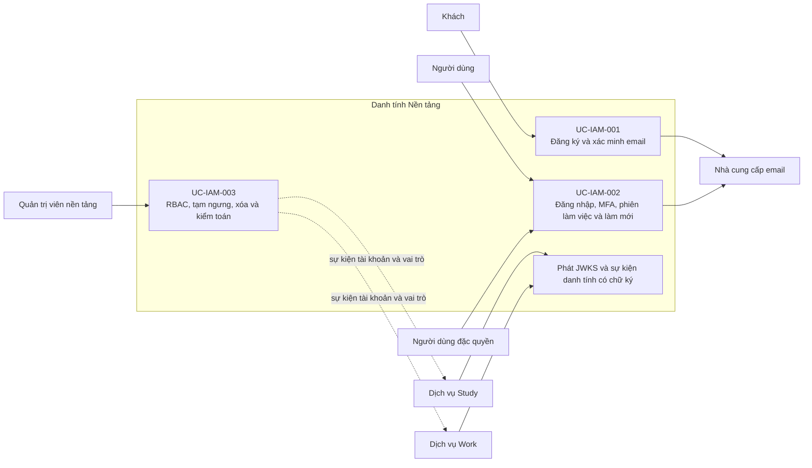
```mermaid
flowchart LR
    Guest[Khách]
    User[Người dùng]
    Priv[Người dùng đặc quyền]
    Admin[Quản trị viên nền tảng]
    Study[Dịch vụ Study]
    Work[Dịch vụ Work]
    Mail[Nhà cung cấp email]

    subgraph IAM[Danh tính Nền tảng]
        Reg["UC-IAM-001<br/>Đăng ký và xác minh email"]
        Login["UC-IAM-002<br/>Đăng nhập, MFA, phiên làm việc và làm mới"]
        Life["UC-IAM-003<br/>RBAC, tạm ngưng, xóa và kiểm toán"]
        JWKS["Phát JWKS và sự kiện danh tính có chữ ký"]
    end

    Guest --> Reg
    User --> Login
    Priv --> Login
    Admin --> Life
    Reg --> Mail
    Login --> Mail
    Life -. sự kiện tài khoản và vai trò .-> Study
    Life -. sự kiện tài khoản và vai trò .-> Work
    Study --> JWKS
    Work --> JWKS
```

### Biểu đồ UC-STU-001 — Bản đồ Study

- **Mục đích:** thể hiện toàn bộ vòng đời học tập từ danh mục đến hoàn thành/minh chứng và vận hành nội dung.
- **Tác nhân:** Khách, người học, tác giả nội dung, người xuất bản được tin cậy, người duyệt, bộ phận hỗ trợ, kiểm duyệt viên, quản trị viên Study, dịch vụ Work.
- **Tiền điều kiện:** nội dung công khai phải có phiên bản đã xuất bản; thao tác của người học yêu cầu tài khoản Danh tính `ACTIVE`; chọn lộ trình chính yêu cầu hoàn tất khởi tạo hồ sơ.
- **Kết thúc:** dữ kiện học tập và lịch sử bất biến được lưu; tác động phụ chạy qua hộp thư đi; nội dung đã xuất bản không bị sửa tại chỗ.
- **Liên kết:** danh mục/ghi danh/lộ trình/tiến độ/lần làm/xuất bản/minh chứng `API-STU-001`, `API-STU-016`, `API-STU-014`, `API-STU-020`, `API-STU-027`, `API-STU-056`, `API-STU-061`; `TBL-STU-001`, `TBL-STU-012`, `TBL-STU-027`, `TBL-STU-033`, `TBL-STU-040`; `SCR-STU-002`, `SCR-STU-005`, `SCR-STU-013`, `SCR-STU-016`, `SCR-STU-017`, `SCR-OPS-007`, `SCR-WRK-017`; `AC-STU-001..003`, `SEQ-STU-001..004`.

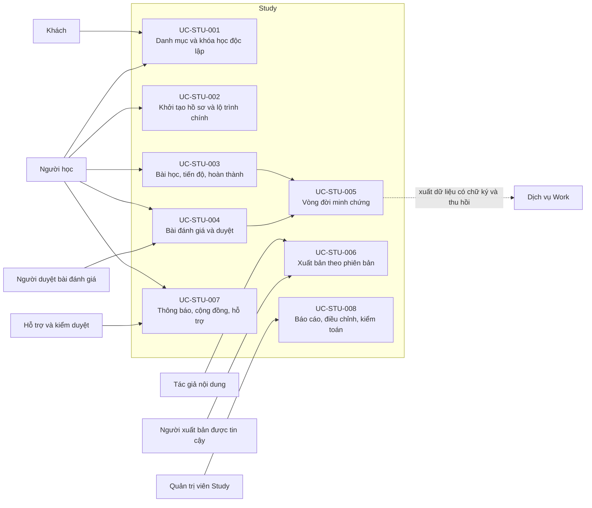
```mermaid
flowchart LR
    Guest[Khách]
    Learner[Người học]
    Author[Tác giả nội dung]
    Publisher[Người xuất bản được tin cậy]
    Reviewer[Người duyệt bài đánh giá]
    Support[Hỗ trợ và kiểm duyệt]
    Admin[Quản trị viên Study]
    Work[Dịch vụ Work]

    subgraph STUDY[Study]
        Catalog["UC-STU-001<br/>Danh mục và khóa học độc lập"]
        Path["UC-STU-002<br/>Khởi tạo hồ sơ và lộ trình chính"]
        Learn["UC-STU-003<br/>Bài học, tiến độ, hoàn thành"]
        Assess["UC-STU-004<br/>Bài đánh giá và duyệt"]
        Evidence["UC-STU-005<br/>Vòng đời minh chứng"]
        Publish["UC-STU-006<br/>Xuất bản theo phiên bản"]
        Engage["UC-STU-007<br/>Thông báo, cộng đồng, hỗ trợ"]
        Operate["UC-STU-008<br/>Báo cáo, điều chỉnh, kiểm toán"]
    end

    Guest --> Catalog
    Learner --> Catalog
    Learner --> Path
    Learner --> Learn
    Learner --> Assess
    Learner --> Engage
    Author --> Publish
    Publisher --> Publish
    Reviewer --> Assess
    Support --> Engage
    Admin --> Operate
    Learn --> Evidence
    Assess --> Evidence
    Evidence -. xuất dữ liệu có chữ ký và thu hồi .-> Work
```

### Biểu đồ UC-WRK-001 — Bản đồ Work

- **Mục đích:** mô tả chuỗi tuyển dụng từ hồ sơ ứng viên, việc làm, tìm nguồn ứng viên, đơn ứng tuyển đến phỏng vấn/trò chuyện và sản phẩm cao cấp.
- **Tác nhân:** Ứng viên, người tuyển dụng, quản trị viên doanh nghiệp, quản lý tuyển dụng, kiểm duyệt viên, dịch vụ Study, dịch vụ thanh toán, nhà cung cấp AI.
- **Tiền điều kiện:** ứng viên và thành viên doanh nghiệp đã xác thực; phạm vi tổ chức được xác định từ tư cách thành viên ở phía máy chủ; việc làm/đơn ứng tuyển phải thuộc phạm vi tổ chức hiện hành.
- **Kết thúc:** bản chụp tuyển dụng và lịch sử được giữ bất biến; chỉ con người có quyền mới chuyển trạng thái ATS; thông tin liên hệ/minh chứng không đi vào chỉ mục tìm kiếm ứng viên.
- **Liên kết:** hồ sơ/tìm kiếm/việc làm/ứng tuyển/ATS/phỏng vấn/trò chuyện `API-WRK-005`, `API-WRK-051`, `API-WRK-043`, `API-WRK-023`, `API-WRK-058`, `API-WRK-060`, `API-WRK-032`; `TBL-WRK-004`, `TBL-WRK-016`, `TBL-WRK-033`, `TBL-WRK-041`, `TBL-WRK-049`, `TBL-WRK-053`, `TBL-WRK-054`; `SCR-WRK-011`, `SCR-WRK-036`, `SCR-WRK-034`, `SCR-WRK-017`, `SCR-WRK-040`, `SCR-WRK-041`, `SCR-WRK-021`; `AC-WRK-001..003`, `AC-INT-001`, `SEQ-WRK-001..005`, `SEQ-INT-001`.

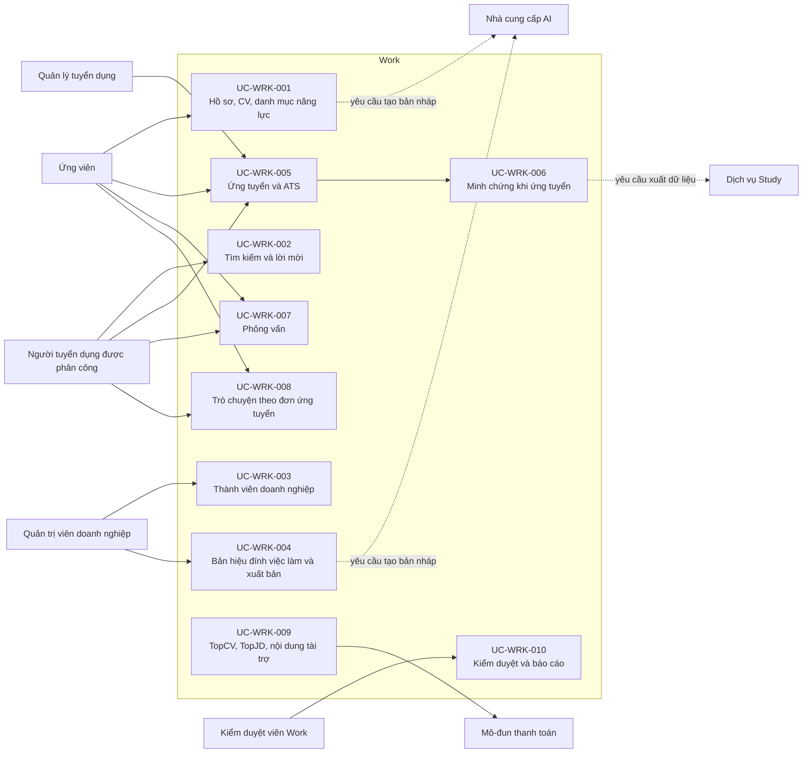
```mermaid
flowchart LR
    Candidate[Ứng viên]
    Recruiter[Người tuyển dụng được phân công]
    EntAdmin[Quản trị viên doanh nghiệp]
    Hiring[Quản lý tuyển dụng]
    Moderator[Kiểm duyệt viên Work]
    Study[Dịch vụ Study]
    Pay[Mô-đun thanh toán]
    AI[Nhà cung cấp AI]

    subgraph WORK[Work]
        Profile["UC-WRK-001<br/>Hồ sơ, CV, danh mục năng lực"]
        Search["UC-WRK-002<br/>Tìm kiếm và lời mời"]
        Tenant["UC-WRK-003<br/>Thành viên doanh nghiệp"]
        Job["UC-WRK-004<br/>Bản hiệu đính việc làm và xuất bản"]
        ATS["UC-WRK-005<br/>Ứng tuyển và ATS"]
        Ev["UC-WRK-006<br/>Minh chứng khi ứng tuyển"]
        Interview["UC-WRK-007<br/>Phỏng vấn"]
        Chat["UC-WRK-008<br/>Trò chuyện theo đơn ứng tuyển"]
        Premium["UC-WRK-009<br/>TopCV, TopJD, nội dung tài trợ"]
        Ops["UC-WRK-010<br/>Kiểm duyệt và báo cáo"]
    end

    Candidate --> Profile
    Candidate --> ATS
    Candidate --> Interview
    Candidate --> Chat
    Recruiter --> Search
    Recruiter --> ATS
    Recruiter --> Interview
    Recruiter --> Chat
    EntAdmin --> Tenant
    EntAdmin --> Job
    Hiring --> ATS
    Moderator --> Ops
    ATS --> Ev
    Ev -. yêu cầu xuất dữ liệu .-> Study
    Premium --> Pay
    Profile -. yêu cầu tạo bản nháp .-> AI
    Job -. yêu cầu tạo bản nháp .-> AI
```

### Biểu đồ UC-UNI-001 — Bản đồ trường

- **Mục đích:** xác định đúng quyền và luồng phối hợp giữa trường, sinh viên và doanh nghiệp mà không biến trường thành người xem mặc định mọi PII.
- **Tác nhân:** Quản trị viên trường, cán bộ hướng nghiệp, sinh viên/ứng viên, người tuyển dụng doanh nghiệp, nhân sự vận hành nền tảng.
- **Tiền điều kiện:** phạm vi tổ chức của trường đã được xác minh; tư cách thành viên, liên kết sinh viên và sự đồng ý còn hiệu lực.
- **Kết thúc:** chương trình/lượt giới thiệu được ghi nhận; báo cáo cá nhân bị chặn nếu thiếu sự đồng ý; dữ liệu tổng hợp dưới 10 người không được hiển thị.
- **Liên kết:** liên kết sinh viên/chương trình/giới thiệu/báo cáo `API-UNI-005`, `API-UNI-010`, `API-UNI-014`, `API-UNI-015`; `TBL-WRK-019`, `TBL-WRK-023`, `TBL-WRK-026`, `TBL-WRK-029`, `TBL-WRK-030`, `TBL-WRK-031`; `SCR-UNI-004`, `SCR-UNI-007`, `SCR-UNI-010`, `SCR-UNI-011`; `AC-UNI-001`, `SEQ-UNI-001`.

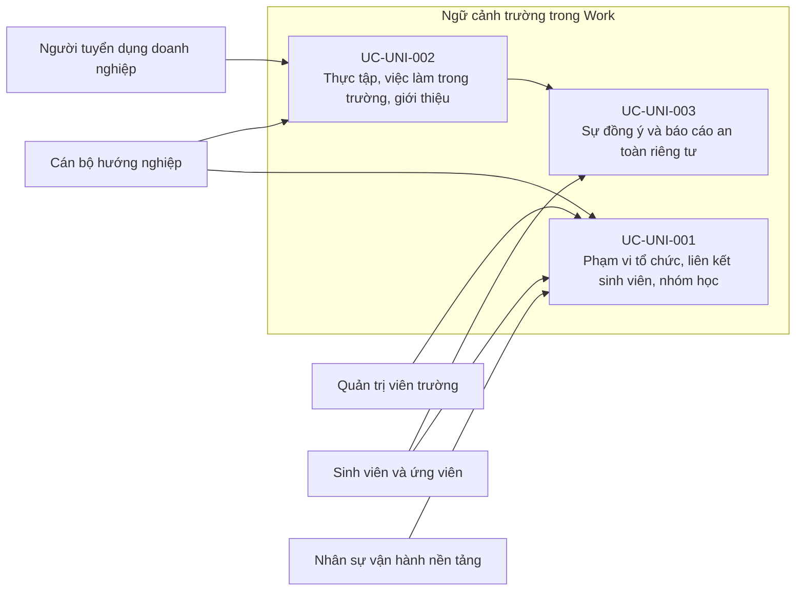
```mermaid
flowchart LR
    UA[Quản trị viên trường]
    CO[Cán bộ hướng nghiệp]
    Student[Sinh viên và ứng viên]
    Recruiter[Người tuyển dụng doanh nghiệp]
    PO[Nhân sự vận hành nền tảng]

    subgraph UNI[Ngữ cảnh trường trong Work]
        Tenant["UC-UNI-001<br/>Phạm vi tổ chức, liên kết sinh viên, nhóm học"]
        Program["UC-UNI-002<br/>Thực tập, việc làm trong trường, giới thiệu"]
        Consent["UC-UNI-003<br/>Sự đồng ý và báo cáo an toàn riêng tư"]
    end

    UA --> Tenant
    CO --> Tenant
    CO --> Program
    Student --> Tenant
    Student --> Consent
    Recruiter --> Program
    PO --> Tenant
    Program --> Consent
```

### Biểu đồ UC-PAY-001 — Bản đồ thanh toán và quyền lợi

- **Mục đích:** tách ý định thanh toán, phản hồi gọi lại của nhà cung cấp, sổ cái và quyền lợi; URL trả về không được cấp quyền sử dụng.
- **Tác nhân:** Học viên, bên mua doanh nghiệp, nhân sự tài chính, VNPAY, MoMo.
- **Tiền điều kiện:** đơn hàng hợp lệ bằng VND; phiên bản sản phẩm/giá còn hiệu lực; khóa chống lặp yêu cầu và thông tin xác thực nhà cung cấp đã có.
- **Kết thúc:** thanh toán được đối soát; chỉ trạng thái `SETTLED` cấp quyền lợi đúng một lần; hoàn tiền/tranh chấp thanh toán ngược không xóa lịch sử và không ghi đè `SETTLED`.
- **Liên kết:** phiên thanh toán/VNPAY/MoMo/hoàn tiền/đối soát `API-PAY-002`, `API-PAY-014`, `API-PAY-015`, `API-PAY-006`, `API-PAY-009`; `TBL-PAY-003`, `TBL-PAY-005`, `TBL-PAY-006`, `TBL-PAY-007`, `TBL-PAY-008`, `TBL-PAY-010`; `SCR-WRK-022`, `SCR-WRK-023`, `SCR-WRK-043`, `SCR-WRK-044`, `SCR-OPS-019`, `SCR-OPS-020`; `AC-PAY-001`, `SEQ-PAY-001`, `SEQ-PAY-002`.

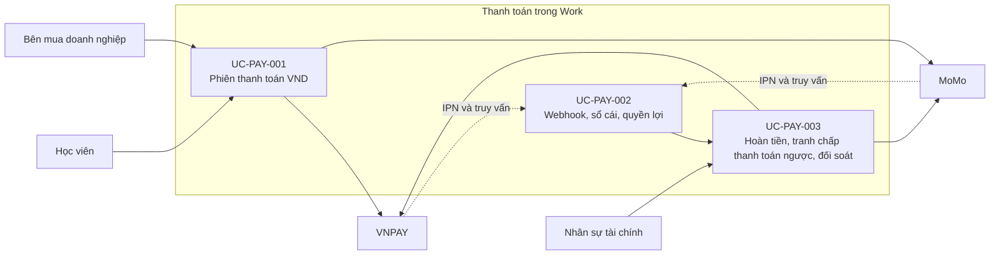
```mermaid
flowchart LR
    Student[Học viên]
    Buyer[Bên mua doanh nghiệp]
    Finance[Nhân sự tài chính]
    VNPAY[VNPAY]
    MoMo[MoMo]

    subgraph PAY[Thanh toán trong Work]
        Checkout["UC-PAY-001<br/>Phiên thanh toán VND"]
        Settle["UC-PAY-002<br/>Webhook, sổ cái, quyền lợi"]
        Reverse["UC-PAY-003<br/>Hoàn tiền, tranh chấp thanh toán ngược, đối soát"]
    end

    Student --> Checkout
    Buyer --> Checkout
    Checkout --> VNPAY
    Checkout --> MoMo
    VNPAY -. IPN và truy vấn .-> Settle
    MoMo -. IPN và truy vấn .-> Settle
    Finance --> Reverse
    Reverse --> VNPAY
    Reverse --> MoMo
    Settle --> Reverse
```

### Biểu đồ UC-AIX-001 — Bản đồ AI có con người trong vòng kiểm soát

- **Mục đích:** giới hạn AI ở vai trò trợ lý tạo bản nháp/giải thích/đề xuất, không trao quyền quyết định tuyển dụng.
- **Tác nhân:** Ứng viên, người tuyển dụng, quản lý tuyển dụng, nhân sự vận hành AI, Ollama hoặc nhà cung cấp thay thế.
- **Tiền điều kiện:** người dùng đã đồng ý gửi dữ liệu được phép; trường bị loại đã được bỏ; chính sách prompt và phiên bản mô hình đang hoạt động.
- **Kết thúc:** đầu ra, nguồn gốc và việc duyệt được lưu; chỉ bản do người dùng áp dụng mới ảnh hưởng bản nháp; ATS không tự đổi trạng thái.
- **Liên kết:** CV/JD/độ phù hợp/danh sách rút gọn việc làm, đầu ra và duyệt bởi con người `API-AIX-001`, `API-AIX-002`, `API-AIX-003`, `API-AIX-004`, `API-AIX-005`, `API-AIX-006`; `TBL-AIX-001`, `TBL-AIX-002`, `TBL-AIX-003`, `TBL-AIX-004`, `TBL-AIX-005`, `TBL-AIX-006`; `SCR-WRK-013`, `SCR-WRK-034`, `SCR-WRK-039`, `SCR-WRK-040`; `AC-AIX-001`, `SEQ-AIX-001`.

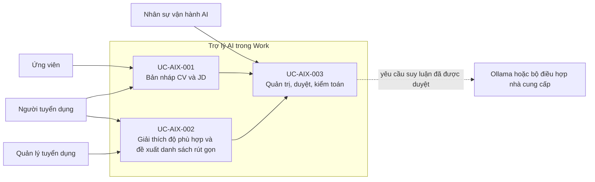
```mermaid
flowchart LR
    Candidate[Ứng viên]
    Recruiter[Người tuyển dụng]
    Hiring[Quản lý tuyển dụng]
    AIOps[Nhân sự vận hành AI]
    Provider[Ollama hoặc bộ điều hợp nhà cung cấp]

    subgraph AIX[Trợ lý AI trong Work]
        Draft["UC-AIX-001<br/>Bản nháp CV và JD"]
        Match["UC-AIX-002<br/>Giải thích độ phù hợp và đề xuất danh sách rút gọn"]
        Govern["UC-AIX-003<br/>Quản trị, duyệt, kiểm toán"]
    end

    Candidate --> Draft
    Recruiter --> Draft
    Recruiter --> Match
    Hiring --> Match
    AIOps --> Govern
    Draft --> Govern
    Match --> Govern
    Govern -. yêu cầu suy luận đã được duyệt .-> Provider
```

### Biểu đồ UC-OPS-001 — Bản đồ vận hành, kiểm duyệt và dữ liệu cá nhân

- **Mục đích:** mô tả các luồng xuyên miền cần kiểm soát đặc biệt: báo cáo/kháng nghị, xóa dữ liệu, lưu giữ pháp lý, thử lại, sao lưu và khôi phục.
- **Tác nhân:** Người báo cáo, kiểm duyệt viên, nhân sự riêng tư, nhân sự bảo mật, tiến trình hệ thống.
- **Tiền điều kiện:** nhân sự vận hành có quyền phù hợp và MFA; mọi truy cập khẩn cấp có lý do, thời hạn và kiểm toán.
- **Kết thúc:** quyết định có thể truy vết; việc xóa lan truyền không lặp tác động; lưu giữ pháp lý được ưu tiên hơn lưu trữ thông thường; DLQ không bị bỏ quên.
- **Liên kết:** kiểm duyệt việc làm/báo cáo/xóa/phát lại sự kiện `API-OPS-003`, `API-OPS-004`, `API-OPS-010`, `API-IAM-019`, `API-INT-006`, `API-INT-007`; `TBL-WRK-060`, `TBL-WRK-061`, `TBL-IAM-017`, `TBL-IAM-018`, `TBL-STU-053`, `TBL-WRK-064`; `SCR-OPS-009`, `SCR-OPS-010`, `SCR-OPS-021`, `SCR-IAM-006`; `AC-OPS-001`, `SEQ-OPS-001`.

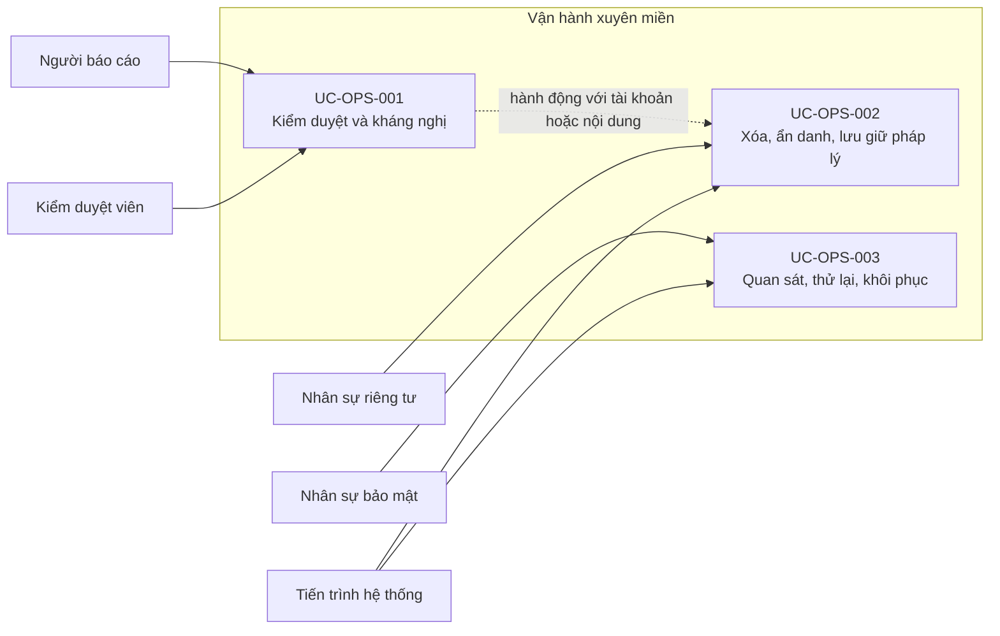
```mermaid
flowchart LR
    Reporter[Người báo cáo]
    Moderator[Kiểm duyệt viên]
    Privacy[Nhân sự riêng tư]
    Security[Nhân sự bảo mật]
    Worker[Tiến trình hệ thống]

    subgraph OPS[Vận hành xuyên miền]
        Mod["UC-OPS-001<br/>Kiểm duyệt và kháng nghị"]
        Delete["UC-OPS-002<br/>Xóa, ẩn danh, lưu giữ pháp lý"]
        Recover["UC-OPS-003<br/>Quan sát, thử lại, khôi phục"]
    end

    Reporter --> Mod
    Moderator --> Mod
    Privacy --> Delete
    Security --> Recover
    Worker --> Delete
    Worker --> Recover
    Mod -. hành động với tài khoản hoặc nội dung .-> Delete
```

## 3. Biểu đồ hoạt động

### AC-IAM-001 — Đăng ký, xác minh, đăng nhập, MFA và làm mới phiên

- **Mục đích:** bao phủ luồng thành công cùng email trùng, mã thông báo hết hạn, gửi lại, khóa thông tin xác thực, tạm ngưng, MFA và tái sử dụng mã làm mới.
- **Tác nhân:** Khách/người dùng, Danh tính Nền tảng, nhà cung cấp email.
- **Tiền điều kiện:** yêu cầu qua HTTPS; email/mật khẩu qua kiểm tra hợp lệ; vai trò đặc quyền bắt buộc đã đăng ký MFA.
- **Kết thúc:** phiên làm việc hợp lệ được cấp hoặc yêu cầu bị từ chối mà không làm lộ sự tồn tại của tài khoản; tái sử dụng thu hồi cả họ phiên.
- **Liên kết:** `UC-IAM-001..003`; `API-IAM-001`, `API-IAM-002`, `API-IAM-004`, `API-IAM-005`, `API-IAM-006`; `TBL-IAM-001`, `TBL-IAM-003`, `TBL-IAM-004`, `TBL-IAM-009`, `TBL-IAM-010`; `SCR-IAM-001`, `SCR-IAM-002`, `SCR-IAM-003`, `SCR-IAM-005`, `SCR-IAM-006`; `SEQ-IAM-001..002`.

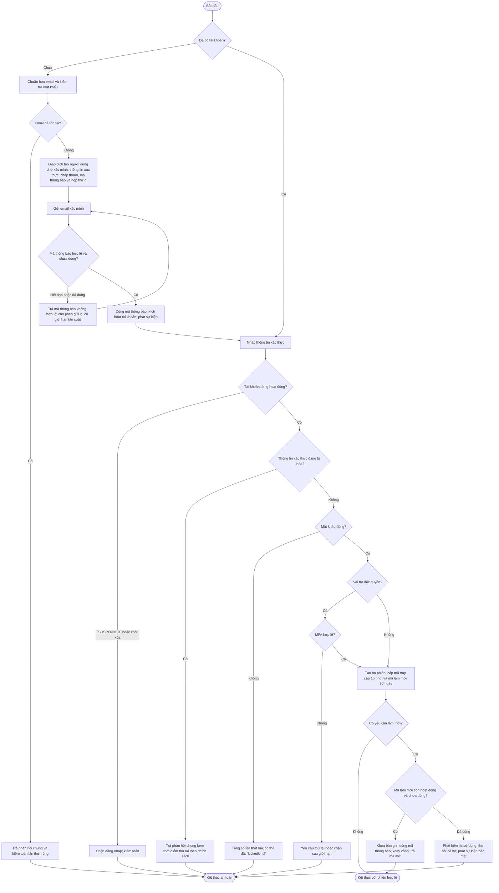
```mermaid
flowchart TD
    A([Bắt đầu]) --> B{Đã có tài khoản?}
    B -- Chưa --> C[Chuẩn hóa email và kiểm tra mật khẩu]
    C --> D{Email đã tồn tại?}
    D -- Có --> E[Trả phản hồi chung và kiểm toán lần thử trùng]
    D -- Không --> F[Giao dịch tạo người dùng chờ xác minh, thông tin xác thực, chấp thuận, mã thông báo và hộp thư đi]
    F --> G[Gửi email xác minh]
    G --> H{Mã thông báo hợp lệ và chưa dùng?}
    H -- Hết hạn hoặc đã dùng --> I[Trả mã thông báo không hợp lệ; cho phép gửi lại có giới hạn tần suất]
    I --> G
    H -- Có --> J[Dùng mã thông báo; kích hoạt tài khoản; phát sự kiện]
    B -- Có --> K[Nhập thông tin xác thực]
    J --> K
    K --> L{Tài khoản đang hoạt động?}
    L -- `SUSPENDED` hoặc chờ xóa --> M[Chặn đăng nhập; kiểm toán]
    L -- Có --> N{Thông tin xác thực đang bị khóa?}
    N -- Có --> O[Trả phản hồi chung kèm thời điểm thử lại theo chính sách]
    N -- Không --> P{Mật khẩu đúng?}
    P -- Không --> Q[Tăng số lần thất bại; có thể đặt `lockedUntil`]
    P -- Có --> R{Vai trò đặc quyền?}
    R -- Có --> S{MFA hợp lệ?}
    S -- Không --> T[Yêu cầu thử lại hoặc chặn sau giới hạn]
    S -- Có --> U[Tạo họ phiên; cấp mã truy cập 15 phút và mã làm mới 30 ngày]
    R -- Không --> U
    U --> V{Có yêu cầu làm mới?}
    V -- Không --> Z([Kết thúc với phiên hợp lệ])
    V -- Có --> W{Mã làm mới còn hoạt động và chưa dùng?}
    W -- Có --> X[Khóa bản ghi; dùng mã thông báo; xoay vòng; trả mã mới]
    X --> Z
    W -- Đã dùng --> Y[Phát hiện tái sử dụng; thu hồi cả họ; phát sự kiện bảo mật]
    E --> ZZ([Kết thúc an toàn])
    M --> ZZ
    O --> ZZ
    Q --> ZZ
    T --> ZZ
    Y --> ZZ
```

### AC-STU-001 — Khóa học độc lập, khởi tạo hồ sơ và đổi lộ trình chính

- **Mục đích:** phân biệt rõ ghi danh khóa học độc lập không cần khởi tạo hồ sơ với lộ trình chính có khởi tạo hồ sơ và thời gian chờ.
- **Tác nhân:** Người học, API Study, tiến trình Study.
- **Tiền điều kiện:** tài khoản Danh tính `ACTIVE`; khóa học/lộ trình có phiên bản hiện hành đã xuất bản.
- **Kết thúc:** lượt ghi danh ghim đúng phiên bản; tối đa một lộ trình chính `ACTIVE`; việc đổi lộ trình giữ toàn bộ tiến độ/lần làm và tạo kiểm toán/hộp thư đi.
- **Liên kết:** `UC-STU-001..003`; danh mục/ghi danh/lộ trình `API-STU-001`, `API-STU-016`, `API-STU-014`; `TBL-STU-001`, `TBL-STU-012`, `TBL-STU-026`, `TBL-STU-027`; `SCR-STU-002`, `SCR-STU-005`, `SCR-STU-011`, `SCR-STU-013`, `SCR-STU-014`; `SEQ-STU-001`.

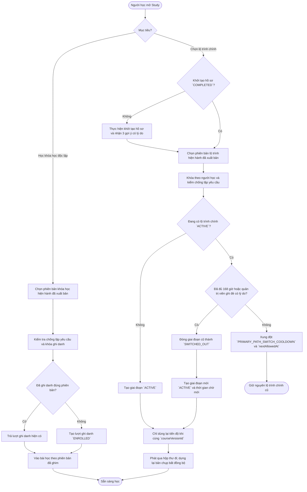
```mermaid
flowchart TD
    A([Người học mở Study]) --> B{Mục tiêu?}
    B -- Học khóa học độc lập --> C[Chọn phiên bản khóa học hiện hành đã xuất bản]
    C --> D[Kiểm tra chống lặp yêu cầu và khóa ghi danh]
    D --> E{Đã ghi danh đúng phiên bản?}
    E -- Có --> F[Trả lượt ghi danh hiện có]
    E -- Không --> G[Tạo lượt ghi danh `ENROLLED`]
    F --> H[Vào bài học theo phiên bản đã ghim]
    G --> H
    B -- Chọn lộ trình chính --> I{Khởi tạo hồ sơ `COMPLETED`?}
    I -- Không --> J[Thực hiện khởi tạo hồ sơ và nhận 3 gợi ý có lý do]
    J --> K[Chọn phiên bản lộ trình hiện hành đã xuất bản]
    I -- Có --> K
    K --> L[Khóa theo người học và kiểm chống lặp yêu cầu]
    L --> M{Đang có lộ trình chính `ACTIVE`?}
    M -- Không --> N[Tạo giai đoạn `ACTIVE`]
    M -- Có --> O{Đã đủ 168 giờ hoặc quản trị viên ghi đè có lý do?}
    O -- Không --> P[Xung đột `PRIMARY_PATH_SWITCH_COOLDOWN` và `nextAllowedAt`]
    O -- Có --> Q[Đóng giai đoạn cũ thành `SWITCHED_OUT`]
    Q --> R[Tạo giai đoạn mới `ACTIVE` và thời gian chờ mới]
    N --> S[Chỉ dùng lại tiến độ khi cùng `courseVersionId`]
    R --> S
    S --> T[Phát qua hộp thư đi; dựng lại bản chụp bất đồng bộ]
    H --> U([Sẵn sàng học])
    T --> U
    P --> V([Giữ nguyên lộ trình chính cũ])
```

### AC-STU-002 — Học bài, bài đánh giá, quét tệp và hoàn thành

- **Mục đích:** nối tiến độ nguồn sự thật với bốn loại bài đánh giá, quét tệp và minh chứng.
- **Tác nhân:** Người học, API Study, tiến trình ClamAV, người duyệt.
- **Tiền điều kiện:** người học có lượt ghi danh đúng phiên bản khóa học; vị trí bài đánh giá có đúng một phạm vi; chưa hết giới hạn lần làm.
- **Kết thúc:** dữ kiện hoàn thành chỉ tăng; lần làm đã nộp là bất biến; hoàn thành khóa học/minh chứng chỉ phát khi thỏa quy tắc.
- **Liên kết:** `UC-STU-003..005`; tiến độ/tải tệp/lần làm/duyệt `API-STU-020`, `API-STU-030`, `API-STU-031`, `API-STU-032`, `API-STU-027`, `API-STU-048`; `TBL-STU-029`, `TBL-STU-033`, `TBL-STU-035`, `TBL-STU-036`, `TBL-STU-038`, `TBL-STU-040`; `SCR-STU-016`, `SCR-STU-017`, `SCR-STU-018`, `SCR-OPS-013`; `SEQ-STU-002`, `SEQ-STU-003`.

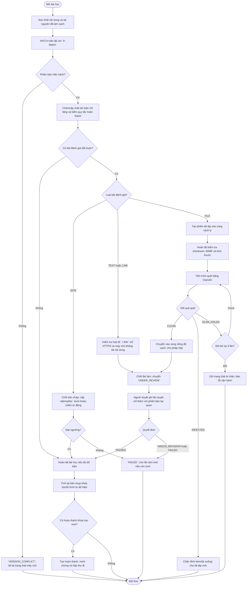
```mermaid
flowchart TD
    A([Mở bài học]) --> B[Đọc khối nội dung và tài nguyên đã làm sạch]
    B --> C[PATCH tiến độ với `If-Match`]
    C --> D{Phiên bản hiện hành?}
    D -- Không --> E[`VERSION_CONFLICT`; tải lại trạng thái máy chủ]
    D -- Có --> F[Chèn/cập nhật dữ kiện chỉ tăng và kiểm quy tắc hoàn thành]
    F --> G{Có bài đánh giá bắt buộc?}
    G -- Không --> H[Hoàn tất bài học nếu đủ dữ kiện]
    G -- Có --> I{Loại bài đánh giá?}
    I -- QUIZ --> J[Chốt bản nháp; cấp `attemptNo` dưới khóa; chấm tự động]
    J --> K{Đạt ngưỡng?}
    K -- Có --> H
    K -- Không --> L[`FAILED`; cho lần làm mới nếu còn lượt]
    I -- TEXT hoặc LINK --> M[Kiểm tra hợp lệ; `LINK` chỉ HTTPS và máy chủ không tải nội dung]
    M --> N[Chốt lần làm; chuyển `UNDER_REVIEW`]
    I -- FILE --> O[Tạo phiên tải tệp vào vùng cách ly]
    O --> P[Hoàn tất kiểm tra checksum, MIME và kích thước]
    P --> Q[Tiến trình quét bằng ClamAV]
    Q --> R{Kết quả quét}
    R -- CLEAN --> S[Chuyển vào vùng riêng đã sạch; cho phép nộp]
    R -- INFECTED --> T[Chặn đính kèm/tải xuống; cho tải tệp mới]
    R -- SCAN_FAILED --> U{Đã thử lại 3 lần?}
    U -- Chưa --> Q
    U -- Rồi --> V[Giữ trạng thái bị chặn; báo lỗi vận hành]
    S --> N
    N --> W[Người duyệt ghi lần duyệt chỉ thêm với phiên bản lạc quan]
    W --> X{Quyết định}
    X -- PASSED --> H
    X -- NEEDS_REVISION hoặc FAILED --> L
    H --> Y[Tính lại bản chụp khóa học/lộ trình từ dữ kiện]
    Y --> Z{Có hoàn thành khóa học mới?}
    Z -- Có --> AA[Tạo hoàn thành, minh chứng và hộp thư đi]
    Z -- Không --> AB([Kết thúc])
    AA --> AB
    E --> AB
    L --> AB
    T --> AB
    V --> AB
```

### AC-STU-003 — Soạn và xuất bản phiên bản nội dung

- **Mục đích:** bảo đảm tác giả không sửa bản hiệu đính đã xuất bản và người xuất bản không bỏ qua quyền, làm sạch, quét tệp hoặc kiểm tra hợp lệ.
- **Tác nhân:** Tác giả nội dung, người xuất bản được tin cậy, API Study, tiến trình quét.
- **Tiền điều kiện:** thực thể nội dung ổn định tồn tại; tác giả/người xuất bản có quyền cục bộ tương ứng.
- **Kết thúc:** bản nháp được xuất bản nguyên tử hoặc giữ nguyên để sửa; phiên bản cũ chuyển `SUPERSEDED` nhưng vẫn truy cập được bởi lượt ghi danh đã ghim.
- **Liên kết:** `UC-STU-006`; bản nháp/kiểm tra/xuất bản `API-STU-054`, `API-STU-055`, `API-STU-056`; `TBL-STU-010`, `TBL-STU-012`, `TBL-STU-017`, `TBL-STU-018`; `SCR-OPS-004`, `SCR-OPS-005`, `SCR-OPS-007`; `SEQ-STU-004`.

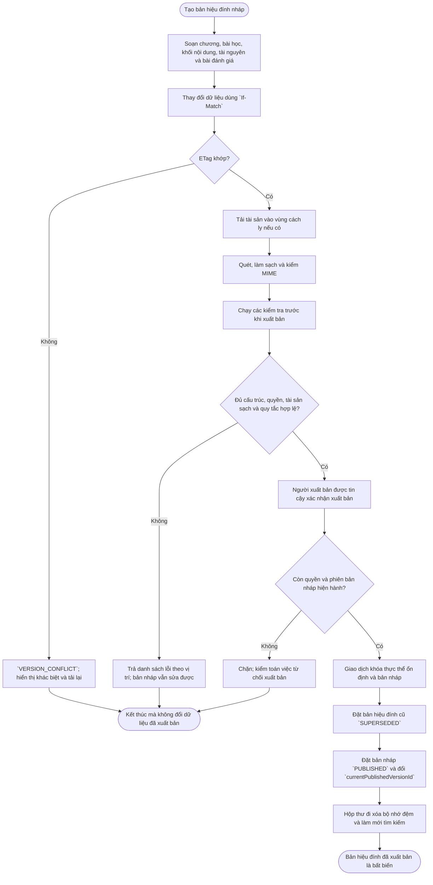
```mermaid
flowchart TD
    A([Tạo bản hiệu đính nháp]) --> B[Soạn chương, bài học, khối nội dung, tài nguyên và bài đánh giá]
    B --> C[Thay đổi dữ liệu dùng `If-Match`]
    C --> D{ETag khớp?}
    D -- Không --> E[`VERSION_CONFLICT`; hiển thị khác biệt và tải lại]
    D -- Có --> F[Tải tài sản vào vùng cách ly nếu có]
    F --> G[Quét, làm sạch và kiểm MIME]
    G --> H[Chạy các kiểm tra trước khi xuất bản]
    H --> I{Đủ cấu trúc, quyền, tài sản sạch và quy tắc hợp lệ?}
    I -- Không --> J[Trả danh sách lỗi theo vị trí; bản nháp vẫn sửa được]
    I -- Có --> K[Người xuất bản được tin cậy xác nhận xuất bản]
    K --> L{Còn quyền và phiên bản nháp hiện hành?}
    L -- Không --> M[Chặn; kiểm toán việc từ chối xuất bản]
    L -- Có --> N[Giao dịch khóa thực thể ổn định và bản nháp]
    N --> O[Đặt bản hiệu đính cũ `SUPERSEDED`]
    O --> P[Đặt bản nháp `PUBLISHED` và đổi `currentPublishedVersionId`]
    P --> Q[Hộp thư đi xóa bộ nhớ đệm và làm mới tìm kiếm]
    Q --> R([Bản hiệu đính đã xuất bản là bất biến])
    E --> S([Kết thúc mà không đổi dữ liệu đã xuất bản])
    J --> S
    M --> S
```

### AC-STU-004 — Thông báo, cộng đồng, hỗ trợ và vận hành Study

- **Mục đích:** bao phủ các luồng tương tác còn lại mà không cho thông báo/cộng đồng/hỗ trợ sửa trực tiếp dữ kiện học tập.
- **Tác nhân:** Người học, tiến trình Study, kiểm duyệt viên cộng đồng, nhân viên hỗ trợ, quản trị viên Study.
- **Tiền điều kiện:** người học đang hoạt động; điều kiện vào cộng đồng được tính từ ghi danh/lộ trình; nhân sự vận hành có quyền cục bộ và MFA khi điều chỉnh dữ liệu.
- **Kết thúc:** thông báo đã khử trùng lặp có lịch sử gửi; liên kết cộng đồng chỉ mở sau khi chấp thuận quy tắc hiện hành; hỗ trợ/điều chỉnh có sự kiện/kiểm toán; báo cáo dùng bản chụp tổng hợp.
- **Liên kết:** `UC-STU-007..008`; `API-STU-034`, `API-STU-039`, `API-STU-040`, `API-STU-041`, `API-STU-043`, `API-STU-045`, `API-STU-050`, `API-OPS-010`; `TBL-STU-042`, `TBL-STU-043`, `TBL-STU-044`, `TBL-STU-045`, `TBL-STU-046`, `TBL-STU-047`, `TBL-STU-048`, `TBL-STU-049`, `TBL-STU-050`, `TBL-STU-054`; `SCR-STU-020`, `SCR-STU-021`, `SCR-STU-022`, `SCR-OPS-014`, `SCR-OPS-015`, `SCR-OPS-021`; `SEQ-STU-005`.

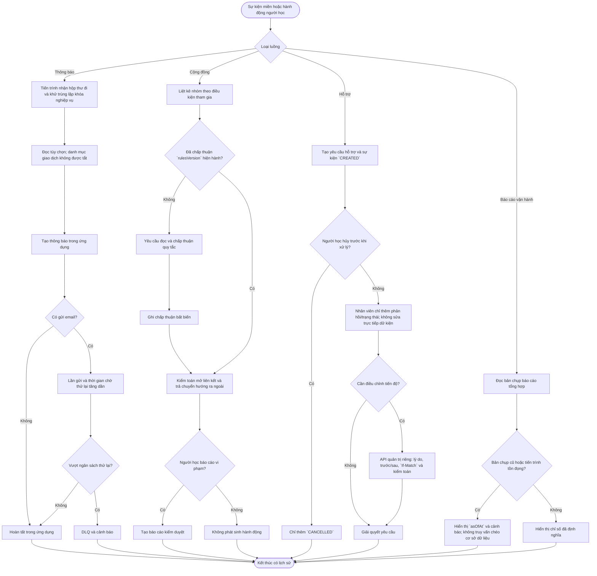
```mermaid
flowchart TD
    A([Sự kiện miền hoặc hành động người học]) --> B{Loại luồng}
    B -- Thông báo --> C[Tiến trình nhận hộp thư đi và khử trùng lặp khóa nghiệp vụ]
    C --> D[Đọc tùy chọn; danh mục giao dịch không được tắt]
    D --> E[Tạo thông báo trong ứng dụng]
    E --> F{Có gửi email?}
    F -- Có --> G[Lần gửi và thời gian chờ thử lại tăng dần]
    F -- Không --> H[Hoàn tất trong ứng dụng]
    G --> I{Vượt ngân sách thử lại?}
    I -- Có --> J[DLQ và cảnh báo]
    I -- Không --> H
    B -- Cộng đồng --> K[Liệt kê nhóm theo điều kiện tham gia]
    K --> L{Đã chấp thuận `rulesVersion` hiện hành?}
    L -- Không --> M[Yêu cầu đọc và chấp thuận quy tắc]
    M --> N[Ghi chấp thuận bất biến]
    N --> O[Kiểm toán mở liên kết và trả chuyển hướng ra ngoài]
    L -- Có --> O
    O --> P{Người học báo cáo vi phạm?}
    P -- Có --> Q[Tạo báo cáo kiểm duyệt]
    P -- Không --> R[Không phát sinh hành động]
    B -- Hỗ trợ --> S[Tạo yêu cầu hỗ trợ và sự kiện `CREATED`]
    S --> T{Người học hủy trước khi xử lý?}
    T -- Có --> U[Chỉ thêm `CANCELLED`]
    T -- Không --> V[Nhân viên chỉ thêm phản hồi/trạng thái; không sửa trực tiếp dữ kiện]
    V --> W{Cần điều chỉnh tiến độ?}
    W -- Có --> X[API quản trị riêng: lý do, trước/sau, `If-Match` và kiểm toán]
    W -- Không --> Y[Giải quyết yêu cầu]
    X --> Y
    B -- Báo cáo vận hành --> Z[Đọc bản chụp báo cáo tổng hợp]
    Z --> AA{Bản chụp cũ hoặc tiến trình tồn đọng?}
    AA -- Có --> AB[Hiển thị `asOfAt` và cảnh báo; không truy vấn chéo cơ sở dữ liệu]
    AA -- Không --> AC[Hiển thị chỉ số đã định nghĩa]
    H --> AD([Kết thúc có lịch sử])
    J --> AD
    Q --> AD
    R --> AD
    U --> AD
    Y --> AD
    AB --> AD
    AC --> AD
```

### AC-WRK-001 — Riêng tư ứng viên, tìm kiếm, lời mời và rút tham gia

- **Mục đích:** giữ hồ sơ riêng tư theo mặc định và bảo đảm tìm kiếm ứng viên không rò thông tin liên hệ, CV hay minh chứng.
- **Tác nhân:** Ứng viên, người tuyển dụng, tiến trình lập chỉ mục tìm kiếm.
- **Tiền điều kiện:** hồ sơ ứng viên có phiên bản; người tuyển dụng thuộc phạm vi tổ chức doanh nghiệp hợp lệ và có quyền tìm nguồn ứng viên.
- **Kết thúc:** chỉ hồ sơ tự nguyện tham gia xuất hiện; rút tham gia bị loại khỏi chỉ mục trong tối đa 5 phút; lời mời không tự mở trò chuyện.
- **Liên kết:** `UC-WRK-001..003`; hồ sơ/sự đồng ý/tìm kiếm/lời mời `API-WRK-006`, `API-WRK-007`, `API-WRK-051`, `API-WRK-053`; `TBL-WRK-004`, `TBL-WRK-005`, `TBL-WRK-037`, `TBL-WRK-038`; `SCR-WRK-011`, `SCR-WRK-012`, `SCR-WRK-036`, `SCR-WRK-037`; `SEQ-WRK-001`.

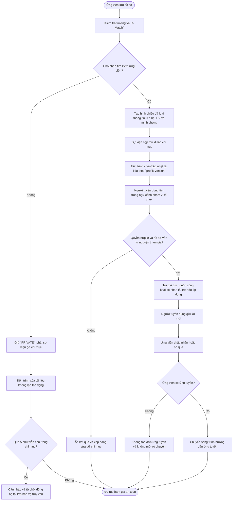
```mermaid
flowchart TD
    A([Ứng viên lưu hồ sơ]) --> B[Kiểm tra trường và `If-Match`]
    B --> C{Cho phép tìm kiếm ứng viên?}
    C -- Không --> D[Giữ `PRIVATE`; phát sự kiện gỡ chỉ mục]
    C -- Có --> E[Tạo hình chiếu đã loại thông tin liên hệ, CV và minh chứng]
    E --> F[Sự kiện hộp thư đi lập chỉ mục]
    D --> G[Tiến trình xóa tài liệu không lặp tác động]
    F --> H[Tiến trình chèn/cập nhật tài liệu theo `profileVersion`]
    H --> I[Người tuyển dụng tìm trong ngữ cảnh phạm vi tổ chức]
    I --> J{Quyền hợp lệ và hồ sơ vẫn tự nguyện tham gia?}
    J -- Không --> K[Ẩn kết quả và xếp hàng sửa gỡ chỉ mục]
    J -- Có --> L[Trả thẻ tìm nguồn công khai có nhãn tài trợ nếu áp dụng]
    L --> M[Người tuyển dụng gửi lời mời]
    M --> N[Ứng viên chấp nhận hoặc bỏ qua]
    N --> O{Ứng viên có ứng tuyển?}
    O -- Không --> P[Không tạo đơn ứng tuyển và không mở trò chuyện]
    O -- Có --> Q[Chuyển sang trình hướng dẫn ứng tuyển]
    G --> R{Quá 5 phút vẫn còn trong chỉ mục?}
    R -- Có --> S[Cảnh báo và từ chối đồng bộ tại lớp bảo vệ truy vấn]
    R -- Không --> T([Đã rút tham gia an toàn])
    K --> T
    P --> T
    Q --> T
```

### AC-WRK-002 — Bản hiệu đính việc làm, ứng tuyển và ATS

- **Mục đích:** mô tả vòng đời việc làm/đơn ứng tuyển, bản chụp bất biến, phân quyền theo phạm vi tổ chức và chuyển ATS có quyết định của con người.
- **Tác nhân:** Ứng viên, người tuyển dụng, quản lý tuyển dụng, quản trị viên doanh nghiệp, kiểm duyệt viên.
- **Tiền điều kiện:** doanh nghiệp đang hoạt động; bản hiệu đính việc làm `PUBLISHED`; ứng viên chưa có đơn ứng tuyển cho việc làm; tác nhân ATS được phân công hoặc có quyền quản trị.
- **Kết thúc:** một đơn ứng tuyển được tạo cùng các bản chụp; chuyển tiếp hợp lệ được thêm vào lịch sử; trạng thái kết thúc khóa trò chuyện và thao tác thay đổi không phù hợp.
- **Liên kết:** `UC-WRK-003..005`; việc làm/xuất bản/ứng tuyển/ATS `API-WRK-043`, `API-WRK-047`, `API-WRK-023`, `API-WRK-058`; `TBL-WRK-033`, `TBL-WRK-035`, `TBL-WRK-041`, `TBL-WRK-042`, `TBL-WRK-046`; `SCR-WRK-034`, `SCR-WRK-035`, `SCR-WRK-017`, `SCR-WRK-040`; `SEQ-WRK-002`, `SEQ-WRK-003`.

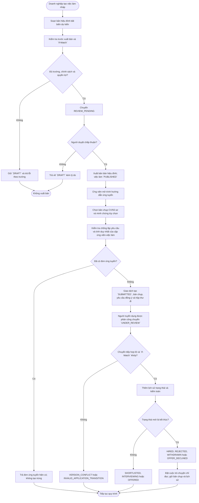
```mermaid
flowchart TD
    A([Doanh nghiệp tạo việc làm nháp]) --> B[Soạn bản hiệu đính bất biến dự kiến]
    B --> C[Kiểm tra trước xuất bản và `If-Match`]
    C --> D{Đủ trường, chính sách và quyền lợi?}
    D -- Không --> E[Giữ `DRAFT` và trả lỗi theo trường]
    D -- Có --> F[Chuyển REVIEW_PENDING]
    F --> G{Người duyệt chấp thuận?}
    G -- Không --> H[Trả về `DRAFT` kèm lý do]
    G -- Có --> I[Xuất bản bản hiệu đính; việc làm `PUBLISHED`]
    I --> J[Ứng viên mở trình hướng dẫn ứng tuyển]
    J --> K[Chọn bản chụp CV/hồ sơ và minh chứng tùy chọn]
    K --> L[Kiểm tra chống lặp yêu cầu và tính duy nhất của cặp ứng viên-việc làm]
    L --> M{Đã có đơn ứng tuyển?}
    M -- Có --> N[Trả đơn ứng tuyển hiện có; không tạo trùng]
    M -- Không --> O[Giao dịch tạo `SUBMITTED`, bản chụp, yêu cầu đồng ý và hộp thư đi]
    O --> P[Người tuyển dụng được phân công chuyển `UNDER_REVIEW`]
    P --> Q{Chuyển tiếp hợp lệ và `If-Match` khớp?}
    Q -- Không --> R[VERSION_CONFLICT hoặc INVALID_APPLICATION_TRANSITION]
    Q -- Có --> S[Thêm lịch sử trạng thái và kiểm toán]
    S --> T{Trạng thái mới là kết thúc?}
    T -- Không --> U[SHORTLISTED, INTERVIEWING hoặc OFFERED]
    T -- Có --> V[HIRED, REJECTED, WITHDRAWN hoặc OFFER_DECLINED]
    V --> W[Đặt cuộc trò chuyện chỉ đọc; giữ bản chụp và lịch sử]
    U --> X([Tiếp tục quy trình])
    W --> X
    E --> Y([Không xuất bản])
    H --> Y
    N --> X
    R --> X
```

### AC-WRK-003 — Phỏng vấn và trò chuyện theo đơn ứng tuyển

- **Mục đích:** phối hợp lịch nội bộ/ICS với trò chuyện thời gian thực nhưng giữ REST và trạng thái có phiên bản làm nguồn sự thật.
- **Tác nhân:** Ứng viên, người tuyển dụng được phân công, quản lý tuyển dụng, tiến trình thông báo, cổng WebSocket.
- **Tiền điều kiện:** đơn ứng tuyển chưa kết thúc; người tuyển dụng được phân công; một cuộc trò chuyện đã hoặc sẽ được tạo đúng một lần.
- **Kết thúc:** lịch/tin nhắn không lặp tác động và có kiểm toán; kết nối lại không mất lịch sử; đơn ứng tuyển kết thúc làm trò chuyện chỉ đọc.
- **Liên kết:** `UC-WRK-007..008`; phỏng vấn/trò chuyện/lịch sử `API-WRK-028`, `API-WRK-029`, `API-WRK-060`, `API-WRK-061`, `API-WRK-062`, `API-WRK-031`, `API-WRK-032`; `TBL-WRK-049`, `TBL-WRK-050`, `TBL-WRK-053`, `TBL-WRK-054`, `TBL-WRK-055`; `SCR-WRK-020`, `SCR-WRK-021`, `SCR-WRK-041`, `SCR-WRK-042`; `SEQ-WRK-004`, `SEQ-WRK-005`.

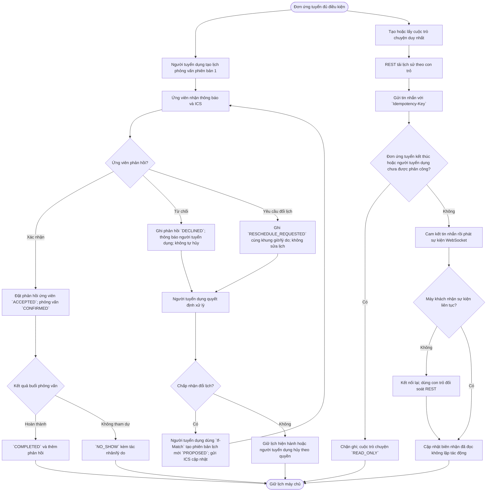
```mermaid
flowchart TD
    A([Đơn ứng tuyển đủ điều kiện]) --> B[Người tuyển dụng tạo lịch phỏng vấn phiên bản 1]
    B --> C[Ứng viên nhận thông báo và ICS]
    C --> D{Ứng viên phản hồi?}
    D -- Xác nhận --> E[Đặt phản hồi ứng viên `ACCEPTED`; phỏng vấn `CONFIRMED`]
    D -- Từ chối --> F[Ghi phản hồi `DECLINED`; thông báo người tuyển dụng; không tự hủy]
    D -- Yêu cầu đổi lịch --> G[Ghi `RESCHEDULE_REQUESTED` cùng khung giờ/lý do; không sửa lịch]
    F --> H[Người tuyển dụng quyết định xử lý]
    G --> H
    H --> I{Chấp nhận đổi lịch?}
    I -- Có --> J[Người tuyển dụng dùng `If-Match` tạo phiên bản lịch mới `PROPOSED`; gửi ICS cập nhật]
    J --> C
    I -- Không --> K[Giữ lịch hiện hành hoặc người tuyển dụng hủy theo quyền]
    E --> L{Kết quả buổi phỏng vấn}
    L -- Hoàn thành --> M[`COMPLETED` và thêm phản hồi]
    L -- Không tham dự --> N[`NO_SHOW` kèm tác nhân/lý do]
    A --> O[Tạo hoặc lấy cuộc trò chuyện duy nhất]
    O --> P[REST tải lịch sử theo con trỏ]
    P --> Q[Gửi tin nhắn với `Idempotency-Key`]
    Q --> R{Đơn ứng tuyển kết thúc hoặc người tuyển dụng chưa được phân công?}
    R -- Có --> S[Chặn ghi; cuộc trò chuyện `READ_ONLY`]
    R -- Không --> T[Cam kết tin nhắn rồi phát sự kiện WebSocket]
    T --> U{Máy khách nhận sự kiện liên tục?}
    U -- Không --> V[Kết nối lại; dùng con trỏ đối soát REST]
    U -- Có --> W[Cập nhật biên nhận đã đọc không lặp tác động]
    V --> W
    K --> X([Giữ lịch máy chủ])
    M --> X
    N --> X
    S --> X
    W --> X
```

### AC-INT-001 — Chọn minh chứng khi ứng tuyển và đồng bộ bất đồng bộ

- **Mục đích:** cho ứng viên chọn minh chứng của chính mình mà Work không đọc cơ sở dữ liệu Study và không tạo kho minh chứng toàn cục.
- **Tác nhân:** Ứng viên, API/tiến trình Work, API/tiến trình Study, người tuyển dụng.
- **Tiền điều kiện:** ứng viên có mã truy cập với đối tượng nhận là Study; lựa chọn minh chứng rõ ràng; giao dịch đơn ứng tuyển chưa được cam kết bằng cùng khóa bất biến theo yêu cầu.
- **Kết thúc:** đơn ứng tuyển không phụ thuộc tính sẵn sàng của Study; bản chụp tối thiểu có trạng thái `PENDING`, `READY`, `UNAVAILABLE`, `HIDDEN` hoặc `REVOKED`.
- **Liên kết:** `UC-STU-005`, `UC-WRK-005..006`; xuất minh chứng/kết quả/thu hồi có chữ ký `API-INT-002`, `API-INT-004`, `API-INT-005`; `TBL-STU-040`, `TBL-STU-041`, `TBL-WRK-043`, `TBL-WRK-044`, `TBL-WRK-045`, `TBL-WRK-069`; `SCR-WRK-017`, `SCR-WRK-019`, `SCR-WRK-040`; `SEQ-INT-001`.

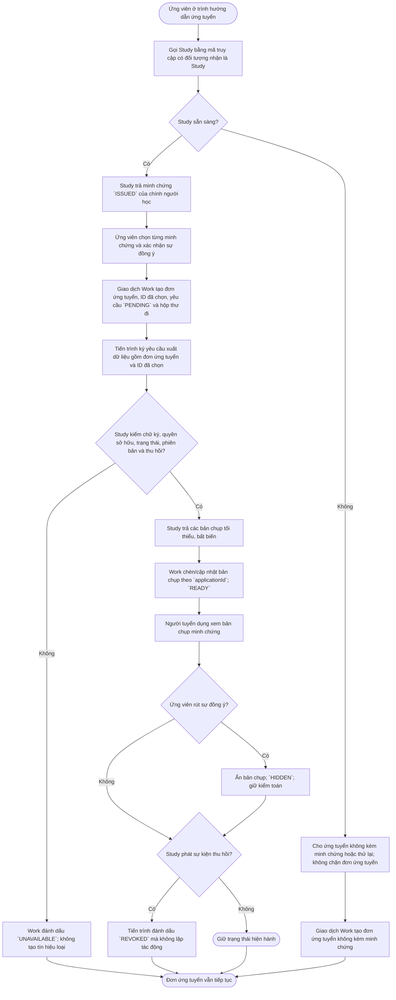
```mermaid
flowchart TD
    A([Ứng viên ở trình hướng dẫn ứng tuyển]) --> B[Gọi Study bằng mã truy cập có đối tượng nhận là Study]
    B --> C{Study sẵn sàng?}
    C -- Không --> D[Cho ứng tuyển không kèm minh chứng hoặc thử lại; không chặn đơn ứng tuyển]
    C -- Có --> E[Study trả minh chứng `ISSUED` của chính người học]
    E --> F[Ứng viên chọn từng minh chứng và xác nhận sự đồng ý]
    F --> G[Giao dịch Work tạo đơn ứng tuyển, ID đã chọn, yêu cầu `PENDING` và hộp thư đi]
    D --> H[Giao dịch Work tạo đơn ứng tuyển không kèm minh chứng]
    G --> I[Tiến trình ký yêu cầu xuất dữ liệu gồm đơn ứng tuyển và ID đã chọn]
    I --> J{Study kiểm chữ ký, quyền sở hữu, trạng thái, phiên bản và thu hồi?}
    J -- Không --> K[Work đánh dấu `UNAVAILABLE`; không tạo tín hiệu loại]
    J -- Có --> L[Study trả các bản chụp tối thiểu, bất biến]
    L --> M[Work chèn/cập nhật bản chụp theo `applicationId`; `READY`]
    M --> N[Người tuyển dụng xem bản chụp minh chứng]
    N --> O{Ứng viên rút sự đồng ý?}
    O -- Có --> P[Ẩn bản chụp; `HIDDEN`; giữ kiểm toán]
    O -- Không --> Q{Study phát sự kiện thu hồi?}
    P --> Q
    Q -- Có --> R[Tiến trình đánh dấu `REVOKED` mà không lặp tác động]
    Q -- Không --> S([Giữ trạng thái hiện hành])
    K --> T([Đơn ứng tuyển vẫn tiếp tục])
    R --> T
    S --> T
    H --> T
```

### AC-UNI-001 — Liên kết trường, chương trình, giới thiệu và báo cáo an toàn riêng tư

- **Mục đích:** bảo đảm phạm vi tổ chức của trường chỉ thao tác trên tư cách thành viên của mình và không dùng báo cáo để suy ra cá nhân thiếu sự đồng ý.
- **Tác nhân:** Sinh viên, quản trị viên trường, cán bộ hướng nghiệp, người tuyển dụng doanh nghiệp.
- **Tiền điều kiện:** phạm vi tổ chức của trường đã xác minh; tư cách thành viên nhân sự vận hành đang hoạt động; chương trình và hợp tác doanh nghiệp còn hiệu lực.
- **Kết thúc:** liên kết sinh viên/lượt giới thiệu có lịch sử; PII chỉ hiện khi sự đồng ý đang hoạt động; báo cáo tổng hợp dưới ngưỡng bị ẩn.
- **Liên kết:** `UC-UNI-001..003`; `API-UNI-005`, `API-UNI-010`, `API-UNI-014`, `API-UNI-015`; `TBL-WRK-019`, `TBL-WRK-023`, `TBL-WRK-026`, `TBL-WRK-029`, `TBL-WRK-030`, `TBL-WRK-031`; `SCR-UNI-004`, `SCR-UNI-007`, `SCR-UNI-010`, `SCR-UNI-011`; `SEQ-UNI-001`.

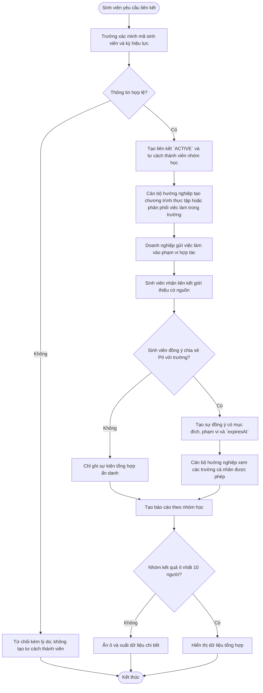
```mermaid
flowchart TD
    A([Sinh viên yêu cầu liên kết]) --> B[Trường xác minh mã sinh viên và kỳ hiệu lực]
    B --> C{Thông tin hợp lệ?}
    C -- Không --> D[Từ chối kèm lý do; không tạo tư cách thành viên]
    C -- Có --> E[Tạo liên kết `ACTIVE` và tư cách thành viên nhóm học]
    E --> F[Cán bộ hướng nghiệp tạo chương trình thực tập hoặc phân phối việc làm trong trường]
    F --> G[Doanh nghiệp gửi việc làm vào phạm vi hợp tác]
    G --> H[Sinh viên nhận liên kết giới thiệu có nguồn]
    H --> I{Sinh viên đồng ý chia sẻ PII với trường?}
    I -- Có --> J[Tạo sự đồng ý có mục đích, phạm vi và `expiresAt`]
    I -- Không --> K[Chỉ ghi sự kiện tổng hợp ẩn danh]
    J --> L[Cán bộ hướng nghiệp xem các trường cá nhân được phép]
    K --> M[Tạo báo cáo theo nhóm học]
    L --> M
    M --> N{Nhóm kết quả ít nhất 10 người?}
    N -- Không --> O[Ẩn ô và xuất dữ liệu chi tiết]
    N -- Có --> P[Hiển thị dữ liệu tổng hợp]
    D --> Q([Kết thúc])
    O --> Q
    P --> Q
```

### AC-PAY-001 — Phiên thanh toán, phản hồi gọi lại, quyền lợi và bút toán đảo

- **Mục đích:** xử lý VNPAY/MoMo an toàn trước phản hồi gọi lại trùng/sai thứ tự và tách URL trả về khỏi nguồn xác nhận.
- **Tác nhân:** Bên mua, thanh toán Work, VNPAY/MoMo, nhân sự tài chính, tiến trình đối soát.
- **Tiền điều kiện:** sản phẩm/giá hợp lệ, số tiền VND nguyên dương, bên mua có ngữ cảnh phạm vi tổ chức hoặc học viên phù hợp.
- **Kết thúc:** sổ cái cân bằng; quyền lợi chỉ cấp sau phản hồi gọi lại đã xác thực ở trạng thái `SETTLED`; hoàn tiền/tranh chấp thanh toán ngược được điều chỉnh bằng bản ghi chỉ thêm và không ghi đè `SETTLED`.
- **Liên kết:** `UC-PAY-001..003`; `API-PAY-002`, `API-PAY-014`, `API-PAY-015`, `API-PAY-006`, `API-PAY-007`, `API-PAY-008`, `API-PAY-009`; `TBL-PAY-003`, `TBL-PAY-005`, `TBL-PAY-006`, `TBL-PAY-007`, `TBL-PAY-008`, `TBL-PAY-009`, `TBL-PAY-010`; `SCR-WRK-022`, `SCR-WRK-023`, `SCR-WRK-043`, `SCR-WRK-044`, `SCR-OPS-019`, `SCR-OPS-020`; `SEQ-PAY-001..002`.

```mermaid
flowchart TD
    A([Bên mua chọn gói hoặc tín dụng]) --> B[Kiểm tra sản phẩm, phiên bản giá, số tiền VND và phạm vi tổ chức]
    B --> C[Kiểm tra chống lặp yêu cầu; tạo đơn hàng và ý định thanh toán `PENDING`]
    C --> D[Bộ điều hợp ký yêu cầu VNPAY hoặc MoMo]
    D --> E[Bên mua thanh toán trên nhà cung cấp]
    E --> F[URL trả về chỉ hiển thị `PROCESSING` hoặc trạng thái đã biết]
    E --> G[Nhà cung cấp gửi webhook hoặc IPN]
    G --> H{Chữ ký, đơn vị nhận tiền (`merchant`), số tiền và loại tiền hợp lệ?}
    H -- Không --> I[Từ chối phản hồi gọi lại; kiểm toán bảo mật]
    H -- Có --> J[Khử trùng lặp `providerEventId`; khóa ý định]
    J --> K{Sự kiện có hợp lệ theo trạng thái hiện tại?}
    K -- Không --> L[Xác nhận phản hồi gọi lại trùng/sai thứ tự; không đổi sổ cái]
    K -- Có --> M{Kết quả nhà cung cấp}
    M -- Thành công đã xác minh --> N[Thêm sổ cái; đặt `SETTLED`; cấp quyền lợi một lần]
    M -- Thất bại hoặc hết hạn --> O[Đặt trạng thái kết thúc; không cấp quyền lợi]
    M -- Hoàn tiền hoặc tranh chấp thanh toán ngược --> P[Ghi hồ sơ xử lý và bút toán đảo; điều chỉnh quyền lợi theo chính sách; vẫn giữ `SETTLED`]
    C --> Q[Tiến trình đối soát truy vấn ý định quá hạn]
    Q --> R{Nhà cung cấp và dữ liệu cục bộ lệch?}
    R -- Có --> S[Áp dụng cùng máy trạng thái đã xác minh; cảnh báo tài chính nếu không giải được]
    R -- Không --> T[Đóng lượt đối soát]
    I --> U([Kết thúc an toàn])
    L --> U
    N --> U
    O --> U
    P --> U
    S --> U
    T --> U
```

### AC-AIX-001 — Yêu cầu AI, chốt chính sách và phê duyệt bởi con người

- **Mục đích:** thể hiện rõ nguồn gốc, dữ liệu loại trừ, xử lý chèn lệnh trong prompt, hết thời gian chờ và thao tác áp dụng của con người.
- **Tác nhân:** Ứng viên/người tuyển dụng, tiến trình AI của Work, nhà cung cấp AI, người duyệt.
- **Tiền điều kiện:** ca sử dụng nằm trong danh sách cho phép; sự đồng ý phù hợp; chính sách prompt/phiên bản mô hình đang hoạt động; không gửi trường được bảo vệ/bị loại.
- **Kết thúc:** đầu ra là bản nháp hoặc đề xuất có nhãn; áp dụng/từ chối do người dùng; trạng thái ATS không bị tiến trình sửa.
- **Liên kết:** `UC-AIX-001..003`; `API-AIX-001`, `API-AIX-002`, `API-AIX-003`, `API-AIX-004`, `API-AIX-005`, `API-AIX-006`; `TBL-AIX-001`, `TBL-AIX-002`, `TBL-AIX-003`, `TBL-AIX-004`, `TBL-AIX-005`, `TBL-AIX-006`; `SCR-WRK-013`, `SCR-WRK-034`, `SCR-WRK-039`, `SCR-WRK-040`; `SEQ-AIX-001`.

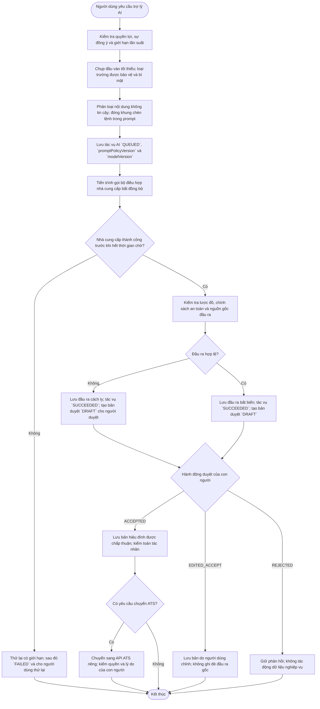
```mermaid
flowchart TD
    A([Người dùng yêu cầu trợ lý AI]) --> B[Kiểm tra quyền lợi, sự đồng ý và giới hạn tần suất]
    B --> C[Chụp đầu vào tối thiểu; loại trường được bảo vệ và bí mật]
    C --> D[Phân loại nội dung không tin cậy; đóng khung chèn lệnh trong prompt]
    D --> E[Lưu tác vụ AI `QUEUED`, `promptPolicyVersion` và `modelVersion`]
    E --> F[Tiến trình gọi bộ điều hợp nhà cung cấp bất đồng bộ]
    F --> G{Nhà cung cấp thành công trước khi hết thời gian chờ?}
    G -- Không --> H[Thử lại có giới hạn; sau đó `FAILED` và cho người dùng thử lại]
    G -- Có --> I[Kiểm tra lược đồ, chính sách an toàn và nguồn gốc đầu ra]
    I --> J{Đầu ra hợp lệ?}
    J -- Không --> K[Lưu đầu ra cách ly; tác vụ `SUCCEEDED`; tạo bản duyệt `DRAFT` cho người duyệt]
    J -- Có --> L[Lưu đầu ra bất biến; tác vụ `SUCCEEDED`; tạo bản duyệt `DRAFT`]
    L --> M{Hành động duyệt của con người}
    M -- ACCEPTED --> N[Lưu bản hiệu đính được chấp thuận; kiểm toán tác nhân]
    M -- EDITED_ACCEPT --> O[Lưu bản do người dùng chỉnh; không ghi đè đầu ra gốc]
    M -- REJECTED --> P[Giữ phản hồi; không tác động dữ liệu nghiệp vụ]
    N --> Q{Có yêu cầu chuyển ATS?}
    Q -- Có --> R[Chuyển sang API ATS riêng; kiểm quyền và lý do của con người]
    Q -- Không --> S([Kết thúc])
    O --> S
    P --> S
    H --> S
    K --> M
    R --> S
```

### AC-OPS-001 — Kiểm duyệt, xóa, lưu giữ pháp lý và khôi phục

- **Mục đích:** bao phủ quyết định kiểm duyệt, kháng nghị, xóa tài khoản lan truyền, lưu trữ/lưu giữ pháp lý và thử lại vận hành.
- **Tác nhân:** Người báo cáo, kiểm duyệt viên, nhân sự riêng tư, tiến trình Danh tính/Study/Work, nhân sự bảo mật.
- **Tiền điều kiện:** nhân sự vận hành có MFA và quyền; tài nguyên/chủ thể được định danh; mã lý do bắt buộc.
- **Kết thúc:** hành động có kiểm toán; dữ liệu thuộc đúng dịch vụ được ẩn danh sau thời gian ân hạn nếu không có lưu giữ pháp lý; lỗi vào hàng đợi thử lại/DLQ có cảnh báo.
- **Liên kết:** `UC-OPS-001..003`; `API-OPS-003`, `API-OPS-004`, `API-OPS-010`, `API-IAM-019`, `API-INT-006`, `API-INT-007`; `TBL-WRK-060`, `TBL-WRK-061`, `TBL-IAM-017`, `TBL-IAM-018`, `TBL-STU-053`, `TBL-WRK-064`; `SCR-OPS-009`, `SCR-OPS-010`, `SCR-OPS-021`, `SCR-IAM-006`; `SEQ-OPS-001`.

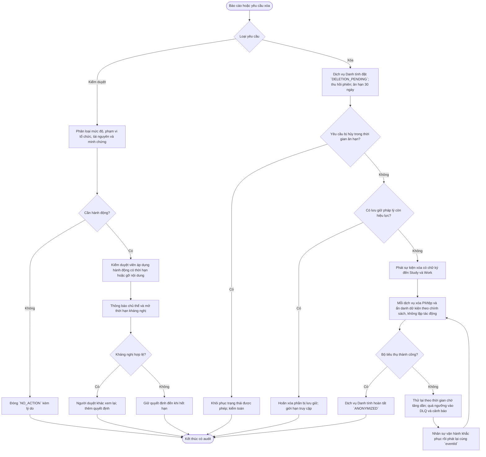
```mermaid
flowchart TD
    A([Báo cáo hoặc yêu cầu xóa]) --> B{Loại yêu cầu}
    B -- Kiểm duyệt --> C[Phân loại mức độ, phạm vi tổ chức, tài nguyên và minh chứng]
    C --> D{Cần hành động?}
    D -- Không --> E[Đóng `NO_ACTION` kèm lý do]
    D -- Có --> F[Kiểm duyệt viên áp dụng hành động có thời hạn hoặc gỡ nội dung]
    F --> G[Thông báo chủ thể và mở thời hạn kháng nghị]
    G --> H{Kháng nghị hợp lệ?}
    H -- Có --> I[Người duyệt khác xem lại; thêm quyết định]
    H -- Không --> J[Giữ quyết định đến khi hết hạn]
    B -- Xóa --> K[Dịch vụ Danh tính đặt `DELETION_PENDING`; thu hồi phiên; ân hạn 30 ngày]
    K --> L{Yêu cầu bị hủy trong thời gian ân hạn?}
    L -- Có --> M[Khôi phục trạng thái được phép; kiểm toán]
    L -- Không --> N{Có lưu giữ pháp lý còn hiệu lực?}
    N -- Có --> O[Hoãn xóa phần bị lưu giữ; giới hạn truy cập]
    N -- Không --> P[Phát sự kiện xóa có chữ ký đến Study và Work]
    P --> Q[Mỗi dịch vụ xóa PII/tệp và ẩn danh dữ kiện theo chính sách, không lặp tác động]
    Q --> R{Bộ tiêu thụ thành công?}
    R -- Không --> S[Thử lại theo thời gian chờ tăng dần; quá ngưỡng vào DLQ và cảnh báo]
    R -- Có --> T[Dịch vụ Danh tính hoàn tất `ANONYMIZED`]
    S --> U[Nhân sự vận hành khắc phục rồi phát lại cùng `eventId`]
    U --> Q
    E --> V([Kết thúc có audit])
    I --> V
    J --> V
    M --> V
    O --> V
    T --> V
```

## 4. Biểu đồ lớp

Các lớp dưới đây biểu diễn thực thể và đối tượng tổng hợp ở mức thiết kế. Tên lớp dùng PascalCase, tương ứng với bảng snake_case trong `03_THIET_KE_CO_SO_DU_LIEU.md`. Thuộc tính chỉ nêu khóa, phiên bản, trạng thái và dữ liệu quyết định quan hệ; danh mục cột đầy đủ nằm trong tài liệu cơ sở dữ liệu.

### CLS-IAM-001 — Danh tính, thông tin xác thực, phiên làm việc và sự kiện bảo mật

- **Mục đích:** xác định đối tượng tổng hợp Người dùng Nền tảng và các bản ghi bảo mật chỉ thêm/mã thông báo một lần.
- **Tác nhân:** API Danh tính, quản trị viên nền tảng, tiến trình Danh tính.
- **Tiền điều kiện:** email được chuẩn hóa; mật khẩu/mã thông báo thô không bao giờ được lưu.
- **Kết thúc:** thông tin xác thực/phiên làm việc chỉ thuộc CSDL Danh tính; hộp thư đi/kiểm toán giữ đầy đủ nguyên nhân và tác nhân.
- **Liên kết:** `UC-IAM-001..003`; `API-IAM-001`, `API-IAM-002`, `API-IAM-004`, `API-IAM-006`, `API-IAM-022`; `TBL-IAM-001`, `TBL-IAM-003`, `TBL-IAM-004`, `TBL-IAM-009`, `TBL-IAM-010`, `TBL-IAM-012`, `TBL-IAM-015`, `TBL-IAM-017`, `TBL-IAM-018`; `SCR-IAM-001`, `SCR-IAM-002`, `SCR-IAM-003`, `SCR-IAM-005`, `SCR-IAM-006`, `SCR-OPS-001`; `SEQ-IAM-001..002`.

```mermaid
classDiagram
    class PlatformUser {
        +UUID id
        +string normalizedEmail
        +AccountStatus status
        +int authVersion
        +datetime emailVerifiedAt
    }
    class PasswordCredential {
        +UUID userId
        +string argon2Hash
        +int failureCount
        +datetime lockedUntil
    }
    class OneTimeToken {
        +UUID id
        +TokenPurpose purpose
        +string tokenHash
        +datetime expiresAt
        +datetime consumedAt
    }
    class AuthSession {
        +UUID id
        +UUID userId
        +UUID familyId
        +datetime expiresAt
        +datetime revokedAt
    }
    class RefreshToken {
        +UUID id
        +UUID sessionId
        +string tokenHash
        +UUID parentTokenId
        +datetime usedAt
    }
    class GlobalRole {
        +UUID id
        +string code
    }
    class PlatformUserRole {
        +UUID userId
        +UUID roleId
        +datetime grantedAt
    }
    class AgreementAcceptance {
        +UUID id
        +string documentCode
        +string documentVersion
        +datetime acceptedAt
    }
    class IdentityAuditLog {
        +UUID id
        +UUID actorId
        +string action
        +string reasonCode
        +datetime occurredAt
    }
    class IdentityOutboxEvent {
        +UUID id
        +string eventType
        +UUID aggregateId
        +int aggregateVersion
        +datetime publishedAt
    }

    PlatformUser "1" *-- "1" PasswordCredential
    PlatformUser "1" *-- "0..*" OneTimeToken
    PlatformUser "1" *-- "0..*" AuthSession
    AuthSession "1" *-- "1..*" RefreshToken
    RefreshToken "0..1" --> "0..1" RefreshToken : xoay vòng tới
    PlatformUser "1" --> "0..*" PlatformUserRole
    GlobalRole "1" --> "0..*" PlatformUserRole
    PlatformUser "1" --> "0..*" AgreementAcceptance
    PlatformUser "1" --> "0..*" IdentityAuditLog : chủ thể
    PlatformUser "1" --> "0..*" IdentityOutboxEvent : đối tượng tổng hợp
```

### CLS-STU-001 — Hồ sơ Study, RBAC và phiên bản chương trình học

- **Mục đích:** mô tả hình chiếu danh tính logic, RBAC cục bộ và cây nội dung bất biến sau khi xuất bản.
- **Tác nhân:** API Study, tác giả nội dung, người xuất bản được tin cậy, bộ tiêu thụ sự kiện Danh tính.
- **Tiền điều kiện:** `StudyUser` được đối soát theo `platformUserId`; phiên bản lộ trình ghim trực tiếp phiên bản khóa học.
- **Kết thúc:** không có thông tin xác thực trong Study; bản hiệu đính đã xuất bản không đổi; mỗi vị trí bài đánh giá có đúng một phạm vi.
- **Liên kết:** `UC-STU-001..002`, `UC-STU-006`; `API-STU-001`, `API-STU-016`, `API-STU-014`, `API-STU-054`, `API-STU-056`; `TBL-STU-001`, `TBL-STU-009`, `TBL-STU-010`, `TBL-STU-011`, `TBL-STU-012`, `TBL-STU-017`, `TBL-STU-020`; `SCR-STU-002`, `SCR-STU-005`, `SCR-STU-013`, `SCR-OPS-004`, `SCR-OPS-005`, `SCR-OPS-007`; `SEQ-STU-001`, `SEQ-STU-004`.

```mermaid
classDiagram
    class PlatformUserReference {
        +UUID platformUserId
        +string identityStatus
        +int identityVersion
    }
    class StudyUser {
        +UUID id
        +UUID platformUserId
        +string projectedEmail
        +string identityStatus
    }
    class LearnerProfile {
        +UUID studyUserId
        +string displayName
        +int version
    }
    class OnboardingRecord {
        +UUID studyUserId
        +OnboardingStatus status
        +datetime completedAt
    }
    class StudyRole {
        +UUID id
        +string code
    }
    class StudyPermission {
        +UUID id
        +string code
    }
    class StudyRolePermission {
        +UUID roleId
        +UUID permissionId
    }
    class StudyUserRoleAssignment {
        +UUID studyUserId
        +UUID roleId
        +datetime expiresAt
    }
    class LearningPath {
        +UUID id
        +string slug
        +EntityStatus status
        +UUID currentPublishedVersionId
    }
    class LearningPathVersion {
        +UUID id
        +UUID learningPathId
        +int versionNo
        +ContentVersionStatus status
    }
    class PathVersionCourse {
        +UUID pathVersionId
        +UUID courseVersionId
        +int position
    }
    class Course {
        +UUID id
        +string slug
        +EntityStatus status
        +UUID currentPublishedVersionId
    }
    class CourseVersion {
        +UUID id
        +UUID courseId
        +int versionNo
        +ContentVersionStatus status
    }
    class Chapter {
        +UUID id
        +UUID courseVersionId
        +int position
    }
    class Lesson {
        +UUID id
        +UUID chapterId
        +int position
    }
    class LessonContentBlock {
        +UUID id
        +UUID lessonId
        +ContentBlockType type
        +int position
    }
    class Assessment {
        +UUID id
        +AssessmentType type
        +int maxAttempts
    }
    class AssessmentPlacement {
        +UUID assessmentId
        +PlacementScope scope
        +UUID scopeId
    }
    class ContentPublishCheck {
        +UUID id
        +UUID contentVersionId
        +PublishCheckStatus status
    }

    PlatformUserReference ..> StudyUser : ánh xạ logic, không có FK
    StudyUser "1" *-- "1" LearnerProfile
    StudyUser "1" *-- "1" OnboardingRecord
    StudyUser "1" --> "0..*" StudyUserRoleAssignment
    StudyRole "1" --> "0..*" StudyUserRoleAssignment
    StudyRole "1" --> "0..*" StudyRolePermission
    StudyPermission "1" --> "0..*" StudyRolePermission
    LearningPath "1" *-- "1..*" LearningPathVersion
    LearningPathVersion "1" *-- "1..*" PathVersionCourse
    CourseVersion "1" --> "0..*" PathVersionCourse
    Course "1" *-- "1..*" CourseVersion
    CourseVersion "1" *-- "1..*" Chapter
    Chapter "1" *-- "1..*" Lesson
    Lesson "1" *-- "1..*" LessonContentBlock
    Assessment "1" *-- "1" AssessmentPlacement
    CourseVersion "1" --> "0..*" ContentPublishCheck
    LearningPathVersion "1" --> "0..*" ContentPublishCheck
```

### CLS-STU-002 — Ghi danh, tiến độ, bài đánh giá, tệp và minh chứng

- **Mục đích:** tách dữ kiện học tập khỏi bản chụp có thể dựng lại, đồng thời giữ lần làm/duyệt/minh chứng bất biến.
- **Tác nhân:** Người học, API/tiến trình Study, người duyệt, tiến trình tích hợp Work.
- **Tiền điều kiện:** mọi lượt ghi danh và giai đoạn lộ trình chính ghim phiên bản đã xuất bản; tệp nằm trong kho lưu trữ riêng.
- **Kết thúc:** hoàn thành chỉ dùng lại cùng phiên bản; lần làm/lần duyệt không bị ghi đè; xuất minh chứng không tạo FK sang Work.
- **Liên kết:** `UC-STU-002..005`; `API-STU-014`, `API-STU-020`, `API-STU-027`, `API-STU-030`, `API-INT-002`; `TBL-STU-026`, `TBL-STU-027`, `TBL-STU-029`, `TBL-STU-033`, `TBL-STU-035`, `TBL-STU-036`, `TBL-STU-038`, `TBL-STU-040`, `TBL-STU-041`; `SCR-STU-013`, `SCR-STU-016`, `SCR-STU-017`, `SCR-STU-018`, `SCR-WRK-017`; `SEQ-STU-001..003`, `SEQ-INT-001`.

```mermaid
classDiagram
    class StudyUser {
        +UUID id
    }
    class PrimaryPathPeriod {
        +UUID id
        +UUID learnerId
        +UUID pathVersionId
        +PrimaryPathStatus status
        +datetime nextSwitchAllowedAt
        +int version
    }
    class PrimaryPathChangeEvent {
        +UUID id
        +UUID fromPeriodId
        +UUID toPeriodId
        +string reasonCode
    }
    class CourseEnrollment {
        +UUID id
        +UUID learnerId
        +UUID courseVersionId
        +EnrollmentStatus status
    }
    class ContentBlockProgress {
        +UUID enrollmentId
        +UUID blockId
        +ProgressStatus status
        +int version
    }
    class LessonProgress {
        +UUID enrollmentId
        +UUID lessonId
        +ProgressStatus status
        +datetime completedAt
    }
    class CourseProgressSnapshot {
        +UUID enrollmentId
        +decimal percent
        +int sourceVersion
    }
    class CompletionRecord {
        +UUID id
        +UUID learnerId
        +CompletionTargetType targetType
        +UUID targetVersionId
        +datetime completedAt
    }
    class AssessmentDraft {
        +UUID learnerId
        +UUID assessmentId
        +int version
    }
    class AssessmentAttempt {
        +UUID id
        +UUID assessmentId
        +UUID learnerId
        +int attemptNo
        +AttemptStatus status
    }
    class AssessmentReview {
        +UUID id
        +UUID attemptId
        +ReviewDecision decision
        +int reviewVersion
    }
    class UploadSession {
        +UUID id
        +UUID ownerId
        +datetime expiresAt
    }
    class FileAsset {
        +UUID id
        +string privateObjectKey
        +FileScanStatus scanStatus
        +string checksum
    }
    class FileScanResult {
        +UUID id
        +UUID fileAssetId
        +FileScanStatus result
        +int scanAttemptNo
    }
    class StudyEvidence {
        +UUID id
        +UUID learnerId
        +UUID completionId
        +EvidenceStatus status
        +int version
    }
    class IntegrationDeliveryLog {
        +UUID eventId
        +string destination
        +DeliveryStatus status
    }

    StudyUser "1" --> "0..*" PrimaryPathPeriod
    PrimaryPathPeriod "1" --> "0..*" PrimaryPathChangeEvent
    StudyUser "1" --> "0..*" CourseEnrollment
    CourseEnrollment "1" *-- "0..*" ContentBlockProgress
    CourseEnrollment "1" *-- "0..*" LessonProgress
    CourseEnrollment "1" *-- "1" CourseProgressSnapshot
    StudyUser "1" --> "0..*" CompletionRecord
    StudyUser "1" --> "0..*" AssessmentDraft
    StudyUser "1" --> "0..*" AssessmentAttempt
    AssessmentAttempt "1" --> "0..*" AssessmentReview
    UploadSession "1" --> "0..1" FileAsset
    FileAsset "1" --> "1..*" FileScanResult
    AssessmentAttempt "0..1" --> "0..1" FileAsset : câu trả lời bằng tệp
    CompletionRecord "1" --> "0..1" StudyEvidence
    StudyEvidence "1" --> "0..*" IntegrationDeliveryLog
```

### CLS-STU-003 — Tương tác, hỗ trợ, điều chỉnh, kiểm toán và bản chụp báo cáo

- **Mục đích:** mô tả gửi thông báo/tương tác/vận hành mà không biến tỷ lệ trong bản chụp thành nguồn sự thật học tập.
- **Tác nhân:** Người học, tiến trình thông báo, kiểm duyệt viên, nhân viên hỗ trợ, quản trị viên Study.
- **Tiền điều kiện:** mọi tài nguyên dùng ID cục bộ `StudyUser`; điều chỉnh bắt buộc có trước/sau, tác nhân và lý do.
- **Kết thúc:** gửi thông báo/hỗ trợ/kiểm toán chỉ thêm lịch sử; bản chụp báo cáo ghi `asOfAt`; ánh xạ cộng đồng dùng FK/join hợp lệ.
- **Liên kết:** `UC-STU-007..008`; `API-STU-034`, `API-STU-039`, `API-STU-040`, `API-STU-041`, `API-STU-043`, `API-STU-050`, `API-OPS-010`; `TBL-STU-042`, `TBL-STU-043`, `TBL-STU-044`, `TBL-STU-045`, `TBL-STU-046`, `TBL-STU-047`, `TBL-STU-048`, `TBL-STU-049`, `TBL-STU-050`, `TBL-STU-054`; `SCR-STU-020`, `SCR-STU-021`, `SCR-STU-022`, `SCR-OPS-014`, `SCR-OPS-015`, `SCR-OPS-021`; `AC-STU-004`, `SEQ-STU-005`.

```mermaid
classDiagram
    class StudyUser {
        +UUID id
    }
    class NotificationPreference {
        +UUID learnerId
        +string category
        +bool emailEnabled
    }
    class Notification {
        +UUID id
        +UUID learnerId
        +string dedupeKey
        +datetime readAt
    }
    class NotificationDelivery {
        +UUID id
        +UUID notificationId
        +DeliveryStatus status
        +int attemptNo
    }
    class CommunityChannel {
        +UUID id
        +string rulesVersion
        +CommunityStatus status
    }
    class CommunityAcceptance {
        +UUID learnerId
        +UUID channelId
        +string rulesVersion
        +datetime acceptedAt
    }
    class SupportTicket {
        +UUID id
        +UUID learnerId
        +SupportStatus status
        +int version
    }
    class SupportMessage {
        +UUID id
        +UUID ticketId
        +UUID authorId
        +datetime createdAt
    }
    class AdminAdjustment {
        +UUID id
        +UUID learnerId
        +string targetType
        +string reasonCode
        +int beforeVersion
        +int afterVersion
    }
    class StudyAuditEvent {
        +UUID id
        +UUID actorId
        +string action
        +datetime occurredAt
    }
    class ReportSnapshot {
        +UUID id
        +string metricSet
        +datetime asOfAt
    }

    StudyUser "1" --> "0..*" NotificationPreference
    StudyUser "1" --> "0..*" Notification
    Notification "1" --> "0..*" NotificationDelivery
    StudyUser "1" --> "0..*" CommunityAcceptance
    CommunityChannel "1" --> "0..*" CommunityAcceptance
    StudyUser "1" --> "0..*" SupportTicket
    SupportTicket "1" *-- "0..*" SupportMessage
    StudyUser "1" --> "0..*" AdminAdjustment
    AdminAdjustment "1" --> "1..*" StudyAuditEvent
    ReportSnapshot ..> StudyAuditEvent : tổng hợp từ dữ kiện đã được cấp quyền
```

### CLS-WRK-001 — Ứng viên, phạm vi tổ chức, việc làm, đơn ứng tuyển và bản chụp ATS

- **Mục đích:** thể hiện quyền sở hữu đối tượng tổng hợp theo phạm vi tổ chức, các bản chụp việc làm/hồ sơ/đơn ứng tuyển bất biến và riêng tư khi tìm nguồn ứng viên.
- **Tác nhân:** Ứng viên, thành viên doanh nghiệp, người tuyển dụng, quản lý tuyển dụng, tiến trình tìm kiếm.
- **Tiền điều kiện:** tư cách thành viên được xác định từ ngữ cảnh truy cập; không nhận `tenantId` do máy khách cung cấp làm nguồn phân quyền.
- **Kết thúc:** một đơn ứng tuyển cho mỗi ứng viên/việc làm; bản hiệu đính việc làm và bản chụp ứng tuyển bất biến; hình chiếu tìm kiếm không chứa dữ liệu nhạy cảm.
- **Liên kết:** `UC-WRK-001..006`; `API-WRK-005`, `API-WRK-051`, `API-WRK-053`, `API-WRK-043`, `API-WRK-047`, `API-WRK-023`, `API-WRK-058`, `API-INT-002`; `TBL-WRK-004`, `TBL-WRK-016`, `TBL-WRK-033`, `TBL-WRK-037`, `TBL-WRK-038`, `TBL-WRK-041`, `TBL-WRK-042`, `TBL-WRK-044`, `TBL-WRK-045`; `SCR-WRK-011`, `SCR-WRK-036`, `SCR-WRK-034`, `SCR-WRK-017`, `SCR-WRK-040`; `SEQ-WRK-001..003`, `SEQ-INT-001`.

```mermaid
classDiagram
    class CandidateProfile {
        +UUID id
        +UUID platformUserId
        +ProfileVisibility visibility
        +bool searchOptIn
        +int version
    }
    class CvDocument {
        +UUID id
        +UUID candidateId
        +int versionNo
        +UUID fileAssetId
    }
    class PortfolioItem {
        +UUID id
        +UUID candidateId
        +string kind
    }
    class CandidateSearchProjection {
        +UUID candidateId
        +int profileVersion
        +SearchIndexStatus status
    }
    class Enterprise {
        +UUID id
        +TenantStatus status
    }
    class EnterpriseMembership {
        +UUID id
        +UUID enterpriseId
        +UUID platformUserId
        +EnterpriseRole role
        +MembershipStatus status
    }
    class Job {
        +UUID id
        +UUID enterpriseId
        +JobStatus status
        +UUID currentPublishedRevisionId
    }
    class JobRevision {
        +UUID id
        +UUID jobId
        +int revisionNo
        +RevisionStatus status
    }
    class CandidateInvitation {
        +UUID id
        +UUID enterpriseId
        +UUID candidateId
        +InvitationStatus status
    }
    class Application {
        +UUID id
        +UUID enterpriseId
        +UUID jobId
        +UUID candidateId
        +ApplicationStatus status
        +int version
    }
    class ApplicationStatusHistory {
        +UUID id
        +UUID applicationId
        +ApplicationStatus fromStatus
        +ApplicationStatus toStatus
        +UUID actorId
    }
    class ApplicationProfileSnapshot {
        +UUID applicationId
        +int sourceProfileVersion
    }
    class ApplicationCvSnapshot {
        +UUID applicationId
        +UUID sourceCvId
        +int sourceCvVersion
    }
    class EvidenceExportRequest {
        +UUID id
        +UUID applicationId
        +EvidenceSyncStatus status
        +datetime consentedAt
    }
    class ApplicationEvidenceSnapshot {
        +UUID id
        +UUID applicationId
        +UUID sourceEvidenceId
        +int sourceVersion
        +EvidenceSyncStatus status
    }

    CandidateProfile "1" *-- "0..*" CvDocument
    CandidateProfile "1" *-- "0..*" PortfolioItem
    CandidateProfile "1" --> "0..1" CandidateSearchProjection
    Enterprise "1" *-- "1..*" EnterpriseMembership
    Enterprise "1" *-- "0..*" Job
    Job "1" *-- "1..*" JobRevision
    Enterprise "1" --> "0..*" CandidateInvitation
    CandidateProfile "1" --> "0..*" CandidateInvitation
    Job "1" --> "0..*" Application
    CandidateProfile "1" --> "0..*" Application
    Enterprise "1" --> "0..*" Application
    Application "1" *-- "1..*" ApplicationStatusHistory
    Application "1" *-- "1" ApplicationProfileSnapshot
    Application "1" *-- "1" ApplicationCvSnapshot
    Application "1" *-- "0..1" EvidenceExportRequest
    Application "1" *-- "0..*" ApplicationEvidenceSnapshot
```

### CLS-WRK-002 — Phỏng vấn, trò chuyện, trường và kiểm duyệt

- **Mục đích:** nối các đối tượng tổng hợp cộng tác quanh đơn ứng tuyển nhưng giữ lớp bảo vệ phạm vi tổ chức/riêng tư ở mọi quan hệ.
- **Tác nhân:** Ứng viên, người tuyển dụng được phân công, cán bộ trường, kiểm duyệt viên, tiến trình thông báo/WebSocket.
- **Tiền điều kiện:** đơn ứng tuyển và phạm vi tổ chức còn truy cập được; cuộc trò chuyện chỉ tạo sau đơn ứng tuyển; PII của trường cần sự đồng ý.
- **Kết thúc:** lịch/tin nhắn/lượt giới thiệu/lịch sử kiểm duyệt không bị xóa dây chuyền; báo cáo trường tuân ngưỡng 10.
- **Liên kết:** `UC-WRK-007..010`, `UC-UNI-001..003`; `API-WRK-060`, `API-WRK-031`, `API-OPS-003`, `API-UNI-005`, `API-UNI-010`, `API-UNI-014`, `API-UNI-015`; `TBL-WRK-049`, `TBL-WRK-050`, `TBL-WRK-053`, `TBL-WRK-054`, `TBL-WRK-019`, `TBL-WRK-023`, `TBL-WRK-026`, `TBL-WRK-029`, `TBL-WRK-030`, `TBL-WRK-060`; `SCR-WRK-020`, `SCR-WRK-021`, `SCR-WRK-041`, `SCR-UNI-004`, `SCR-UNI-007`, `SCR-UNI-010`, `SCR-UNI-011`, `SCR-OPS-009`; `SEQ-WRK-004..005`, `SEQ-UNI-001`, `SEQ-OPS-001`.

```mermaid
classDiagram
    class Application {
        +UUID id
        +UUID enterpriseId
        +ApplicationStatus status
    }
    class RecruiterAssignment {
        +UUID applicationId
        +UUID membershipId
        +datetime assignedAt
    }
    class Interview {
        +UUID id
        +UUID applicationId
        +InterviewStatus status
        +int scheduleVersion
    }
    class InterviewScheduleHistory {
        +UUID id
        +UUID interviewId
        +int versionNo
        +datetime startsAt
        +string timezone
    }
    class InterviewFeedback {
        +UUID id
        +UUID interviewId
        +UUID authorMembershipId
        +int version
    }
    class Conversation {
        +UUID id
        +UUID applicationId
        +ConversationStatus status
    }
    class ChatMessage {
        +UUID id
        +UUID conversationId
        +UUID senderPlatformUserId
        +datetime sentAt
    }
    class MessageReceipt {
        +UUID messageId
        +UUID readerPlatformUserId
        +datetime readAt
    }
    class University {
        +UUID id
        +TenantStatus status
    }
    class UniversityMembership {
        +UUID universityId
        +UUID platformUserId
        +UniversityRole role
    }
    class StudentAffiliation {
        +UUID id
        +UUID universityId
        +UUID candidateId
        +AffiliationStatus status
    }
    class InternshipProgram {
        +UUID id
        +UUID universityId
        +datetime startsAt
        +datetime endsAt
    }
    class CandidateReferral {
        +UUID id
        +UUID programId
        +UUID candidateId
        +UUID jobId
        +UUID affiliationId
        +UUID consentGrantId
        +ReferralStatus status
    }
    class DataSharingConsent {
        +UUID id
        +UUID candidateId
        +UUID universityId
        +string purpose
        +datetime expiresAt
    }
    class ModerationCase {
        +UUID id
        +string resourceType
        +UUID resourceId
        +ModerationStatus status
    }
    class ModerationDecision {
        +UUID id
        +UUID caseId
        +string action
        +string reasonCode
    }

    Application "1" --> "0..*" RecruiterAssignment
    Application "1" *-- "0..*" Interview
    Interview "1" *-- "1..*" InterviewScheduleHistory
    Interview "1" *-- "0..*" InterviewFeedback
    Application "1" *-- "0..1" Conversation
    Conversation "1" *-- "0..*" ChatMessage
    ChatMessage "1" --> "0..*" MessageReceipt
    University "1" *-- "1..*" UniversityMembership
    University "1" --> "0..*" StudentAffiliation
    University "1" --> "0..*" InternshipProgram
    InternshipProgram "1" --> "0..*" CandidateReferral
    University "1" --> "0..*" DataSharingConsent
    ModerationCase "1" *-- "0..*" ModerationDecision
```

### CLS-PAY-001 — Đơn hàng, sự kiện nhà cung cấp, sổ cái, quyền lợi và quảng bá

- **Mục đích:** tách ý định mua, xác nhận nhà cung cấp, kế toán chỉ thêm và quyền sử dụng TopCV/TopJD/nội dung tài trợ.
- **Tác nhân:** Bên mua, API/tiến trình thanh toán, nhân sự tài chính, VNPAY/MoMo.
- **Tiền điều kiện:** sản phẩm và phiên bản giá tồn tại; một đơn hàng dùng đúng một phạm vi bên mua; sự kiện nhà cung cấp có khóa tự nhiên duy nhất.
- **Kết thúc:** tổng sổ cái có thể đối soát; cấp/tiêu/điều chỉnh quyền lợi có lịch sử; vị trí tài trợ không sửa điểm tự nhiên/độ phù hợp.
- **Liên kết:** `UC-WRK-009`, `UC-PAY-001..003`; `API-PAY-002`, `API-PAY-014`, `API-PAY-015`, `API-PAY-006`, `API-PAY-009`, `API-PAY-010`, `API-PAY-011`; `TBL-PAY-001`, `TBL-PAY-002`, `TBL-PAY-003`, `TBL-PAY-005`, `TBL-PAY-006`, `TBL-PAY-007`, `TBL-PAY-008`, `TBL-PAY-009`, `TBL-PAY-010`, `TBL-PAY-011`, `TBL-PAY-012`, `TBL-PAY-013`; `SCR-WRK-022`, `SCR-WRK-023`, `SCR-WRK-043`, `SCR-WRK-044`, `SCR-OPS-019`, `SCR-OPS-020`; `SEQ-PAY-001..002`.

```mermaid
classDiagram
    class BillableProduct {
        +UUID id
        +string code
        +ProductStatus status
    }
    class ProductPriceVersion {
        +UUID id
        +UUID productId
        +long amountVnd
        +datetime effectiveFrom
    }
    class Order {
        +UUID id
        +BuyerType buyerType
        +UUID buyerId
        +OrderStatus status
        +long amountVnd
    }
    class PaymentIntent {
        +UUID id
        +UUID orderId
        +PaymentProvider provider
        +PaymentStatus status
    }
    class PaymentProviderEvent {
        +UUID id
        +string providerEventId
        +PaymentEventType eventType
        +datetime providerOccurredAt
    }
    class BillingLedgerEntry {
        +UUID id
        +UUID orderId
        +LedgerEntryType type
        +long amountVnd
    }
    class EntitlementGrant {
        +UUID id
        +UUID orderId
        +UUID ownerId
        +EntitlementType type
        +long quantity
    }
    class EntitlementUsage {
        +UUID id
        +UUID grantId
        +UUID targetId
        +long quantity
    }
    class SponsoredPlacement {
        +UUID id
        +UUID entitlementUsageId
        +SponsoredTargetType targetType
        +UUID targetId
        +datetime endsAt
    }
    class ReconciliationRun {
        +UUID id
        +PaymentProvider provider
        +ReconciliationStatus status
    }

    BillableProduct "1" *-- "1..*" ProductPriceVersion
    ProductPriceVersion "1" --> "0..*" Order
    Order "1" *-- "1..*" PaymentIntent
    PaymentIntent "1" --> "0..*" PaymentProviderEvent
    Order "1" --> "0..*" BillingLedgerEntry
    Order "1" --> "0..*" EntitlementGrant
    EntitlementGrant "1" --> "0..*" EntitlementUsage
    EntitlementUsage "1" --> "0..1" SponsoredPlacement
    ReconciliationRun "1" --> "0..*" PaymentProviderEvent : đối soát
```

### CLS-AIX-001 — Tác vụ AI, nguồn gốc, duyệt và bản hiệu đính do con người áp dụng

- **Mục đích:** chứng minh đầu ra AI không phải nguồn dữ liệu nghiệp vụ cho tới khi hành động của con người được ghi nhận.
- **Tác nhân:** Ứng viên/người tuyển dụng, tiến trình AI, nhân sự vận hành AI, bộ điều hợp nhà cung cấp.
- **Tiền điều kiện:** danh sách cho phép của chính sách AI, sự đồng ý và quyền lợi đã qua lớp bảo vệ.
- **Kết thúc:** mọi suy luận truy được chính sách prompt/mô hình/đầu vào; đầu ra gốc bất biến; bản hiệu đính do con người áp dụng là bản ghi riêng.
- **Liên kết:** `UC-AIX-001..003`; `API-AIX-001`, `API-AIX-002`, `API-AIX-003`, `API-AIX-004`, `API-AIX-005`, `API-AIX-006`; `TBL-AIX-001`, `TBL-AIX-002`, `TBL-AIX-003`, `TBL-AIX-004`, `TBL-AIX-005`, `TBL-AIX-006`; `SCR-WRK-013`, `SCR-WRK-034`, `SCR-WRK-039`, `SCR-WRK-040`; `SEQ-AIX-001`.

```mermaid
classDiagram
    class AiProviderConfiguration {
        +UUID id
        +string providerCode
        +string modelVersion
        +ProviderStatus status
    }
    class PromptPolicyVersion {
        +UUID id
        +string useCaseCode
        +int versionNo
        +PolicyStatus status
    }
    class AiJob {
        +UUID id
        +UUID requesterId
        +string useCaseCode
        +AiJobStatus status
        +UUID promptPolicyVersionId
    }
    class AiInputSnapshot {
        +UUID id
        +UUID jobId
        +string checksum
        +string exclusionPolicyVersion
    }
    class AiOutput {
        +UUID id
        +UUID jobId
        +string outputSchemaVersion
        +string checksum
    }
    class AiHumanReview {
        +UUID id
        +UUID jobId
        +UUID outputId
        +AiReviewDecision decision
        +string reasonCode
    }
    class HumanAiDecision {
        +UUID id
        +UUID outputId
        +UUID actorId
        +HumanDecision decision
    }
    class HumanAppliedRevision {
        +UUID id
        +UUID humanDecisionId
        +string targetType
        +UUID targetId
        +int targetVersion
    }

    AiProviderConfiguration "1" --> "0..*" AiJob
    PromptPolicyVersion "1" --> "0..*" AiJob
    AiJob "1" *-- "1" AiInputSnapshot
    AiJob "1" *-- "0..1" AiOutput
    AiOutput "1" --> "0..*" AiHumanReview
    AiHumanReview "1" --> "0..1" HumanAppliedRevision
```

### CLS-INT-001 — Liên kết logic giữa ba cơ sở dữ liệu

- **Mục đích:** làm rõ mọi liên kết liên dịch vụ đều qua định danh bất biến, sự kiện/yêu cầu có chữ ký và hình chiếu cục bộ; không có FK xuyên cơ sở dữ liệu.
- **Tác nhân:** bên phát hộp thư đi Danh tính/Study/Work và bộ tiêu thụ không lặp tác động.
- **Tiền điều kiện:** phiên bản hợp đồng được hỗ trợ; chữ ký, nguồn phát hành, đối tượng nhận, dấu thời gian và `eventId` hợp lệ.
- **Kết thúc:** hình chiếu đạt tính nhất quán cuối cùng; sự kiện trùng/cũ không ghi đè phiên bản mới; lỗi vào hàng đợi thử lại/DLQ.
- **Khóa liên hệ:** `platformUserId` là khóa liên hệ toàn cục bất biến trong luồng thông thường. Riêng thông điệp xóa có thể dùng khóa chủ thể giả danh theo hợp đồng hai bên; dịch vụ nhận chỉ phân giải bằng ánh xạ cục bộ, không dùng email hay ID cục bộ của dịch vụ khác.
- **Liên kết:** `UC-IAM-003`, `UC-STU-005`, `UC-WRK-006`, `UC-OPS-002..003`; hợp đồng danh tính/minh chứng có chữ ký `API-INT-001`, `API-INT-002`, `API-INT-004`, `API-INT-005`, `API-INT-006`, `API-INT-007`; `TBL-IAM-018`, `TBL-IAM-019`, `TBL-STU-040`, `TBL-STU-041`, `TBL-STU-053`, `TBL-WRK-044`, `TBL-WRK-045`, `TBL-WRK-064`, `TBL-WRK-069`; `SEQ-INT-001`, `SEQ-OPS-001`.

```mermaid
classDiagram
    class IdentityPlatformUser {
        +UUID platformUserId
        +int authVersion
        +AccountStatus status
    }
    class IdentityOutboxEvent {
        +UUID eventId
        +string eventType
        +int aggregateVersion
        +string signature
    }
    class StudyUserProjection {
        +UUID studyUserId
        +UUID platformUserId
        +int identityVersion
    }
    class WorkUserProjection {
        +UUID workUserId
        +UUID platformUserId
        +int identityVersion
    }
    class StudyEvidence {
        +UUID evidenceId
        +UUID learnerId
        +int version
        +EvidenceStatus status
    }
    class SignedEvidenceExportRequest {
        +UUID requestId
        +UUID applicationId
        +UUID candidatePlatformUserId
    }
    class ApplicationEvidenceSnapshot {
        +UUID applicationId
        +UUID sourceEvidenceId
        +int sourceVersion
        +EvidenceSyncStatus status
    }
    class ConsumerReceipt {
        +UUID eventId
        +string consumerName
        +int appliedVersion
    }

    IdentityPlatformUser "1" --> "0..*" IdentityOutboxEvent
    IdentityOutboxEvent ..> StudyUserProjection : sự kiện có chữ ký, không có FK
    IdentityOutboxEvent ..> WorkUserProjection : sự kiện có chữ ký, không có FK
    StudyEvidence ..> SignedEvidenceExportRequest : nguồn đã kiểm tra hợp lệ
    SignedEvidenceExportRequest ..> ApplicationEvidenceSnapshot : bản chụp tối thiểu, không có FK
    IdentityOutboxEvent ..> ConsumerReceipt : khử trùng lặp
    SignedEvidenceExportRequest ..> ConsumerReceipt : khử trùng lặp
```

## 5. Biểu đồ tuần tự

### SEQ-IAM-001 — Đăng ký, xác minh, đăng nhập/MFA và tạo hình chiếu

- **Mục đích:** mô tả giao dịch đăng ký, xác minh một lần, đăng nhập đặc quyền có MFA và lan truyền sang hai miền.
- **Tác nhân:** Khách/người dùng, API/CSDL/tiến trình Danh tính, nhà cung cấp email, bộ tiêu thụ Study/Work.
- **Tiền điều kiện:** `Idempotency-Key` có ở đăng ký; mã thô chỉ tồn tại trong phản hồi nội bộ gửi email; khóa ký lấy từ trình quản lý bí mật/KMS.
- **Kết thúc:** người dùng `ACTIVE` có phiên làm việc hoặc bị chặn an toàn; hình chiếu Study/Work áp dụng đúng phiên bản đối tượng tổng hợp.
- **Liên kết:** `UC-IAM-001..003`; `API-IAM-001`, `API-IAM-002`, `API-IAM-004`, `API-IAM-005`; `TBL-IAM-001`, `TBL-IAM-003`, `TBL-IAM-004`, `TBL-IAM-009`, `TBL-IAM-018`; `SCR-IAM-001`, `SCR-IAM-002`, `SCR-IAM-003`, `SCR-IAM-005`; `AC-IAM-001`, `CLS-IAM-001`, `CLS-INT-001`.

```mermaid
sequenceDiagram
    autonumber
    actor U as Khách hoặc người dùng
    participant I as API Danh tính
    participant IDB as CSDL Danh tính
    participant M as Nhà cung cấp email
    participant OW as Tiến trình hộp thư đi Danh tính
    participant S as Bộ tiêu thụ Study
    participant W as Bộ tiêu thụ Work

    U->>I: POST đăng ký với `Idempotency-Key`
    I->>IDB: BEGIN; kiểm chống lặp yêu cầu và email đã chuẩn hóa
    alt Email mới
        I->>IDB: Chèn người dùng chờ xác minh, thông tin xác thực Argon2id, chấp thuận, mã xác minh băm, hộp thư đi
        I->>IDB: COMMIT và lưu phản hồi chống lặp yêu cầu
        I-->>U: Chấp nhận đăng ký bằng phản hồi chung
        OW->>IDB: Nhận sự kiện gửi email
        OW->>M: Gửi liên kết xác minh chứa mã thô
        M-->>OW: Kết quả gửi
    else Email trùng hoặc yêu cầu trùng
        I-->>U: Cùng phản hồi chung hoặc phát lại phản hồi đã lưu
    end

    U->>I: POST xác minh email với mã thô
    I->>IDB: Khóa mã dùng một lần đã băm
    alt Mã đang hoạt động và chưa dùng
        I->>IDB: Dùng mã; kích hoạt người dùng; tăng phiên bản; thêm hộp thư đi
        I-->>U: Đã xác minh email
        OW-->>S: Sự kiện `identity.verified` có chữ ký
        OW-->>W: Sự kiện `identity.verified` có chữ ký
        S->>S: Khử trùng lặp và chèn/cập nhật hình chiếu nếu phiên bản mới hơn
        W->>W: Khử trùng lặp và chèn/cập nhật hình chiếu nếu phiên bản mới hơn
    else Mã sai, hết hạn hoặc đã dùng
        I-->>U: VERIFY_TOKEN_INVALID
    end

    U->>I: POST đăng nhập
    I->>IDB: Đọc tài khoản và thông tin xác thực; kiểm mật khẩu
    alt Bị tạm ngưng, bị khóa hoặc thông tin xác thực sai
        I->>IDB: Thêm kiểm toán bảo mật; cập nhật chính sách thất bại nếu cần
        I-->>U: Lỗi xác thực chung
    else Vai trò đặc quyền
        I-->>U: Thử thách MFA
        U->>I: Gửi TOTP hoặc mã khôi phục
        I->>IDB: Kiểm MFA; tạo họ phiên và mã làm mới đã băm
        I-->>U: Mã truy cập 15 phút và mã làm mới xoay vòng
    else Vai trò thông thường
        I->>IDB: Tạo họ phiên và mã làm mới đã băm
        I-->>U: Mã truy cập 15 phút và mã làm mới xoay vòng
    end
```

### SEQ-IAM-002 — Xoay vòng mã làm mới, phát hiện tái sử dụng và lan truyền tạm ngưng

- **Mục đích:** chứng minh mã làm mới một lần được khóa khi xoay vòng và mọi phiên bị thu hồi khi tái sử dụng/tạm ngưng.
- **Tác nhân:** Máy khách, API/quản trị/CSDL/tiến trình Danh tính, Study và Work.
- **Tiền điều kiện:** mã làm mới thuộc họ phiên chưa hết hạn; quản trị viên có MFA và quyền tạm ngưng.
- **Kết thúc:** chỉ một yêu cầu làm mới đồng thời thành công; tái sử dụng thu hồi cả họ; tạm ngưng tăng `authVersion` và chặn cả hình chiếu cục bộ.
- **Liên kết:** `UC-IAM-002..003`; `API-IAM-006`, `API-IAM-022`; `TBL-IAM-001`, `TBL-IAM-009`, `TBL-IAM-010`, `TBL-IAM-017`, `TBL-IAM-018`; `SCR-IAM-006`, `SCR-OPS-001`; `AC-IAM-001`, `CLS-IAM-001`, `CLS-INT-001`.

```mermaid
sequenceDiagram
    autonumber
    actor C as Máy khách
    actor A as Quản trị viên nền tảng
    participant I as API Danh tính
    participant IDB as CSDL Danh tính
    participant OW as Tiến trình hộp thư đi
    participant S as Study
    participant W as Work

    par Hai yêu cầu làm mới đồng thời cùng mã
        C->>I: POST mã làm mới R1
    and
        C->>I: POST mã làm mới R1
    end
    I->>IDB: SELECT R1 FOR UPDATE
    alt Yêu cầu giữ khóa đầu tiên
        I->>IDB: Đặt R1 đã dùng; chèn mã con R2; COMMIT
        I-->>C: Mã truy cập mới và R2
    else Yêu cầu sau thấy R1 đã dùng
        I->>IDB: Thu hồi cả họ phiên; thêm sự kiện tái sử dụng; COMMIT
        I-->>C: `REFRESH_TOKEN_REUSED` và buộc đăng nhập lại
    end

    A->>I: Tạm ngưng người dùng với lý do và `If-Match`
    I->>IDB: Khóa người dùng; đặt `SUSPENDED`; tăng `authVersion`; thu hồi mọi phiên; thêm kiểm toán/hộp thư đi
    I-->>A: Đã tạm ngưng
    OW-->>S: Sự kiện `identity.status-changed` có chữ ký, phiên bản N
    OW-->>W: Sự kiện `identity.status-changed` có chữ ký, phiên bản N
    par Bộ tiêu thụ nhận sự kiện trùng hoặc sai thứ tự
        S->>S: Khử trùng lặp `eventId`; chỉ áp dụng phiên bản lớn hơn
    and
        W->>W: Khử trùng lặp `eventId`; chỉ áp dụng phiên bản lớn hơn
    end
    C->>S: Yêu cầu bằng mã truy cập cũ
    S->>S: Kiểm trạng thái hình chiếu và `authVersion`
    S-->>C: 403 ACCOUNT_SUSPENDED
```

### SEQ-STU-001 — Ghi danh khóa học độc lập và đổi lộ trình chính cạnh tranh

- **Mục đích:** phân biệt hai luồng ghi danh, xử lý hai lần đổi đồng thời và giữ tiến độ theo phiên bản.
- **Tác nhân:** Người học, API/CSDL/tiến trình Study.
- **Tiền điều kiện:** người học đang hoạt động; bản hiệu đính khóa học/lộ trình đích đã xuất bản; `Idempotency-Key` có ở ghi danh/đổi lộ trình.
- **Kết thúc:** một lượt ghi danh duy nhất theo người học/phiên bản khóa học; tối đa một giai đoạn lộ trình hoạt động; yêu cầu đổi lộ trình thua nhận phát lại/xung đột.
- **Liên kết:** `UC-STU-001..003`; `API-STU-016`, `API-STU-014`; `TBL-STU-012`, `TBL-STU-026`, `TBL-STU-027`, `TBL-STU-029`; `SCR-STU-005`, `SCR-STU-011`, `SCR-STU-013`, `SCR-STU-014`; `AC-STU-001`, `CLS-STU-001..002`.

```mermaid
sequenceDiagram
    autonumber
    actor L as Người học
    participant S as API Study
    participant DB as CSDL Study
    participant Q as Tiến trình Study

    L->>S: POST ghi danh khóa học độc lập với `Idempotency-Key`
    S->>DB: Xác định `courseVersionId` hiện hành đã xuất bản
    S->>DB: Chèn lượt ghi danh theo khóa duy nhất người học-phiên bản khóa học
    alt Lượt ghi danh đã có hoặc yêu cầu trùng
        DB-->>S: Lượt ghi danh hiện có
    else Lượt ghi danh mới
        DB-->>S: ENROLLED
    end
    S-->>L: Lượt ghi danh ghim `courseVersionId`

    L->>S: PUT lộ trình chính đích với `Idempotency-Key`
    S->>DB: BEGIN; khóa bản ghi điều phối người học
    S->>DB: Kiểm khởi tạo hồ sơ, đích đã xuất bản và giai đoạn `ACTIVE` hiện hành
    alt Chưa hoàn tất khởi tạo hồ sơ
        S->>DB: ROLLBACK
        S-->>L: ONBOARDING_REQUIRED
    else Chưa đủ thời gian chờ 168 giờ
        S->>DB: ROLLBACK
        S-->>L: `PRIMARY_PATH_SWITCH_COOLDOWN` và `nextAllowedAt`
    else Hợp lệ
        S->>DB: Đóng giai đoạn cũ; chèn giai đoạn `ACTIVE` mới; sự kiện thay đổi; hộp thư đi
        S->>DB: COMMIT
        S-->>L: Lộ trình chính mới và tóm tắt tiến độ giữ lại
        S-->>Q: Sự kiện dựng lại bản chụp
        Q->>DB: Chỉ dùng lại hoàn thành khi `courseVersionId` trùng
    end

    par Hai yêu cầu đổi sang đích khác cùng lúc
        L->>S: PUT lộ trình B với khóa K1
    and
        L->>S: PUT lộ trình C với khóa K2
    end
    S->>DB: Tuần tự hóa bằng khóa người học và chỉ mục duy nhất từng phần `ACTIVE`
    DB-->>S: Một lần cam kết; yêu cầu sau thấy thời gian chờ hoặc phiên bản mới
    S-->>L: Một thành công, một xung đột; không có hai giai đoạn `ACTIVE`
```

### SEQ-STU-002 — Tiến độ bài học và chấm tự động trắc nghiệm

- **Mục đích:** minh họa đồng thời lạc quan, tiến độ chỉ tăng, số lần làm dưới khóa và hoàn thành đồng bộ.
- **Tác nhân:** Người học, API/CSDL Study, tiến trình thông báo/minh chứng.
- **Tiền điều kiện:** lượt ghi danh ghim phiên bản khóa học; người học được phép mở bài học; phiên bản câu hỏi trắc nghiệm thuộc bài đánh giá đang ghim.
- **Kết thúc:** máy khách dùng phiên bản cũ không ghi đè; câu trả lời đã chốt là bất biến; đạt yêu cầu cập nhật hoàn thành một lần và tác động phụ bất đồng bộ.
- **Liên kết:** `UC-STU-003..005`; `API-STU-020`, `API-STU-027`; `TBL-STU-027`, `TBL-STU-029`, `TBL-STU-033`, `TBL-STU-040`; `SCR-STU-016`, `SCR-STU-017`, `SCR-STU-019`; `AC-STU-002`, `CLS-STU-002`.

```mermaid
sequenceDiagram
    autonumber
    actor L as Người học
    participant S as API Study
    participant DB as CSDL Study
    participant W as Tiến trình Study

    L->>S: PATCH tiến độ bài học với `If-Match` V5
    S->>DB: Khóa dữ kiện tiến độ; so sánh phiên bản
    alt Máy chủ đã ở V6
        S-->>L: `VERSION_CONFLICT` với biểu diễn hiện hành
    else Khớp V5
        S->>DB: Chèn/cập nhật dữ kiện khối/bài học chỉ tăng; tính lại bản chụp
        S-->>L: Tiến độ V6
    end

    L->>S: POST lần làm trắc nghiệm với `Idempotency-Key`
    S->>DB: BEGIN; khóa bộ đếm lần làm của người học-bài đánh giá
    S->>DB: Kiểm giới hạn; gán `attemptNo`; chốt câu trả lời
    S->>DB: Chấm phía máy chủ theo câu hỏi/lựa chọn đã ghim
    alt Đạt yêu cầu
        S->>DB: Đặt `PASSED`; cập nhật hoàn thành bài học/khóa học; thêm hộp thư đi; COMMIT
        S-->>L: Kết quả, điểm và phản hồi được phép
        W->>DB: Nhận sự kiện thông báo/minh chứng/báo cáo
    else Thất bại nhưng còn lượt
        S->>DB: Đặt `FAILED`; COMMIT
        S-->>L: Kết quả và số lượt còn lại
    else Đã đạt giới hạn lần làm
        S->>DB: ROLLBACK
        S-->>L: ATTEMPT_LIMIT_REACHED
    end
```

### SEQ-STU-003 — Tải tệp lên vùng cách ly, quét, nộp và hai người duyệt cạnh tranh

- **Mục đích:** bảo đảm tệp chưa ở trạng thái `CLEAN` không thể đính kèm/tải xuống/duyệt và chỉ một phiên bản duyệt lạc quan được chấp nhận.
- **Tác nhân:** Người học, API/CSDL Study, kho đối tượng, tiến trình ClamAV, người duyệt.
- **Tiền điều kiện:** tệp thuộc danh sách cho phép, tối đa 25 MiB, phiên tải lên còn hạn; bài đánh giá có loại FILE.
- **Kết thúc:** tệp nhiễm hoặc quét lỗi bị chặn; tệp sạch có lần nộp bất biến; lịch sử duyệt chỉ thêm.
- **Liên kết:** `UC-STU-004..005`; `API-STU-030`, `API-STU-031`, `API-STU-032`, `API-STU-027`, `API-STU-048`; `TBL-STU-033`, `TBL-STU-035`, `TBL-STU-036`, `TBL-STU-038`; `SCR-STU-017`, `SCR-STU-018`, `SCR-OPS-013`; `AC-STU-002`, `CLS-STU-002`.

```mermaid
sequenceDiagram
    autonumber
    actor L as Người học
    actor R1 as Người duyệt 1
    actor R2 as Người duyệt 2
    participant S as API Study
    participant DB as CSDL Study
    participant O as Kho đối tượng riêng tư
    participant C as Tiến trình ClamAV

    L->>S: POST phiên tải lên với name, size, MIME, checksum
    S->>DB: Tạo phiên tải lên có hạn
    S-->>L: URL tải lên có chữ ký tới vùng cách ly
    L->>O: PUT dữ liệu tệp
    L->>S: POST hoàn tất
    S->>O: HEAD đối tượng và xác minh size/checksum
    S->>DB: Tạo tài sản tệp `SCANNING`
    S-->>C: Tác vụ quét
    C->>O: Đọc đối tượng trong vùng cách ly
    C->>C: Nhận diện MIME và mã độc
    alt CLEAN
        C->>O: Di chuyển vào tiền tố tệp sạch riêng tư
        C->>DB: Thêm kết quả quét; tệp `CLEAN`
        L->>S: POST lần nộp tệp với `Idempotency-Key`
        S->>DB: Kiểm quyền sở hữu và `CLEAN`; niêm phong lần nộp `UNDER_REVIEW`
        S-->>L: Đã chấp nhận lần nộp
    else INFECTED
        C->>DB: Thêm kết quả; tệp `INFECTED`
        L->>S: POST lần nộp tệp
        S-->>L: FILE_NOT_CLEAN; tải lại không làm mất lượt nộp
    else SCAN_FAILED ba lần
        C->>DB: Thêm các lần quét; tệp `SCAN_FAILED`
        S-->>L: FILE_SCAN_UNAVAILABLE; chưa thể nộp
    end

    par Duyệt đồng thời với If-Match R0
        R1->>S: POST duyệt `PASSED`, If-Match R0
    and
        R2->>S: POST duyệt `NEEDS_REVISION`, If-Match R0
    end
    S->>DB: Tuần tự hóa phiên bản duyệt lạc quan
    DB-->>S: Một lần ghi thêm thành công; yêu cầu còn lại dùng phiên bản cũ
    S-->>R1: Thành công hoặc REVIEW_CONFLICT
    S-->>R2: Thành công hoặc REVIEW_CONFLICT
```

### SEQ-STU-004 — Kiểm tra trước khi xuất bản, hoán đổi phiên bản nguyên tử và làm mất hiệu lực bộ nhớ đệm

- **Mục đích:** mô tả tác giả/người xuất bản thao tác đồng thời, kiểm tra hợp lệ đầy đủ và việc lượt ghi danh cũ tiếp tục dùng bản hiệu đính đã được thay thế.
- **Tác nhân:** Tác giả nội dung, người xuất bản tin cậy, API/CSDL Study, tiến trình bộ nhớ đệm/tìm kiếm.
- **Tiền điều kiện:** bản hiệu đính nháp có thể sửa; quyền xuất bản đang hoạt động; có thể chạy lại các kiểm tra quyền, làm sạch nội dung, tài sản và bài đánh giá.
- **Kết thúc:** chỉ một lần xuất bản được chấp nhận; con trỏ hiện hành đổi nguyên tử; bộ nhớ đệm/chỉ mục tìm kiếm nhất quán sau cùng nhưng truy vấn danh mục luôn bảo vệ trạng thái đã xuất bản.
- **Liên kết:** `UC-STU-006`; `API-STU-054`, `API-STU-055`, `API-STU-056`; `TBL-STU-009`, `TBL-STU-010`, `TBL-STU-012`, `TBL-STU-017`, `TBL-STU-018`; `SCR-OPS-004`, `SCR-OPS-005`, `SCR-OPS-007`; `AC-STU-003`, `CLS-STU-001`.

```mermaid
sequenceDiagram
    autonumber
    actor A as Tác giả nội dung
    actor P as Người xuất bản tin cậy
    participant S as API Study
    participant DB as CSDL Study
    participant W as Tiến trình bộ nhớ đệm và tìm kiếm

    A->>S: PATCH bản nháp với If-Match V7
    S->>DB: So sánh phiên bản bản nháp
    alt Bản nháp dùng phiên bản cũ hoặc đã xuất bản
        S-->>A: VERSION_CONFLICT hoặc CONTENT_VERSION_NOT_EDITABLE
    else Có thể chỉnh sửa
        S->>DB: Lưu bản nháp V8 và thêm kiểm toán
        S-->>A: Bản nháp V8
    end
    P->>S: POST pre-publish-check
    S->>DB: Đánh giá cấu trúc, quyền, tài sản `CLEAN`, vị trí và quy tắc
    alt Có lỗi
        S-->>P: Báo cáo kiểm tra hợp lệ theo tài nguyên
    else Đạt kiểm tra
        P->>S: POST xuất bản với Idempotency-Key và If-Match V8
        S->>DB: BEGIN; khóa thực thể ổn định và bản nháp
        alt Con trỏ hoặc bản nháp đã đổi bởi người xuất bản khác
            S->>DB: ROLLBACK
            S-->>P: VERSION_CONFLICT hoặc phát lại phản hồi xuất bản
        else Hợp lệ
            S->>DB: Thay thế bản hiệu đính cũ; xuất bản V8; hoán đổi con trỏ hiện hành; hộp thư đi
            S->>DB: COMMIT
            S-->>P: Đã xuất bản V8
            S-->>W: Sự kiện làm mới bộ nhớ đệm và chỉ mục tìm kiếm
            W->>DB: Đọc con trỏ và phiên bản đã xuất bản hiện hành
        end
    end
    Note over DB: Lượt ghi danh cũ vẫn ghim bản hiệu đính cũ; lượt ghi danh mới dùng bản hiệu đính hiện hành
```

### SEQ-STU-005 — Khử trùng lặp thông báo, quy tắc cộng đồng và điều chỉnh hỗ trợ

- **Mục đích:** minh họa ba bất biến vận hành: việc gửi không trùng, liên kết ngoài cần chấp thuận phiên bản quy tắc hiện hành và hỗ trợ không sửa tiến độ ngoài API điều chỉnh.
- **Tác nhân:** Người học, API/CSDL/tiến trình Study, nhà cung cấp email, nhân viên hỗ trợ, quản trị viên Study.
- **Tiền điều kiện:** sự kiện miền đã được cam kết qua hộp thư đi; người học đủ điều kiện vào cộng đồng; tác nhân hỗ trợ có quyền.
- **Kết thúc:** thông báo chỉ có một lần phát sinh nghiệp vụ dù tiến trình thử lại; chấp thuận ghim phiên bản quy tắc; điều chỉnh giữ giá trị trước/sau và kiểm toán.
- **Liên kết:** `UC-STU-007..008`; `API-STU-034`, `API-STU-040`, `API-STU-041`, `API-STU-043`, `API-STU-045`, `API-STU-050`; `TBL-STU-042`, `TBL-STU-043`, `TBL-STU-044`, `TBL-STU-045`, `TBL-STU-046`, `TBL-STU-047`, `TBL-STU-048`, `TBL-STU-049`, `TBL-STU-050`; `SCR-STU-020`, `SCR-STU-021`, `SCR-STU-022`, `SCR-OPS-014`, `SCR-OPS-015`; `AC-STU-004`, `CLS-STU-003`.

```mermaid
sequenceDiagram
    autonumber
    actor L as Người học
    actor A as Nhân viên hỗ trợ hoặc quản trị viên Study
    participant S as API Study
    participant DB as CSDL Study
    participant Q as Tiến trình Study
    participant M as Nhà cung cấp email

    Q->>DB: Nhận quyền xử lý sự kiện hộp thư đi miền E
    Q->>DB: Tạo thông báo theo khóa duy nhất learner-businessDedupeKey
    alt Tiến trình thử lại hoặc E trùng
        DB-->>Q: Thông báo đã tồn tại; không trùng
    else Thông báo mới và email đang bật
        Q->>DB: Thêm lần gửi
        Q->>M: Gửi email
        M-->>Q: Đã nhận hoặc lỗi tạm thời
        Q->>DB: Thêm kết quả gửi; thử lại có giới hạn nếu cần
    else Chỉ hiển thị trong ứng dụng
        Q->>DB: Thông báo sẵn sàng
    end

    L->>S: POST mở liên kết cộng đồng
    S->>DB: Kiểm điều kiện và chấp thuận `rulesVersion` hiện hành
    alt Chưa chấp thuận phiên bản hiện hành
        S-->>L: COMMUNITY_RULE_ACCEPTANCE_REQUIRED
        L->>S: POST chấp thuận quy tắc phiên bản hiện hành
        S->>DB: Thêm chấp thuận bất biến
        S-->>L: Đã chấp thuận
    end
    L->>S: POST mở lại liên kết cộng đồng
    S->>DB: Thêm kiểm toán liên kết
    S-->>L: Chuyển hướng ngắn hạn đến cộng đồng bên ngoài

    L->>S: POST yêu cầu hỗ trợ
    S->>DB: Tạo phiếu hỗ trợ và sự kiện `CREATED`
    S-->>L: Đã mở phiếu hỗ trợ
    A->>S: Xem xét phiếu hỗ trợ và dữ kiện người học
    alt Chỉ cần trả lời
        S->>DB: Thêm tin nhắn/trạng thái hỗ trợ
    else Cần sửa sai tiến độ
        A->>S: POST điều chỉnh tiến độ với lý do và If-Match
        S->>DB: Kiểm quyền; thêm điều chỉnh trước/sau, hiệu chỉnh dữ kiện, kiểm toán và hộp thư đi trong giao dịch
        S-->>A: Đã ghi nhận điều chỉnh
    end
```

### SEQ-WRK-001 — Ứng viên cho phép tìm kiếm, nhãn tài trợ và SLA rút khỏi tìm kiếm

- **Mục đích:** chỉ rõ chỉ mục nhất quán sau cùng không phải nguồn phân quyền và vị trí tài trợ không can thiệp điểm xếp hạng tự nhiên.
- **Tác nhân:** Ứng viên, người tuyển dụng, API/CSDL Work, tiến trình tìm kiếm.
- **Tiền điều kiện:** phiên bản hồ sơ ứng viên hợp lệ; tư cách thành viên/quyền của người tuyển dụng đang hoạt động trong phạm vi tổ chức.
- **Kết thúc:** thẻ kết quả tìm kiếm không có PII nhạy cảm; yêu cầu rút khỏi tìm kiếm bị từ chối ngay tại lớp bảo vệ truy vấn và được gỡ chỉ mục trong 5 phút.
- **Liên kết:** `UC-WRK-001..003`, `UC-WRK-009`; `API-WRK-006`, `API-WRK-007`, `API-WRK-051`, `API-WRK-053`, `API-PAY-010`, `API-PAY-011`; `TBL-WRK-004`, `TBL-WRK-005`, `TBL-WRK-037`, `TBL-WRK-038`, `TBL-PAY-012`, `TBL-PAY-013`; `SCR-WRK-011`, `SCR-WRK-012`, `SCR-WRK-036`, `SCR-WRK-037`; `AC-WRK-001`, `CLS-WRK-001`, `CLS-PAY-001`.

```mermaid
sequenceDiagram
    autonumber
    actor C as Ứng viên
    actor R as Người tuyển dụng
    participant W as API Work
    participant DB as CSDL Work
    participant X as Tiến trình tìm kiếm và PostgreSQL FTS

    C->>W: PATCH hồ sơ `searchOptIn` true với If-Match
    W->>DB: Lưu phiên bản N; dựng sự kiện hình chiếu an toàn
    W-->>X: Lập chỉ mục phiên bản ứng viên N
    X->>DB: Đọc kỹ năng/chức danh/địa điểm được phép và gói tài trợ đang hoạt động
    X->>X: Chèn/cập nhật tài liệu; `organicScore` tách khỏi cờ tài trợ

    R->>W: GET tìm kiếm ứng viên trong ngữ cảnh doanh nghiệp
    W->>DB: Xác định tư cách thành viên và quyền ở phía máy chủ
    W->>X: Tìm kiếm hình chiếu an toàn
    X-->>W: ID ứng viên, điểm tự nhiên, cờ tài trợ
    W->>DB: Kiểm tra lại `opt-in`/trạng thái hiện hành của các ID trả về
    W-->>R: Thẻ không có liên hệ/CV/minh chứng; mục tài trợ có nhãn

    C->>W: PATCH hồ sơ `searchOptIn` false
    W->>DB: Ghi nhận rút khỏi tìm kiếm và sự kiện gỡ chỉ mục tại T0
    W-->>X: Gỡ chỉ mục phiên bản N+1
    R->>W: Tìm kiếm trước khi tiến trình hoàn tất
    W->>DB: Kiểm tra lại `opt-in` false
    W-->>R: Không trả ứng viên dù chỉ mục còn cũ
    X->>X: Xóa tài liệu trước T0 cộng 5 phút
```

### SEQ-WRK-002 — Bản hiệu đính việc làm, duyệt và xuất bản cạnh tranh

- **Mục đích:** bảo đảm bản hiệu đính việc làm đã xuất bản là bất biến, quyền theo phạm vi tổ chức đầy đủ và hai người xuất bản không ghi đè nhau.
- **Tác nhân:** Người tuyển dụng, người duyệt doanh nghiệp, API/CSDL Work, tiến trình tìm kiếm.
- **Tiền điều kiện:** doanh nghiệp đang hoạt động; tác nhân thuộc cùng phạm vi tổ chức; bản hiệu đính nháp dùng `If-Match`; có quyền lợi TopJD nếu chọn tính năng cao cấp.
- **Kết thúc:** chuyển trạng thái hợp lệ là `DRAFT → REVIEW_PENDING → PUBLISHED`; bản hiệu đính cũ giữ nguyên; tìm kiếm chỉ lập chỉ mục bản hiệu đính đã xuất bản hiện hành.
- **Liên kết:** `UC-WRK-003..004`, `UC-WRK-009`; `API-WRK-043`, `API-WRK-044`, `API-WRK-045`, `API-WRK-047`; `TBL-WRK-014`, `TBL-WRK-016`, `TBL-WRK-032`, `TBL-WRK-033`, `TBL-WRK-035`; `SCR-WRK-034`, `SCR-WRK-035`; `AC-WRK-002`, `CLS-WRK-001`.

```mermaid
sequenceDiagram
    autonumber
    actor R as Người tuyển dụng
    actor V as Người duyệt doanh nghiệp
    participant W as API Work
    participant DB as CSDL Work
    participant X as Tiến trình tìm kiếm việc làm

    R->>W: PATCH bản nháp việc làm với If-Match J4
    W->>DB: Xác thực tư cách thành viên trong `job.enterpriseId`; lưu J5
    W-->>R: Bản hiệu đính nháp J5
    R->>W: POST gửi duyệt với Idempotency-Key
    W->>DB: Kiểm trường bắt buộc, chính sách và quyền lợi; đặt `REVIEW_PENDING`
    V->>W: POST duyệt xuất bản với If-Match J5
    W->>DB: BEGIN; khóa việc làm và bản hiệu đính; kiểm tra lại quyền theo phạm vi tổ chức
    alt Bản hiệu đính dùng phiên bản cũ hoặc việc làm không còn có thể xuất bản
        W->>DB: ROLLBACK
        W-->>V: VERSION_CONFLICT hoặc INVALID_JOB_TRANSITION
    else Hợp lệ
        W->>DB: Thay thế bản hiệu đính cũ; xuất bản J5; cập nhật trạng thái việc làm; thêm lịch sử/hộp thư đi
        W->>DB: COMMIT
        W-->>V: PUBLISHED
        W-->>X: Làm mới bản hiệu đính việc làm hiện hành
        X->>DB: Đọc riêng bản hiệu đính đã xuất bản và quyền lợi tài trợ
    end
    Note over W,DB: PAUSED có thể trở lại PUBLISHED; CLOSED, EXPIRED, TAKEN_DOWN là trạng thái kết thúc
```

### SEQ-WRK-003 — Nộp đơn, bản chụp bất biến và chuyển tiếp ATS

- **Mục đích:** giữ giao dịch đơn ứng tuyển độc lập với Study/AI, chống nộp trùng và kiểm mọi chuyển tiếp ATS bằng quyền của con người.
- **Tác nhân:** Ứng viên, người tuyển dụng/quản lý tuyển dụng được phân công, API/CSDL Work, tiến trình Work.
- **Tiền điều kiện:** trạng thái việc làm hiện hành là `PUBLISHED`; tài khoản ứng viên đang hoạt động; khóa duy nhất ứng viên-việc làm chưa bị vi phạm.
- **Kết thúc:** đơn ứng tuyển `SUBMITTED` có bản chụp việc làm/hồ sơ/CV; lịch sử chỉ thêm; trạng thái kết thúc làm cuộc trò chuyện chỉ đọc.
- **Liên kết:** `UC-WRK-004..006`; `API-WRK-023`, `API-WRK-058`; `TBL-WRK-033`, `TBL-WRK-041`, `TBL-WRK-042`, `TBL-WRK-043`, `TBL-WRK-044`, `TBL-WRK-046`; `SCR-WRK-017`, `SCR-WRK-019`, `SCR-WRK-040`; `AC-WRK-002`, `CLS-WRK-001`.

```mermaid
sequenceDiagram
    autonumber
    actor C as Ứng viên
    actor R as Người tuyển dụng được phân công
    participant W as API Work
    participant DB as CSDL Work
    participant Q as Tiến trình Work

    C->>W: POST đơn ứng tuyển với Idempotency-Key
    W->>DB: BEGIN; xác định bản hiệu đính việc làm đã xuất bản và phiên bản ứng viên hiện hành
    W->>DB: Khóa khóa duy nhất ứng viên-việc làm
    alt Đơn ứng tuyển đã tồn tại hoặc khóa đã dùng
        W->>DB: ROLLBACK hoặc phát lại phản hồi đã lưu
        W-->>C: Biểu diễn đơn ứng tuyển hiện có
    else Việc làm đã đóng hoặc tài khoản không hợp lệ
        W->>DB: ROLLBACK
        W-->>C: JOB_NOT_APPLYABLE hoặc ACCOUNT_RESTRICTED
    else Hợp lệ
        W->>DB: Thêm đơn `SUBMITTED`, bản chụp việc làm/hồ sơ/CV, yêu cầu minh chứng tùy chọn, hộp thư đi
        W->>DB: COMMIT
        W-->>C: Đã nộp đơn; minh chứng có thể `PENDING`
        W-->>Q: Tác vụ thông báo và xuất minh chứng
    end

    R->>W: PATCH trạng thái đơn ứng tuyển với If-Match A3 và lý do
    W->>DB: Xác định phân công người tuyển dụng, tư cách trong phạm vi tổ chức và A3 hiện hành
    alt Không được phân công hoặc sai phạm vi tổ chức
        W-->>R: 403 PERMISSION_DENIED
    else Phiên bản cũ
        W-->>R: VERSION_CONFLICT với trạng thái hiện tại
    else Chuyển tiếp không thuộc máy trạng thái
        W-->>R: INVALID_APPLICATION_TRANSITION
    else Chuyển tiếp do con người thực hiện hợp lệ
        W->>DB: Thêm lịch sử trạng thái, cập nhật A4, kiểm toán và hộp thư đi
        alt Trạng thái mới là kết thúc
            W->>DB: Đánh dấu cuộc trò chuyện `READ_ONLY`; hủy thao tác phỏng vấn đang chờ theo chính sách
        end
        W-->>R: Đơn ứng tuyển A4
    end
```

### SEQ-INT-001 — Minh chứng được chọn khi ứng tuyển khi Study sẵn sàng hoặc gián đoạn

- **Mục đích:** chỉ rõ đơn ứng tuyển được cam kết trước khi xuất dữ liệu, hợp đồng dịch vụ có chữ ký và bản chụp chỉ thuộc đơn ứng tuyển.
- **Tác nhân:** Ứng viên, API/CSDL/tiến trình Work, API/CSDL Study, người tuyển dụng.
- **Tiền điều kiện:** ứng viên chọn rõ minh chứng và sự đồng ý; thông tin xác thực dịch vụ hỗ trợ ký yêu cầu; ID được chọn không do người tuyển dụng cung cấp.
- **Kết thúc:** Study gián đoạn không làm mất đơn ứng tuyển; kết quả trùng/cũ được khử trùng lặp; rút sự đồng ý/thu hồi ẩn dữ liệu nhưng giữ kiểm toán.
- **Liên kết:** `UC-STU-005`, `UC-WRK-005..006`; `API-INT-002`, `API-INT-004`, `API-INT-005`; `TBL-STU-040`, `TBL-STU-041`, `TBL-WRK-043`, `TBL-WRK-044`, `TBL-WRK-045`, `TBL-WRK-069`; `SCR-WRK-017`, `SCR-WRK-019`, `SCR-WRK-040`; `AC-INT-001`, `CLS-STU-002`, `CLS-WRK-001`, `CLS-INT-001`.

```mermaid
sequenceDiagram
    autonumber
    actor C as Ứng viên
    actor R as Người tuyển dụng
    participant W as API Work
    participant WDB as CSDL Work
    participant Q as Tiến trình minh chứng Work
    participant S as API Study
    participant SDB as CSDL Study

    C->>S: GET minh chứng đã cấp của tôi bằng mã truy cập có đối tượng nhận là Study
    alt Study không sẵn sàng
        S--xC: Timeout hoặc 5xx
        C->>W: Ứng tuyển không kèm minh chứng hoặc lưu lựa chọn để máy khách thử lại
    else Study sẵn sàng
        S->>SDB: Chỉ truy vấn minh chứng `ISSUED` của chính chủ thể
        S-->>C: Tóm tắt minh chứng được phép
        C->>W: Ứng tuyển với `selectedEvidenceIds` và sự đồng ý rõ ràng
    end
    W->>WDB: Giao dịch đơn ứng tuyển cùng yêu cầu xuất `PENDING` và hộp thư đi
    W-->>C: Chấp nhận đơn ứng tuyển ngay
    Q->>WDB: Nhận yêu cầu xuất dữ liệu
    Q->>S: POST yêu cầu xuất có chữ ký gồm `applicationId`, chủ thể, ID, nonce, dấu thời gian
    alt Chữ ký, đối tượng nhận hoặc phát lại không hợp lệ
        S-->>Q: INTEGRATION_REQUEST_INVALID
        Q->>WDB: Đặt `UNAVAILABLE`; lên lịch thử lại có giới hạn nếu có thể
    else Quyền sở hữu/trạng thái/phiên bản/thu hồi không hợp lệ
        S->>SDB: Thêm kiểm toán từ chối tích hợp
        S-->>Q: EVIDENCE_NOT_EXPORTABLE theo từng item
        Q->>WDB: Đặt từng mục `UNAVAILABLE`; không đổi ATS
    else Hợp lệ
        S->>SDB: Ghi biên nhận xuất dữ liệu
        S-->>Q: Bản chụp tối thiểu, bất biến, có chữ ký
        Q->>WDB: Chèn/cập nhật theo đơn ứng tuyển-minh chứng-phiên bản; `READY`; biên nhận bộ tiêu thụ
    end
    R->>W: GET minh chứng của đơn ứng tuyển
    W->>WDB: Phân quyền người tuyển dụng được phân công và khả năng hiển thị hiện hành
    W-->>R: `PENDING`, `READY` hoặc `UNAVAILABLE`; lỗi không tạo tín hiệu từ chối

    opt Ứng viên rút sự đồng ý
        C->>W: DELETE sự đồng ý về minh chứng của đơn ứng tuyển
        W->>WDB: Đặt `HIDDEN` và ẩn bản chụp; thêm kiểm toán
    end
    opt Study phát sự kiện `evidence.revoked`
        S-->>Q: Sự kiện thu hồi có chữ ký
        Q->>WDB: Khử trùng lặp; đặt các bản chụp đơn ứng tuyển khớp là `REVOKED`
    end
```

### SEQ-WRK-004 — Lập lịch phỏng vấn theo phiên bản, ICS và vắng mặt

- **Mục đích:** chống mất cập nhật khi đổi lịch và giữ lịch nội bộ là nguồn sự thật, ICS chỉ là bản phân phối.
- **Tác nhân:** Người tuyển dụng được phân công, ứng viên, API/CSDL Work, tiến trình thông báo.
- **Tiền điều kiện:** đơn ứng tuyển chưa kết thúc và chuyển tiếp cho phép phỏng vấn; tác nhân thuộc đơn ứng tuyển.
- **Kết thúc:** mỗi thay đổi do người tuyển dụng thực hiện tạo lịch sử/phiên bản lịch; thử lại email/ICS không tạo lịch nghiệp vụ trùng.
- **Liên kết:** `UC-WRK-005`, `UC-WRK-007`; `API-WRK-028`, `API-WRK-029`, `API-WRK-030`, `API-WRK-060`, `API-WRK-061`, `API-WRK-062`; `TBL-WRK-049`, `TBL-WRK-050`, `TBL-WRK-051`, `TBL-WRK-052`; `SCR-WRK-020`, `SCR-WRK-041`; `AC-WRK-003`, `CLS-WRK-002`.

```mermaid
sequenceDiagram
    autonumber
    actor R as Người tuyển dụng được phân công
    actor C as Ứng viên
    participant W as API Work
    participant DB as CSDL Work
    participant N as Tiến trình thông báo

    R->>W: POST phỏng vấn với `Idempotency-Key`
    W->>DB: Kiểm phân công, trạng thái đơn ứng tuyển và ràng buộc thời gian
    W->>DB: Chèn phỏng vấn `PROPOSED`, lịch sử lịch V1, hộp thư đi
    W-->>R: Phỏng vấn V1
    N->>DB: Nhận sự kiện thông báo
    N-->>C: Thông báo đề xuất và ICS V1
    C->>W: POST phản hồi `CONFIRMED`, `DECLINED` hoặc `RESCHEDULE_REQUESTED` với V1
    W->>DB: Kiểm đúng `scheduleVersion`; thêm phản hồi ứng viên, không sửa lịch khi yêu cầu đổi lịch
    alt Ứng viên xác nhận
        W->>DB: Đặt phỏng vấn `CONFIRMED`; thêm lịch sử
        W-->>C: Đã xác nhận V1
    else Ứng viên yêu cầu đổi lịch hoặc từ chối
        W-->>R: Thông báo phản hồi; lịch hiện hành không đổi
        R->>W: POST đổi lịch với `If-Match` V1 nếu chấp nhận
        W->>DB: Khóa phỏng vấn; thay thế lịch V1; tạo phiên bản lịch V2 `PROPOSED`; thêm hộp thư đi
        W-->>R: V2 hoặc `INTERVIEW_VERSION_CONFLICT`
        N-->>C: ICS V2 thay thế V1 khi đã đổi lịch
    end

    alt Buổi phỏng vấn diễn ra
        R->>W: POST hoàn tất và phản hồi
        W->>DB: Đặt `COMPLETED`; thêm phản hồi/kiểm toán
    else Ứng viên hoặc người tuyển dụng không tham dự
        R->>W: POST ghi nhận vắng mặt với tác nhân và lý do
        W->>DB: Đặt `NO_SHOW`; thêm kiểm toán
    else Người tuyển dụng hủy hợp lệ
        R->>W: POST hủy với lý do
        W->>DB: Đặt `CANCELLED`; hộp thư đi hủy ICS
    end
```

### SEQ-WRK-005 — Trò chuyện: ghi trước khi phát, gửi trùng và kết nối lại

- **Mục đích:** giữ một cuộc trò chuyện cho mỗi đơn ứng tuyển, tin nhắn không lặp tác động và lịch sử REST nhất quán khi WebSocket mất kết nối.
- **Tác nhân:** Ứng viên, người tuyển dụng được phân công, API/DB trò chuyện Work, cổng WebSocket.
- **Tiền điều kiện:** đơn ứng tuyển tồn tại và chưa ở trạng thái kết thúc; người tuyển dụng được phân công; người gửi có quyền truy cập cuộc trò chuyện.
- **Kết thúc:** gửi trùng chỉ tạo một tin nhắn; sự kiện chỉ phát sau khi cam kết; đơn ứng tuyển kết thúc từ chối ghi thêm.
- **Liên kết:** `UC-WRK-005`, `UC-WRK-008`; `API-WRK-031`, `API-WRK-032`, `API-WRK-033`, `API-INT-011`; `TBL-WRK-053`, `TBL-WRK-054`, `TBL-WRK-055`, `TBL-WRK-056`; `SCR-WRK-021`, `SCR-WRK-042`; `AC-WRK-003`, `CLS-WRK-002`.

```mermaid
sequenceDiagram
    autonumber
    actor C as Ứng viên
    actor R as Người tuyển dụng được phân công
    participant A as API REST trò chuyện
    participant DB as CSDL Work
    participant G as Cổng WebSocket

    C->>A: GET lịch sử trò chuyện từ con trỏ P0
    A->>DB: Phân quyền người tham gia đơn ứng tuyển; truy vấn trang theo thứ tự
    A-->>C: Tin nhắn và `nextCursor` P1
    R->>G: Kết nối JWT, đăng ký theo dõi cuộc trò chuyện
    G->>DB: Kiểm phân công hiện hành và quyền truy cập cuộc trò chuyện
    G-->>R: Đã đăng ký nhận

    par Máy khách thử lại cùng khóa chống lặp K
        C->>A: POST tin nhắn K
    and
        C->>A: POST tin nhắn K
    end
    A->>DB: BEGIN; kiểm đơn ứng tuyển chưa kết thúc, người gửi, K
    alt Yêu cầu đầu tiên
        A->>DB: Thêm tin nhắn; lưu phản hồi chống lặp yêu cầu; COMMIT
        A-->>G: Phát sự kiện `message-created` sau khi cam kết
        G-->>R: Sự kiện WebSocket
        A-->>C: Đã chấp nhận tin nhắn
    else K trùng
        A-->>C: Phát lại cùng `messageId`
    end

    G--xR: Mất kết nối mạng
    C->>A: POST tin nhắn mới khi người tuyển dụng ngoại tuyến
    A->>DB: Cam kết tin nhắn
    R->>G: Kết nối lại
    R->>A: GET lịch sử sau `lastCursor`
    A->>DB: Truy vấn các tin nhắn còn thiếu
    A-->>R: Lịch sử chuẩn bị bỏ lỡ

    R->>A: POST tin nhắn sau khi đơn ứng tuyển kết thúc
    A->>DB: Đọc trạng thái kết thúc và cuộc trò chuyện `READ_ONLY`
    A-->>R: CONVERSATION_READ_ONLY
```

### SEQ-UNI-001 — Liên kết sinh viên, sự đồng ý giới thiệu và báo cáo ngưỡng 10

- **Mục đích:** minh họa lớp bảo vệ theo phạm vi tổ chức, mục đích/hạn sự đồng ý và ẩn dữ liệu trước khi trả/xuất báo cáo.
- **Tác nhân:** Sinh viên, cán bộ trường, người tuyển dụng doanh nghiệp, API/CSDL Work.
- **Tiền điều kiện:** trường đã xác minh; tư cách thành viên của cán bộ đang hoạt động; hợp tác/chương trình còn hiệu lực.
- **Kết thúc:** liên kết sinh viên/lượt giới thiệu có nguồn; PII chỉ trả trong phạm vi đồng ý; nhóm nhỏ không thể xem chi tiết/xuất dữ liệu.
- **Liên kết:** `UC-UNI-001..003`; `API-UNI-005`, `API-UNI-006`, `API-UNI-007`, `API-UNI-010`, `API-UNI-014`, `API-UNI-015`; `TBL-WRK-019`, `TBL-WRK-023`, `TBL-WRK-026`, `TBL-WRK-029`, `TBL-WRK-030`, `TBL-WRK-031`; `SCR-UNI-004`, `SCR-UNI-005`, `SCR-UNI-007`, `SCR-UNI-010`, `SCR-UNI-011`; `AC-UNI-001`, `CLS-WRK-002`.

```mermaid
sequenceDiagram
    autonumber
    actor S as Sinh viên
    actor O as Cán bộ trường
    actor R as Người tuyển dụng doanh nghiệp
    participant W as API Work
    participant DB as CSDL Work

    S->>W: Yêu cầu liên kết với trường và bằng chứng sinh viên
    W->>DB: Tạo liên kết `PENDING` trong phạm vi trường
    O->>W: Xác minh liên kết
    W->>DB: Xác định tư cách thành viên cán bộ trong cùng trường
    alt Sai phạm vi tổ chức hoặc tư cách thành viên không hoạt động
        W-->>O: 403 TENANT_ACCESS_DENIED
    else Bằng chứng hợp lệ
        W->>DB: Kích hoạt liên kết và tư cách thành viên nhóm học; thêm lịch sử
        W-->>S: Liên kết `ACTIVE`
    end

    O->>W: Tạo chương trình thực tập và phân phối việc làm trong trường
    W->>DB: Lưu trong phạm vi tổ chức của trường
    R->>W: Gắn việc làm đủ điều kiện qua hợp tác đang hoạt động
    W->>DB: Kiểm hợp tác doanh nghiệp-trường
    O->>W: Gửi lượt giới thiệu cho sinh viên có sự đồng ý phù hợp
    W->>DB: Tạo `candidate_referrals`; không tạo đơn ứng tuyển hoặc trò chuyện
    S->>W: Mở lượt giới thiệu
    W->>DB: Đánh dấu lượt giới thiệu `VIEWED`; trả đường dẫn đến luồng ứng tuyển
    opt Sinh viên tự chọn ứng tuyển
        S->>W: Mở và hoàn tất luồng ứng tuyển thông thường
        W->>DB: Tạo đơn ứng tuyển theo quy tắc `UC-WRK-005`, độc lập với lượt giới thiệu
    end
    S->>W: Cấp sự đồng ý chia sẻ dữ liệu với mục đích, trường và thời hạn
    W->>DB: Lưu phiên bản sự đồng ý

    O->>W: Yêu cầu báo cáo nhóm học hoặc chi tiết cá nhân
    W->>DB: Xác định phạm vi tổ chức, quyền, mục đích và sự đồng ý hiện hành
    alt Xem cá nhân thiếu hoặc hết hạn đồng ý
        W-->>O: 403 CONSENT_REQUIRED
    else Nhóm tổng hợp nhỏ hơn 10
        W-->>O: Chỉ số bị ẩn; không xem chi tiết/xuất dữ liệu
    else Cá nhân được phép hoặc tổng hợp đủ ngưỡng
        W-->>O: Chỉ các trường/chỉ số trong phạm vi
    end
```

### SEQ-PAY-001 — Phiên thanh toán VNPAY/MoMo, IPN/webhook và cấp quyền lợi một lần

- **Mục đích:** khẳng định URL trả về chỉ hiển thị, còn phản hồi gọi lại của máy chủ đã xác minh mới cập nhật trạng thái `SETTLED` và cấp quyền.
- **Tác nhân:** Bên mua, API/DB/tiến trình thanh toán Work, VNPAY hoặc MoMo.
- **Tiền điều kiện:** phiên bản giá đang hoạt động, số tiền VND khớp máy chủ, thông tin xác thực bộ điều hợp nhà cung cấp đang hoạt động, `Idempotency-Key` có ở phiên thanh toán.
- **Kết thúc:** phản hồi gọi lại trùng/sai thứ tự được xác nhận mà không nhân đôi sổ cái/quyền lợi; ý định `PENDING` được đối soát.
- **Liên kết:** `UC-PAY-001..002`, `UC-WRK-009`; `API-PAY-002`, `API-PAY-014`, `API-PAY-015`, `API-PAY-016`; `TBL-PAY-001`, `TBL-PAY-002`, `TBL-PAY-003`, `TBL-PAY-005`, `TBL-PAY-006`, `TBL-PAY-010`; `SCR-WRK-022`, `SCR-WRK-023`, `SCR-WRK-043`, `SCR-WRK-044`; `AC-PAY-001`, `CLS-PAY-001`.

```mermaid
sequenceDiagram
    autonumber
    actor B as Bên mua
    participant A as API thanh toán
    participant DB as CSDL Work
    participant P as Bộ điều hợp VNPAY hoặc MoMo
    participant Q as Tiến trình thanh toán

    B->>A: POST phiên thanh toán `productId`, nhà cung cấp, `Idempotency-Key`
    A->>DB: Xác định giá VND phía máy chủ; tạo đơn hàng và ý định `PENDING`
    A->>P: Tạo yêu cầu thanh toán nhà cung cấp có chữ ký
    P-->>A: URL chuyển hướng/thanh toán và mã tham chiếu nhà cung cấp
    A->>DB: Lưu mã tham chiếu nhà cung cấp
    A-->>B: URL chuyển hướng/thanh toán
    B->>P: Hoàn tất thanh toán tại nhà cung cấp
    P-->>B: Chuyển hướng về URL trả về
    B->>A: GET trang kết quả thanh toán
    A->>DB: Chỉ đọc trạng thái cục bộ
    A-->>B: `PROCESSING` hoặc trạng thái hiện biết; không cấp quyền lợi

    P->>A: IPN/webhook từ máy chủ
    A->>A: Kiểm chữ ký, đơn vị nhận tiền, mã tham chiếu, số tiền và VND
    A->>DB: BEGIN; khử trùng lặp `providerEventId`; khóa ý định
    alt Phản hồi gọi lại không hợp lệ
        A->>DB: Thêm nhật ký bảo mật; ROLLBACK
        A-->>P: Phản hồi thất bại theo nhà cung cấp
    else Trùng hoặc trạng thái kết thúc có độ ưu tiên cao hơn
        A->>DB: Lưu biên nhận nếu chưa có; không hạ trạng thái; COMMIT
        A-->>P: Xác nhận thành công
    else Thành công đã xác minh
        A->>DB: Thêm sự kiện nhà cung cấp và sổ cái; đặt `SETTLED`; cấp quyền lợi theo nguồn duy nhất; hộp thư đi; COMMIT
        A-->>P: Xác nhận thành công
        A-->>Q: Sự kiện thông báo quyền lợi/làm mới chỉ mục
    else Thất bại hoặc hết hạn hợp lệ
        A->>DB: Thêm sự kiện; đặt trạng thái kết thúc; COMMIT
        A-->>P: Xác nhận thành công
    end
```

### SEQ-PAY-002 — Hoàn tiền, tranh chấp thanh toán ngược và đối soát

- **Mục đích:** không sửa/xóa sổ cái cũ; chênh lệch nhà cung cấp và bút toán đảo đều đi qua cùng máy trạng thái đã xác minh.
- **Tác nhân:** Nhân sự tài chính, API/DB/tiến trình thanh toán, VNPAY/MoMo.
- **Tiền điều kiện:** đơn hàng từng `SETTLED`; nhân sự vận hành có MFA/quyền; số tiền đảo không vượt số có thể hoàn.
- **Kết thúc:** hoàn tiền/tranh chấp thanh toán ngược thêm bút toán đảo, điều chỉnh quyền lợi có lý do; chênh lệch chưa giải quyết phát cảnh báo; trạng thái thanh toán đã `SETTLED` không bị ghi đè.
- **Liên kết:** `UC-PAY-003`; `API-PAY-006`, `API-PAY-007`, `API-PAY-008`, `API-PAY-009`; `TBL-PAY-005`, `TBL-PAY-006`, `TBL-PAY-007`, `TBL-PAY-008`, `TBL-PAY-009`, `TBL-PAY-010`, `TBL-PAY-011`; `SCR-OPS-019`, `SCR-OPS-020`; `AC-PAY-001`, `CLS-PAY-001`.

```mermaid
sequenceDiagram
    autonumber
    actor F as Nhân sự tài chính
    participant A as API thanh toán
    participant DB as CSDL Work
    participant P as Bộ điều hợp VNPAY hoặc MoMo
    participant Q as Tiến trình đối soát

    F->>A: POST hoàn tiền với `Idempotency-Key`, số tiền và lý do
    A->>DB: Khóa đơn hàng; kiểm số dư đã thanh toán và quyền
    A->>P: Yêu cầu hoàn tiền có chữ ký
    alt Nhà cung cấp từ chối hoặc hết thời gian chờ
        P-->>A: Lỗi hoặc chưa rõ kết quả
        A->>DB: Giữ yêu cầu hoàn tiền `PROCESSING`; lên lịch truy vấn; kiểm toán
        A-->>F: Đang xử lý, không giả định thất bại
    else Nhà cung cấp chấp nhận
        P-->>A: Mã tham chiếu hoàn tiền của nhà cung cấp
        A->>DB: Lưu thao tác nhà cung cấp đang chờ
        A-->>F: Đã yêu cầu hoàn tiền
    end
    P->>A: Phản hồi gọi lại hoàn tiền hoặc tranh chấp thanh toán ngược đã xác minh
    A->>DB: Khử trùng lặp sự kiện; thêm bút toán đảo vào sổ cái; cập nhật hồ sơ xử lý hoàn tiền/tranh chấp thanh toán ngược riêng
    A->>DB: Thêm điều chỉnh quyền lợi, không xóa lịch sử sử dụng; giữ trạng thái thanh toán `SETTLED`

    Q->>DB: Chọn ý định và thao tác chờ đã cũ
    Q->>P: Truy vấn trạng thái nhà cung cấp theo tham chiếu đơn vị nhận tiền
    P-->>Q: Kết quả có thẩm quyền của nhà cung cấp
    Q->>DB: Áp dụng chuyển tiếp đã xác minh không lặp tác động
    alt Dữ liệu cục bộ và nhà cung cấp vẫn không đối soát được
        Q->>DB: Đánh dấu chênh lệch cần duyệt thủ công
        Q-->>F: Cảnh báo kèm tham chiếu và trạng thái biết gần nhất
    else Đã đối soát
        Q->>DB: Đóng mục đối soát
    end
```

### SEQ-AIX-001 — Suy luận AI bất đồng bộ, chốt an toàn và bản hiệu đính do con người áp dụng

- **Mục đích:** tách xếp hàng/suy luận/đầu ra khỏi dữ liệu CV/JD/ATS và ghi đầy đủ nguồn gốc.
- **Tác nhân:** Ứng viên/người tuyển dụng, API/CSDL Work, tiến trình/nhà cung cấp AI, người duyệt.
- **Tiền điều kiện:** ca sử dụng, quyền lợi, sự đồng ý, chính sách mô hình/prompt đều hoạt động; giảm tối thiểu đầu vào chạy trước khi xếp hàng.
- **Kết thúc:** đầu ra không hợp lệ bị cách ly; đầu ra hợp lệ vẫn chỉ là đề xuất; áp dụng tạo bản hiệu đính riêng do con người tạo.
- **Liên kết:** `UC-AIX-001..003`; `API-AIX-001`, `API-AIX-002`, `API-AIX-003`, `API-AIX-004`, `API-AIX-005`, `API-AIX-006`; `TBL-AIX-001`, `TBL-AIX-002`, `TBL-AIX-003`, `TBL-AIX-004`, `TBL-AIX-005`, `TBL-AIX-006`; `SCR-WRK-013`, `SCR-WRK-034`, `SCR-WRK-039`, `SCR-WRK-040`; `AC-AIX-001`, `CLS-AIX-001`.

```mermaid
sequenceDiagram
    autonumber
    actor H as Ứng viên hoặc người tuyển dụng
    participant W as API Work
    participant DB as CSDL Work
    participant Q as Tiến trình AI
    participant P as Ollama hoặc bộ điều hợp nhà cung cấp

    H->>W: POST yêu cầu trợ lý AI với `Idempotency-Key`
    W->>DB: Kiểm quyền lợi, sự đồng ý, giới hạn tần suất và danh sách cho phép ca sử dụng
    W->>W: Loại trường được bảo vệ/bị loại; đóng khung nội dung không tin cậy
    W->>DB: Chèn tác vụ AI `QUEUED`, checksum đầu vào, `promptPolicyVersion`, `modelVersion`
    W-->>H: 202 tác vụ đã xếp hàng
    Q->>DB: Nhận tác vụ và chuyển `RUNNING`
    Q->>P: Yêu cầu suy luận với prompt có giới hạn và thời gian chờ
    alt Hết thời gian chờ hoặc lỗi nhà cung cấp có thể thử lại
        P--xQ: Lỗi
        Q->>DB: Thử lại có giới hạn; sau đó đặt `FAILED`
        H->>W: GET tác vụ
        W-->>H: `FAILED` và tùy chọn thử lại
    else Nhận đầu ra
        P-->>Q: Đầu ra có cấu trúc
        Q->>Q: Kiểm lược đồ, nguồn gốc và chính sách an toàn
        alt Không hợp lệ hoặc không an toàn
            Q->>DB: Lưu đầu ra cách ly; đặt tác vụ `SUCCEEDED`; suy ra duyệt đầu ra `DRAFT`
            W-->>H: Không hiển thị đầu ra chưa duyệt
        else Hợp lệ
            Q->>DB: Lưu đầu ra bất biến; đặt tác vụ `SUCCEEDED`; suy ra duyệt đầu ra `DRAFT`
            H->>W: GET đầu ra tác vụ
            W-->>H: Bản nháp/giải thích/đề xuất có nhãn
            H->>W: POST duyệt bởi con người `ACCEPTED`, `EDITED_ACCEPT` hoặc `REJECTED`
            W->>DB: Thêm quyết định và bản hiệu đính đích do con người áp dụng khi phù hợp
            W-->>H: Cập nhật bản nháp thuộc người dùng; trạng thái ATS không đổi
        end
    end
```

### SEQ-OPS-001 — Hành động kiểm duyệt, phát tán sự kiện xóa và phát lại DLQ

- **Mục đích:** thể hiện phân tách nhiệm vụ cho kiểm duyệt/khiếu nại, Danh tính điều phối xóa và thử lại không lặp tác động phụ.
- **Tác nhân:** Người báo cáo, người kiểm duyệt/người duyệt khiếu nại, người dùng, tiến trình Danh tính/Study/Work, nhân sự vận hành quyền riêng tư.
- **Tiền điều kiện:** nhân sự vận hành có MFA và quyền theo phạm vi; thời gian ân hạn xóa là 30 ngày; kiểm tra lưu giữ pháp lý chạy trước khi giả danh hóa.
- **Kết thúc:** quyết định kiểm duyệt/khiếu nại chỉ thêm; có đủ biên nhận xóa theo dịch vụ hoặc có lưu giữ pháp lý; phát lại cùng `eventId` không lặp tác động.
- **Liên kết:** `UC-OPS-001..003`; `API-OPS-003`, `API-OPS-004`, `API-OPS-010`, `API-IAM-019`, `API-INT-006`, `API-INT-007`; `TBL-WRK-060`, `TBL-WRK-061`, `TBL-IAM-017`, `TBL-IAM-018`, `TBL-STU-053`, `TBL-WRK-064`; `SCR-OPS-009`, `SCR-OPS-010`, `SCR-OPS-021`, `SCR-IAM-006`; `AC-OPS-001`, `CLS-INT-001`.

```mermaid
sequenceDiagram
    autonumber
    actor U as Người dùng hoặc người báo cáo
    actor M as Người kiểm duyệt
    actor A as Người duyệt khiếu nại
    actor P as Nhân sự vận hành quyền riêng tư
    participant I as Danh tính
    participant S as Bộ tiêu thụ Study
    participant W as Bộ tiêu thụ Work

    U->>M: Gửi báo cáo nội dung/hồ sơ
    M->>M: Phân loại tài nguyên, mức độ nghiêm trọng và minh chứng
    alt Cần hành động
        M-->>U: Quyết định, lý do, thời hạn và hạn khiếu nại
        U->>A: Gửi khiếu nại
        A->>A: Duyệt độc lập; thêm quyết định giữ nguyên/điều chỉnh/đảo ngược
        A-->>U: Kết quả khiếu nại
    else Không cần hành động
        M-->>U: Đóng hồ sơ xử lý với lý do
    end

    U->>I: Yêu cầu xóa tài khoản
    I->>I: Đặt `DELETION_PENDING`; thu hồi phiên; bắt đầu ân hạn 30 ngày; kiểm toán
    alt Người dùng hủy trong thời gian ân hạn và chính sách cho phép
        U->>I: Hủy xóa
        I-->>U: Khôi phục trạng thái được phép
    else Đã hết thời gian ân hạn
        P->>I: Chạy điều phối xóa
        I->>I: Kiểm tra lưu giữ pháp lý
        alt Có lưu giữ pháp lý hiệu lực
            I-->>P: Giữ dữ liệu trong phạm vi; hạn chế truy cập; hoãn hoàn tất
        else Không có lưu giữ pháp lý
            I-->>S: Sự kiện xóa có chữ ký E, khóa chủ thể giả danh
            I-->>W: Sự kiện xóa có chữ ký E, khóa chủ thể giả danh
            par Xử lý tại Study
                S->>S: Khử trùng lặp E; xóa PII/tệp riêng tư; thu hồi minh chứng; giả danh dữ kiện giữ lại
                S-->>I: Biên nhận có chữ ký
            and Xử lý tại Work
                W->>W: Khử trùng lặp E; xóa PII/tệp riêng tư; giả danh dữ kiện tuyển dụng giữ lại
                W-->>I: Biên nhận có chữ ký
            end
            alt Một bộ tiêu thụ lỗi vượt ngân sách thử lại
                I->>I: Đưa E vào DLQ; cảnh báo; không hoàn tất
                P->>I: Sửa nguyên nhân và phát lại E
                I-->>S: Phát lại cùng E nếu Study thiếu biên nhận
                I-->>W: Phát lại cùng E nếu Work thiếu biên nhận
            else Đủ biên nhận
                I->>I: Hoàn tất `ANONYMIZED`; giữ bản ghi kiểm toán/thanh toán hợp pháp
            end
        end
    end
```

## 6. Ma trận bao phủ xuyên suốt

Ma trận này là chỉ mục điều hướng, không thay thế ma trận truy vết chính ở `01_TONG_QUAN_DU_AN.md`. “Điểm neo hợp đồng” chỉ liệt kê các điểm neo tối thiểu có ý nghĩa; điểm cuối API/bảng/màn hình liên quan còn lại nằm trong tài liệu sở hữu tương ứng.

| Năng lực | Ca sử dụng | Hoạt động | Lớp | Tuần tự | Điểm neo hợp đồng | Kịch bản nghiệm thu chính |
|---|---|---|---|---|---|---|
| Đăng ký, xác minh, phiên làm việc, MFA | `UC-IAM-001`, `UC-IAM-002` | `AC-IAM-001` | `CLS-IAM-001` | `SEQ-IAM-001`, `SEQ-IAM-002` | `API-IAM-001`, `API-IAM-002`, `API-IAM-004`, `API-IAM-006`; `TBL-IAM-001`, `TBL-IAM-009`, `TBL-IAM-010`; `SCR-IAM-001`, `SCR-IAM-003`, `SCR-IAM-005` | Đăng ký trùng an toàn; mã hết hạn; khóa thông tin xác thực; MFA đặc quyền; hai lần làm mới chỉ còn một mã hiệu lực |
| Trạng thái tài khoản, vai trò và hình chiếu | `UC-IAM-003`, `UC-OPS-003` | `AC-IAM-001`, `AC-OPS-001` | `CLS-IAM-001`, `CLS-INT-001` | `SEQ-IAM-002`, `SEQ-OPS-001` | `API-IAM-022`, `API-INT-006`, `API-INT-007`; `TBL-IAM-017`, `TBL-IAM-018`; `SCR-OPS-001` | Tạm ngưng thu hồi phiên; sự kiện trùng/phiên bản cũ không làm thay đổi; hình chiếu chặn mã cũ |
| Danh mục và khóa học độc lập | `UC-STU-001`, `UC-STU-003` | `AC-STU-001`, `AC-STU-002` | `CLS-STU-001`, `CLS-STU-002` | `SEQ-STU-001`, `SEQ-STU-002` | `API-STU-001`, `API-STU-016`, `API-STU-020`; `TBL-STU-012`, `TBL-STU-027`, `TBL-STU-029`; `SCR-STU-005`, `SCR-STU-016` | Người học chưa hoàn tất khởi tạo hồ sơ vẫn ghi danh khóa học độc lập; ghi danh trùng trả cùng lượt ghi danh; tiến độ chỉ tăng |
| Khởi tạo hồ sơ và lộ trình chính | `UC-STU-002` | `AC-STU-001` | `CLS-STU-001`, `CLS-STU-002` | `SEQ-STU-001` | `API-STU-014`; `TBL-STU-026`; `SCR-STU-011`, `SCR-STU-013` | Chưa hoàn tất khởi tạo hồ sơ thì bị chặn; thời gian chờ đủ 168 giờ; hai lần đổi chỉ có một `ACTIVE`; tiến độ không mất |
| Bài đánh giá và bảo mật tệp | `UC-STU-004` | `AC-STU-002` | `CLS-STU-002` | `SEQ-STU-002`, `SEQ-STU-003` | `API-STU-027`, `API-STU-030`, `API-STU-032`, `API-STU-048`; `TBL-STU-033`, `TBL-STU-035`, `TBL-STU-036`, `TBL-STU-038`; `SCR-STU-017`, `SCR-OPS-013` | Trắc nghiệm được chấm tự động; liên kết không bị máy chủ tự tải; tệp đang chờ/nhiễm không thể nộp; hai người duyệt chỉ có một quyết định được chấp nhận |
| Hoàn thành và minh chứng Study | `UC-STU-003`, `UC-STU-005` | `AC-STU-002`, `AC-INT-001` | `CLS-STU-002`, `CLS-INT-001` | `SEQ-STU-002`, `SEQ-INT-001` | `API-STU-061`, `API-INT-002`, `API-INT-004`, `API-INT-005`; `TBL-STU-040`, `TBL-STU-041`, `TBL-WRK-045`; `SCR-WRK-017`, `SCR-WRK-040` | Tái sử dụng hoàn thành đúng cùng phiên bản; xuất đúng chủ thể/trạng thái; rút đồng ý ẩn bản chụp, còn thu hồi từ Study chuyển bản chụp khớp thành `REVOKED` |
| Xuất bản phiên bản tin cậy | `UC-STU-006` | `AC-STU-003` | `CLS-STU-001` | `SEQ-STU-004` | `API-STU-054`, `API-STU-055`, `API-STU-056`; `TBL-STU-010`, `TBL-STU-012`, `TBL-STU-017`; `SCR-OPS-004`, `SCR-OPS-007` | Thiếu quyền/tài sản sạch thì bị chặn; hai người xuất bản chỉ có một lần hoán đổi; lượt ghi danh cũ giữ bản hiệu đính cũ |
| Thông báo, cộng đồng, hỗ trợ, báo cáo | `UC-STU-007`, `UC-STU-008` | `AC-STU-004` | `CLS-STU-003` | `SEQ-STU-005` | `API-STU-034`, `API-STU-041`, `API-STU-043`, `API-STU-050`, `API-OPS-010`; `TBL-STU-043`, `TBL-STU-045`, `TBL-STU-047`, `TBL-STU-049`, `TBL-STU-054`; `SCR-STU-020`, `SCR-STU-021`, `SCR-STU-022`, `SCR-OPS-021` | Thông báo được khử trùng lặp; chấp thuận quy tắc hiện hành; có lịch sử hỗ trợ; sửa tiến độ qua điều chỉnh; báo cáo có `asOfAt` |
| Hồ sơ ứng viên và quyền riêng tư khi tìm nguồn ứng viên | `UC-WRK-001`, `UC-WRK-002`, `UC-WRK-003` | `AC-WRK-001` | `CLS-WRK-001` | `SEQ-WRK-001` | `API-WRK-006`, `API-WRK-007`, `API-WRK-051`, `API-WRK-053`; `TBL-WRK-004`, `TBL-WRK-005`, `TBL-WRK-037`; `SCR-WRK-011`, `SCR-WRK-012`, `SCR-WRK-036` | Mặc định riêng tư; thẻ không có liên hệ/CV/minh chứng; rút khỏi tìm kiếm bị chặn ngay và gỡ chỉ mục dưới 5 phút; lời mời không mở trò chuyện |
| Bản hiệu đính việc làm doanh nghiệp và xuất bản | `UC-WRK-003`, `UC-WRK-004` | `AC-WRK-002` | `CLS-WRK-001` | `SEQ-WRK-002` | `API-WRK-043`, `API-WRK-045`, `API-WRK-047`; `TBL-WRK-016`, `TBL-WRK-033`, `TBL-WRK-035`; `SCR-WRK-034`, `SCR-WRK-035` | Khác phạm vi tổ chức trả 404/403 theo chính sách; xung đột bản hiệu đính cũ; bản hiệu đính đã xuất bản là bất biến |
| Nộp đơn, bản chụp bất biến và ATS | `UC-WRK-005`, `UC-WRK-006` | `AC-WRK-002`, `AC-INT-001` | `CLS-WRK-001`, `CLS-INT-001` | `SEQ-WRK-003`, `SEQ-INT-001` | `API-WRK-023`, `API-WRK-058`, `API-INT-002`, `API-INT-004`; `TBL-WRK-041`, `TBL-WRK-042`, `TBL-WRK-046`; `SCR-WRK-017`, `SCR-WRK-040` | Một đơn ứng tuyển cho mỗi ứng viên/việc làm; Study gián đoạn vẫn nộp đơn; chuyển tiếp không hợp lệ/phiên bản cũ bị chặn; AI không đổi ATS |
| Phỏng vấn | `UC-WRK-007` | `AC-WRK-003` | `CLS-WRK-002` | `SEQ-WRK-004` | `API-WRK-028`, `API-WRK-029`, `API-WRK-060`, `API-WRK-061`, `API-WRK-062`; `TBL-WRK-049`, `TBL-WRK-050`; `SCR-WRK-020`, `SCR-WRK-041` | Ứng viên chỉ phản hồi/yêu cầu đổi lịch; người tuyển dụng tạo phiên bản lịch mới; ICS thử lại không tạo lịch trùng; hoàn thành/vắng mặt/hủy có lịch sử |
| Trò chuyện về đơn ứng tuyển | `UC-WRK-008` | `AC-WRK-003` | `CLS-WRK-002` | `SEQ-WRK-005` | `API-WRK-031`, `API-WRK-032`, `API-INT-011`; `TBL-WRK-053`, `TBL-WRK-054`, `TBL-WRK-055`; `SCR-WRK-021`, `SCR-WRK-042` | Một cuộc trò chuyện cho mỗi đơn ứng tuyển; gửi trùng chỉ có một tin nhắn; kết nối lại đối soát qua REST; trạng thái kết thúc chỉ đọc |
| Phạm vi tổ chức trường và báo cáo | `UC-UNI-001`, `UC-UNI-002`, `UC-UNI-003` | `AC-UNI-001` | `CLS-WRK-002` | `SEQ-UNI-001` | `API-UNI-005`, `API-UNI-010`, `API-UNI-014`, `API-UNI-015`; `TBL-WRK-019`, `TBL-WRK-023`, `TBL-WRK-026`, `TBL-WRK-030`, `TBL-WRK-031`; `SCR-UNI-004`, `SCR-UNI-007`, `SCR-UNI-011` | Liên kết/hợp tác đúng phạm vi tổ chức; PII cần sự đồng ý còn hạn; nhóm dưới 10 bị ẩn |
| TopCV/TopJD, thanh toán và quảng bá | `UC-WRK-009`, `UC-PAY-001`, `UC-PAY-002`, `UC-PAY-003` | `AC-PAY-001` | `CLS-PAY-001` | `SEQ-PAY-001`, `SEQ-PAY-002` | `API-PAY-002`, `API-PAY-014`, `API-PAY-015`, `API-PAY-006`, `API-PAY-009`, `API-PAY-010`, `API-PAY-011`; `TBL-PAY-003`, `TBL-PAY-006`, `TBL-PAY-010`, `TBL-PAY-013`; `SCR-WRK-022`, `SCR-WRK-043`, `SCR-OPS-019` | URL trả về không cấp quyền; phản hồi gọi lại trùng/sai thứ tự không nhân sổ cái; chỉ `SETTLED` mới cấp quyền; mục tài trợ luôn có nhãn |
| Trợ lý AI và phê duyệt của con người | `UC-AIX-001`, `UC-AIX-002`, `UC-AIX-003` | `AC-AIX-001` | `CLS-AIX-001` | `SEQ-AIX-001` | `API-AIX-001`, `API-AIX-002`, `API-AIX-003`, `API-AIX-004`, `API-AIX-005`, `API-AIX-006`; `TBL-AIX-004`, `TBL-AIX-005`, `TBL-AIX-006`; `SCR-WRK-013`, `SCR-WRK-034`, `SCR-WRK-040` | Trường bị loại không được gửi; chèn lệnh trong prompt bị đóng khung; hết thời gian chờ/thử lại có giới hạn; đầu ra chỉ áp dụng sau hành động của con người |
| Kiểm duyệt, xóa và khôi phục | `UC-WRK-010`, `UC-OPS-001`, `UC-OPS-002`, `UC-OPS-003` | `AC-OPS-001` | `CLS-WRK-002`, `CLS-INT-001` | `SEQ-OPS-001` | `API-OPS-003`, `API-OPS-004`, `API-OPS-010`, `API-IAM-019`, `API-INT-006`, `API-INT-007`; `TBL-WRK-060`, `TBL-WRK-061`, `TBL-IAM-017`, `TBL-IAM-018`; `SCR-OPS-009`, `SCR-OPS-010`, `SCR-OPS-021`, `SCR-IAM-006` | Khiếu nại có người duyệt độc lập; ân hạn 30 ngày; lưu giữ pháp lý ưu tiên hơn thời hạn lưu giữ; thiếu biên nhận vào DLQ và phát lại không lặp tác động |

## 7. Ma trận nhánh lỗi và cạnh tranh bắt buộc

| Tình huống | Điều kiện bảo vệ/giao dịch | Kết quả bắt buộc | Sơ đồ chứng minh |
|---|---|---|---|
| Đăng ký cùng email/khóa | Email chuẩn hóa duy nhất + phản hồi chống lặp yêu cầu | Không tạo hai người dùng, không lộ email đã tồn tại | `AC-IAM-001`, `SEQ-IAM-001` |
| Hai lần làm mới cùng mã | `SELECT ... FOR UPDATE` trên mã làm mới | Một lần luân chuyển thành công; yêu cầu thấy mã đã dùng sẽ thu hồi cả họ mã | `SEQ-IAM-002` |
| Mã cũ sau khi tạm ngưng | `authVersion` + hình chiếu trạng thái tài khoản | Study/Work từ chối ngay cả khi JWT chưa hết hạn | `SEQ-IAM-002` |
| Hai lần đổi lộ trình chính | Khóa điều phối người học + chỉ mục duy nhất từng phần `ACTIVE` | Một giai đoạn hoạt động; yêu cầu sau nhận xung đột thời gian chờ/phiên bản | `AC-STU-001`, `SEQ-STU-001` |
| Tiến độ dùng phiên bản cũ/không theo thứ tự | `If-Match` + dữ kiện chỉ tăng | Không giảm mức hoàn thành; máy khách tải lại biểu diễn của máy chủ | `AC-STU-002`, `SEQ-STU-002` |
| Tệp có MIME giả hoặc mã độc | HEAD/checksum, nhận diện MIME, vùng cách ly + trạng thái quét | Không thể nộp/tải xuống/duyệt trước `CLEAN`; tệp nhiễm không tốn lượt nộp | `AC-STU-002`, `SEQ-STU-003` |
| Hai người duyệt | Phiên bản duyệt lạc quan + quyết định chỉ thêm | Một thành công, một `REVIEW_CONFLICT` | `SEQ-STU-003` |
| Hai người xuất bản | Khóa thực thể ổn định/bản nháp + `If-Match` | Một con trỏ hiện hành; bản hiệu đính đã xuất bản không sửa | `AC-STU-003`, `SEQ-STU-004` |
| Tiến trình thông báo thử lại | Khóa khử trùng lặp người học/nghiệp vụ duy nhất | Một thông báo nghiệp vụ, nhiều lần gửi có lịch sử | `AC-STU-004`, `SEQ-STU-005` |
| Chỉ mục tìm kiếm cũ sau khi rút khỏi tìm kiếm | Lớp bảo vệ DB khi truy vấn + SLA hộp thư đi gỡ chỉ mục | Ứng viên biến mất ngay khỏi phản hồi và khỏi chỉ mục tối đa 5 phút | `AC-WRK-001`, `SEQ-WRK-001` |
| Mã tài nguyên khác phạm vi tổ chức | Xác định tư cách thành viên ở máy chủ + điều kiện phạm vi tổ chức tổ hợp | Không rò tài nguyên hay sự tồn tại ngoài phạm vi tổ chức | `AC-WRK-002`, `SEQ-WRK-002`, `SEQ-UNI-001` |
| Nộp đơn trùng | Khóa duy nhất ứng viên/việc làm + bản ghi chống lặp yêu cầu | Một đơn ứng tuyển, cùng bản chụp bất biến | `AC-WRK-002`, `SEQ-WRK-003` |
| Study gián đoạn khi nộp/xuất đơn | Cam kết đơn ứng tuyển cục bộ trước tích hợp HTTP; thử lại bất đồng bộ | Đơn ứng tuyển thành công; minh chứng `PENDING/UNAVAILABLE`; không tự động từ chối | `AC-INT-001`, `SEQ-INT-001` |
| Kết quả xuất trùng/dùng phiên bản cũ | Khóa đơn ứng tuyển/minh chứng nguồn/phiên bản + biên nhận bộ tiêu thụ | Không tạo bản chụp trùng, phiên bản cũ không ghi đè | `CLS-INT-001`, `SEQ-INT-001` |
| Ứng viên yêu cầu đổi lịch đồng thời | `scheduleVersion` phỏng vấn + `If-Match` của người tuyển dụng | Chỉ người tuyển dụng chấp nhận mới tạo phiên bản lịch mới; yêu cầu dùng phiên bản cũ nhận xung đột và tải lại | `AC-WRK-003`, `SEQ-WRK-004` |
| Thử lại/kết nối lại trò chuyện | Khóa chống lặp yêu cầu của tin nhắn; cam kết trước khi phát; con trỏ REST | Một tin nhắn; không mất lịch sử; sự kiện trùng được khử trùng lặp | `AC-WRK-003`, `SEQ-WRK-005` |
| Đơn ứng tuyển kết thúc trong lúc gửi trò chuyện | Kiểm trạng thái trong giao dịch tin nhắn | Không cam kết tin nhắn mới; cuộc trò chuyện `READ_ONLY` | `SEQ-WRK-005` |
| Sự đồng ý của trường hết hạn | Kiểm mục đích/phạm vi/thời hạn trước truy vấn | Không trả PII; dữ liệu tổng hợp vẫn theo ngưỡng tối thiểu 10 | `AC-UNI-001`, `SEQ-UNI-001` |
| Phản hồi gọi lại thanh toán trùng/sai thứ tự | Xác minh chữ ký/đơn vị nhận tiền/số tiền; `providerEvent` duy nhất; điều kiện thứ hạng trạng thái | Xác nhận không làm gì, không lùi trạng thái, không cấp quyền hai lần | `AC-PAY-001`, `SEQ-PAY-001` |
| Hết thời gian chờ hoàn tiền | Thao tác nhà cung cấp `PENDING` + truy vấn đối soát | Không suy đoán thất bại/thành công; sổ cái chỉ thêm khi có kết quả xác minh | `SEQ-PAY-002` |
| AI hết thời gian chờ hoặc đầu ra sai lược đồ | Thử lại có giới hạn + chốt lược đồ/an toàn | Tác vụ `FAILED` hoặc `SUCCEEDED` với đầu ra cách ly và duyệt `DRAFT`; không ảnh hưởng CV/JD/ATS | `AC-AIX-001`, `SEQ-AIX-001` |
| Chèn lệnh trong CV/JD | Giảm tối thiểu đầu vào + dấu phân cách nội dung không tin cậy + suy luận không công cụ theo danh sách cho phép | Chỉ dẫn trong nội dung không được thực thi; vẫn lưu nguồn gốc | `AC-AIX-001`, `SEQ-AIX-001` |
| Bộ tiêu thụ xóa lỗi | Sự kiện có chữ ký, biên nhận theo dịch vụ, thử lại/DLQ/phát lại `eventId` | Danh tính chưa hoàn tất; phát lại không lặp tác động phụ | `AC-OPS-001`, `SEQ-OPS-001` |
| Lưu giữ pháp lý gặp tác vụ hết hạn lưu giữ | Kiểm lưu giữ trước khi giả danh hóa/xóa cứng | Dữ liệu trong phạm vi lưu giữ bị hạn chế truy cập nhưng chưa xóa | `AC-OPS-001`, `SEQ-OPS-001` |

## 8. Trạng thái và kết quả kết thúc cần giữ nhất quán

| Đối tượng tổng hợp | Trạng thái chính | Kết thúc hoặc chỉ đọc | Ghi chú bất biến |
|---|---|---|---|
| Tài khoản Danh tính | `PENDING_EMAIL_VERIFICATION → ACTIVE ↔ SUSPENDED → DELETION_PENDING → ANONYMIZED` | `ANONYMIZED` | Khóa thông tin xác thực là trạng thái của thông tin xác thực, không phải trạng thái tài khoản |
| Bản hiệu đính nội dung | `DRAFT → PUBLISHED → SUPERSEDED`; `DRAFT → DISCARDED` | `PUBLISHED`, `SUPERSEDED`, `DISCARDED` không thể sửa | Phiên bản mới không di chuyển lượt ghi danh cũ |
| Giai đoạn lộ trình chính | `ACTIVE → SWITCHED_OUT \| COMPLETED \| CANCELLED_BY_ADMIN` | Mọi trạng thái ngoài `ACTIVE` | Chỉ mục duy nhất từng phần bảo đảm tối đa một `ACTIVE` |
| Lượt ghi danh khóa học | `ENROLLED → IN_PROGRESS → COMPLETED` | `COMPLETED` không lùi khi ôn tập | Duy nhất theo người học/phiên bản khóa học |
| Lần làm bài đánh giá thủ công | `SUBMITTED → UNDER_REVIEW → PASSED \| NEEDS_REVISION \| FAILED` | Lần làm đã nộp luôn bất biến | Cần sửa/thất bại tạo lần làm mới nếu còn lượt |
| Tài sản tệp | `CREATED → UPLOADING → UPLOADED → SCANNING → CLEAN \| INFECTED \| SCAN_FAILED` | `INFECTED`, `DELETED`, `EXPIRED`; `SCAN_FAILED` bị chặn | Chỉ `CLEAN` được đính kèm/tải xuống |
| Việc làm | `DRAFT → REVIEW_PENDING → PUBLISHED ↔ PAUSED → CLOSED \| EXPIRED \| TAKEN_DOWN` | `CLOSED`, `EXPIRED`, `TAKEN_DOWN` | Bản hiệu đính đã xuất bản là bất biến |
| Đơn ứng tuyển | `SUBMITTED → UNDER_REVIEW → SHORTLISTED → INTERVIEWING → OFFERED → HIRED` cùng nhánh `REJECTED`, `WITHDRAWN`, `OFFER_DECLINED` | `HIRED`, `REJECTED`, `WITHDRAWN`, `OFFER_DECLINED` | Trạng thái kết thúc làm cuộc trò chuyện chỉ đọc |
| Bản chụp minh chứng tại Work | `PENDING → READY \| UNAVAILABLE`; `READY → HIDDEN \| REVOKED`; `UNAVAILABLE → PENDING \| HIDDEN` (khi rút sự đồng ý); `HIDDEN → REVOKED` (khi Study thu hồi) | `REVOKED`; `HIDDEN` chỉ là trạng thái ẩn, không phải trạng thái kết thúc | Chỉ thuộc một đơn ứng tuyển; không dùng làm chỉ mục tìm kiếm; rút sự đồng ý đặt `HIDDEN`, còn thu hồi từ Study chuyển bản chụp khớp thành `REVOKED` |
| Điều phối đơn hàng/thanh toán | `CREATED → PENDING → SETTLED \| FAILED \| EXPIRED \| CANCELLED` | `SETTLED`, `FAILED`, `EXPIRED`, `CANCELLED` | `SETTLED` không bị ghi đè bởi hoàn tiền/tranh chấp thanh toán ngược; chúng là hồ sơ xử lý và sổ cái chỉ thêm riêng |
| Tác vụ AI | `QUEUED → RUNNING → SUCCEEDED \| FAILED \| CANCELLED` | `SUCCEEDED`, `FAILED`, `CANCELLED` | Trạng thái thực thi, không diễn đạt việc duyệt đầu ra |
| Duyệt đầu ra AI | `DRAFT → ACCEPTED \| EDITED_ACCEPT \| REJECTED \| EXPIRED` | `ACCEPTED`, `EDITED_ACCEPT`, `REJECTED`, `EXPIRED` | Là trạng thái duyệt độc lập; chỉ hành động của con người mới áp dụng nội dung |

## 9. Ghi chú tích hợp thanh toán và thời gian thực

- VNPAY tách rõ chuyển hướng `vnp_ReturnUrl` để hiển thị cho khách và IPN URL để đơn vị nhận tiền (`merchant`) cập nhật kết quả. Vì vậy, sơ đồ chỉ cho `API-PAY-014` thay đổi trạng thái thanh toán sau xác minh; tham khảo [tài liệu PAY chính thức của VNPAY](https://sandbox.vnpayment.vn/apis/docs/thanh-toan-pay/pay.html).
- Thanh toán một lần qua MoMo đi qua bộ điều hợp nhà cung cấp riêng; phản hồi gọi lại phải được kiểm chữ ký và đối chiếu đơn vị nhận tiền/đơn hàng/số tiền trước khi ghi sự kiện nhà cung cấp; tham khảo [tài liệu thanh toán một lần chính thức của MoMo](https://developers.momo.vn/v3/docs/payment/api/credit/onetime/).
- WebSocket `API-INT-011` dùng cơ chế giao ít nhất một lần. Mọi sự kiện có `eventId` và số thứ tự; máy khách khử trùng lặp, phát hiện khoảng thiếu và gọi lịch sử REST. Kết nối WebSocket không nhận chuyển tiếp ATS hoặc quyết định nghiệp vụ.

## 10. Danh sách kiểm tra tài liệu biểu đồ

- Mỗi khối Mermaid có đúng một ID tiêu đề ổn định và đủ mục đích, tác nhân, tiền điều kiện, kết thúc, liên kết.
- Mỗi UC trong danh mục xuất hiện trong ít nhất một sơ đồ hoạt động, lớp và tuần tự ở ma trận bao phủ.
- Không có cú pháp UML cho ca sử dụng vượt ngoài khả năng Mermaid; mọi bản đồ ca sử dụng đều là `flowchart`.
- Không có quan hệ khóa ngoại/truy vấn xuyên CSDL Danh tính nền tảng, CSDL Study và CSDL Work; liên dịch vụ chỉ dùng nét đứt, yêu cầu/sự kiện có chữ ký và hình chiếu/bản chụp cục bộ.
- Nhánh thành công, lỗi phân quyền, lỗi kiểm tra hợp lệ, gián đoạn dịch vụ, thử lại, trùng lặp, phiên bản cũ và thay đổi đồng thời đều có điểm neo trong phần 7.
- ID API/bảng/màn hình được đối chiếu với tài liệu sở hữu; sơ đồ không lặp lược đồ JSON, danh mục cột hoặc danh mục trường màn hình.
- Thanh toán, AI, vị trí tài trợ, tìm kiếm ứng viên, báo cáo trường, kiểm duyệt và xóa đều thể hiện lớp bảo vệ riêng tư/con người/không gian dữ liệu trước tác động phụ.
