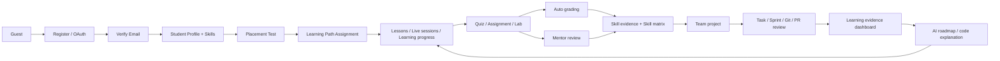
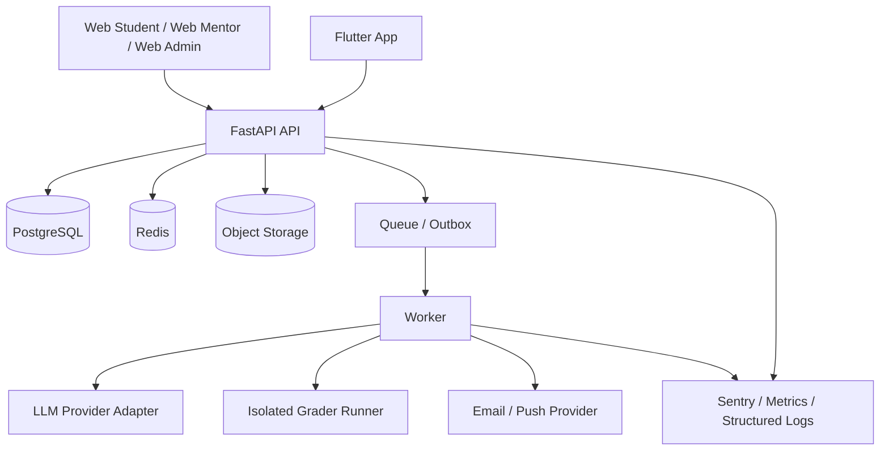

# Study2Work — Business Design (BD) — Study Scope, Codex-Ready

> **Document type:** Business Design (BD) / Study-Only Source of Truth  
> **Version:** 1.0  
> **Generated date:** 2026-07-01  
> **Primary readers:** Product Owner, BA, Tech Lead, Backend/Frontend/Mobile Developer, QA, Codex/AI coding agent  
> **Scope rule:** This document covers the **EdTech / Study** part only. Any recruitment function is intentionally excluded.

---

## 0. How to use this document

This BD is the canonical implementation context for the Study scope. Read it before generating:
1. API DD, database migrations, service modules, UI features, tests, or PlantUML diagrams.
2. New modules or tables that affect learning, assessment, mentor workflow, project teamwork, AI learning support, or platform governance.

**Normative terms**

- **MUST**: mandatory for implementation.
- **SHOULD**: default implementation rule; deviation requires ADR/approval.
- **MAY**: optional enhancement that does not change core behavior.
- **Proposed canonical**: a concrete implementation decision added to make source documents coding-ready; it must be retained unless an ADR supersedes it.

---

## 1. Scope, boundary and assumptions

### 1.1 Product problem

Study2Work is not a video-only LMS. The learning value chain is:

```text
Learn → Practice → Evaluate → Build evidence of capability
```

The platform must convert real learning behavior, submissions, mentor reviews and teamwork into **traceable skill evidence**. The Study scope ends at validated learning evidence; it does **not** include recruitment workflows.

### 1.2 In scope

| Area | Included capability | Source module |
| --- | --- | --- |
| Authentication & Profile | Register; verify email; OAuth Google/GitHub; login; forgot password; refresh token; logout; profile; RBAC | Authentication & User |
| Learning System | Learning path; video/document; quiz; assignment; learning progress; live session; lesson comment; bookmark | Learning System |
| Practice & Assessment | Lab coding; code submission; auto grading; rubric; skill matrix; mentor review; leaderboard; practice history | Practice & Assessment |
| Project & Teamwork | Team project; task board; Git integration; PR review; project submission; sprint; team chat; file sharing | Project & Teamwork |
| AI learning only | AI roadmap; AI code explanation; AI debugging hints / learning insight | AI Features filtered for Study scope |
| Admin & Platform | User/mentor/content management; analytics; settings; notification; audit; moderation | Admin System filtered for Study scope |

### 1.3 Explicitly out of scope

The following items MUST NOT be generated in the Study implementation, even if they appear in original full-system references:

- Employer identity/profile/dashboard and employer management.
- Job post, job requirement, candidate search, matching, shortlist, application, interview scheduling, offer and hiring workflow.
- Public talent pool / searchable candidate profile.
- CV builder, AI CV review, AI interview assistant and job-oriented portfolio publishing.
- Employer-related database tables, endpoints, UI routes, worker jobs, permissions and analytics.

**Boundary note:** a student may have a private **learning evidence view** inside the Study dashboard, but it is not a recruitment portfolio and is not searchable by external organizations.

### 1.4 Project assumptions

- Primary users are IT students who need a structured path, practice and mentor feedback.
- The product supports both self-paced learning and mentor-assisted delivery.
- Learning content may include video, documents, external links, live sessions, lab/coding tasks and project artifacts.
- The system is designed as a modular monolith first and is microservice-ready, but must avoid premature distributed complexity.
- External services may include OAuth, email/push, S3-compatible storage, AI provider, Git provider and code-grading runner.

---

## 2. Source inventory and reconciliation

### 2.1 Inputs consolidated

| Source artifact | Used for |
| --- | --- |
| De_an_he_thong_dao_tao_it_thuc_chien.md/.docx | Product vision, learner journey, learning stages, mentor/AI functions, assessment criteria |
| Study2Work_Use_Case_Diagram_v1.md | Actors, UC IDs, include/extend relations, module boundary |
| Study2Work_Activity_Diagram_Data_Set.md | Business flows, decision nodes, impacted data |
| Study2Work_Domain_Model_Coding_Practice.md | Bounded contexts, aggregates, invariants, events, state/read-model principles |
| Study2Work_ERD_Thuc_Chien_Coding_Guide.md | Tables, relations, constraints, lifecycle states, endpoint seeds |
| Study2Work_BusinessCode_Debug.md | Module/API business codes, error/debug/log/trace standards |
| Kien_truc_du_an_Study2Work_tree.md | Original monorepo and module-tree intent |
| Danh_sach_cong_nghe_hien_dai_Python_VueTS.docx | Target Python + Vue/TS technology recommendations |
| Study2Work_Detailed_Task_List.xlsx | Feature inventory, BD→UIUX→BE→FE→Mobile→QA delivery pattern |
| Study2Work_DD_Template_Master.xlsx + Guide | API Detail Design workbook and field-entry rules |
| Study2Work_UTC_Template.xlsx | Unit-test specification template context |
| List must update.txt | Documentation governance and coding-ready checklist |

### 2.2 Technology conflict that must be resolved

Project documents contain two backend directions:

| Source | Direction |
|---|---|
| Original monorepo tree and task spreadsheet | Vue/NextJS + Flutter + **NestJS** + PostgreSQL + Redis |
| Technology proposal `Danh_sach_cong_nghe_hien_dai_Python_VueTS.docx` | Vue 3 + TypeScript + **FastAPI/Python** + PostgreSQL + Redis |

**Canonical decision for this BD:**

- Use **Vue 3 + TypeScript** for web dashboards.
- Use **Python 3.12+ + FastAPI** for the Study backend.
- Keep the legacy NestJS tree only as a **logical modularity reference**; do not generate NestJS source for the canonical Study implementation.
- Before coding begins, record this as an ADR: `ADR-001 Canonical Study Backend = FastAPI`.

This decision removes ambiguity for Codex. If the team intentionally selects NestJS later, preserve all business/module/data rules in this BD and create a replacement ADR; do not implement both stacks in one service.

---

## 3. Product model and actors

### 3.1 Roles

| Role | Primary responsibilities | Scope constraint |
| --- | --- | --- |
| Guest | View public content; start registration; verify email | Cannot access private data or unassigned learning content |
| Student | Learn, take placement tests, enroll in paths, complete quizzes/assignments/labs, submit code, join projects, view skill matrix, request AI help | Can only own/read/write personal data and authorized team data |
| Mentor | Manage assigned learners/teams; create or assign authorized content; review, use rubrics, provide feedback; host live sessions | Can only review or view data within assigned scope |
| Admin | Manage users/mentors/content, skill taxonomy, settings, analytics, moderation and audit | Highest privilege; sensitive actions must create audit logs |
| System / Worker | Auto grading, send notifications, process events, create analytics | No user interface; minimum service-account permissions |
| AI Service | Generate roadmap suggestions, explain code and produce learning insights | Can only read authorized context; cannot overwrite source of truth |

### 3.2 Permission matrix

| Domain | Actor | Minimum permissions |
| --- | --- | --- |
| AUTH | Guest | register, verify_email, login, oauth_callback, request_password_reset |
| PROFILE | Student | read/update own profile, skills, social links |
| LEARNING | Student | enroll, read assigned content, create own progress/bookmark/comment |
| ASSESSMENT | Student | attempt quiz, create/update draft submission, submit own assignment, view own review |
| ASSESSMENT | Mentor | view assigned submissions, create review/feedback, apply rubric, request revision |
| PROJECT | Student | create/join team by policy, manage own task, access project/team artifacts |
| PROJECT | Mentor | view assigned projects, comment/review, monitor sprint/task progress |
| CONTENT | Admin | CRUD learning path/module/lesson/quiz/assignment/rubric |
| MENTOR | Admin | assign mentor scope, activate/suspend mentor |
| PLATFORM | Admin | settings, feature flags, audit viewer, moderation, analytics |

### 3.3 Core module map

| Module | Study capability | Bounded context | Primary actors |
| --- | --- | --- | --- |
| AUTH & PROFILE | Register, verify email, OAuth, login, refresh token, logout, profile, RBAC | Identity & Access; Profile | Guest, Student, Mentor, Admin |
| LEARNING JOURNEY | Placement test, learning path, stage, module, lesson, content, live session, progress, bookmark, lesson comment | Learning Journey | Student, Mentor, Admin |
| PRACTICE & ASSESSMENT | Quiz, assignment, lab coding, code submission, auto grading, rubric, mentor review, skill matrix, practice history, leaderboard | Practice & Assessment | Student, Mentor, Admin, Worker |
| PROJECT & TEAMWORK | Project, team, task board, sprint, Git link, PR review, project submission, chat, file sharing, work log | Project & Teamwork | Student, Mentor, Admin |
| AI LEARNING SUPPORT | Roadmap suggestion, code explanation, debugging hints, study insight | AI Assistant | Student, Mentor, AI Worker |
| ADMIN & PLATFORM | User/mentor/content management, analytics, setting, notification, audit, moderation | Admin & Platform | Admin, System |
| LEARNING COMMUNITY | Workshop/live session, event registration, comments, leaderboard, group learning / engagement | Community & Engagement | Student, Mentor, Admin |

### 3.4 Core objects and terminology

| Term | Meaning in this system |
|---|---|
| Learning Path | Ordered program assigned/enrolled to a student. |
| Stage | High-level section of a path, for example Foundation or Core Skills. |
| Module | A coherent learning unit under a path/stage. |
| Lesson | A single teachable unit with content and completion policy. |
| Quiz Attempt | Versioned attempt to answer a quiz. |
| Assignment Submission | A versioned evidence artifact submitted by a student. |
| Rubric | Versioned scoring definition used to review a submission/project. |
| Review | Mentor evaluation bound to a rubric and evidence. |
| Skill Assessment | Immutable evidence record that explains why a skill has a level. |
| User Skill | Current projected skill level computed from validated evidence. |
| Project | Real-work simulation containing team, tasks, sprints and artifacts. |
| AI Insight | Non-authoritative recommendation generated from an authorized prompt/context. |

---

## 4. End-to-end operating flow

### 4.1 System flow



### 4.2 Learner journey and data impact

| Step | Business stage | Main behavior | Primary data |
| --- | --- | --- | --- |
| 1 | Identity initialization | Guest registers/OAuths → verifies email → Student/Mentor role is activated | user, role, user_role, verification_token, session, refresh_token |
| 2 | Learner onboarding | Student completes profile/skills → takes placement test or receives default path | profile, student_profile, skill, user_skill, learning_path_enrollment |
| 3 | Path-based learning | Student views stage/module/lesson, video/document/live session; system updates progress | learning_path, module, lesson, lesson_content, live_session, learning_progress |
| 4 | Practice and assessment | Student completes quiz/assignment/lab → submits → auto grade and/or mentor review | quiz_attempt, assignment_submission, rubric, review, feedback |
| 5 | Capability accumulation | Results are aggregated from learning evidence, submissions, reviews, tasks and projects | skill_assessment, user_skill, analytics_snapshot |
| 6 | Team project work | Student joins team → creates task/sprint → works with Git/PR → mentor monitors → project submission | project, team, team_member, sprint, task, pull_request_review, project_submission |
| 7 | Continuous improvement | Student views dashboard/feedback/skill gap → receives AI roadmap or code explanation → continues learning | ai_request, ai_insight, roadmap_suggestion, code_explanation_request, notification |

### 4.3 Main business flows

| Flow ID | Flow | Happy path | Key exceptions/decisions | Events |
| --- | --- | --- | --- | --- |
| F-AUTH-01 | Registration and activation | Guest enters information → validate → check uniqueness → hash password → create PENDING user → send verification → verify → ACTIVE | Duplicate email; expired token; suspended user | UserRegistered, EmailVerified |
| F-LEARN-01 | Path assignment | Placement test/skill input → determine level → map learning path → create enrollment → seed progress → show dashboard | Missing data; path not published; enrollment already exists | LearningPathAssigned |
| F-LEARN-02 | Lesson learning | Authorize enrollment → open content → log view/start → save progress → check completion rule → unlock next lesson | Draft content; lesson locked; user not in path | LessonCompleted |
| F-ASSESS-01 | Quiz | Start attempt → load versioned questions → save answers → submit → auto score → persist result → update progress | Time expired; attempt limit exceeded; question no longer published | QuizSubmitted |
| F-ASSESS-02 | Assignment / code submission | Create draft → validate ownership/deadline/file → freeze version → queue grading → save result → review if needed | Late submission; invalid file; job timeout; plagiarism rule | AssignmentSubmitted, AutoGradingCompleted |
| F-MENTOR-01 | Mentor review | Check mentor assignment → open submission/project → apply rubric version → create feedback → mark review status → update skill assessment | Out of scope; missing rubric criterion; needs revision | SubmissionReviewed, SkillLevelUpdated |
| F-PROJECT-01 | Team project | Create/join team → assign role → initialize task board/sprint → task/PR/work log → mentor oversight → submit project | Team full; duplicate membership; sprint closed; invalid task transition | TeamCreated, TaskAssigned, ProjectSubmitted |
| F-AI-01 | AI learning support | Validate consent/context/rate limit → create AI request snapshot → send scoped prompt → save response → display suggestion | Rate limited; provider timeout; unsafe/error response | AIReviewCompleted |

### 4.4 Flow design standard

Every Activity/Sequence/API DD MUST make these items explicit:

1. Trigger and actor.
2. Preconditions and authorization scope.
3. Request input and field validation.
4. Business validation and state transition validation.
5. Database reads/writes and transaction boundary.
6. Async side effects, event name and retry behavior.
7. Success response and business code.
8. Expected error scenarios and safe error code.
9. Audit/log checkpoints with `traceId`.
10. Postconditions and resulting state.

---

## 5. Functional specification by module

### 5.1 Identity, authentication and profile

**Goals**
- Give every actor one secure identity.
- Support student/mentor/admin access using RBAC.
- Separate identity from profile and learning data.

**Functions**
- Register with email/phone and verify email.
- OAuth sign-in using Google/GitHub.
- Login, logout, refresh-token rotation and password reset.
- Read/update own profile; student baseline skills and career goals.
- Admin role/permission management; mentor scope assignment.

**Acceptance conditions**
- A duplicate email/phone cannot create a second user.
- `PENDING` users cannot access protected Study resources before verification.
- User/role changes are audited.
- A student cannot read or edit another student’s private profile.
- Password, token and raw OAuth secret are never returned in API/logs.

### 5.2 Learning Journey

**Goals**
- Deliver a personalized, ordered learning path.
- Record real progress instead of trusting client-calculated completion.

**Functions**
- Placement test / baseline skill intake.
- Browse assigned learning path, stage, module, lesson and content.
- Access video/document/link/live-session content under enrollment policy.
- Start, update and complete lesson progress.
- Bookmark lessons and discuss through lesson comments.
- Student and mentor dashboards show current progress and blockers.

**Acceptance conditions**
- Only `PUBLISHED` content can be served to students.
- Student access is checked against `learning_path_enrollment`.
- Progress may only transition forward unless an admin/mentor policy explicitly reopens content.
- Next lesson unlock policy is evaluated on the server.
- Bookmark uniqueness is enforced by database constraint.

### 5.3 Practice and assessment

**Goals**
- Move learning from passive consumption to assessable practice.
- Maintain a durable evidence trail for every score/skill update.

**Functions**
- Quiz creation, versioning, attempts, answer saving and scoring.
- Assignment creation with deadline, requirements, allowed attempts and rubric.
- Lab/coding workspace, code/file submission and auto-grading result.
- Mentor rubric review, feedback and revision request.
- Practice history and skill matrix dashboard.
- Optional leaderboard based on approved/derived metrics only.

**Acceptance conditions**
- Question/rubric changes do not mutate historical attempt/review meaning.
- A final submission is immutable; later corrections create a new version or a returned-to-draft workflow.
- Auto grader stores verdict/result logs but must not expose hidden test cases or internal runner details.
- Mentor review must include required rubric criteria.
- Skill level changes are explainable by evidence records.

### 5.4 Project and teamwork

**Goals**
- Simulate real IT collaboration and produce evidence beyond individual quiz results.

**Functions**
- Create/join team based on project policy.
- Assign team roles: developer, tester, leader, reviewer.
- Create sprints, task board and work logs.
- Link Git repository and record pull-request reviews.
- Team chat, task comments and file sharing.
- Project milestone and versioned final submission.

**Acceptance conditions**
- Team member, task assignee and reviewer scope are validated.
- Task transition follows the state machine.
- Sprint/task/project boundaries are checked.
- Uploaded artifacts pass storage/scan policy before visible use.
- Git integration data is verified before it becomes evidence.

### 5.5 Mentor workflow

**Goals**
- Make mentor feedback structured, scoped and measurable.

**Functions**
- Mentor dashboard for assigned students/submissions/projects.
- Review queue, review detail, rubric scoring and feedback.
- Request revision and track status.
- Create/host live session or mentoring session.
- View progress and skill gap of assigned students.

**Acceptance conditions**
- Mentor can only access assigned scope.
- Finalized review has immutable score snapshot and audit record.
- Feedback is visible to the correct student and project team based on visibility policy.
- Review affects skill evidence only after validation of rubric/evidence source.

### 5.6 AI learning support

**Goals**
- Provide contextual learning assistance without replacing mentor or business decisions.

**In Study scope**
- AI roadmap suggestion.
- Code explanation.
- Debugging hints and learning insight.
- Summarized study gaps based on authorized skill/progress context.

**Rules**
- AI output is never a source of truth for score, progress, skill level or review result.
- AI calls are rate-limited and asynchronous when latency is material.
- Prompt content must exclude secrets/tokens and use redacted personal data where possible.
- Every request stores `traceId`, user context, prompt type, provider status and result reference.

### 5.7 Admin, community and platform

**Admin functions**
- Manage users and mentors; activate/suspend and scope assignment.
- Create/publish/unpublish learning path/module/lesson/quiz/assignment/rubric.
- Manage skill taxonomy, feature flags, settings and notification templates.
- View Study analytics: active learners, progress, attempts, review SLA, skill distribution, project completion.
- Moderate lesson comments/community content.

**Community functions**
- Lesson comments/bookmarks.
- Workshops/live sessions and registrations.
- Leaderboard/learning engagement view.
- Team chat and file sharing in project scope.

---

## 6. Business rule catalog

| Rule ID | Rule |
| --- | --- |
| BR-AUTH-001 | User email/phone must be unique; login/reset-password flows must not reveal whether an account exists. |
| BR-AUTH-002 | Store only password hashes; access tokens, refresh tokens and passwords must not be logged in plaintext. |
| BR-AUTH-003 | User status may only transition through the state machine; SUSPENDED/DELETED users cannot authenticate to use APIs. |
| BR-LEARN-001 | A student may open a lesson only when they have a valid enrollment and the lesson satisfies the unlock condition. |
| BR-LEARN-002 | Progress must reflect real interaction; clients cannot set completed status without a server-side rule. |
| BR-LEARN-003 | A bookmark is unique by `(user_id, lesson_id)`; comments must have an owner and moderation status. |
| BR-ASSESS-001 | Quiz attempts use question snapshots/versions; historical results must not change when quiz content is edited. |
| BR-ASSESS-002 | A SUBMITTED assignment submission is immutable; later changes must create a new version or return to DRAFT through workflow. |
| BR-ASSESS-003 | Late submissions must use LATE_SUBMITTED or be rejected according to assignment configuration; submitted timestamp must not be overwritten. |
| BR-ASSESS-004 | Rubrics must be versioned; reviews always reference the rubric/version used for grading. |
| BR-ASSESS-005 | Skill matrix may only update from valid evidence: quiz/assignment/project/review; UI cannot update it directly. |
| BR-MENTOR-001 | Mentors may only review students, submissions or projects within their assigned scope. |
| BR-MENTOR-002 | DONE reviews must include every required criterion or a valid reason for skipped criteria. |
| BR-PROJECT-001 | Team member is unique by `(team_id, user_id)` and must have a valid team role. |
| BR-PROJECT-002 | Task transitions are allowed only through TODO → IN_PROGRESS → IN_REVIEW → DONE; BLOCKED is an exception branch. |
| BR-PROJECT-003 | Tasks must belong to the correct project/sprint; `project_id` cannot change after work log or PR review exists. |
| BR-AI-001 | AI is an assistant; output is only a recommendation/draft and cannot directly change score, progress, skill level or review. |
| BR-AI-002 | AI requests require `traceId`, `userId`, `moduleCode` and a redacted input snapshot when sensitive data is present. |
| BR-ADMIN-001 | Create/update/delete of learning content, rubric, permission, setting and moderation actions must create audit logs. |
| BR-PLATFORM-001 | Every API must check authentication, authorization, validation and ownership/scope, and return a stable `businessCode`. |

---

## 7. State machines

| Object / field | Allowed transitions | Module |
| --- | --- | --- |
| user.status | PENDING → ACTIVE → SUSPENDED → ACTIVE \| ACTIVE/SUSPENDED → DELETED | Identity |
| learning_path_enrollment.enrollment_status | ENROLLED → IN_PROGRESS → COMPLETED \| ENROLLED/IN_PROGRESS → DROPPED | Learning |
| learning_progress.progress_status | NOT_STARTED → IN_PROGRESS → DONE | Learning |
| quiz_attempt.status | IN_PROGRESS → SUBMITTED → SCORED \| IN_PROGRESS → EXPIRED | Assessment (proposed canonical) |
| assignment_submission.submission_status | DRAFT → SUBMITTED/LATE_SUBMITTED → GRADED \| SUBMITTED/LATE_SUBMITTED → RETURNED → DRAFT | Assessment |
| review.review_status | PENDING → DONE \| PENDING → NEEDS_REVISION | Assessment |
| project.status | DRAFT → ACTIVE → ON_HOLD/COMPLETED → ARCHIVED | Project |
| task.status | TODO → IN_PROGRESS → IN_REVIEW → DONE; TODO/IN_PROGRESS → BLOCKED → IN_PROGRESS | Project |
| sprint.status | PLANNED → ACTIVE → CLOSED | Project (proposed canonical) |

**Implementation requirements**
- State validation belongs to the domain/application service, not the client.
- Invalid transition returns a stable validation/business error code.
- Store timestamp/actor/reason for sensitive transitions: suspension, content publish, review finalization, submission return, project archive.
- Use optimistic locking/version field for high-contention records such as submission/review/task if concurrent updates are expected.

---

## 8. Domain model and ownership

### 8.1 Bounded contexts and aggregates

| Context | Aggregate root | Entities / value objects | Responsibility | Core invariants |
| --- | --- | --- | --- | --- |
| Identity & Access | User, Session, Role | Credential, RefreshToken, VerificationToken, Permission, UserRole | Identity, login, token, RBAC | Email/phone unique; status lifecycle; no plaintext secret |
| Profile | Profile | StudentProfile, MentorProfile, Education, Experience, SocialLink, UserSkill | Profile & skill baseline | One identity; visibility separated; normalized skill level |
| Learning Journey | LearningPath, Module, Lesson, LiveSession | PathStage, LessonContent, Bookmark, LessonComment, LearningProgress | Content, enrollment, progress | Lesson belongs to module; publish state; bookmark unique |
| Practice & Assessment | Quiz, Assignment, Submission, SkillAssessment | Question, Choice, Rubric, Criterion, Review, Feedback | Evidence, grading, reviewer feedback | Submission/rubric versioning; evidence-backed skill |
| Project & Teamwork | Project, Team, Sprint, Task | TeamMember, TaskComment, Attachment, GitLink, PRReview, Milestone, WorkLog | Team production workflow | Member role; task owner; sprint/project boundary |
| AI Assistant | AIRequest, AIConversation, ReviewReport | AIInsight, RoadmapSuggestion, CodeExplanationRequest | Scoped learning help | Recommendation only; audit/rate limit |
| Admin & Platform | SystemSetting, AuditLog, AnalyticsSnapshot | FeatureFlag, NotificationTemplate, Notification, ModerationCase | Governance/operations | Audit sensitive actions; typed setting key |

### 8.2 Commands

```text
RegisterUser
VerifyEmail
LoginUser
RefreshSession
UpdateProfile
AssignLearningPath
EnrollLearningPath
StartLesson
RecordLessonProgress
StartQuizAttempt
SubmitQuizAttempt
CreateAssignmentSubmission
SubmitAssignment
RequestAutoGrade
RecordAutoGradeResult
ReviewSubmission
RequestSubmissionRevision
UpdateSkillProjection
CreateProject
CreateTeam
JoinTeam
CreateSprint
CreateTask
TransitionTaskStatus
RecordPullRequestReview
SubmitProject
RequestAIRoadmap
RequestCodeExplanation
PublishLearningContent
AssignMentorScope
```

### 8.3 Queries / read models

```text
GetStudentDashboard
GetMentorDashboard
GetLearningPathProgress
GetLessonDetail
GetQuizAttemptDetail
GetSubmissionDetail
GetReviewQueue
GetSkillMatrix
GetProjectBoard
GetTeamProjectDetail
GetLearningAnalytics
GetNotificationFeed
```

**Read-model policy**
- Optimize dashboards for filter, pagination, search and aggregation.
- Avoid cross-context joins in domain logic; build read views/projections/events when cross-context display is needed.
- `user_skill`, dashboard progress percentage and leaderboard score are derived/projection data, not independent truth sources.

### 8.4 Domain events

```text
UserRegistered
EmailVerified
LearningPathAssigned
LearningPathEnrolled
LessonStarted
LessonCompleted
QuizSubmitted
AssignmentSubmitted
AutoGradingCompleted
SubmissionReviewed
SkillLevelUpdated
TeamCreated
TeamMemberJoined
TaskAssigned
TaskStatusChanged
ProjectSubmitted
AIInsightGenerated
NotificationRequested
LearningContentPublished
```

**Event rule:** publish only facts that have already committed. For cross-context handlers, use an outbox-style mechanism or retry-safe queue worker; do not use a long transaction across modules.

---

## 9. Database design

### 9.1 Database standards

- PostgreSQL is the canonical relational database.
- PK: UUID `id`; FK name: `<entity>_id`.
- Use `created_at`, `updated_at`; add `deleted_at` only for entities that need soft deletion.
- Use `snake_case` for schema and fields.
- Use database constraints for uniqueness and referential integrity; never rely solely on UI validation.
- All timestamps are UTC. Client locale/time zone lives in profile/session metadata.
- Use JSONB only for flexible snapshots/configuration; do not hide strongly relational data in JSONB.
- Large files/artifacts use object storage and `file_asset`, not `bytea` in transactional rows.

### 9.2 Study data dictionary

| Domain | Table(s) | Key fields | Constraint / index | Coding note |
| --- | --- | --- | --- | --- |
| Identity | user | id, email, phone, password_hash, status, last_login_at, created_at, updated_at | PK id; UQ email; UQ phone; index status | Root identity |
| Identity | role / permission / role_permission / user_role | id/code/name; user_id/role_id; role_id/permission_id | UQ user_id+role_id; UQ role_id+permission_id | RBAC; no hard-coded role check in controller |
| Identity | session / refresh_token / verification_token | user_id, token_hash, expires_at, revoked_at, device metadata | Index user_id, expires_at; token hash unique | Store hash, revocation and expiry, not raw token |
| Profile | profile | user_id, display_name, avatar_file_id, bio, visibility, locale, time_zone | UQ user_id; FK user_id | Public/private fields separated |
| Profile | student_profile / mentor_profile | user_id, learning_goal / expertise, availability, status | UQ user_id; FK user_id | Role-specific extension |
| Profile | skill / user_skill | skill_code/name/category; user_id/skill_id/current_level/source_updated_at | UQ skill.code; UQ user_id+skill_id | user_skill is current projection, not raw evidence |
| Learning | learning_path / learning_path_stage | code, title, level, status; path_id, order_no, title | UQ path.code; UQ path_id+order_no | Published path only can enroll |
| Learning | module / lesson / lesson_content | path/stage id, code, order_no, status; module_id, type, unlock_rule; lesson_id, content_type, uri/file_id | UQ module.code; UQ module_id+order_no; index status | Content supports video/document/link/live/lab reference |
| Learning | live_session | lesson_id/module_id, mentor_id, starts_at, ends_at, meeting_url, capacity, status | Index mentor_id, starts_at | Access by enrollment/scope |
| Learning | learning_path_enrollment | user_id, path_id, enrollment_status, assigned_at, completed_at | UQ user_id+path_id | Enrollment is source of learning access |
| Learning | learning_progress | user_id, lesson_id, progress_status, started_at, completed_at, last_position | UQ user_id+lesson_id | Server validates completion |
| Learning | bookmark / lesson_comment | user_id, lesson_id, note; user_id, lesson_id, content, status | UQ bookmark.user_id+lesson_id; indexes lesson_id,status | Comment needs moderation state |
| Assessment | quiz / question / choice | module_id, version, status, pass_score; quiz_id, question_type, order_no; question_id, content, is_correct | UQ quiz_id+version; UQ quiz_id+order_no | Freeze question snapshot per attempt |
| Assessment | quiz_attempt / quiz_answer | quiz_id, user_id, attempt_order, status, started/submitted_at, score; attempt_id, question_snapshot, answer_value, is_correct | UQ quiz_id+user_id+attempt_order | No client score trust |
| Assessment | assignment / assignment_submission | module_id, title, due_at, allowed_attempts, config; assignment_id, user_id, version, status, submitted_at, artifact_file_id, score | UQ assignment_id+user_id+version | Submission versioned/immutable after submit |
| Assessment | rubric / rubric_criterion | assignment_id, version, status; rubric_id, criterion, weight, min/max score, required | UQ assignment_id+version; UQ rubric_id+order_no | Weights validated on publish |
| Assessment | review / feedback | submission_id/project_id, mentor_id, rubric_id, status, total_score; review_id, criterion_id, comment, score | Index mentor_id,status; FK evidence | Review scope checked before write |
| Assessment | skill_assessment | user_id, skill_id, evidence_type/id, level, score, assessed_at, assessor_id | Index user_id,skill_id,assessed_at | Immutable evidence history; feeds user_skill |
| Project | project / team / team_member | module_id, title, status; project_id, name; team_id,user_id,team_role | UQ team_member.team_id+user_id | Project may have one or multiple teams per business policy |
| Project | sprint / task | project_id, name, dates, status; project_id,sprint_id,title,assignee_id,status,priority,due_at | Index project_id,status; index assignee_id,status | Validate task transition/server-side |
| Project | task_comment / task_attachment / work_log | task_id, user_id, body; task_id,file_id; task_id,user_id,duration,work_date | Index task_id; index user_id,work_date | Artifacts stored through file_asset |
| Project | git_repository_link / pull_request_review | project_id, provider, repo_url, external_id; task_id, reviewer_id, external_pr_id, status, comment | UQ project_id+provider | External webhook data is untrusted until verified |
| Project | project_milestone / project_submission | project_id,title,due_at,status; project_id,team_id,version,status,artifact_file_id,submitted_at | Index project_id,status | Final artifact/version history |
| AI | ai_conversation / ai_request / ai_insight | user_id, context; conversation_id,type,input_snapshot,status,trace_id; request_id,output,confidence,created_at | Index user_id,created_at; UQ trace_id | Redact secrets; rate limited |
| AI | roadmap_suggestion / code_explanation_request / review_report | request_id, path proposal; request_id, code snapshot; request_id, structured report | Index request_id | AI outputs never overwrite business facts |
| Platform | notification_template / notification | template_code, channel, body; user_id, template_id, data,status,read_at | UQ template_code; index user_id,status | Async delivery through worker |
| Platform | audit_log | actor_id, action, resource_type/id, before_json, after_json, trace_id, ip, created_at | Index resource_type/resource_id; index actor_id,created_at | Append-only for sensitive operations |
| Platform | system_setting / feature_flag | setting_key, scope, value_json; flag_key, environment, enabled | UQ setting_key+scope; UQ flag_key+environment | Typed config and environment-scoped rollouts |
| Platform | community_event / event_registration / analytics_snapshot | creator_id,title,starts_at; event_id,user_id,status; metric_key, dimension, value, captured_at | UQ event_id+user_id; index metric/time | Learning engagement only |
| Cross-cutting - required addition | file_asset | id, owner_id, storage_key, mime_type, size_bytes, checksum, scan_status, created_at | UQ storage_key; index owner_id,scan_status | Required canonical file abstraction; do not scatter storage path in business tables |

### 9.3 Essential relationships

```mermaid
erDiagram
    USER ||--o| PROFILE : has
    USER ||--o{ USER_ROLE : assigned
    ROLE ||--o{ USER_ROLE : grants
    ROLE ||--o{ ROLE_PERMISSION : includes
    PERMISSION ||--o{ ROLE_PERMISSION : mapped

    USER ||--o| STUDENT_PROFILE : specializes
    USER ||--o| MENTOR_PROFILE : specializes
    USER ||--o{ USER_SKILL : owns
    SKILL ||--o{ USER_SKILL : categorized_as

    LEARNING_PATH ||--o{ LEARNING_PATH_STAGE : contains
    LEARNING_PATH ||--o{ MODULE : contains
    MODULE ||--o{ LESSON : contains
    LESSON ||--o{ LESSON_CONTENT : has
    USER ||--o{ LEARNING_PATH_ENROLLMENT : enrolls
    LEARNING_PATH ||--o{ LEARNING_PATH_ENROLLMENT : assigned
    USER ||--o{ LEARNING_PROGRESS : records
    LESSON ||--o{ LEARNING_PROGRESS : tracks

    MODULE ||--o{ QUIZ : publishes
    QUIZ ||--o{ QUESTION : contains
    QUESTION ||--o{ CHOICE : has
    QUIZ ||--o{ QUIZ_ATTEMPT : attempted
    QUIZ_ATTEMPT ||--o{ QUIZ_ANSWER : contains

    MODULE ||--o{ ASSIGNMENT : publishes
    ASSIGNMENT ||--o{ ASSIGNMENT_SUBMISSION : receives
    ASSIGNMENT ||--o{ RUBRIC : uses
    RUBRIC ||--o{ RUBRIC_CRITERION : contains
    ASSIGNMENT_SUBMISSION ||--o{ REVIEW : reviewed
    REVIEW ||--o{ FEEDBACK : produces
    USER ||--o{ SKILL_ASSESSMENT : evidences

    PROJECT ||--o{ TEAM : contains
    TEAM ||--o{ TEAM_MEMBER : includes
    PROJECT ||--o{ SPRINT : plans
    PROJECT ||--o{ TASK : owns
    SPRINT ||--o{ TASK : groups
    TASK ||--o{ TASK_COMMENT : has
    TASK ||--o{ TASK_ATTACHMENT : attaches
    TASK ||--o{ PULL_REQUEST_REVIEW : receives
    PROJECT ||--o{ PROJECT_SUBMISSION : receives

    USER ||--o{ AI_CONVERSATION : owns
    AI_CONVERSATION ||--o{ AI_REQUEST : contains
    AI_REQUEST ||--o{ AI_INSIGHT : produces

    USER ||--o{ NOTIFICATION : receives
    USER ||--o{ AUDIT_LOG : triggers
```



### 9.4 Migration order

```text
Tier 1: user, role, permission, role_permission, user_role, profile, student_profile,
        mentor_profile, skill, user_skill, session, refresh_token, verification_token.

Tier 2: learning_path, learning_path_stage, module, lesson, lesson_content, live_session,
        learning_path_enrollment, learning_progress, bookmark, lesson_comment.

Tier 3: quiz, question, choice, quiz_attempt, quiz_answer, assignment, assignment_submission,
        rubric, rubric_criterion, review, feedback, skill_assessment, file_asset.

Tier 4: project, team, team_member, sprint, task, task_comment, task_attachment,
        git_repository_link, pull_request_review, project_milestone, project_submission, work_log.

Tier 5: ai_conversation, ai_request, ai_insight, roadmap_suggestion, code_explanation_request,
        review_report, notification_template, notification, audit_log, system_setting,
        feature_flag, community_event, event_registration, analytics_snapshot.
```

---

## 10. API design and integration contracts

### 10.1 API conventions

- Prefix all APIs with `/api/v1`.
- `Content-Type: application/json` unless file upload.
- Use bearer JWT for protected APIs.
- `traceId` MUST exist for request correlation. Accept an upstream correlation ID only after validation, otherwise generate one.
- Use cursor/page pagination for list endpoints; never return unbounded collection.
- API operation must document: caller, permission, request DTO, response DTO, affected tables, transaction, side effects, errors, tests.
- Implement idempotency for safe retry where relevant: enrollment, bookmark toggle, external webhook, submission create with client request ID.

### 10.2 Standard response envelope

```json
{
  "businessCode": "LEARN-RESP-SUCCESS",
  "message": "Request completed successfully.",
  "timestamp": "2026-07-01T10:00:00Z",
  "traceId": "7c3a2f1b-31c5-4a21-9b3e-7d1745c4748a",
  "data": {}
}
```

### 10.3 Error envelope

```json
{
  "businessCode": "LEARN-RESP-INVALID_INPUT",
  "message": "Validation failed.",
  "timestamp": "2026-07-01T10:00:00Z",
  "traceId": "7c3a2f1b-31c5-4a21-9b3e-7d1745c4748a",
  "errors": [
    {
      "field": "assignmentId",
      "code": "E422",
      "message": "Assignment is not available for submission."
    }
  ]
}
```

### 10.4 Study API catalogue

> API codes marked **Proposed canonical** extend the existing BusinessCode catalog in a consistent way. They must be registered before implementation.

| API business code | Method | Endpoint | Caller | Purpose | Primary tables |
| --- | --- | --- | --- | --- | --- |
| AUTH-REGISTER-001 | POST | /api/v1/auth/register | Guest | Create pending account; send verification | user, user_role, verification_token, audit_log |
| AUTH-LOGIN-001 | POST | /api/v1/auth/login | Guest | Authenticate and create session/token | user, session, refresh_token, audit_log |
| AUTH-VERIFY-001 | POST | /api/v1/auth/verify-email | Guest | Verify account token and activate | user, verification_token, audit_log |
| AUTH-OAUTH-001 | GET/POST | /api/v1/auth/oauth/{provider} | Guest | Start/callback OAuth | user, user_role, session, refresh_token |
| AUTH-REFRESH-001 | POST | /api/v1/auth/refresh | Student/Mentor/Admin | Rotate refresh/access token | session, refresh_token, audit_log |
| AUTH-LOGOUT-001 | POST | /api/v1/auth/logout | Student/Mentor/Admin | Revoke current refresh token/session | session, refresh_token, audit_log |
| USER-PROFILE-001 | GET | /api/v1/me | Student/Mentor/Admin | Read own profile + assigned roles | user, profile, *_profile, user_skill |
| USER-PROFILE-002 | PATCH | /api/v1/me/profile | Student/Mentor | Update own profile | profile, student_profile/mentor_profile, audit_log |
| USER-SKILL-001 | PUT | /api/v1/me/skills | Student/Mentor | Update declared baseline skills; does not set assessed level | skill, user_skill, audit_log |
| LEARN-PATH-001 | GET | /api/v1/learning-paths | Student | List published/eligible learning paths | learning_path, stage, module |
| LEARN-PATH-002 | POST | /api/v1/learning-paths/{pathId}/enroll | Student | Enroll/assign path | learning_path_enrollment, learning_progress, audit_log |
| LEARN-PLACEMENT-001 | POST | /api/v1/placement-tests/{testId}/attempts | Student | Submit placement test and calculate level | quiz_attempt, quiz_answer, skill_assessment |
| LEARN-LESSON-001 | GET | /api/v1/lessons/{lessonId} | Student | Read unlocked lesson + content | lesson, lesson_content, enrollment, progress |
| LEARN-PROGRESS-001 | POST | /api/v1/lessons/{lessonId}/progress | Student | Record start/position/completion event | learning_progress, audit_log |
| LEARN-BOOKMARK-001 | PUT | /api/v1/lessons/{lessonId}/bookmark | Student | Create/remove bookmark idempotently | bookmark |
| LEARN-COMMENT-001 | POST | /api/v1/lessons/{lessonId}/comments | Student/Mentor | Create lesson discussion comment | lesson_comment, audit_log |
| LEARN-LIVE-001 | GET | /api/v1/live-sessions | Student/Mentor | List sessions in learning scope | live_session, enrollment |
| LEARN-QUIZ-001 | POST | /api/v1/quizzes/{quizId}/attempts/{attemptId}/submit | Student | Submit quiz and calculate score | quiz_attempt, quiz_answer, progress, skill_assessment |
| ASSESS-SUBMISSION-001 | POST | /api/v1/assignments/{assignmentId}/submissions | Student | Create assignment/code submission | assignment_submission, file_asset, audit_log |
| ASSESS-GRADE-001 | POST | /api/v1/submissions/{submissionId}/grade | System Worker | Persist auto-grade outcome | assignment_submission, review_report, skill_assessment |
| MENTOR-REVIEW-001 | POST | /api/v1/submissions/{submissionId}/reviews | Mentor | Create rubric-based review | review, feedback, rubric, skill_assessment, audit_log |
| MENTOR-REVIEW-002 | PATCH | /api/v1/reviews/{reviewId} | Mentor | Update draft/pending review before finalization | review, feedback, audit_log |
| SKILL-MATRIX-001 | GET | /api/v1/me/skill-matrix | Student | Read evidence-backed skill matrix | user_skill, skill_assessment, review |
| PROJECT-TEAM-001 | POST | /api/v1/projects/{projectId}/teams | Student | Create team for project | project, team, team_member, audit_log |
| PROJECT-TEAM-002 | POST | /api/v1/teams/{teamId}/members | Student/Mentor | Join/add member according policy | team_member, audit_log |
| PROJECT-SPRINT-001 | POST | /api/v1/projects/{projectId}/sprints | Student/Mentor | Create sprint | sprint, audit_log |
| PROJECT-TASK-001 | POST | /api/v1/projects/{projectId}/tasks | Student/Mentor | Create task | task, audit_log |
| PROJECT-TASK-002 | PATCH | /api/v1/tasks/{taskId}/status | Student/Mentor | Transition task status | task, work_log, audit_log |
| PROJECT-PR-001 | POST | /api/v1/tasks/{taskId}/pull-request-reviews | Student/Mentor | Record PR review | pull_request_review, task_comment, audit_log |
| PROJECT-SUBMIT-001 | POST | /api/v1/projects/{projectId}/submissions | Student | Submit project artifact/version | project_submission, file_asset, audit_log |
| AI-ROADMAP-001 | POST | /api/v1/ai/roadmap-suggestions | Student | Generate scoped roadmap suggestion | ai_request, roadmap_suggestion, ai_insight |
| AI-CODE-001 | POST | /api/v1/ai/code-explanations | Student/Mentor | Explain code/debug concept | ai_request, code_explanation_request, ai_insight |
| ADMIN-CONTENT-001 | POST | /api/v1/admin/learning-paths | Admin | Create/modify content tree | learning_path, module, lesson, audit_log |
| ADMIN-RUBRIC-001 | POST | /api/v1/admin/rubrics | Admin | Create/version/publish rubric | rubric, rubric_criterion, audit_log |
| ADMIN-MENTOR-001 | PATCH | /api/v1/admin/mentors/{mentorId}/scope | Admin | Assign mentor scope | mentor_profile, audit_log |

### 10.5 Required API validation sequence

```text
1. Parse and validate transport schema (Pydantic DTO).
2. Authenticate bearer/OAuth identity where required.
3. Authorize permission and resource ownership/scope.
4. Validate entity exists and is available/published.
5. Validate current state and business rules.
6. Open short transaction for writes.
7. Persist source records and audit log.
8. Commit.
9. Dispatch safe async event/job after commit.
10. Map stable success/error envelope with traceId.
```

---

## 11. BusinessCode, error, logging and debugging

### 11.1 Business modules

| BusinessCode | Module | Sub-module | Priority | Catalog status |
| --- | --- | --- | --- | --- |
| AUTH | Authentication | Login, Register, JWT | Critical | Existing |
| USER | User Management | Profile | High | Existing |
| LEARN | Learning | Roadmap, Quiz, Assignment | High | Existing |
| PROJECT | Project | TeamProject | High | Existing |
| MENTOR | Mentor | Review | Medium | Existing |
| AI | AI Services | AI Tutor / Review | High | Existing |
| NOTI | Notification | Email, In-app, Push | Medium | Existing (expanded channel scope) |
| SYSTEM | System | Logging, Audit, Worker | Critical | Existing |

### 11.2 Stable standard errors

| Error code | Layer | Meaning | Typical cause | Action |
| --- | --- | --- | --- | --- |
| E401 | AUTH | Unauthorized | Invalid/expired token or credential | Refresh or re-login |
| E403 | AUTH | Forbidden | Permission/ownership/scope denied | Check RBAC and mentor/student/project scope |
| E404 | API | Not found | Unknown resource or unavailable content | Verify resource ID and publication status |
| E409 | DATABASE | Conflict | Duplicate unique data or invalid concurrent state | Return stable conflict business code |
| E422 | VALIDATION | Validation failed | Invalid payload/state transition/required input | Return field-level safe validation detail |
| E500 | SYSTEM | Internal server error | Unhandled error | Log traceId; hide internals from client |
| E502 | GATEWAY | Dependency unavailable | AI/storage/email/grading dependency down | Retry only safe transient actions |
| E504 | TIMEOUT | Request timeout | Long grading/AI/query | Async job or optimize/cache |

### 11.3 Logging convention

| Level | Convention | Example | Use |
|---|---|---|---|
| INFO | `[MODULE]-[ACTION]-SUCCESS` | `LEARN-QUIZ-SUCCESS` | Successful business checkpoint |
| WARN | `[MODULE]-[ACTION]-WARNING` | `ASSESS-GRADE-WARNING` | Retryable/non-blocking anomaly |
| ERROR | `[MODULE]-[ACTION]-ERROR` | `MENTOR-REVIEW-ERROR` | Failed business/system flow |
| DEBUG | `[MODULE]-[DETAIL]-TRACE` | `AUTH-JWT-TRACE` | Development/internal tracing only |

### 11.4 Mandatory trace fields

```text
traceId      UUID        required
userId       UUID        required after authentication
sessionId    UUID/string optional
moduleCode   string      required
apiCode      string      required
timestamp    ISO-8601    required
deviceInfo   string      optional
ipAddress    string      optional, protect as personal/sensitive data
resourceType string      recommended
resourceId   UUID        recommended
```

### 11.5 Security logging rules

- Never log password, raw access token, refresh token, OAuth secret, uploaded source code containing secret, hidden test cases or private PII.
- Add `traceId` to client-safe response, structured logs, audit records and async job payload.
- Error response is user-safe; technical stack trace goes only to observability tooling.
- `audit_log` is append-only for sensitive business/admin actions.

---

## 12. Target architecture

### 12.1 Architecture principles

1. **Modular monolith first:** fast to develop, one deployment unit, clear domain boundaries.
2. **Clean layering:** domain → application → infrastructure → presentation.
3. **Contract first:** APIs/DD/DTO/OpenAPI are synchronized.
4. **Async for expensive work:** auto grading, AI, email/push, analytics aggregation.
5. **Evidence over score:** retain raw assessment/review/project evidence and derive dashboards.
6. **Security by boundary:** JWT/RBAC/ownership at every protected endpoint.
7. **Observability by default:** trace, structured logs, Sentry, metrics, audit.

### 12.2 Monorepo tree — Study scope

```text
study2work/
├── apps/
│   ├── web-public/              # landing, public workshop/content
│   ├── web-student/             # Study learner dashboard
│   ├── web-mentor/              # review and class/team supervision
│   ├── web-admin/               # learning content and governance
│   └── mobile-app/              # Flutter, student-first mobile flows
├── services/
│   ├── api/                     # FastAPI modular monolith
│   │   ├── app/
│   │   │   ├── core/            # config, security, middleware, errors, logging
│   │   │   ├── modules/
│   │   │   │   ├── identity/
│   │   │   │   ├── profile/
│   │   │   │   ├── learning/
│   │   │   │   ├── assessment/
│   │   │   │   ├── project/
│   │   │   │   ├── mentor/
│   │   │   │   ├── ai/
│   │   │   │   ├── notification/
│   │   │   │   └── platform/
│   │   │   ├── shared/          # contracts, event bus, pagination, file abstraction
│   │   │   └── main.py
│   │   ├── alembic/
│   │   ├── tests/
│   │   └── pyproject.toml
│   ├── worker/                  # Celery/RQ handlers: grading, AI, mail, analytics
│   └── grader-runner/           # isolated, sandboxed code execution boundary
├── packages/
│   ├── shared-types/            # OpenAPI generated TS/Dart models
│   ├── shared-ui/
│   ├── shared-utils/
│   ├── eslint-config/
│   └── design-system/
├── docs/
│   ├── bd/
│   ├── dd/
│   ├── architecture/
│   ├── database/
│   ├── api/
│   ├── diagrams/
│   └── adr/
├── infrastructure/
│   ├── docker/
│   ├── nginx/
│   ├── ci-cd/
│   ├── monitoring/
│   └── terraform/
├── tests/
│   ├── e2e/
│   ├── integration/
│   ├── fixtures/
│   └── performance/
├── scripts/
├── storage/
├── deployment/
├── .github/
├── docker-compose.yml
├── .env.example
└── README.md
```

### 12.3 Backend module structure

```text
services/api/app/modules/assessment/
├── domain/
│   ├── entities/
│   ├── value_objects/
│   ├── events/
│   ├── services/
│   └── repositories.py          # interfaces only
├── application/
│   ├── commands/
│   ├── queries/
│   ├── dto/
│   ├── handlers/
│   └── mappers/
├── infrastructure/
│   ├── db/
│   │   ├── models/
│   │   └── repositories/
│   ├── jobs/
│   └── adapters/
├── presentation/
│   ├── routes.py
│   ├── schemas.py
│   └── dependencies.py
└── module.py
```

### 12.4 Technology stack

| Layer | Technology | Role |
| --- | --- | --- |
| Web application | Vue 3 + TypeScript + Vite | Student, mentor, admin dashboard; feature modules |
| UI | Tailwind CSS + shadcn-vue or Naive UI | Consistent accessible dashboard components |
| Client state/data | Pinia + TanStack Query for Vue | UI state and server cache |
| Public/SEO | Nuxt 3 | Landing/blog/workshop pages; optional in Study scope |
| Backend (canonical) | Python 3.12+ + FastAPI + Pydantic v2 | Typed REST API, OpenAPI, AI/data friendly |
| Persistence | SQLAlchemy 2.0 + Alembic + PostgreSQL | Domain data, migration, transactions |
| Cache/session/rate limit | Redis | Cache, token/session support, queue broker and throttling |
| Worker | Celery or RQ | AI, notifications, auto grading orchestration, long tasks |
| Realtime | WebSocket / Socket.IO compatible gateway | Notifications, mentor collaboration, grading/project status |
| Search/AI | LLM API + pgvector | AI roadmap, semantic learning assistance; isolated service adapter |
| File storage | S3-compatible Object Storage | Learning assets, artifacts, attachments, submissions |
| Security | JWT + OAuth2 + RBAC | Authentication/authorization |
| Packaging/deploy | Docker + Docker Compose | Dev/staging/prod parity |
| CI/CD | GitHub Actions | Build, lint, test, migration, deploy |
| Observability | Sentry + Prometheus + Grafana + centralized logs | Errors, metrics, traceability |
| Testing | Pytest + Vitest + Playwright | Backend, frontend unit, e2e |
| Mobile | Flutter | Student/mobile learning flow; API contract shared |

### 12.5 Runtime interaction



### 12.6 Code execution safety boundary

Lab/assignment code must never execute inside the main API process.

```text
Student submission
  → API validates ownership, format, size and scan status
  → store artifact and create submission record
  → enqueue grading job
  → isolated grader runner applies CPU/memory/time/network restrictions
  → worker persists safe verdict and metrics
  → notification/dashboard projection updates
```

This is a **proposed canonical security requirement** for the auto-grading feature.

---

## 13. Creating API Detail Design (DD)

### 13.1 When a DD is required

Create one DD workbook for each externally callable API or atomic API operation that:
- changes state,
- reads a complex business aggregate,
- calls an external dependency,
- triggers grading/AI/notification,
- requires authorization/ownership logic,
- has non-trivial error cases.

Do not create DD based only on screen count. A single screen may call several APIs, each with its own DD.

### 13.2 Design chain

```text
Product requirement
  → BD module / business rules
  → Use Case + scenario + acceptance criteria
  → Activity + Sequence diagram
  → ERD / data ownership / state machine
  → API list
  → API DD workbook
  → OpenAPI DTO + migration + implementation
  → Unit / integration / E2E test
  → Release checklist
```

### 13.3 Master template sheets

| Sheet | Required content | Rule |
| --- | --- | --- |
| Cover | API name, version, creator/reviewer/approver, date | Replace only placeholders; preserve layout and merged cells |
| History | Version/change history | Append a row; never delete old history |
| Overview | Project, module/domain, API purpose, caller, trigger, pre/postconditions, scope notes | Explain business value and key constraints |
| 1.Request | Method, URI, charset, content type, auth, field list, validation, JSON example, FE/BE notes | Name logical/physical fields consistently; examples must be valid JSON |
| 2.Response | Envelope, response fields, success/error cases, DB source mapping, JSON examples | Use stable businessCode and no internal exception/message leak |
| 3. Data mapping | Step-by-step business flow: input → validation → reads/writes → decision → transaction → output → logging | State tables read/write, permission checks and event/async side effects |
| 4.Error | Category, validation/verify check, error code, message ID, retry rule | Use standard error catalog; include business and system errors |
| 00.Template Guide | Quick reference | Do not remove or replace with business content |

### 13.4 DD authoring procedure

1. **Start from the BD:** identify Flow ID, actor, role/permission, BR IDs, states and tables.
2. **Name the DD:** `Study2Work_<MODULE>_<FEATURE>_<HTTP_METHOD>_<ENDPOINT_SLUG>_DD_vX.Y.xlsx`.
3. **Copy the master template:** `Study2Work_DD_Template_Master.xlsx`. Keep all sheets/layout/merge/cells; replace placeholders only.
4. **Fill Overview:** explain caller, trigger, precondition, postcondition, business objective and explicit Study-only scope.
5. **Fill Request:** define real physical JSON keys, type, required flag, min/max, format, default, sample and field validation.
6. **Fill Response:** use the standard response envelope; define fields and JSON examples for success and error.
7. **Fill Data mapping:** write the actual server sequence. Each step must identify read/write tables, ownership check, validations, transaction, event/job/cache behavior and log checkpoint.
8. **Fill Error:** map each expected validation/business/system failure to standard error/business code and retry policy.
9. **Cross-check:** DD must agree with migration, OpenAPI DTO, API controller/route, service, async job and tests.
10. **Review:** BA/Tech Lead/QA review state transitions, security/ownership and negative cases before implementation.

### 13.5 DD pre-implementation checklist

| # | Area | Completion rule |
| --- | --- | --- |
| 1 | BD source | UC/scenario, roles, precondition, acceptance criteria, BR IDs, data and state transitions are approved. |
| 2 | API contract | Endpoint/method/caller/permission/idempotency/timeout are decided. |
| 3 | Data ownership | Tables read/write, FK/unique/transaction boundary and audit requirements are identified. |
| 4 | Validation | Field-level and business-level validations are listed; error code mapping is complete. |
| 5 | Security | JWT/RBAC/ownership/scope, secret redaction, rate-limit and file scanning requirements are specified. |
| 6 | Side effects | Events, notifications, worker jobs, cache invalidation and retry behavior are described. |
| 7 | Tests | Happy path, validation, authorization, concurrency, state transition, retry and failure cases are traceable. |

### 13.6 Minimum DD content for selected critical APIs

| API | DD-specific mandatory content |
|---|---|
| Register/Login/Refresh | Token/session lifecycle, credential handling, user status, rate-limit, audit, safe message policy. |
| Enroll learning path | Eligibility, enrollment uniqueness, initial progress creation, idempotency, event. |
| Lesson progress | Enrollment ownership, unlock rule, completion threshold, duplicate event handling. |
| Quiz submit | Attempt status, time limit, question snapshot, score calculation, progress/skill side effects. |
| Assignment submission | Deadline, files/code validation, submission version, plagiarism/scan policy, async grading job. |
| Mentor review | Assignment scope, rubric version, criterion completeness, review state, skill evidence update. |
| Task status transition | Team/project scope, allowed transition, optimistic concurrency, audit and notification. |
| AI roadmap/code explanation | Consent/context, rate limit, PII/secret redaction, provider failure/retry and output disclaimer. |

### 13.7 DD quality gate

A DD is **not ready** while any of these are missing:
- Placeholder `{{...}}` still exists.
- Request/response JSON is invalid.
- Field name mismatch exists between Request, Data Mapping, Response and DTO.
- Table read/write ownership is missing.
- Permission, state validation, transaction or error behavior is ambiguous.
- Success and error examples lack business code/trace behavior.
- Test cases cannot be derived from the document.

---

## 14. Non-functional requirements

### 14.1 Security
- JWT access token + refresh-token rotation; revocation stored server-side.
- OAuth2 provider integration behind adapter interface.
- RBAC + ownership/scope check on every protected operation.
- Rate-limit auth, AI, upload and grading-trigger APIs.
- Hash password with a modern password-hash implementation; never store plaintext.
- S3 pre-signed upload/download only after authorization; validate MIME/size/checksum and scan status.
- Protect against IDOR: resource ID alone never grants access.
- Audit sensitive operations and redact sensitive fields in logs.

### 14.2 Reliability and data integrity
- Database transaction for atomic write groups.
- Use retry-safe worker jobs for email/AI/grading/notifications.
- Outbox/event retry records for committed events.
- Unique constraints prevent duplicate enrollments, bookmarks, roles, memberships and attempts.
- Snapshot/version rules protect historical submissions, rubric reviews and AI outputs.
- Backup/restore and migration rollback procedure must be tested.

### 14.3 Performance
- Paginate list endpoints.
- Index all high-frequency FK/status/date queries.
- Cache read-heavy public/published content and selected dashboard projections.
- Offload auto grading, analytics aggregation and AI calls to workers.
- Do not block UI after submission; return job/submission status and push/poll outcome.

### 14.4 Observability
- Structured log: timestamp, level, traceId, apiCode, moduleCode, actor/resource identifiers.
- Error monitoring: Sentry.
- Metrics: request latency/error rate, queue depth, grading timeouts, active learners, review SLA, cache hit rate.
- Dashboards: Prometheus/Grafana.
- Alerting: repeated job failure, grading runner unavailable, high auth failure burst, database saturation.

---

## 15. Testing and delivery standards

| Test level | Mandatory coverage |
| --- | --- |
| Unit | Domain invariants, state transitions, scoring/rubric calculation, permissions, mapper/validator |
| Integration | Repository + migration + transaction + cache/queue adapter behavior |
| API | Request/response contract, auth/RBAC, business code, error catalog, idempotency |
| E2E | Register → learning path → lesson → quiz/assignment → mentor review → skill matrix |
| Security | OWASP Top 10, upload scan, token rotation/revocation, IDOR/ownership tests, rate limit |
| Performance | Dashboard/progress query, quiz submit burst, grading queue throughput, websocket notification fan-out |
| Regression/UAT | Per completed feature; use DD and acceptance criteria as traceability source |

### 15.1 Definition of Done per Study feature

```text
[ ] BD/UC/AC/BR references exist
[ ] DD workbook approved for each API
[ ] DB migration + constraints + seed/fixture added
[ ] Route/controller + DTO + authorization implemented
[ ] Application/domain service and repository tests pass
[ ] Async jobs/events retry-safe and monitored
[ ] Web/mobile UI uses generated API types
[ ] API integration, errors and loading states implemented
[ ] Unit, integration and E2E coverage completed
[ ] Security/ownership/state transition negative cases pass
[ ] Audit/log/trace convention implemented
[ ] Documentation and changelog updated
```

---

## 16. Delivery sequence (Study scope)

### Phase S1 — Foundation

```text
Identity & Access
Profile + student/mentor profile
RBAC and audit base
Skill taxonomy
Learning content foundations
Notifications/infrastructure baseline
```

### Phase S2 — Learning core

```text
Learning path, stages, modules, lessons and content
Enrollment and progress
Bookmarks/comments
Placement test / initial path assignment
Student/mentor dashboards
```

### Phase S3 — Practice & assessment

```text
Quiz/attempt/answer
Assignment/submission/version
File asset pipeline
Auto-grading queue + sandbox
Rubric/review/feedback
Skill evidence and skill matrix
```

### Phase S4 — Project teamwork

```text
Project/team/member
Sprint/task/work log
Git/PR review integration
Team chat/file sharing
Project submissions/milestones
```

### Phase S5 — AI learning support and optimization

```text
AI roadmap/code explanation
Learning insight
Analytics projection
Feature flags, rate-limit, monitoring hardening
```

---

## 17. Codex execution rules

1. Generate only the Study scope defined in this document; do not create employer, job, application, matching, shortlist, offer or hiring modules.
2. Use the canonical backend direction: FastAPI/Python. The legacy NestJS tree is reference-only. Do not mix NestJS controllers with FastAPI in the same deliverable.
3. Implement a modular monolith first. Each bounded context has domain, application, infrastructure and presentation layers.
4. Never place business logic in controller/route handlers. Controllers validate/authorize/map response; application services orchestrate; domain enforces invariants.
5. Treat `user` as identity root; profile is separate. Do not put learning, submissions, project or AI fields into `user`.
6. Use UUID primary keys, UTC timestamps, `created_at`, `updated_at`, `deleted_at` where soft delete is required, and snake_case database naming.
7. Every state transition must be server-side and validated against the state machine in this document.
8. Store source/evidence history and derive projections. `user_skill` is a projection; `skill_assessment` is the evidence history.
9. Version immutable artifacts: assignment submissions, rubric definitions, project submissions, AI input/output snapshots when audit is needed.
10. Use `file_asset` for uploaded content. Never persist raw object-storage URLs/path strings as the only business reference.
11. Auto grading and LLM operations are asynchronous. Do not execute untrusted code or long AI calls in the API request process.
12. Every protected action checks JWT, RBAC and resource ownership/scope. Mentor review must check assigned scope.
13. Return the standard response envelope with `businessCode`, `message`, `timestamp`, `traceId`, and `data`.
14. Use existing business module codes and stable error codes. Add a new code only through the catalog; do not invent inconsistent strings per endpoint.
15. Create audit logs for content publication, mentor assignment, review finalization, role/permission changes, settings and administrative actions.
16. Use Alembic migrations for all schema changes and add unique/FK/index constraints from this BD in the migration.
17. Define Pydantic request/response models and OpenAPI examples that agree with DD. No hidden fields in responses.
18. For each endpoint, create unit + integration/API tests before marking the feature complete; include permission and state-transition tests.
19. Use events/outbox-style dispatch for cross-context actions such as progress/skill projection/notifications. Do not use distributed transactions.
20. When project sources conflict, preserve the scope, business rule and invariants in this BD; log the tech decision as an ADR before implementation.

---

## 18. Explicit do-not-build list for this BD

```text
web-employer
employer_profile
job_post
job_requirement
job_skill_requirement
application
shortlist
interview
interview_feedback
offer
candidate_snapshot
match_score
candidate search
job matching
recruitment dashboards
employer administration
CV builder / AI CV review / AI interview assistant
```

These items belong to a future **Career & Recruitment BD** and must not leak into Study migrations, routes, events, permissions or UI.

---

## 19. Open decisions / ADR backlog

| ADR ID | Decision | Default in this BD | Required owner |
|---|---|---|---|
| ADR-001 | Backend framework | FastAPI/Python canonical; NestJS tree reference-only | Tech Lead |
| ADR-002 | ORM approach | SQLAlchemy 2.0 + Alembic | Backend Lead |
| ADR-003 | Async worker | Celery or RQ; select one | Backend/DevOps |
| ADR-004 | Grading sandbox provider/implementation | Isolated runner mandatory; define container/security policy | Tech Lead/Security |
| ADR-005 | Learning unlock policy | Server-controlled rule set per lesson/module | Product + BA |
| ADR-006 | Mentor assignment model | Define class/team/cohort ownership tables if needed | BA + Backend Lead |
| ADR-007 | Skill scoring formula | Evidence weights, decay/no-decay, conflict handling | Product + Mentor Lead |
| ADR-008 | Portfolio/evidence view boundary | Private Study evidence only or future Career integration | Product Owner |
| ADR-009 | Git integration provider | GitHub/GitLab scope, webhook validation, event mapping | Tech Lead |

---

## 20. Final implementation statement

The Study scope is successful when a student can securely enter the system, receive an appropriate learning path, complete structured learning and practice, receive valid auto/mentor evaluation, collaborate in a team project, and see an explainable evidence-based skill matrix.

The non-negotiable implementation principle is:

```text
Learning activity → immutable evidence → validated assessment → skill projection → actionable next step
```

No recruitment workflow is part of this BD.
