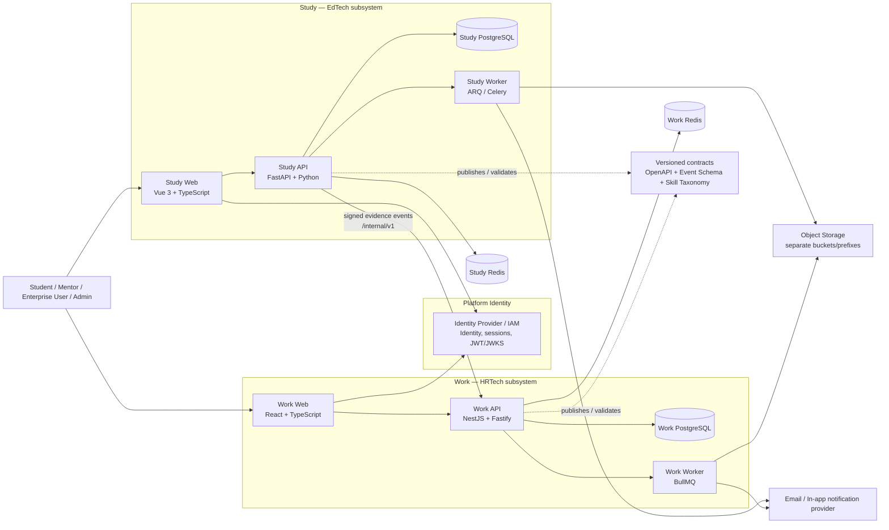
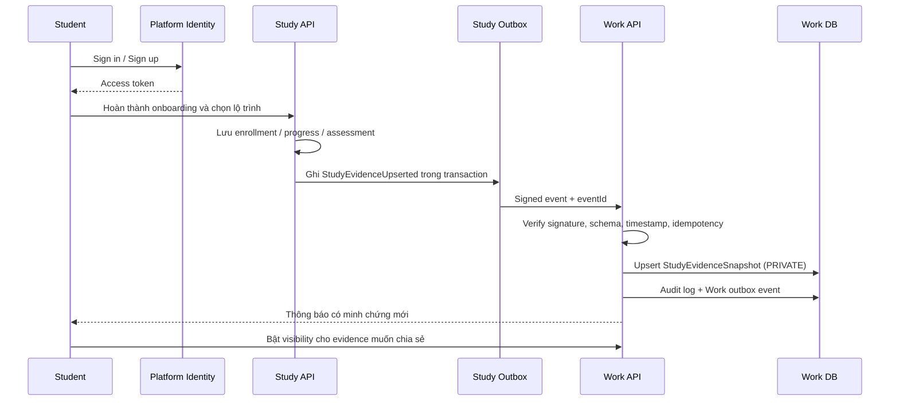

# Thiết kế kiến trúc tích hợp — Study2Work

> **Loại tài liệu:** DD kiến trúc cấp hệ sinh thái  
> **Phiên bản:** 1.0.0  
> **Trạng thái:** Draft — đã hợp nhất kiến trúc Study và Work  
> **Ngày cập nhật:** 05/07/2026  
> **Nguồn tích hợp:**  
> - `Study2Work_DD_Architecture_Frontend_Backend.md` — kiến trúc hệ thống con Study  
> - `Study2Work_Work_Learn2Earn_Architecture.md` — kiến trúc hệ thống con Work (Learn2Earn)  
> **Mục tiêu:** Xác định kiến trúc thống nhất cho toàn bộ Study2Work, đồng thời giữ Study và Work độc lập về frontend, backend, database, API public, vòng đời triển khai và ownership dữ liệu.

---

## 1. Mục tiêu và phạm vi

### 1.1. Định vị sản phẩm

Study2Work là hệ sinh thái **EdTech + HRTech** dành cho người Việt Nam học lập trình, đặc biệt là sinh viên IT, người mới bắt đầu và người bị mất gốc.

```text
Học có lộ trình trong Study
        ↓
Làm bài / hoàn thành dự án / được xác minh kỹ năng
        ↓
Tạo minh chứng năng lực có kiểm soát quyền riêng tư
        ↓
Xây hồ sơ nghề nghiệp, CV và portfolio trong Work
        ↓
Khám phá cơ hội phù hợp, ứng tuyển và theo dõi tuyển dụng
        ↓
Kết nối thực tế với doanh nghiệp
```

| Hệ thống con | Vai trò | Công nghệ bắt buộc |
|---|---|---|
| **Study** | LMS: lộ trình, khóa học, bài học, bài tập, đánh giá, tiến độ, cộng đồng và xác minh năng lực học tập. | Vue 3 + TypeScript; FastAPI + Python |
| **Work** | HRTech: hồ sơ nghề nghiệp, CV, portfolio, doanh nghiệp, job, ATS, phỏng vấn, matching và moderation. | React + TypeScript; Node.js + TypeScript |

### 1.2. Mục tiêu kiến trúc

1. Giữ Study và Work có thể phát triển, triển khai, rollback và mở rộng độc lập.
2. Không cho phép database chéo hoặc business logic chéo giữa hai hệ thống.
3. Tạo cầu nối đáng tin cậy từ kết quả học tập sang minh chứng nghề nghiệp.
4. Sử dụng một danh tính người dùng nhất quán trên toàn nền tảng.
5. Duy trì ranh giới dữ liệu, consent, audit và tenant isolation rõ ràng.
6. Tối ưu cho đội ngũ nhỏ bằng **modular monolith** trong từng hệ thống con; không tách microservice sớm.
7. Có contract versioned để frontend, backend, QA và các hệ thống con tích hợp an toàn.

### 1.3. Ngoài phạm vi giai đoạn MVP

- AI tự động quyết định tuyển hoặc loại ứng viên.
- Cơ chế điểm, thưởng, referral hoặc mô hình đa cấp.
- Đồng bộ dữ liệu trực tiếp bằng database join giữa Study và Work.
- Chat realtime đầy đủ như mạng xã hội.
- Microservices cho từng module.
- Search cluster hoặc data warehouse riêng khi chưa có tải thực tế.
- Chia sẻ tự động Study Evidence cho doanh nghiệp khi người học chưa đồng ý.

---

## 2. Quyết định kiến trúc thống nhất

| Quyết định | Nội dung |
|---|---|
| **Hai hệ thống con độc lập** | Study và Work có frontend, backend, database, repository module, API public và pipeline riêng. |
| **Một Platform Identity** | Danh tính, credential, session, email verification và token thuộc một năng lực dùng chung của nền tảng; không để Study và Work có hai tài khoản độc lập cho cùng một người. |
| **Local projection, không sao chép identity** | Study và Work lưu projection người dùng cần cho nghiệp vụ riêng; không tự sở hữu password hoặc refresh token của người dùng. |
| **Modular monolith trong từng subsystem** | Study là FastAPI modular monolith; Work là NestJS modular monolith. Các module được tách theo nghiệp vụ, không theo thư mục kỹ thuật lớn. |
| **API + Event contract** | Giao tiếp Study ↔ Work qua REST internal API đã version hóa, webhook/event có chữ ký, outbox và idempotency. |
| **Snapshot thay vì runtime join** | Work lưu `StudyEvidenceSnapshot`, không gọi hoặc join trực tiếp dữ liệu học tập khi recruiter mở hồ sơ ứng viên. |
| **Consent theo evidence** | Snapshot từ Study mặc định private; Work quyết định visibility theo lựa chọn của Student. |
| **Canonical API convention** | API mới ở cả Study và Work dùng response envelope, pagination, trace ID, error code và idempotency convention thống nhất. |
| **Shared contracts, không shared business code** | Có thể dùng chung OpenAPI, JSON Schema/AsyncAPI, design tokens và skill taxonomy; không cố dùng chung code Python/TypeScript giữa hai domain. |

> **Lưu ý về Platform Identity:** đây là năng lực nền tảng dùng chung, không phải một “hệ thống con sản phẩm” thứ ba. Nó có thể được triển khai bằng một identity provider chuyên dụng hoặc một deployable Platform IAM riêng. Nó không làm Study và Work mất tính độc lập dữ liệu.

---

## 3. Kiến trúc ngữ cảnh cấp hệ sinh thái



### 3.1. Quy tắc bắt buộc

```text
Study API      ✗ query Work database
Work API       ✗ query Study database
Study frontend ✗ gọi Work internal API bằng user token tùy ý
Work frontend  ✗ gọi Study internal API để lấy toàn bộ lịch sử học
Recruiter      ✗ xem Study Evidence private hoặc evidence đã bị thu hồi
```

```text
Study API → transactional outbox → signed event/webhook → Work Integration module
Work API  → local snapshot + audit + outbox → worker side effects
```

---

## 4. Bounded context và ownership dữ liệu

### 4.1. Owner dữ liệu

| Nhóm dữ liệu | Owner chính | Consumer hợp lệ | Quy tắc |
|---|---|---|---|
| Identity, credential, session, verified email | Platform Identity | Study, Work | Chỉ đọc danh tính/claim cần thiết qua token hoặc projection. |
| Learning path, course, chapter, lesson, enrollment, progress | Study | Work chỉ qua evidence đã chuẩn hóa | Work không được đọc toàn bộ lịch sử học. |
| Assessment, assignment, mentor review, project review | Study | Work chỉ qua evidence snapshot có consent | Dữ liệu bài làm gốc không xuất sang Work. |
| Skill taxonomy chuẩn | Platform governance / Admin | Study, Work | Dùng `skillCode` chuẩn; local label có thể khác theo UI. |
| Career profile, CV, portfolio hiển thị nghề nghiệp | Work | Study qua internal summary theo quyền rõ ràng | Study không sửa CV hoặc application trực tiếp. |
| Enterprise, membership, job, application, interview | Work | Study không truy cập trực tiếp | Tenant scope bắt buộc cho mọi query doanh nghiệp. |
| Notification, audit log | Mỗi subsystem tự sở hữu | Hệ thống phát sinh event | Không ghi chéo trực tiếp bảng notification/audit. |
| File nhị phân | Object storage tách namespace | Subsystem sở hữu file | Metadata và ACL thuộc subsystem tạo file. |

### 4.2. Mapping user cốt lõi

```text
platformUserId (UUID, immutable)
   ├── StudyUserProjection / StudentLearningProfile
   └── WorkUserProjection / StudentCareerProfile
```

- `platformUserId` là khóa liên hệ duy nhất giữa Study và Work.
- Không dùng email làm khóa tích hợp.
- Không dùng ID nội bộ của Study hoặc Work làm external contract ID.
- Email, phone, address và dữ liệu PII không nằm trong Study Evidence event nếu không cần thiết.

### 4.3. Quy tắc skill taxonomy

Mọi evidence và job requirement dùng `skillCode` chuẩn hóa:

```text
typescript
nodejs
fastapi
postgresql
docker
git
rest-api
```

Quy ước:

- `skillCode` là stable identifier; không đổi khi đổi label hiển thị.
- Study có thể gắn skill vào course, assessment hoặc project.
- Work dùng cùng `skillCode` để lọc, matching và hiển thị verified badge.
- Nếu cần thêm skill mới, quản trị taxonomy trước; không để mỗi module tự tạo code tùy ý.

---

## 5. Identity, authentication và authorization

### 5.1. Platform Identity

Platform Identity sở hữu:

```text
Đăng ký / đăng nhập
Password hash
Email verification
Password reset
Session
Refresh token
Access token
Token rotation / revocation
JWKS / signing key
```

Study và Work **không lưu password**. Hai subsystem chỉ nhận access token đã được ký và kiểm tra:

```text
iss  = issuer hợp lệ
aud  = study-api hoặc work-api
sub  = platformUserId
exp  = chưa hết hạn
jti  = token identifier khi cần revocation
```

### 5.2. Luồng xác thực khuyến nghị

```text
Study Web / Work Web
  ↓
Platform Identity login
  ↓
Authorization Code + PKCE
  ↓
Access token ngắn hạn
  ↓
Study API hoặc Work API verify JWT qua JWKS
  ↓
API map sub → local user projection
  ↓
API kiểm tra permission + ownership + tenant scope
```

Quy tắc bảo mật:

- Access token ngắn hạn.
- Refresh token chỉ ở `HttpOnly`, `Secure`, `SameSite` cookie hoặc cơ chế session an toàn của IdP.
- Không lưu refresh token trong `localStorage`.
- Khi dùng cookie, áp dụng CSRF protection phù hợp.
- JWKS cache có TTL và cơ chế refresh khi key rotation.
- Không cho frontend tự quyết định quyền; backend luôn kiểm tra lại.

### 5.3. Phân quyền hợp nhất

#### Global/platform roles

| Role | Phạm vi |
|---|---|
| `STUDENT` | Học, quản lý hồ sơ học tập/career, ứng tuyển. |
| `MENTOR` | Review/đánh giá trong phạm vi Study được phân công. |
| `CONTENT_MANAGER` | Quản trị nội dung học tập của Study. |
| `PLATFORM_ADMIN` | Quản trị cross-platform theo thẩm quyền. |

#### Local Work tenant roles

| Role | Phạm vi |
|---|---|
| `OWNER` | Quản trị doanh nghiệp, membership, job và pipeline thuộc enterprise. |
| `RECRUITER` | Tạo/quản lý job và xử lý ứng viên trong enterprise được cấp quyền. |
| `INTERVIEWER` | Chỉ xem ứng viên/lịch phỏng vấn được phân công; nhập feedback. |
| `VIEWER` | Quyền xem giới hạn theo policy doanh nghiệp. |

#### Quy tắc thực thi

```text
Identity verification
  ↓
Global/platform permission
  ↓
Resource ownership check
  ↓
Tenant scope check (Work)
  ↓
Business-state validation
  ↓
Allow / deny
```

Ví dụ: `RECRUITER` Company A không được đọc application của Company B, kể cả khi biết `applicationId`.

### 5.4. Điều chỉnh so với hai tài liệu nguồn

| Khu vực | Quyết định sau tích hợp |
|---|---|
| Study `auth/users/roles_permissions` | Chuyển ownership credential/session sang Platform Identity; Study giữ local permissions và user projection phục vụ học tập. |
| Work `work_users` | Là user projection theo `platformUserId`, không lưu credential. |
| JWT | Cả hai API xác minh token từ cùng issuer/JWKS; audience khác nhau theo API. |
| Mentor / Admin | Có thể có claim platform, nhưng quyền cụ thể vẫn được resolve ở Study/Work theo policy local. |

---

## 6. Hành trình người dùng xuyên hệ thống

### 6.1. Student học và chuyển hóa thành career evidence



### 6.2. Quy tắc nghiệp vụ xuyên hệ thống

1. Study tiếp tục áp dụng rule: một học viên chỉ có **một lộ trình đang hoạt động** nếu đây là policy của Study.
2. Rule một lộ trình hoạt động không phải điều kiện cứng để Work cho phép tạo career profile hoặc xem job.
3. Không có Study Evidence không đồng nghĩa với việc bị chặn ứng tuyển.
4. Study Evidence chỉ là **minh chứng hỗ trợ**, không phải bằng cấp pháp lý và không thay thế quyết định tuyển dụng.
5. Work được dùng evidence đã consent để:
   - hiển thị badge;
   - lọc theo skill verified;
   - hỗ trợ matching rule-based;
   - giúp recruiter hiểu quá trình phát triển kỹ năng.
6. Work không được:
   - tự động reject ứng viên vì thiếu evidence;
   - hiển thị điểm nội bộ gây hiểu nhầm là kết quả tuyển dụng;
   - cung cấp quiz answer, lịch sử học đầy đủ hoặc review riêng tư cho doanh nghiệp.

---

## 7. Kiến trúc frontend hợp nhất

### 7.1. Nguyên tắc chung

- Mỗi frontend là SPA độc lập, build và deploy độc lập.
- Đều dùng TypeScript strict mode, Zod validation, TanStack Query, OpenAPI generated client, Vitest và Playwright.
- Server state không được đặt vào global UI store.
- Filter/search/page/sort ảnh hưởng danh sách phải nằm trong URL.
- Mọi màn hình gọi API phải có loading, empty, error, retry và permission state.
- Route guard chỉ phục vụ UX; API backend là lớp phân quyền bắt buộc.

### 7.2. Study Web

```text
Vue 3 + TypeScript + Vite
Vue Router
Pinia (global UI/auth projection)
TanStack Query Vue (server state)
Axios / generated client
Zod + VeeValidate
Vuetify hoặc Tailwind theo quy ước module
Vitest + Playwright
```

Dependency direction:

```text
app
 ↓
pages
 ↓
features
 ↓
entities
 ↓
shared
```

Tính năng chính:

```text
auth
onboarding
learning-path
course-catalog
lesson-learning
learning-progress
assessment
community
notification
profile-management
admin
```

### 7.3. Work Web

```text
React + TypeScript + Vite
React Router
Zustand (global UI/auth projection)
TanStack Query (server state)
Axios / fetch wrapper / generated client
React Hook Form + Zod
Tailwind + accessible primitives
TanStack Table
Vitest + React Testing Library + Playwright
```

Dependency direction:

```text
app
 ↓
pages
 ↓
widgets
 ↓
features
 ↓
entities
 ↓
shared
```

Tính năng chính:

```text
auth
job-search
career-profile-edit
cv-create / cv-upload
portfolio
study-evidence-visibility
application-create / withdraw
job-create / update
application-status-update
interview-schedule
enterprise-member-manage
moderation
notification
```

### 7.4. Design system xuyên nền tảng

Không dùng chung component code Vue và React. Chỉ dùng chung:

```text
Design tokens: color, typography, spacing, radius, shadow
Icon policy
Accessibility baseline
Status badge semantics
Content style guide
```

Ví dụ các status nên có semantic chung:

```text
SUCCESS
WARNING
DANGER
INFO
NEUTRAL
```

Nhưng implementation UI nằm trong từng frontend.

---

## 8. Kiến trúc backend hợp nhất

### 8.1. Study backend

```text
FastAPI + Python 3.12+
SQLAlchemy 2.x Async + Alembic
PostgreSQL
Redis
ARQ mặc định; Celery khi queue phức tạp
MinIO/S3-compatible storage
Pydantic v2 + OpenAPI
pytest + pytest-asyncio + httpx
```

Module cốt lõi:

```text
study-access
learning-paths
courses
lessons
enrollments
learning-progress
assessments
community
notifications
files
admin
audit-logs
study-evidence
integration-work
```

> `study-evidence` và `integration-work` là hai module phải bổ sung để thực hiện hợp đồng Study → Work một cách rõ ràng.

Luồng request:

```text
Vue page
→ feature composable
→ Study API route
→ request validation
→ identity + permission
→ use case
→ domain rule
→ repository port
→ SQLAlchemy/PostgreSQL
→ standard response
```

### 8.2. Work backend

```text
NestJS + Fastify + TypeScript strict
Prisma + PostgreSQL
Redis + BullMQ
S3-compatible storage / MinIO
OpenAPI / Swagger
Jest or Vitest + Supertest + Testcontainers
```

Module cốt lõi:

```text
iam-adapter
enterprise
student-profile
skill-taxonomy-adapter
study-evidence
cv
portfolio
job
application
interview
matching
notification
file-asset
moderation
analytics
integration-study
audit
```

Luồng request:

```text
React frontend
→ controller
→ authentication guard
→ permission + tenant scope guard
→ DTO validation
→ application use case
→ domain rule
→ repository port
→ Prisma / PostgreSQL / Redis / storage
→ standard response
```

### 8.3. Quy tắc dependency backend

```text
Presentation → Application → Domain
Infrastructure → Domain
```

Không hợp lệ:

```text
Domain → FastAPI / NestJS / ORM / Redis / HTTP
Controller / Router → SQL query trực tiếp
Repository → tự commit transaction
Module A → ghi trực tiếp bảng private của Module B
```

Nên dùng:

```text
Use case
→ domain/application event
→ handler của module đích
→ outbox nếu side effect hoặc cross-system delivery
```

### 8.4. Transaction và outbox

Bất kỳ use case ghi dữ liệu quan trọng phải chạy trong transaction.

Ví dụ Study tạo/đổi evidence:

```text
1. Hoàn thành assessment hoặc course.
2. Validate rule phát hành evidence.
3. Persist evidence source record.
4. Persist outbox event StudyEvidenceUpserted.
5. Persist audit log.
6. Commit.
7. Worker phát webhook/event sau commit.
```

Ví dụ Work nhận evidence:

```text
1. Verify request/auth/signature/schema.
2. Check event idempotency.
3. Upsert StudyEvidenceSnapshot.
4. Persist sync log + audit log + outbox event.
5. Commit.
6. Worker gửi notification sau commit.
```

Không gọi Study API, gửi email hoặc gửi webhook bên trong transaction nghiệp vụ.

---

## 9. API convention thống nhất

> Quy ước này thay thế sự khác nhau giữa response envelope trong hai tài liệu nguồn đối với API mới. Vì hệ thống đang ở trạng thái thiết kế, nên chuẩn hóa ngay từ `/api/v1` để tránh chi phí migration sau này.

### 9.1. Base URL

```text
Study public API:  /api/v1
Work public API:   /api/v1
Internal API:      /internal/v1
```

Ví dụ host:

```text
study-api.study2work.vn/api/v1/...
work-api.study2work.vn/api/v1/...
work-api.study2work.vn/internal/v1/study/evidence-events
```

### 9.2. Response envelope

#### Thành công

```json
{
  "success": true,
  "businessCode": "JOB_LIST_RETRIEVED",
  "message": "Thành công",
  "data": {
    "items": []
  },
  "meta": {
    "pagination": {
      "page": 1,
      "pageSize": 20,
      "total": 0,
      "totalPages": 0
    }
  },
  "traceId": "uuid"
}
```

#### Lỗi

```json
{
  "success": false,
  "businessCode": "APPLICATION_ALREADY_EXISTS",
  "message": "Bạn đã ứng tuyển vào công việc này.",
  "errors": [
    {
      "field": "jobId",
      "code": "DUPLICATE_APPLICATION"
    }
  ],
  "traceId": "uuid"
}
```

Quy tắc:

- `businessCode`: machine-readable, ổn định và rõ nghĩa.
- `message`: thông điệp có thể hiển thị an toàn cho người dùng.
- Không trả stack trace ở production.
- `traceId` là camelCase ở mọi API mới.
- `meta.pagination` chỉ xuất hiện cho response list.
- Không expose ORM model hoặc database schema trực tiếp.

### 9.3. Query convention

```text
GET /api/v1/jobs?
  page=1&
  pageSize=20&
  keyword=typescript&
  skill=typescript&
  skill=nodejs&
  location=ha-noi&
  workMode=HYBRID&
  employmentType=INTERNSHIP&
  sort=RELEVANCE
```

- `page` bắt đầu từ 1.
- `pageSize` có maximum theo endpoint.
- Dùng repeated key cho list filter, không trộn CSV và repeated key.
- Query param được validate/normalize tại boundary.
- Pipeline lớn có thể dùng cursor pagination theo API DD riêng.

### 9.4. Idempotency

Bắt buộc hỗ trợ header `Idempotency-Key` cho:

```text
Submit application
Create/update evidence event consumer
Create job
Invite enterprise member
Schedule interview
Finalize upload
```

Server lưu `idempotency key + actor + endpoint + request hash + response snapshot` theo TTL/policy phù hợp.

### 9.5. OpenAPI và contract registry

```text
FastAPI / Pydantic → Study OpenAPI
NestJS / Swagger   → Work OpenAPI
Event JSON Schema / AsyncAPI → Study–Work integration contract
```

Quy tắc:

- Không sửa thủ công generated client.
- Contract thay đổi phải qua review và semantic versioning.
- Breaking REST change dùng `/api/v2` hoặc migration plan rõ ràng.
- Breaking event change tạo event version mới, ví dụ `study.evidence.upserted.v2`.
- Frontend chỉ gọi feature API wrapper/composable/hook, không gọi generated client trực tiếp trong component/page.

---

## 10. Contract tích hợp Study → Work

### 10.1. Mục đích

Study chỉ phát hành dữ liệu tối thiểu cần thiết để Work xây `StudyEvidenceSnapshot`:

```text
Course/path completion
Assessment/lab completion
Project completion
Mentor verification/review
Verified skill evidence
Evidence revocation
```

Work không nhận:

```text
Nội dung bài học đầy đủ
Câu trả lời quiz
Lịch sử click/video chi tiết
Private mentor note
Thông tin sức khỏe, địa chỉ, PII không liên quan
```

### 10.2. Transport

Giai đoạn đầu:

```text
Study transactional outbox
→ signed HTTPS webhook
→ Work internal integration endpoint
→ Work idempotent consumer
```

Endpoint:

```text
POST /internal/v1/study/evidence-events
```

Header tối thiểu:

```text
X-S2W-Event-Id: <uuid>
X-S2W-Event-Type: study.evidence.upserted.v1
X-S2W-Event-Version: 1
X-S2W-Timestamp: 2026-07-05T10:00:00Z
X-S2W-Signature: sha256=<HMAC>
X-Correlation-Id: <uuid>
```

Bảo vệ transport:

1. TLS bắt buộc.
2. HMAC secret hoặc mTLS/service JWT theo environment.
3. Kiểm tra timestamp chống replay.
4. Signature được tính trên raw body canonical.
5. Work verify trước khi parse/use payload nghiệp vụ.
6. Retry exponential backoff từ Study worker.
7. Dead-letter / failed event review queue khi quá số retry.
8. Scheduled catch-up để đối soát event bị thất lạc.

### 10.3. Event envelope chuẩn

```json
{
  "eventId": "f7c9d11a-6b97-4d4b-ae45-1e2e7d5a8d11",
  "eventType": "study.evidence.upserted.v1",
  "eventVersion": 1,
  "occurredAt": "2026-07-05T10:00:00Z",
  "producer": "study-api",
  "correlationId": "9d203bce-2b73-49d0-8eb8-6d62e2e37d44",
  "subject": {
    "platformUserId": "a7bf4a34-0b05-4d4f-afd2-8bffb2de1f11"
  },
  "data": {
    "sourceEvidenceId": "3eb1a3f0-45d9-49f1-8c55-0d3e7cf1d2a6",
    "sourceVersion": 3,
    "type": "COURSE_COMPLETION",
    "title": "Hoàn thành lộ trình Backend Node.js",
    "skillCodes": ["nodejs", "typescript", "rest-api"],
    "level": "FOUNDATION",
    "verified": true,
    "issuedAt": "2026-07-04T08:00:00Z",
    "verificationRef": "study:evidence:3eb1a3f0-45d9-49f1-8c55-0d3e7cf1d2a6",
    "metadata": {
      "learningPathCode": "backend-nodejs",
      "assessmentScore": 82
    }
  }
}
```

### 10.4. Event types

| Event type | Producer | Work xử lý |
|---|---|---|
| `study.evidence.upserted.v1` | Study | Upsert snapshot, mặc định `PRIVATE`. |
| `study.evidence.revoked.v1` | Study | Mark `REVOKED`, ẩn khỏi search/profile; giữ audit. |
| `study.user.sync-requested.v1` | Study/Identity khi cần | Cập nhật projection tối thiểu của Work, không đồng bộ credential. |
| `platform.user.deletion-requested.v1` | Platform Identity | Work và Study bắt đầu workflow retention/anonymization theo policy. |

### 10.5. Idempotency, ordering và conflict rule

Work Integration module bắt buộc:

```text
Unique key: producer + eventId
Business key: platformUserId + sourceEvidenceId
Version rule: chỉ apply payload có sourceVersion lớn hơn hoặc bằng bản hiện tại
```

- Event duplicate: trả/ghi trạng thái accepted nhưng không tạo side effect lặp.
- Event cũ hơn `sourceVersion`: ghi sync log `IGNORED_STALE`.
- Event schema sai: reject `422` và ghi rõ reason không chứa dữ liệu nhạy cảm.
- Signature sai: reject `401/403`, không parse data nghiệp vụ.
- Nếu Work không hoạt động: Study retry qua worker; không retry bằng HTTP request của user.

### 10.6. Visibility và revocation

`StudyEvidenceSnapshot` trong Work có:

```text
PRIVATE
APPLIED_ONLY
SEARCHABLE
PUBLIC
REVOKED
```

Quy tắc:

- Evidence mới luôn `PRIVATE`.
- Student là người thay đổi visibility qua Work.
- `SEARCHABLE` chỉ hiển thị với recruiter của enterprise đã được xác minh và theo policy.
- `APPLIED_ONLY` chỉ hiển thị cho enterprise khi Student đã nộp application liên quan.
- `REVOKED` không được đưa vào candidate search, profile public hoặc matching.
- Work không cho Student tự sửa title, verified flag, issuedAt hoặc skillCode của evidence nguồn; chỉ được đổi visibility và thứ tự trình bày.

### 10.7. Catch-up API

Để đối soát khi webhook bị mất, Study có thể cung cấp endpoint nội bộ:

```text
GET /internal/v1/work/evidence?updatedSince=<ISO8601>&cursor=<opaque>
```

Work gọi bằng service credential chỉ khi:

- chạy scheduled reconciliation;
- phát hiện missing sequence/sync lag;
- admin thực hiện recovery có audit.

Không dùng endpoint này để frontend/recruiter đọc trực tiếp.

---

## 11. Mô hình dữ liệu tích hợp

### 11.1. Study — bổ sung logical model

```text
StudyUserProjection
LearningPath
Enrollment
Course
Lesson
AssessmentAttempt
ProjectSubmission
MentorReview
StudyEvidence
StudyEvidenceSkill
OutboxEvent
IntegrationDeliveryLog
AuditLog
```

`StudyEvidence` là entity phát hành nghiệp vụ; event chỉ là bản tin transport.

### 11.2. Work — logical model

```text
WorkUserProjection
StudentCareerProfile
CareerPreference
Skill
StudentSkill
StudyEvidenceSnapshot
StudyEvidenceSyncLog
CV
CVVersion
PortfolioProject
Enterprise
EnterpriseMember
Job
JobSkillRequirement
Application
ApplicationStatusHistory
ApplicationCvSnapshot
ApplicationJobSnapshot
Interview
Notification
OutboxEvent
IdempotencyRecord
AuditLog
```

### 11.3. Invariants quan trọng

1. Một user có một `platformUserId` xuyên Study và Work.
2. Work không nhận evidence nếu event signature/schema không hợp lệ.
3. Evidence snapshot chỉ thay đổi qua Integration module hoặc explicit re-sync use case.
4. CV/job snapshot tại thời điểm apply là immutable.
5. Recruiter chỉ truy cập application thuộc enterprise membership hợp lệ.
6. Job `CLOSED` hoặc `EXPIRED` không nhận application mới.
7. Mọi status transition có history record và audit log.
8. File private chỉ trả signed URL ngắn hạn sau authorization.
9. Xóa logical dùng soft delete khi cần audit; hard delete theo retention policy được phê duyệt.
10. Snapshot `REVOKED` không tham gia matching hoặc candidate search.

---

## 12. Privacy, security và audit

### 12.1. Privacy by design

| Dữ liệu | Mặc định | Ai có thể xem |
|---|---|---|
| Study progress chi tiết | Private ở Study | Student, mentor/admin có quyền Study. |
| Study Evidence snapshot | Private ở Work | Student; các đối tượng khác theo visibility. |
| CV | Private hoặc Applied-only | Student; enterprise đúng ngữ cảnh application/search policy. |
| Application history | Private | Student; enterprise sở hữu job; admin theo thẩm quyền. |
| Interview feedback nội bộ | Private | Enterprise được phân quyền; không hiển thị cho Student trừ policy riêng. |
| Public career profile | Off mặc định | Chỉ public khi Student chủ động bật. |

### 12.2. File security

```text
Client
→ yêu cầu upload session / presigned URL
→ upload object storage
→ file scan worker
→ store metadata + scan status
→ signed URL ngắn hạn khi authorization pass
```

Bắt buộc:

- Whitelist MIME type, kích thước và extension.
- Không dùng filename do client gửi làm object key.
- Lưu checksum, uploader, contentType, size, scanStatus, visibility.
- Tách bucket/prefix ví dụ `study-private/`, `study-public/`, `work-private/`, `work-public/`.
- Work không cấp public URL cố định cho CV/application attachment.

### 12.3. Audit

Audit tối thiểu cho:

```text
Auth/session security events
Visibility change của Study Evidence
CV publish/update
Application submit/withdraw/status transition
Job create/review/publish/close
Enterprise verification/membership change
Internal integration receive/reject/retry
Admin moderation action
```

Mỗi audit record nên có:

```text
timestamp
traceId / correlationId
actorId
actorType
module
action
resourceType
resourceId
beforeSummary / afterSummary (đã minimize)
ip / userAgent khi phù hợp
```

Không log password, access token, refresh token, signed URL, raw CV hay full PII.

---

## 13. Observability, reliability và vận hành

### 13.1. Correlation

Mọi request/event có:

```text
traceId
correlationId
eventId (nếu là event)
actorId (nếu đã xác thực)
module
action
durationMs
```

- `traceId` dùng cho một API request.
- `correlationId` đi xuyên Study → Work cho một business flow.
- `eventId` định danh duy nhất cho một message delivery.

### 13.2. Health check chuẩn

| Endpoint | Mục đích |
|---|---|
| `/health/live` | Process còn chạy. |
| `/health/ready` | Có thể phục vụ traffic; kiểm tra dependency cần thiết. |
| `/metrics` | Metrics có kiểm soát truy cập khi môi trường hỗ trợ. |

### 13.3. Metrics ưu tiên

```text
API request count / latency / error rate
Authentication failure / token validation failure
Evidence sync success / lag / retry / failed
Application submit success / duplicate / rejection
Job publish / expiration
Tenant isolation authorization denial
Worker queue depth / retry / dead-letter
Storage scan failure
Database pool saturation
Cache hit ratio
```

### 13.4. Backup và recovery

- Backup PostgreSQL tách riêng cho Study và Work.
- Backup object storage theo bucket/prefix.
- Mọi migration có rollback/recovery plan.
- Recovery evidence sync dùng reconciliation endpoint + idempotent reprocessing.
- Không dùng restore database của subsystem này để ghi đè trực tiếp subsystem khác.

---

## 14. Testing strategy tích hợp

### 14.1. Test trong từng subsystem

| Loại | Study | Work |
|---|---|---|
| Unit | Domain rule, mapper, permission, evidence issuance. | Transition validator, matching rule, tenant policy, mapper. |
| Integration | SQLAlchemy/Redis/storage adapter/outbox. | Prisma/Redis/storage/outbox/idempotency. |
| API E2E | Login projection, enroll, progress, assessment, evidence publish. | Career profile, CV, apply, recruiter pipeline, moderation. |
| Frontend E2E | Onboarding → learning → progress. | Login → apply; recruiter → status update; admin → approve. |

### 14.2. Cross-system contract tests

Bắt buộc có test tự động cho:

1. Schema `study.evidence.upserted.v1` hợp lệ được Work accept.
2. Signature sai bị Work reject.
3. Event duplicate không tạo duplicate snapshot/notification.
4. Event stale version không ghi đè evidence mới hơn.
5. Evidence mới luôn private.
6. Evidence `REVOKED` biến mất khỏi candidate search.
7. `platformUserId` map đúng giữa Study và Work.
8. Work không đọc Study data ngoài event/snapshot contract.
9. Không có personal data không được phép trong payload.
10. Contract breaking change không được merge nếu chưa tăng version/migration plan.

### 14.3. Security tests

```text
IDOR: student A không đọc application/CV của student B
Tenant isolation: recruiter A không đọc Company B
Permission bypass: frontend hide button không được coi là bảo mật
Replay attack: reject webhook timestamp/signature không hợp lệ
File upload: invalid MIME, oversized, unsafe file
Rate-limit: auth/public search/upload endpoints
```

---

## 15. Repository, infrastructure và CI/CD

### 15.1. Cấu trúc repository đề xuất

Khuyến nghị **polyglot monorepo**, nhưng mỗi app phải build/deploy độc lập:

```text
study2work/
├─ apps/
│  ├─ study-web/                 # Vue 3 + TypeScript
│  ├─ study-api/                 # FastAPI + Python
│  ├─ work-web/                  # React + TypeScript
│  ├─ work-api/                  # NestJS + TypeScript
│  └─ platform-identity/         # IdP config / IAM deployable nếu tự vận hành
│
├─ contracts/
│  ├─ openapi/
│  │  ├─ study/
│  │  └─ work/
│  ├─ events/
│  │  └─ study-work/
│  ├─ skill-taxonomy/
│  └─ api-guidelines/
│
├─ infra/
│  ├─ docker/
│  ├─ nginx/
│  ├─ compose/
│  ├─ k8s/                       # chỉ khi cần
│  └─ monitoring/
│
├─ docs/
│  ├─ architecture/
│  ├─ bd/
│  ├─ dd/
│  ├─ adr/
│  ├─ api/
│  ├─ security/
│  └─ test/
│
└─ .github/ or .gitlab/
```

Nguyên tắc:

- Không dùng shared runtime business package giữa Python và TypeScript.
- Contract có thể được generate cho từng ngôn ngữ từ OpenAPI/JSON Schema.
- Commit thay đổi event/API phải cập nhật contract + test + documentation trong cùng PR.
- Nếu team/CI chưa sẵn sàng cho monorepo, có thể tách repository nhưng `contracts/` phải là repo/package versioned độc lập.

### 15.2. Local environment

```text
study-web
study-api
study-worker
study-postgres
study-redis
work-web
work-api
work-worker
work-postgres
work-redis
minio
mailhog (local only)
identity provider / mock JWKS
```

### 15.3. CI/CD tối thiểu

```text
Install
↓
Lint
↓
Type check
↓
Unit test
↓
Contract validation
↓
Build
↓
Integration/API E2E
↓
Security scan
↓
Docker image build
↓
Deploy staging
↓
Smoke test
↓
Manual approval
↓
Deploy production
```

### 15.4. Environment variables chung cần quản lý

```env
APP_ENV=
LOG_LEVEL=
CORS_ALLOWED_ORIGINS=

IDENTITY_ISSUER=
IDENTITY_JWKS_URL=
IDENTITY_AUDIENCE=

STUDY_DATABASE_URL=
STUDY_REDIS_URL=
WORK_DATABASE_URL=
WORK_REDIS_URL=

S3_ENDPOINT=
S3_BUCKET_STUDY=
S3_BUCKET_WORK=
S3_ACCESS_KEY=
S3_SECRET_KEY=

STUDY_TO_WORK_WEBHOOK_SECRET=
INTERNAL_SERVICE_TOKEN=
MAIL_PROVIDER=
MAIL_FROM=
```

Không ghi secret thật vào source code, tài liệu, screenshot hoặc issue tracker.

---

## 16. Lộ trình triển khai đề xuất

### Phase 0 — Nền tảng chung

- Platform Identity, `platformUserId`, JWT/JWKS, audience/issuer policy.
- Canonical API response/error/pagination/trace ID.
- Skill taxonomy v1.
- Contract repository: OpenAPI + event schema.
- Docker local, logging, health check, audit/outbox foundation.
- Design tokens và accessibility baseline.

### Phase 1 — Study core

- Onboarding.
- Chọn một lộ trình đang hoạt động.
- Course/chapter/lesson, enrollment, progress.
- Assessment/bài tập cơ bản.
- Admin content management.
- Study Evidence entity và outbox nhưng chưa bắt buộc Work UI.

### Phase 2 — Work core

- Enterprise verification.
- Public job catalogue.
- Student career profile.
- CV creation/upload/publish.
- Application, timeline, recruiter pipeline.
- Admin review queue.
- Tenant isolation, audit, signed file access.

### Phase 3 — Study ↔ Work bridge

- Signed evidence webhook + idempotent Work consumer.
- Evidence visibility.
- Verified skill/evidence filter.
- Rule-based matching.
- Career readiness dashboard.
- Reconciliation/catch-up and integration monitoring.

### Phase 4 — Mở rộng có kiểm soát

- Interview scheduling, email reminder/retry.
- Portfolio verification.
- Reporting/search optimization.
- Calendar integration, realtime chat, advanced matching.
- Chỉ tách notification/search/worker service khi tải, ownership hoặc release cadence yêu cầu.

---

## 17. Danh sách DD cần tách tiếp theo

### 17.1. Platform / cross-system

1. `DD_Platform_Identity_Authentication_Authorization.md`
2. `DD_Platform_API_Convention_and_Error_Catalog.md`
3. `DD_Platform_Skill_Taxonomy.md`
4. `DD_Study_Work_Evidence_Integration.md`
5. `DD_Platform_Event_Contract_and_Outbox.md`
6. `DD_Platform_Audit_Privacy_Retention.md`
7. `DD_Platform_Deployment_Observability_Runbook.md`

### 17.2. Study

1. `DD_Study_Onboarding_and_Learning_Path.md`
2. `DD_Study_Course_Lesson_Enrollment.md`
3. `DD_Study_Assessment_Practice_and_Review.md`
4. `DD_Study_Community_and_Zalo_Integration.md`
5. `DD_Study_Evidence_Issuance.md`
6. `DD_Study_Admin_Content_Management.md`
7. `DD_Study_API_Catalog.xlsx`
8. `DD_Study_ERD.md`

### 17.3. Work

1. `DD_Work_Student_Career_Profile.md`
2. `DD_Work_CV_Portfolio.md`
3. `DD_Work_Enterprise_Verification_Membership.md`
4. `DD_Work_Job_Management.md`
5. `DD_Work_Application_ATS.md`
6. `DD_Work_Interview_Scheduling.md`
7. `DD_Work_Matching_Recommendation.md`
8. `DD_Work_Moderation_Audit.md`
9. `DD_Work_File_Asset_Security.md`
10. `DD_Work_API_Catalog.xlsx`
11. `DD_Work_ERD.md`

---

## 18. Definition of Done cấp kiến trúc tích hợp

Tài liệu này được coi là đủ để triển khai DD module khi:

- [x] Xác định Study và Work độc lập về codebase, database và deployment.
- [x] Xác định Platform Identity và `platformUserId` dùng chung.
- [x] Chuẩn hóa ownership dữ liệu.
- [x] Chuẩn hóa API response, pagination, error code, trace ID và idempotency cho API mới.
- [x] Có contract Study Evidence versioned, signed, idempotent và có quy tắc retry/reconciliation.
- [x] Có consent/visibility/revocation cho Study Evidence.
- [x] Có RBAC + permission + tenant isolation.
- [x] Có quy tắc event/outbox/transaction.
- [x] Có testing strategy cho nội bộ và cross-system contract.
- [x] Có security/privacy/audit/file access rules.
- [x] Có repository, local infrastructure, CI/CD và roadmap rõ ràng.
- [x] Có danh sách DD tiếp theo để coding theo module.

---

## 19. Kết luận

Kiến trúc tích hợp của Study2Work giữ đúng tinh thần của hai tài liệu nguồn:

```text
Study phát triển năng lực thật
↓
Evidence có nguồn gốc, có version và có consent
↓
Work chuyển năng lực thành hồ sơ nghề nghiệp và cơ hội thực tế
↓
Doanh nghiệp đánh giá minh bạch trong phạm vi tenant của mình
```

Điểm then chốt là **Study không biến thành ATS** và **Work không biến thành LMS**. Hai hệ thống cộng tác qua `platformUserId`, skill taxonomy, API/event contract và snapshot evidence; không chia sẻ database, không tự động lộ dữ liệu học tập và không thay thế quyết định tuyển dụng của doanh nghiệp.
