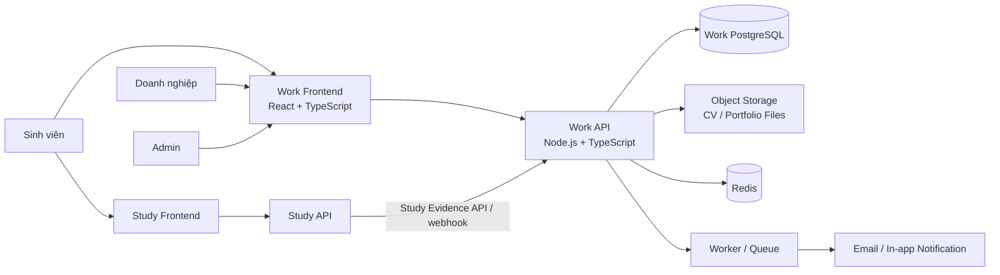
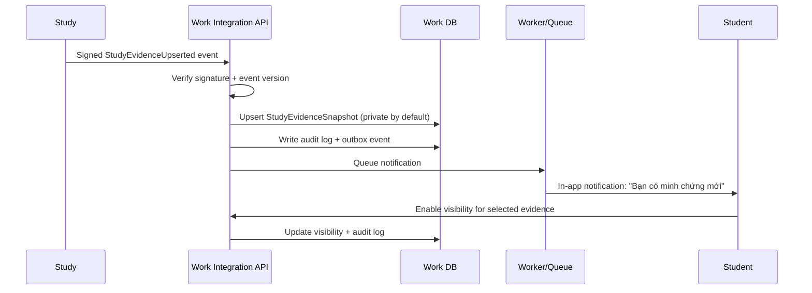

# Thiết kế tài liệu DD — Study2Work Work (Learn2Earn)

> **Trạng thái:** Draft  
> **Phiên bản:** 0.1.0  
> **Ngày tạo:** 05/07/2026  
> **Phạm vi:** Mô tả tổng quan, nghiệp vụ, kiến trúc frontend/backend, ranh giới dữ liệu, tích hợp với Study, dữ liệu lõi, API định hướng, bảo mật và lộ trình triển khai cho hệ thống con **Work** của Study2Work.  
> **Công nghệ bắt buộc:** Backend Node.js + TypeScript; Frontend React + TypeScript.  
> **Quy ước:** Tài liệu này là DD kiến trúc cấp hệ thống. ERD vật lý, API contract đầy đủ, UI DD, migration, test case và deployment runbook sẽ được tách thành tài liệu riêng theo từng module.

---

## 1. Bối cảnh và mục tiêu

### 1.1. Vị trí của Work trong Study2Work

**Study2Work** là hệ sinh thái hỗ trợ người học Việt Nam phát triển từ nền tảng kiến thức đến cơ hội nghề nghiệp thực tế.

Hệ thống gồm hai hệ thống con độc lập:

| Hệ thống con | Mục tiêu chính | Frontend / Backend / API |
|---|---|---|
| **Study** | Cung cấp khóa học, lộ trình học, luyện tập, đánh giá và phát triển năng lực IT. | Độc lập |
| **Work** | Kết nối sinh viên với doanh nghiệp, cơ hội thực tập/việc làm và quy trình tuyển dụng. | Độc lập |

**Work** kế thừa định hướng nghiệp vụ của **Learn2Earn**: sinh viên xây hồ sơ nghề nghiệp, tạo CV, tìm kiếm việc làm, ứng tuyển, theo dõi trạng thái; doanh nghiệp tạo hồ sơ, đăng tin tuyển dụng, tìm kiếm ứng viên và quản lý pipeline tuyển dụng.

Điểm khác biệt cốt lõi của Work so với một job board thông thường:

> Sinh viên đã học, làm bài, hoàn thành dự án hoặc được xác minh năng lực từ Study có thể đưa các minh chứng đó vào hồ sơ Work, từ đó được ưu tiên hiển thị và gợi ý phù hợp hơn với công việc liên quan.

Ưu tiên ở đây là **ưu tiên dựa trên minh chứng năng lực có sự đồng ý của sinh viên**, không phải cam kết được tuyển dụng, không được thay thế quyết định của doanh nghiệp và không được dùng làm cơ chế tự động loại ứng viên.

---

### 1.2. Mục tiêu sản phẩm

1. Tạo cầu nối rõ ràng giữa quá trình học trong Study và cơ hội nghề nghiệp trong Work.
2. Giúp sinh viên, đặc biệt là người mới hoặc mất gốc, chuyển kiến thức học được thành hồ sơ có thể chứng minh.
3. Giúp doanh nghiệp tiếp cận ứng viên trẻ theo kỹ năng, bằng chứng học tập, dự án và mức độ sẵn sàng nghề nghiệp.
4. Tạo quy trình tuyển dụng minh bạch: đăng tin → ứng tuyển → sàng lọc → phỏng vấn → kết quả.
5. Đảm bảo dữ liệu cá nhân, CV và lịch sử ứng tuyển được bảo vệ, có kiểm soát quyền truy cập và audit log.
6. Giữ Work có thể triển khai, vận hành và mở rộng độc lập với Study nhưng vẫn tích hợp qua contract rõ ràng.

---

### 1.3. Không thuộc phạm vi MVP

Các nội dung sau không nên làm trong MVP đầu tiên:

- Tự động quyết định tuyển hoặc loại ứng viên bằng AI.
- Điểm tín dụng, tiền thưởng hoặc cơ chế đa cấp/referral.
- Marketplace dịch vụ tuyển dụng trả phí phức tạp.
- Chat realtime đầy đủ như mạng xã hội.
- Tích hợp nhiều job board bên thứ ba.
- Microservices cho mọi module ngay từ đầu.
- Đồng bộ database trực tiếp giữa Study và Work.

---

## 2. Đối tượng sử dụng và phân quyền

### 2.1. Nhóm người dùng

| Nhóm | Mô tả | Nhu cầu chính |
|---|---|---|
| Guest | Người chưa đăng nhập. | Xem công việc public, xem thông tin doanh nghiệp, đăng ký/đăng nhập. |
| Student | Sinh viên/người tìm việc. | Quản lý hồ sơ nghề nghiệp, CV, portfolio, Study Evidence, tìm việc, ứng tuyển, theo dõi tiến trình. |
| Enterprise Owner | Chủ tài khoản doanh nghiệp. | Quản trị thông tin doanh nghiệp, thành viên tuyển dụng, tin tuyển dụng và pipeline. |
| Recruiter | Nhân sự tuyển dụng thuộc doanh nghiệp. | Đăng tin, xem ứng viên, cập nhật trạng thái, đặt lịch phỏng vấn. |
| Interviewer | Thành viên tham gia đánh giá/phỏng vấn. | Chỉ xem hồ sơ và lịch phỏng vấn được phân công, ghi nhận đánh giá. |
| Mentor | Vai trò liên kết từ Study, có thể xác nhận portfolio/đánh giá nếu được cấp quyền. | Xem phạm vi sinh viên được giao, cung cấp nhận xét hoặc xác minh. |
| Admin | Quản trị nền tảng. | Duyệt doanh nghiệp, duyệt tin, quản lý nội dung, xử lý vi phạm, audit, báo cáo. |

> Một `platformUserId` có thể đồng thời là Student và Enterprise Member. Quyền truy cập được quyết định bởi role và permission trong từng ngữ cảnh, không chỉ bằng một cờ role duy nhất.

---

### 2.2. Mô hình RBAC + tenant scope

Work sử dụng hai lớp phân quyền:

1. **Platform RBAC**: `GUEST`, `STUDENT`, `MENTOR`, `ADMIN`.
2. **Enterprise membership scope**: `OWNER`, `RECRUITER`, `INTERVIEWER`, `VIEWER` theo từng doanh nghiệp.

Ví dụ:

```text
User A
 ├─ STUDENT
 └─ ENTERPRISE_MEMBER tại Company X với role RECRUITER
```

Một recruiter chỉ được xem ứng viên, tin tuyển dụng và lịch phỏng vấn thuộc doanh nghiệp mình là thành viên. Không được truy vấn dữ liệu ứng viên thuộc doanh nghiệp khác.

---

### 2.3. Permission gợi ý

| Permission | Vai trò điển hình | Ý nghĩa |
|---|---|---|
| `job.read.public` | Guest, Student, Enterprise | Xem việc làm public. |
| `profile.manage.self` | Student | Sửa hồ sơ nghề nghiệp cá nhân. |
| `cv.manage.self` | Student | Tạo, sửa, xóa CV cá nhân. |
| `application.create.self` | Student | Ứng tuyển bằng CV hợp lệ. |
| `application.withdraw.self` | Student | Rút hồ sơ theo điều kiện nghiệp vụ. |
| `job.manage.enterprise` | Owner, Recruiter | Tạo/sửa/pause/đóng tin của doanh nghiệp. |
| `candidate.read.enterprise` | Owner, Recruiter, Interviewer | Xem hồ sơ ứng viên trong phạm vi được cấp. |
| `application.update.enterprise` | Owner, Recruiter | Cập nhật pipeline tuyển dụng. |
| `interview.manage.enterprise` | Owner, Recruiter | Tạo và điều chỉnh lịch phỏng vấn. |
| `enterprise.manage.members` | Owner | Quản lý thành viên doanh nghiệp. |
| `moderation.manage` | Admin | Duyệt doanh nghiệp, tin tuyển dụng và xử lý vi phạm. |
| `audit.read` | Admin | Xem audit log phù hợp thẩm quyền. |

---

## 3. Nguyên tắc kiến trúc

### 3.1. Quyết định kiến trúc chính

Work dùng kiến trúc:

```text
Frontend: Feature-Sliced / Feature-first + Layered Architecture
Backend: Modular Monolith + Clean Architecture + DDD-lite + Ports & Adapters
Tích hợp liên hệ thống: API Contract + Webhook/Event + Outbox Pattern
```

Lý do chọn **Modular Monolith** thay vì microservices ngay từ đầu:

- Nghiệp vụ Work có nhiều luồng liên kết chặt: hồ sơ → CV → job → application → interview → notification.
- Đội ngũ và sản phẩm giai đoạn đầu cần tốc độ phát triển, debug, test và deployment đơn giản.
- Vẫn giữ ranh giới module rõ để có thể tách service sau này khi có tải, ownership hoặc nhu cầu mở rộng thực sự.
- Tránh chi phí vận hành sớm: distributed tracing, service discovery, message broker bắt buộc, retry phức tạp và dữ liệu phân tán.

---

### 3.2. Quy tắc độc lập giữa Study và Work

| Quy tắc | Ý nghĩa |
|---|---|
| Không truy cập database chéo | Work không query trực tiếp database của Study và ngược lại. |
| Có owner dữ liệu rõ ràng | Study sở hữu khóa học, tiến độ, assessment; Work sở hữu hồ sơ nghề nghiệp, job, application. |
| Tích hợp qua contract versioned | Dùng API `/internal/v1/...`, webhook có chữ ký hoặc event có version. |
| Snapshot thay vì join runtime | Work lưu `StudyEvidenceSnapshot` cần thiết cho hồ sơ/tìm kiếm, không giữ liên kết DB sống. |
| Có consent | Student quyết định evidence nào hiển thị cho doanh nghiệp. |
| Có truy vết | Mọi đồng bộ, thay đổi visibility, xem CV và cập nhật pipeline đều có audit log. |

---

### 3.3. Sơ đồ ngữ cảnh hệ thống



---

## 4. Kiến trúc công nghệ đề xuất

### 4.1. Frontend Work

| Nhóm | Công nghệ đề xuất | Vai trò |
|---|---|---|
| Core | React + TypeScript | Xây dựng SPA, kiểm soát kiểu dữ liệu. |
| Build | Vite | Khởi tạo, dev server, build production. |
| Routing | React Router | Route tree, loaders khi cần, route guard, URL state. |
| Server state | TanStack Query | Fetch, cache, pagination, mutation, invalidation. |
| Client UI state | Zustand | Auth UI state, sidebar, modal, local preference; không chứa server cache. |
| Forms | React Hook Form + Zod | Form hiệu quả, validate runtime và type inference. |
| HTTP | Axios hoặc fetch wrapper | Interceptor, refresh token flow, error normalization. |
| UI | Tailwind CSS + accessible component primitives | Responsive UI, dashboard và form nhất quán. |
| Data table | TanStack Table | Bảng ứng viên, job management, filter và pagination. |
| Icons | Lucide React | Bộ icon thống nhất. |
| Test unit/component | Vitest + React Testing Library | Test component, hook, utility. |
| Test E2E | Playwright | Test các luồng critical. |
| Code quality | ESLint + Prettier + TypeScript strict | Đồng nhất style, tránh lỗi runtime. |

> Work là hệ thống dashboard, form và bảng dữ liệu nhiều. Khuyến nghị dùng một design system thống nhất; không trộn nhiều UI library trong cùng một feature nếu không có quy ước.

---

### 4.2. Backend Work

| Nhóm | Công nghệ đề xuất | Vai trò |
|---|---|---|
| Runtime | Node.js | Nền tảng chạy backend. |
| Ngôn ngữ | TypeScript strict mode | Kiểm soát kiểu xuyên suốt request → use case → persistence. |
| Framework | NestJS với Fastify adapter | Module, DI, guard, validation, testability và HTTP hiệu quả. |
| ORM | Prisma | Schema, migration, type-safe query, transaction. |
| Database | PostgreSQL | Dữ liệu quan hệ, JSONB, full-text search cơ bản, transaction. |
| Cache / queue | Redis + BullMQ | Rate limit, cache công khai, background jobs, retry. |
| File storage | S3-compatible storage / MinIO | Lưu CV PDF, avatar, portfolio asset; DB chỉ lưu metadata. |
| API docs | OpenAPI / Swagger | Contract rõ ràng, generate client khi cần. |
| Validation | class-validator / Zod boundary validation | Kiểm tra request, file metadata và integration payload. |
| Logging | Structured logging + trace ID | Debug, audit, correlation giữa API/worker. |
| Test | Jest/Vitest + Supertest + Testcontainers | Unit, integration, E2E API. |
| Container | Docker Compose | Local development và môi trường chạy thống nhất. |

---

### 4.3. Hạ tầng tối thiểu

```text
Reverse Proxy / TLS
        ↓
React SPA (Nginx / CDN)
        ↓
NestJS API
   ├── PostgreSQL
   ├── Redis
   ├── Object Storage
   └── Worker (BullMQ)
```

Môi trường local tối thiểu:

```text
apps/
  web-work/
  api-work/
packages/
  shared-types/
  api-contract/
infra/
  docker/
  nginx/
```

Docker Compose chạy:

```text
web-work
api-work
worker-work
postgres-work
redis-work
minio
mailhog (local only)
```

---

## 5. Kiến trúc Frontend Work

### 5.1. Quy tắc tổ chức

Frontend dùng **Feature-Sliced Architecture (FSD) rút gọn**:

```text
app
 ↓
pages
 ↓
widgets
 ↓
features
 ↓
entities
 ↓
shared
```

Không được import ngược chiều.

Ví dụ đúng:

```text
pages/jobs/JobDetailPage
  ↓
widgets/job-detail/JobApplicationPanel
  ↓
features/application/create-application
  ↓
entities/application
  ↓
shared/api/http
```

Ví dụ sai:

```text
shared/api/http
  ↓
features/application/create-application
```

---

### 5.2. Cấu trúc thư mục đề xuất

```text
apps/web-work/src/
├─ app/
│  ├─ providers/
│  │  ├─ QueryProvider.tsx
│  │  ├─ RouterProvider.tsx
│  │  └─ AuthBootstrapProvider.tsx
│  ├─ router/
│  │  ├─ routes.tsx
│  │  ├─ guards/
│  │  └─ route-meta.ts
│  ├─ layouts/
│  │  ├─ PublicLayout.tsx
│  │  ├─ StudentLayout.tsx
│  │  ├─ EnterpriseLayout.tsx
│  │  └─ AdminLayout.tsx
│  ├─ styles/
│  └─ App.tsx
│
├─ pages/
│  ├─ public/
│  │  ├─ HomePage.tsx
│  │  ├─ JobListPage.tsx
│  │  ├─ JobDetailPage.tsx
│  │  └─ EnterprisePublicPage.tsx
│  ├─ auth/
│  ├─ student/
│  │  ├─ CareerProfilePage.tsx
│  │  ├─ CvManagementPage.tsx
│  │  ├─ StudyEvidencePage.tsx
│  │  ├─ ApplicationListPage.tsx
│  │  └─ InterviewSchedulePage.tsx
│  ├─ enterprise/
│  │  ├─ EnterpriseDashboardPage.tsx
│  │  ├─ JobManagementPage.tsx
│  │  ├─ CandidatePipelinePage.tsx
│  │  └─ EnterpriseMembersPage.tsx
│  └─ admin/
│
├─ widgets/
│  ├─ job-search-panel/
│  ├─ career-profile-summary/
│  ├─ application-pipeline-board/
│  ├─ enterprise-dashboard/
│  └─ admin-review-queue/
│
├─ features/
│  ├─ auth/
│  ├─ job-search/
│  ├─ job-save/
│  ├─ application-create/
│  ├─ application-withdraw/
│  ├─ career-profile-edit/
│  ├─ cv-create/
│  ├─ cv-upload/
│  ├─ study-evidence-visibility/
│  ├─ job-create/
│  ├─ job-update/
│  ├─ application-status-update/
│  ├─ interview-schedule/
│  ├─ enterprise-member-manage/
│  ├─ notification-read/
│  └─ moderation/
│
├─ entities/
│  ├─ user/
│  ├─ enterprise/
│  ├─ job/
│  ├─ application/
│  ├─ cv/
│  ├─ study-evidence/
│  ├─ skill/
│  ├─ interview/
│  └─ notification/
│
├─ shared/
│  ├─ api/
│  │  ├─ http-client.ts
│  │  ├─ api-error.ts
│  │  ├─ request-id.ts
│  │  └─ pagination.ts
│  ├─ ui/
│  ├─ lib/
│  ├─ config/
│  ├─ constants/
│  ├─ hooks/
│  ├─ types/
│  ├─ validation/
│  └─ utils/
│
├─ generated/
│  └─ api-client/
│
├─ main.tsx
└─ vite-env.d.ts
```

---

### 5.3. Quy tắc quản lý state

| Loại state | Công cụ | Ví dụ |
|---|---|---|
| Server state | TanStack Query | Job list, application detail, candidate list, notification list. |
| Form state | React Hook Form | Tạo CV, tạo job, cập nhật enterprise profile. |
| URL state | React Router search params | `keyword`, `location`, `page`, `sort`, `skill`, `workMode`. |
| Global UI state | Zustand | Sidebar open/close, active enterprise context, unread UI badge. |
| Local component state | `useState` | Modal state đơn giản, tab cục bộ, input chưa submit. |

Nguyên tắc:

- Không đưa job list hoặc candidate list vào Zustand.
- Không tự `fetch` trong component nếu đã có query hook.
- Mutation phải invalidation hoặc cập nhật cache có chủ đích.
- Filter cần nằm trong URL để có thể share link, refresh và quay lại trang vẫn giữ điều kiện.

---

### 5.4. Query và mutation pattern

Ví dụ cấu trúc feature `application-create`:

```text
features/application-create/
├─ api/
│  └─ create-application.api.ts
├─ model/
│  ├─ useCreateApplicationMutation.ts
│  └─ application.schema.ts
├─ ui/
│  ├─ ApplyJobDialog.tsx
│  └─ ApplicationForm.tsx
└─ lib/
   └─ toCreateApplicationRequest.ts
```

Luồng:

```text
ApplicationForm
  ↓
Zod validation
  ↓
useCreateApplicationMutation
  ↓
POST /api/v1/jobs/{jobId}/applications
  ↓
Invalidate:
  - ['jobs', jobId]
  - ['me', 'applications']
  - ['enterprise', enterpriseId, 'candidates']
```

---

### 5.5. Layout theo ngữ cảnh

| Layout | Đối tượng | Nội dung |
|---|---|---|
| `PublicLayout` | Guest | Job list, job detail, enterprise public page. |
| `StudentLayout` | Student | Hồ sơ nghề nghiệp, CV, Study Evidence, ứng tuyển, phỏng vấn. |
| `EnterpriseLayout` | Owner/Recruiter/Interviewer | Dashboard, job management, candidate pipeline, lịch phỏng vấn. |
| `AdminLayout` | Admin | Review queue, enterprise verification, reports, audit. |

---

## 6. Kiến trúc Backend Work

### 6.1. Luồng request chuẩn

```text
React Frontend
  ↓
API Gateway / Reverse Proxy
  ↓
NestJS Controller
  ↓
Authentication Guard
  ↓
Permission + Tenant Scope Guard
  ↓
Request DTO Validation
  ↓
Application Use Case
  ↓
Domain Rule / Domain Event
  ↓
Repository Port
  ↓
Prisma Repository / External Adapter
  ↓
PostgreSQL / Object Storage / Redis
  ↓
Response DTO
  ↓
Standard API Response
```

Controller không chứa business rule phức tạp. Repository không tự quyết định authorization hoặc tự commit ngoài Unit of Work / transaction do application layer điều phối.

---

### 6.2. Cấu trúc backend đề xuất

```text
apps/api-work/src/
├─ main.ts
├─ app.module.ts
│
├─ config/
│  ├─ env.schema.ts
│  ├─ app.config.ts
│  ├─ auth.config.ts
│  └─ storage.config.ts
│
├─ common/
│  ├─ auth/
│  ├─ guards/
│  ├─ decorators/
│  ├─ filters/
│  ├─ interceptors/
│  ├─ logging/
│  ├─ pagination/
│  ├─ transaction/
│  ├─ idempotency/
│  └─ audit/
│
├─ modules/
│  ├─ iam/
│  ├─ enterprise/
│  ├─ student-profile/
│  ├─ skill/
│  ├─ study-evidence/
│  ├─ cv/
│  ├─ portfolio/
│  ├─ job/
│  ├─ application/
│  ├─ interview/
│  ├─ matching/
│  ├─ notification/
│  ├─ file-asset/
│  ├─ moderation/
│  ├─ analytics/
│  └─ integration-study/
│
├─ workers/
│  ├─ notification.worker.ts
│  ├─ study-sync.worker.ts
│  ├─ job-expiration.worker.ts
│  └─ file-scan.worker.ts
│
└─ prisma/
   ├─ schema.prisma
   ├─ migrations/
   └─ seed/
```

Cấu trúc bên trong một module:

```text
modules/application/
├─ domain/
│  ├─ entities/
│  ├─ value-objects/
│  ├─ events/
│  ├─ repositories/
│  └─ services/
├─ application/
│  ├─ commands/
│  ├─ queries/
│  ├─ use-cases/
│  ├─ dto/
│  └─ ports/
├─ infrastructure/
│  ├─ persistence/
│  ├─ repositories/
│  ├─ mappers/
│  └─ adapters/
├─ presentation/
│  ├─ http/
│  │  ├─ application.controller.ts
│  │  ├─ request/
│  │  └─ response/
│  └─ event-handlers/
└─ application.module.ts
```

---

### 6.3. Ranh giới module

| Module | Trách nhiệm chính | Không sở hữu |
|---|---|---|
| IAM | Xác thực token, người dùng Work, role/permission mapping. | Credential source của platform nếu dùng identity chung. |
| Enterprise | Hồ sơ doanh nghiệp, trạng thái xác minh, membership. | Job và ứng viên chi tiết. |
| Student Profile | Hồ sơ nghề nghiệp, preference, skill tự khai. | Course/assessment của Study. |
| Study Evidence | Snapshot minh chứng từ Study, visibility, tính toàn vẹn và đồng bộ. | Nội dung khóa học gốc. |
| CV | CV template, version, export file, CV snapshot. | Application pipeline. |
| Job | Tin tuyển dụng, tiêu chí, lifecycle và public catalogue. | Candidate decision. |
| Application | Ứng tuyển, status history, snapshot CV/JD. | Job moderation. |
| Interview | Lịch phỏng vấn, participants, outcome note. | Calendar bên thứ ba. |
| Matching | Tính điểm/gợi ý minh bạch, shortlist hỗ trợ recruiter. | Quyết định tuyển tự động. |
| Notification | In-app/email event delivery. | Logic nghiệp vụ của module phát sinh event. |
| Moderation | Duyệt enterprise/job, report/violation. | Sửa trực tiếp dữ liệu module khác không qua use case. |
| Integration Study | Client/webhook/event contract với Study. | Logic học tập nội bộ Study. |

---

### 6.4. Quy tắc phụ thuộc module

Không được:

```text
job module
  → import Prisma repository nội bộ của application module
  → update trực tiếp bảng application
```

Nên:

```text
job module
  → phát JobClosed event
  → application event handler
  → use case đóng/đánh dấu application liên quan theo policy
```

Hoặc:

```text
application module
  → gọi JobReadPort
  → chỉ đọc projection cần thiết từ job module
```

---

### 6.5. Transaction, idempotency và outbox

Một use case có nhiều thao tác ghi cần chạy trong transaction.

Ví dụ submit application:

```text
1. Kiểm tra job đang PUBLISHED và chưa hết hạn.
2. Kiểm tra student có quyền dùng CV.
3. Kiểm tra chưa ứng tuyển trùng theo rule.
4. Tạo application.
5. Tạo immutable CV snapshot và Job snapshot.
6. Ghi application status history = SUBMITTED.
7. Ghi audit log.
8. Ghi outbox event ApplicationSubmitted.
9. Commit transaction.
10. Worker gửi notification sau commit.
```

Không gửi email hoặc gọi API Study trong transaction chính.

Bắt buộc hỗ trợ `Idempotency-Key` cho các thao tác có nguy cơ click lại:

- Submit application.
- Create job.
- Invite enterprise member.
- Schedule interview.
- Upload finalize file.

---

## 7. Tích hợp Study → Work: Study Evidence

### 7.1. Mục tiêu

Study Evidence biến kết quả học tập thành dữ liệu có thể trình bày trong hồ sơ nghề nghiệp, ví dụ:

- Hoàn thành course/path.
- Hoàn thành assessment/lab.
- Được mentor review.
- Hoàn thành project thực hành.
- Có skill được hệ thống xác minh.
- Có portfolio/Git repository liên quan.

Work không cần sao chép toàn bộ dữ liệu học tập. Chỉ cần dữ liệu đã được Study công bố qua contract, có version và có thể kiểm tra nguồn.

---

### 7.2. Data ownership

| Dữ liệu | Owner |
|---|---|
| Course, lesson, quiz, assessment attempt, mentor review gốc | Study |
| `StudyEvidenceSnapshot` hiển thị trong Work | Work |
| User identity toàn nền tảng | Platform Identity / IAM |
| Career profile, CV, job, application, interview | Work |

---

### 7.3. Study Evidence Snapshot

Ví dụ payload chuẩn hóa:

```json
{
  "eventVersion": 1,
  "eventId": "uuid",
  "occurredAt": "2026-07-05T10:00:00Z",
  "learnerId": "platform-user-uuid",
  "evidence": {
    "sourceEvidenceId": "study-evidence-uuid",
    "type": "COURSE_COMPLETION",
    "title": "Hoàn thành lộ trình Backend Node.js",
    "skillCodes": ["nodejs", "typescript", "rest-api"],
    "level": "FOUNDATION",
    "verified": true,
    "issuedAt": "2026-07-04T08:00:00Z",
    "verificationUrl": "https://study.example/evidence/...",
    "metadata": {
      "courseId": "uuid",
      "assessmentScore": 82
    }
  }
}
```

Nguyên tắc bảo mật:

- Không đưa câu trả lời quiz, thông tin private hoặc toàn bộ lịch sử học vào Work.
- `verificationUrl` phải yêu cầu quyền thích hợp hoặc dùng signed URL.
- Work lưu hash/signature nếu contract cần chống giả mạo.
- Work chỉ hiển thị evidence cho doanh nghiệp sau khi Student bật visibility.

---

### 7.4. Luồng đồng bộ



---

### 7.5. Quy tắc ưu tiên ứng viên đã học từ Study

Work được phép dùng Study Evidence để:

- Hiển thị badge như `Đã hoàn thành lộ trình`, `Có minh chứng kỹ năng`, `Đã được mentor review`.
- Tăng mức độ phù hợp trong job recommendation.
- Giúp recruiter lọc theo skill đã được xác minh.
- Gợi ý công việc có yêu cầu gần với skill evidence.

Work **không được**:

- Tự động reject ứng viên chỉ vì không có Study Evidence.
- Hiển thị score nội bộ gây hiểu nhầm là kết quả tuyển dụng.
- Chia sẻ evidence private khi chưa có consent.
- Coi completion course là bằng cấp hoặc chứng chỉ pháp lý nếu không có cơ chế cấp chứng chỉ riêng.

---

## 8. Chức năng nghiệp vụ

### 8.1. Public Job Catalogue

**Mục tiêu:** Cho phép khách chưa đăng nhập xem và tìm kiếm job.

Chức năng:

- Danh sách job public.
- Search theo keyword.
- Filter theo kỹ năng, địa điểm, hình thức làm việc, cấp bậc, loại hình, kinh nghiệm.
- Sort theo mới nhất, hạn nộp gần nhất, mức độ phù hợp sau đăng nhập.
- Xem detail job và enterprise public profile.
- Đăng nhập/đăng ký để lưu job hoặc ứng tuyển.

---

### 8.2. Career Profile của Student

Thông tin đề xuất:

| Nhóm | Trường thông tin |
|---|---|
| Cơ bản | Họ tên, avatar, email/phone theo privacy setting, tỉnh/thành. |
| Mục tiêu | Vị trí mong muốn, định hướng, loại hình công việc, mức lương mong muốn. |
| Học vấn | Trường, chuyên ngành, năm học/tốt nghiệp. |
| Skills | Kỹ năng, trình độ tự đánh giá, nguồn: self / study verified / mentor verified. |
| Kinh nghiệm | Job/internship/volunteer/part-time. |
| Dự án | Project, vai trò, mô tả, tech stack, repository/demo. |
| Portfolio | GitHub, LinkedIn, website, chứng chỉ, file work sample. |
| Study Evidence | Các minh chứng đã đồng bộ và được chọn hiển thị. |
| Preference | Địa điểm, remote/hybrid/on-site, availability, ngành nghề. |

Profile completion nên được tính theo rule rõ ràng, ví dụ:

```text
Profile Completion =
  base information
  + career objective
  + >= 1 skill
  + >= 1 CV published
  + >= 1 project or Study Evidence
```

Không dùng completion như điều kiện cứng để cấm ứng tuyển, trừ khi job yêu cầu trường bắt buộc đã được xác định rõ.

---

### 8.3. CV Management

Chức năng:

- Tạo CV theo form.
- Lưu nhiều CV version.
- Chọn CV mặc định.
- Upload CV PDF.
- Preview CV.
- Xuất PDF khi template hỗ trợ.
- Gắn CV với từng application.
- Không cho sửa snapshot CV đã dùng cho application cũ.

Quy tắc:

```text
CV đang được dùng trong ứng tuyển
→ Application lưu CV snapshot
→ Student vẫn có thể sửa CV gốc
→ Application cũ không thay đổi ngược theo CV mới
```

---

### 8.4. Portfolio và Project Evidence

Sinh viên có thể khai báo:

- Tên dự án.
- Mô tả vấn đề và trách nhiệm.
- Vai trò.
- Kỹ năng/tech stack.
- Link GitHub/demo/video.
- File minh chứng.
- Liên kết với Study project nếu được đồng bộ.

Doanh nghiệp chỉ xem tài nguyên public hoặc đã được student cho phép hiển thị.

---

### 8.5. Enterprise Profile và Verification

Thông tin doanh nghiệp:

- Tên pháp lý/tên hiển thị.
- Logo, mô tả, lĩnh vực, quy mô.
- Website, email domain, địa chỉ.
- Social links.
- Trạng thái: `DRAFT`, `PENDING_VERIFICATION`, `VERIFIED`, `SUSPENDED`, `REJECTED`.

MVP có thể bắt đầu với duyệt thủ công bởi Admin. Chỉ doanh nghiệp `VERIFIED` hoặc được Admin cho phép mới được publish job.

---

### 8.6. Job Management

Trường chính của job:

| Nhóm | Ví dụ |
|---|---|
| Tổng quan | title, slug, summary, description. |
| Hình thức | internship / part-time / full-time / freelance / trainee. |
| Điều kiện | level, experience, education, required skills, preferred skills. |
| Thời gian | publishedAt, expiresAt, startDate nếu có. |
| Nơi làm việc | city, work mode, office address nếu cần. |
| Đãi ngộ | salary min/max, currency, benefits. |
| Quy trình | số vòng, contact policy, application deadline. |
| Governance | job status, moderation result, publish history. |

Vòng đời job:

```text
DRAFT
  → PENDING_REVIEW
  → PUBLISHED
  → PAUSED
  → PUBLISHED
  → EXPIRED / CLOSED

PENDING_REVIEW
  → REJECTED
  → DRAFT
```

---

### 8.7. Application Tracking System (ATS)

Luồng ứng tuyển:

```text
SUBMITTED
  → VIEWED
  → SHORTLISTED
  → INTERVIEW_SCHEDULED
  → INTERVIEWED
  → OFFERED
  → HIRED

SUBMITTED / VIEWED / SHORTLISTED / INTERVIEW_SCHEDULED
  → REJECTED
  → WITHDRAWN
```

Mỗi status transition phải:

- Validate quyền.
- Validate transition hợp lệ.
- Ghi `ApplicationStatusHistory`.
- Ghi audit log.
- Gửi notification sau commit.
- Không ghi đè kết quả cũ không có history.

Student luôn xem được timeline trạng thái của chính mình, nhưng enterprise internal notes không hiển thị cho student.

---

### 8.8. Interview Scheduling

Chức năng:

- Recruiter tạo lịch phỏng vấn.
- Chọn time window, type (online/offline), location/meeting link.
- Gán interviewer.
- Sinh viên xác nhận hoặc đề xuất đổi lịch theo rule.
- Nhắc lịch qua notification.
- Ghi nhận outcome nội bộ.

Với MVP, chỉ cần lịch nội bộ + thông báo. Tích hợp Google Calendar/Microsoft Calendar là phase sau, dùng OAuth và token storage bảo mật.

---

### 8.9. Matching và Recommendation

Matching là module hỗ trợ, không phải công cụ ra quyết định tự động.

Điểm phù hợp có thể gồm:

```text
Match Score = 
  Skill Fit
  + Study Evidence Fit
  + Preference Fit
  + Profile Readiness
  + Recency
```

Nguyên tắc:

- Weight phải cấu hình được, versioned và có thể audit.
- Chỉ dùng dữ liệu liên quan trực tiếp đến công việc.
- Không dùng thông tin nhạy cảm để xếp hạng.
- Hiển thị giải thích ngắn cho sinh viên, ví dụ:
  - “Phù hợp vì bạn có TypeScript, Node.js và đã hoàn thành lộ trình Backend.”
- Recruiter thấy signal hỗ trợ, không được coi score là quyết định tuyển dụng.
- Rule-based matching triển khai trước; ML/AI là phase sau và phải có kiểm thử fairness riêng.

---

### 8.10. Notification

Sự kiện có thể tạo notification:

- Job phù hợp mới.
- Application submitted.
- Recruiter đổi trạng thái application.
- Lịch phỏng vấn mới/thay đổi.
- Enterprise invitation.
- Study Evidence mới đồng bộ.
- Job sắp hết hạn.
- CV upload scan failed.

Kênh:

```text
MVP: in-app + email
Phase sau: web push, mobile push
```

---

### 8.11. Moderation và Audit

Admin cần:

- Review enterprise verification.
- Review job trước khi publish.
- Pause/close job vi phạm.
- Xử lý report.
- Quản lý skill taxonomy/industry/location metadata.
- Xem audit log theo quyền.
- Export báo cáo đã được kiểm soát.

Audit log lưu:

```text
actorId
actorType
action
resourceType
resourceId
beforeSummary
afterSummary
ipHash
userAgentSummary
traceId
occurredAt
```

Không lưu plaintext password, raw token, file private hoặc nội dung nhạy cảm không cần thiết trong audit log.

---

## 9. Mô hình dữ liệu lõi

### 9.1. Nhóm bảng

| Nhóm | Bảng chính |
|---|---|
| Identity & authorization | `work_users`, `roles`, `permissions`, `user_roles`. |
| Enterprise | `enterprises`, `enterprise_members`, `enterprise_verifications`. |
| Student profile | `student_profiles`, `career_preferences`, `skills`, `student_skills`. |
| Study evidence | `study_evidence_snapshots`, `study_evidence_sync_logs`. |
| CV & portfolio | `cvs`, `cv_versions`, `portfolio_projects`, `file_assets`. |
| Job | `jobs`, `job_skill_requirements`, `job_locations`, `job_status_history`. |
| Recruitment | `applications`, `application_status_history`, `application_notes`, `application_cv_snapshots`, `application_job_snapshots`. |
| Interview | `interviews`, `interview_participants`, `interview_feedback`. |
| Notification | `notifications`, `notification_deliveries`. |
| Governance | `audit_logs`, `outbox_events`, `idempotency_records`, `reports`. |

---

### 9.2. Quan hệ nghiệp vụ chính

```text
WorkUser 1 ─── 1 StudentProfile
WorkUser 1 ─── * CV
WorkUser 1 ─── * StudyEvidenceSnapshot
WorkUser 1 ─── * Application

Enterprise 1 ─── * EnterpriseMember
Enterprise 1 ─── * Job
Job 1 ─── * JobSkillRequirement
Job 1 ─── * Application

Application 1 ─── * ApplicationStatusHistory
Application 1 ─── 1 ApplicationCvSnapshot
Application 1 ─── 1 ApplicationJobSnapshot
Application 1 ─── * Interview
```

---

### 9.3. Các invariants quan trọng

1. Một `Application` thuộc đúng một `Student`, một `Job` và một `Enterprise` thông qua Job.
2. Student chỉ ứng tuyển bằng CV thuộc chính mình và đang ở trạng thái publish/usable.
3. Một job đã `CLOSED`/`EXPIRED` không nhận application mới.
4. Một application có immutable snapshot của CV và job tại thời điểm submit.
5. `StudyEvidenceSnapshot` chỉ được cập nhật từ integration module hoặc explicit sync use case đã verify payload.
6. Enterprise user không được đọc CV/application ngoài tenant enterprise của mình.
7. Mọi transition job/application/interview cần tạo history record.
8. File private không trả public URL cố định; dùng signed URL thời hạn ngắn.
9. Xóa soft delete đối với entity cần audit; hard delete chỉ chạy theo retention policy đã duyệt.

---

## 10. Thiết kế API

### 10.1. Base URL và versioning

```text
Public Work API: /api/v1
Internal Study integration API: /internal/v1
```

Ví dụ:

```text
https://work-api.study2work.vn/api/v1/jobs
https://work-api.study2work.vn/internal/v1/study/evidence-events
```

Nguyên tắc versioning:

- Không đổi breaking response trong `/api/v1`.
- Khi thay đổi contract không tương thích, tạo `/api/v2`.
- Event có `eventVersion`.
- API generated client chỉ dùng từ OpenAPI contract đã review.

---

### 10.2. Response envelope chuẩn

```json
{
  "businessCode": "JOB_LIST_RETRIEVED",
  "message": "Thành công",
  "timestamp": "2026-07-05T10:00:00.000Z",
  "traceId": "uuid",
  "data": {
    "items": [],
    "page": 1,
    "pageSize": 20,
    "total": 0
  }
}
```

Error response:

```json
{
  "businessCode": "APPLICATION_ALREADY_EXISTS",
  "message": "Bạn đã ứng tuyển vào công việc này.",
  "timestamp": "2026-07-05T10:00:00.000Z",
  "traceId": "uuid",
  "errors": [
    {
      "field": "jobId",
      "code": "DUPLICATE_APPLICATION"
    }
  ]
}
```

---

### 10.3. Endpoint định hướng

#### Public

| Method | Endpoint | Mô tả |
|---|---|---|
| `GET` | `/api/v1/jobs` | Danh sách job public, search/filter/sort/pagination. |
| `GET` | `/api/v1/jobs/{jobSlug}` | Chi tiết job public. |
| `GET` | `/api/v1/enterprises/{enterpriseSlug}` | Hồ sơ doanh nghiệp public. |
| `GET` | `/api/v1/metadata/skills` | Skill taxonomy dùng cho filter/form. |
| `GET` | `/api/v1/metadata/locations` | Danh sách location chuẩn hóa. |

#### Student

| Method | Endpoint | Mô tả |
|---|---|---|
| `GET` | `/api/v1/me/career-profile` | Lấy hồ sơ nghề nghiệp. |
| `PATCH` | `/api/v1/me/career-profile` | Cập nhật hồ sơ nghề nghiệp. |
| `GET` | `/api/v1/me/cvs` | Danh sách CV. |
| `POST` | `/api/v1/me/cvs` | Tạo CV. |
| `PATCH` | `/api/v1/me/cvs/{cvId}` | Cập nhật CV. |
| `POST` | `/api/v1/me/cvs/{cvId}/publish` | Publish CV. |
| `GET` | `/api/v1/me/study-evidence` | Lấy Study Evidence snapshot. |
| `PATCH` | `/api/v1/me/study-evidence/{evidenceId}/visibility` | Cập nhật visibility. |
| `POST` | `/api/v1/jobs/{jobId}/applications` | Ứng tuyển. |
| `GET` | `/api/v1/me/applications` | Danh sách application của tôi. |
| `GET` | `/api/v1/me/applications/{applicationId}` | Chi tiết/timeline application. |
| `POST` | `/api/v1/me/applications/{applicationId}/withdraw` | Rút ứng tuyển. |

#### Enterprise

| Method | Endpoint | Mô tả |
|---|---|---|
| `GET` | `/api/v1/enterprise/context` | Lấy enterprise context đang chọn. |
| `GET` | `/api/v1/enterprises/{enterpriseId}/jobs` | Job thuộc enterprise. |
| `POST` | `/api/v1/enterprises/{enterpriseId}/jobs` | Tạo job draft. |
| `PATCH` | `/api/v1/enterprises/{enterpriseId}/jobs/{jobId}` | Sửa job. |
| `POST` | `/api/v1/enterprises/{enterpriseId}/jobs/{jobId}/submit-review` | Gửi duyệt. |
| `GET` | `/api/v1/enterprises/{enterpriseId}/applications` | Candidate pipeline. |
| `POST` | `/api/v1/enterprises/{enterpriseId}/applications/{applicationId}/status-transitions` | Đổi trạng thái ứng viên. |
| `POST` | `/api/v1/enterprises/{enterpriseId}/interviews` | Tạo lịch phỏng vấn. |
| `GET` | `/api/v1/enterprises/{enterpriseId}/members` | Danh sách thành viên. |
| `POST` | `/api/v1/enterprises/{enterpriseId}/members/invitations` | Mời thành viên. |

#### Admin

| Method | Endpoint | Mô tả |
|---|---|---|
| `GET` | `/api/v1/admin/review-queue/jobs` | Hàng đợi duyệt job. |
| `POST` | `/api/v1/admin/jobs/{jobId}/approve` | Duyệt job. |
| `POST` | `/api/v1/admin/jobs/{jobId}/reject` | Từ chối job có lý do. |
| `GET` | `/api/v1/admin/enterprise-verifications` | Hàng đợi xác minh enterprise. |
| `POST` | `/api/v1/admin/enterprises/{enterpriseId}/verify` | Xác minh enterprise. |
| `GET` | `/api/v1/admin/audit-logs` | Xem audit log theo filter/quyền. |

#### Internal Integration

| Method | Endpoint | Mô tả |
|---|---|---|
| `POST` | `/internal/v1/study/evidence-events` | Nhận event evidence có signature. |
| `POST` | `/internal/v1/study/users/sync` | Đồng bộ projection người dùng khi cần. |
| `GET` | `/internal/v1/work/students/{platformUserId}/career-summary` | Study lấy summary theo quyền rõ ràng. |

---

### 10.4. Query convention

```text
GET /api/v1/jobs?
  page=1&
  pageSize=20&
  keyword=typescript&
  skill=nodejs&
  location=ha-noi&
  workMode=HYBRID&
  employmentType=INTERNSHIP&
  sort=RELEVANCE
```

Quy tắc:

- `page` bắt đầu từ 1.
- Có giới hạn `pageSize` tối đa để tránh abuse.
- Keyword cần normalize và chống query nguy hiểm.
- Filter list dùng nhiều key hoặc CSV theo contract thống nhất, không trộn hai cách trong cùng API.
- Response pagination luôn có `items`, `page`, `pageSize`, `total`.

---

## 11. Authentication và bảo mật

### 11.1. Authentication

Khuyến nghị dùng **Platform Identity Provider** chung cho Study2Work:

```text
Study / Work Frontend
  ↓
Identity Provider
  ↓
Access Token (short-lived)
  ↓
Study API hoặc Work API
```

Work nhận `access token` và map `sub` về `platformUserId`. Work giữ `WorkUser` projection, profile và role/domain data của riêng mình.

MVP có thể giữ Work auth module riêng nếu Identity Provider chưa sẵn sàng, nhưng contract phải chuẩn bị để chuyển sang shared identity mà không thay đổi domain modules.

---

### 11.2. Authorization

- JWT chỉ xác nhận danh tính và claim tối thiểu.
- Permission check ở guard/application use case.
- Tenant scope check bắt buộc trước mọi query enterprise.
- Không tin `enterpriseId` hoặc `userId` do frontend gửi nếu chưa xác thực context.
- Public endpoint chỉ trả fields public.
- CV/download file phải kiểm tra quyền trước khi tạo signed URL.

---

### 11.3. File security

1. Chỉ chấp nhận định dạng/kích thước file được whitelist.
2. Upload dùng presigned URL hoặc server-side stream theo chính sách.
3. File qua malware scan trước khi public/attach vào application.
4. Không dùng file name do client cung cấp làm storage key.
5. Lưu metadata: uploader, mime type, size, checksum, scan status, visibility.
6. Chỉ phát signed URL ngắn hạn khi user có quyền.

---

### 11.4. API security

- Rate limiting theo IP/user/path.
- CORS allowlist.
- Helmet/security headers.
- CSRF protection nếu dùng cookie session.
- Refresh token rotation nếu dùng refresh token.
- Input validation mọi boundary.
- Parameterized query qua Prisma, không nối SQL bằng string.
- Secret chỉ qua environment/secret manager, không commit `.env`.
- Thêm `traceId` vào response/log nhưng không lộ stack trace production.
- Thường xuyên review dependency và backup database.

---

### 11.5. Privacy by design

Dữ liệu cần kiểm soát chặt:

- Email, phone, địa chỉ.
- CV, file portfolio private.
- Lịch sử ứng tuyển.
- Interview notes.
- Study Evidence không public.
- Enterprise internal notes.

Quy tắc visibility gợi ý:

```text
PRIVATE
→ chỉ Student và Admin theo thẩm quyền

APPLIED_ONLY
→ enterprise chỉ xem khi Student ứng tuyển

SEARCHABLE
→ enterprise verified có thể tìm và xem theo policy

PUBLIC
→ hiển thị public profile nếu Student bật rõ ràng
```

---

## 12. Background jobs và event handling

### 12.1. Worker jobs

| Job | Trigger | Mục đích |
|---|---|---|
| Notification delivery | Outbox event | Gửi in-app/email có retry. |
| Study evidence sync | Webhook hoặc scheduled catch-up | Đồng bộ evidence idempotent. |
| Job expiration | Scheduled | Chuyển job quá hạn sang `EXPIRED`. |
| File scan | File upload finalized | Cập nhật file safe/blocked. |
| Search index projection | Job/profile thay đổi | Cập nhật materialized search data. |
| Reminder | Interview gần tới hạn | Gửi reminder. |

---

### 12.2. Outbox pattern

Mỗi event quan trọng được ghi cùng transaction với dữ liệu nghiệp vụ.

```text
ApplicationSubmitted
ApplicationStatusChanged
JobPublished
JobExpired
StudyEvidenceSynced
InterviewScheduled
FileScanCompleted
```

Worker đọc `outbox_events`, xử lý retry exponential backoff, ghi trạng thái xử lý và không được thực hiện side effect trùng lặp.

---

## 13. Search và hiệu năng

### 13.1. Chiến lược giai đoạn đầu

Bắt đầu bằng PostgreSQL:

- Index job status, publishedAt, expiresAt, enterpriseId.
- GIN/FTS index cho title, summary, description.
- Index bảng liên kết skill.
- `pg_trgm` cho keyword search gần đúng nếu cần.
- Cursor pagination cho pipeline lớn; offset pagination cho danh sách nhỏ/public ban đầu.

Chỉ cân nhắc OpenSearch/Elasticsearch khi:

- Search volume/tài liệu lớn.
- Cần multi-field relevance phức tạp.
- Cần autocomplete/facet/phân tích sâu vượt khả năng Postgres.
- Có năng lực vận hành search cluster.

---

### 13.2. Cache

Cache phù hợp:

- Danh mục skills/locations.
- Job detail public đang PUBLISHED.
- Landing/public jobs có TTL ngắn.
- Rate-limit counters.

Không cache lâu dữ liệu nhạy cảm như application detail hoặc candidate pipeline nếu không có invalidation strategy rõ.

---

## 14. Quan sát hệ thống và vận hành

### 14.1. Logging

Log cấu trúc tối thiểu:

```json
{
  "level": "info",
  "traceId": "uuid",
  "module": "application",
  "action": "submit_application",
  "actorId": "uuid",
  "resourceId": "uuid",
  "durationMs": 120,
  "timestamp": "..."
}
```

Không log:

- Password.
- Access/refresh token.
- Nội dung CV đầy đủ.
- Raw personal data không cần cho debug.
- Signed URL.

---

### 14.2. Health checks

| Endpoint | Mục đích |
|---|---|
| `/health/live` | Process còn chạy. |
| `/health/ready` | Có thể phục vụ traffic, kiểm tra dependency cần thiết. |
| `/metrics` | Metric phục vụ monitoring nếu môi trường cho phép. |

---

### 14.3. Metric gợi ý

- Request count/error rate/latency theo endpoint.
- Job publish/review count.
- Application submit success/failure.
- Worker retry/failure.
- File scan failure.
- Study evidence sync lag/failure.
- Database connection pool usage.
- Cache hit ratio.

---

## 15. Chiến lược test

### 15.1. Backend

| Loại test | Phạm vi |
|---|---|
| Unit test | Domain rule, use case, mapper, transition validator. |
| Integration test | Prisma repository, transaction, Postgres, Redis adapter. |
| API E2E | Auth, permission, tenant isolation, job/application critical flow. |
| Contract test | Payload Study → Work, response generated from OpenAPI. |
| Security test | IDOR, missing permission, invalid upload, rate-limit, input validation. |

Critical tests:

1. Student không thể xem application của student khác.
2. Recruiter Company A không đọc candidate Company B.
3. Student không thể submit vào job expired/closed.
4. Không tạo duplicate application khi retry request cùng idempotency key.
5. CV snapshot application không đổi khi CV gốc bị sửa.
6. Evidence private không hiển thị trong candidate search.
7. Job status transition không hợp lệ bị từ chối.
8. Signed Study event sai signature bị từ chối.

---

### 15.2. Frontend

| Loại test | Phạm vi |
|---|---|
| Unit | Mapper, formatter, permission helper, validation schema. |
| Component | Job card, application form, CV form section, status badge. |
| Integration | Query/mutation behavior, error state, optimistic update nếu có. |
| E2E | Login → apply; recruiter → update application; admin → approve job. |
| Accessibility | Keyboard navigation, label, focus trap, contrast baseline. |

---

## 16. CI/CD và môi trường

### 16.1. Pipeline gợi ý

```text
Install
  ↓
Lint
  ↓
Type Check
  ↓
Unit Test
  ↓
Build
  ↓
Integration / E2E (staging or ephemeral)
  ↓
Security Scan
  ↓
Build Docker Image
  ↓
Deploy Staging
  ↓
Smoke Test
  ↓
Manual Approval
  ↓
Deploy Production
```

---

### 16.2. Environment variables tối thiểu

```env
NODE_ENV=
PORT=

DATABASE_URL=
REDIS_URL=

JWT_ISSUER=
JWT_AUDIENCE=
JWT_PUBLIC_KEY_OR_JWKS_URL=

S3_ENDPOINT=
S3_REGION=
S3_BUCKET=
S3_ACCESS_KEY=
S3_SECRET_KEY=

STUDY_INTEGRATION_BASE_URL=
STUDY_WEBHOOK_SECRET=

MAIL_PROVIDER=
MAIL_FROM=

LOG_LEVEL=
```

Không thêm giá trị thật vào tài liệu, source code, screenshot hoặc issue tracker.

---

## 17. Lộ trình triển khai

### Phase 0 — Foundation

- Monorepo / repository structure.
- Docker local.
- Prisma schema foundation.
- Auth integration hoặc Work auth tạm thời.
- RBAC + tenant scope.
- Standard API response/error/trace ID.
- Audit + outbox base.
- UI shell, layouts, route guards, design primitives.

### Phase 1 — MVP tuyển dụng lõi

- Public job catalogue.
- Enterprise profile + verification thủ công.
- Job draft/review/publish.
- Student career profile.
- CV creation/upload.
- Apply job + application timeline.
- Recruiter candidate list + status transition.
- In-app notification.
- Admin review queue.

### Phase 2 — Kết nối Study

- Study Evidence contract.
- Webhook/signature + idempotent sync.
- Evidence visibility.
- Candidate filter theo verified skill/evidence.
- Job recommendations theo rule-based matching.
- Student career readiness dashboard.

### Phase 3 — Tuyển dụng nâng cao

- Interview scheduling.
- Email notification/retry.
- Portfolio project verification.
- Enterprise member management đầy đủ.
- Reporting.
- Search optimization.

### Phase 4 — Mở rộng có kiểm soát

- Chat realtime.
- Calendar integration.
- Advanced matching.
- OpenSearch nếu cần.
- Tách worker/notification/search service nếu tải thực tế yêu cầu.

---

## 18. Quyết định thiết kế quan trọng

| Quyết định | Lý do |
|---|---|
| Work là hệ thống độc lập | Có frontend/backend/API riêng, dễ triển khai và scale theo nghiệp vụ HRTech. |
| Modular monolith trước | Đủ rõ ràng để mở rộng nhưng vận hành đơn giản hơn microservices. |
| NestJS + Fastify | Phù hợp Node.js + TypeScript, module/DI/guard/test tốt. |
| React + Feature-Sliced | Phù hợp dashboard, role-based UI, form và table nhiều. |
| PostgreSQL + Prisma | Transaction, full-text search giai đoạn đầu, type-safe ORM. |
| Redis + BullMQ | Tách side effects khỏi request, hỗ trợ retry. |
| Snapshot Study Evidence | Không coupling database, có dữ liệu cần thiết cho Work. |
| Consent theo evidence | Bảo vệ dữ liệu học tập và quyền riêng tư của sinh viên. |
| CV/job snapshot khi apply | Giữ lịch sử tuyển dụng chính xác, có audit. |
| Rule-based matching trước | Minh bạch, test được, ít rủi ro hơn AI auto-decision. |

---

## 19. Danh sách DD cần tách tiếp theo

1. `DD_Work_IAM_Authentication_Authorization.md`
2. `DD_Work_Student_Career_Profile.md`
3. `DD_Work_Study_Evidence_Integration.md`
4. `DD_Work_CV_Portfolio.md`
5. `DD_Work_Enterprise_Verification_Membership.md`
6. `DD_Work_Job_Management.md`
7. `DD_Work_Application_ATS.md`
8. `DD_Work_Interview_Scheduling.md`
9. `DD_Work_Matching_Recommendation.md`
10. `DD_Work_Notification.md`
11. `DD_Work_Moderation_Audit.md`
12. `DD_Work_File_Asset_Security.md`
13. `DD_Work_API_Contract_Catalog.xlsx`
14. `DD_Work_ERD.md`
15. `DD_Work_UTC_UTR_ITR.md`

---

## 20. Definition of Done cấp kiến trúc

Tài liệu kiến trúc Work được coi là đủ để chuyển sang DD module khi:

- [x] Xác định rõ Work là hệ thống độc lập với Study.
- [x] Xác định frontend React + TypeScript và backend Node.js + TypeScript.
- [x] Có kiến trúc frontend và backend rõ tầng/phụ thuộc.
- [x] Có ranh giới dữ liệu Study ↔ Work.
- [x] Có mô hình role, permission và tenant scope.
- [x] Có luồng nghiệp vụ student, enterprise, admin.
- [x] Có lifecycle job/application.
- [x] Có data model lõi ở mức logical.
- [x] Có API direction và response convention.
- [x] Có nguyên tắc security/privacy/audit.
- [x] Có test strategy và deployment direction.
- [x] Có roadmap ưu tiên MVP → mở rộng.

---

## 21. Kết luận

Work là lớp **HRTech/career platform** của Study2Work, kế thừa nghiệp vụ lõi từ Learn2Earn nhưng được tổ chức lại theo kiến trúc có ranh giới module, dữ liệu và tích hợp rõ ràng.

Thiết kế ưu tiên:

```text
Học trong Study
  ↓
Tạo minh chứng kỹ năng có consent
  ↓
Xây hồ sơ nghề nghiệp và CV trong Work
  ↓
Khám phá job phù hợp
  ↓
Ứng tuyển và theo dõi pipeline minh bạch
  ↓
Kết nối thực tế với doanh nghiệp
```

Kiến trúc này cho phép phát triển Work nhanh ở MVP, vẫn bảo vệ dữ liệu người dùng, và có đường mở rộng rõ ràng khi số lượng doanh nghiệp, sinh viên, job và quy trình tuyển dụng tăng lên.
