# Study2Work Study - AC Diagram Luong Nghiep Vu Cot Loi

## Nguon phan tich

- Toan bo 14 tai lieu trong `S2W/docs/BD`.
- Trong tam: hanh trinh hoc vien, trang thai tai khoan, onboarding, kich hoat lo trinh, hoc bai, bai tap, tien do, Zalo, ho tro ngoai le va thong bao.

## Bieu do

```mermaid
flowchart TD
    Start([Bat dau])
    Public["Guest xem catalog, lo trinh, khoa hoc, bai hoc mau"]
    WantStart{"Muon bat dau hoc?"}
    Register["Dang ky hoac dang nhap"]
    Verify{"Tai khoan da xac thuc?"}
    DoVerify["Xac thuc email / phone"]
    Suspended{"Tai khoan bi tam ngung?"}
    StopSuspended["Chan hoc tap, nop bai va link Zalo rieng tu"]
    Onboarded{"Da hoan tat onboarding?"}
    Onboarding["Nhap ho so hoc tap, muc tieu, nen tang, thoi gian hoc"]
    Suggest["He thong goi y lo trinh phu hop"]
    ConfirmOnboarding["Hoc vien chon mot lo trinh va xac nhan quy tac"]
    ActivePath{"Da co lo trinh ACTIVE?"}
    ShowActiveBlock["Thong bao phai hoan thanh lo trinh hien tai hoac gui yeu cau ho tro"]
    RequestSupport["Gui yeu cau doi / reset / huy lo trinh"]
    AdminReview["Admin xem ho so, tien do, lich su yeu cau"]
    AdminDecision{"Chap thuan ngoai le?"}
    Reject["Thong bao tu choi va giu trang thai hien tai"]
    ApplyException["Reset / huy / chuyen lo trinh theo quyet dinh"]
    Audit["Ghi audit log va ly do"]
    Activate["Kich hoat lo trinh"]
    UnlockFirst["Mo noi dung dau tien theo cau hinh"]
    Dashboard["Dashboard hien thi tien do, bai tiep theo, bai tap can lam"]
    OpenContent["Hoc vien mo khoa hoc / chuong / bai hoc"]
    AccessAllowed{"Noi dung da mo khoa?"}
    Locked["Khong hien thi noi dung rieng tu, goi y dieu kien can hoan thanh"]
    Learn["Xem video, doc tai lieu, lam hoat dong ngan"]
    NeedExercise{"Co bai tap bat buoc?"}
    DoExercise["Luu nhap, nop bai, nhan cham tu dong hoac review thu cong"]
    ExercisePassed{"Bai tap dat yeu cau?"}
    Revision["Nhan phan hoi va nop lai neu duoc phep"]
    UpdateProgress["Cap nhat tien do bai hoc, chuong, khoa hoc, lo trinh"]
    MoreRequired{"Con noi dung bat buoc?"}
    NextContent["Mo / goi y noi dung tiep theo"]
    CompletePath["Chuyen lo trinh sang COMPLETED"]
    Notify["Gui thong bao va hien thi tong ket"]
    ZaloOpt{"Muon mo nhom Zalo?"}
    ZaloRules["Hien thi quy tac cong dong"]
    OpenZalo["Xac nhan quy tac, mo link ngoai, ghi su kien mo link"]
    ChooseNext["Mo quyen chon lo trinh tiep theo"]
    End([Ket thuc luong cot loi])

    Start --> Public
    Public --> WantStart
    WantStart -->|Khong| Public
    WantStart -->|Co| Register
    Register --> Suspended
    Suspended -->|Co| StopSuspended
    StopSuspended --> End
    Suspended -->|Khong| Verify
    Verify -->|Chua| DoVerify
    DoVerify --> Verify
    Verify -->|Roi| Onboarded
    Onboarded -->|Chua| Onboarding
    Onboarding --> Suggest
    Suggest --> ConfirmOnboarding
    ConfirmOnboarding --> ActivePath
    Onboarded -->|Roi| ActivePath
    ActivePath -->|Co lo trinh khac ACTIVE| ShowActiveBlock
    ShowActiveBlock --> RequestSupport
    RequestSupport --> AdminReview
    AdminReview --> AdminDecision
    AdminDecision -->|Khong| Reject
    Reject --> Dashboard
    AdminDecision -->|Co| ApplyException
    ApplyException --> Audit
    Audit --> Activate
    ActivePath -->|Chua co| Activate
    Activate --> UnlockFirst
    UnlockFirst --> Dashboard
    Dashboard --> OpenContent
    OpenContent --> AccessAllowed
    AccessAllowed -->|Khong| Locked
    Locked --> Dashboard
    AccessAllowed -->|Co| Learn
    Learn --> NeedExercise
    NeedExercise -->|Khong| UpdateProgress
    NeedExercise -->|Co| DoExercise
    DoExercise --> ExercisePassed
    ExercisePassed -->|Chua dat / can sua| Revision
    Revision --> DoExercise
    ExercisePassed -->|Dat| UpdateProgress
    UpdateProgress --> MoreRequired
    MoreRequired -->|Con| NextContent
    NextContent --> Dashboard
    MoreRequired -->|Het| CompletePath
    CompletePath --> Notify
    Notify --> ZaloOpt
    Dashboard --> ZaloOpt
    ZaloOpt -->|Co| ZaloRules
    ZaloRules --> OpenZalo
    OpenZalo --> Dashboard
    ZaloOpt -->|Khong| Dashboard
    Notify --> ChooseNext
    ChooseNext --> End
```

## Giai thich chi tiet

### Luong chinh

- Luong bat dau tu `Guest` kham pha catalog. Neu chua muon hoc, nguoi dung chi tiep tuc xem noi dung cong khai.
- Khi muon hoc, nguoi dung phai co tai khoan, khong bi `SUSPENDED`, da xac thuc kenh lien he va hoan tat onboarding.
- Onboarding thu thap ho so hoc tap, muc tieu, nen tang va cho hoc vien tu chon mot lo trinh. Goi y cua he thong khong tu dong kich hoat.
- Neu hoc vien chua co lo trinh active, he thong kich hoat lo trinh, mo noi dung dau tien va dua ve dashboard.
- Dashboard la diem dieu huong trung tam: tiep tuc hoc, lam bai tap, xem tien do, xem thong bao va nhom Zalo phu hop.

### Nhanh hoc tap va tien do

- Truoc khi hien thi noi dung rieng tu, he thong kiem tra noi dung da duoc mo khoa hay chua.
- Bai hoc co the hoan thanh bang video, tai lieu, xac nhan hoc xong, cau hoi tu kiem tra hoac bai tap lien quan theo cau hinh Admin.
- Bai tap bat buoc phai dat yeu cau moi dong gop vao tien do. Ban nhap khong duoc tinh la da nop.
- Sau moi lan dat dieu kien, he thong cap nhat tien do tu bai hoc len chuong, khoa hoc va lo trinh.

### Nhanh ngoai le

- Neu hoc vien dang co lo trinh `ACTIVE`, he thong chan kich hoat lo trinh moi.
- Hoc vien co the gui yeu cau doi/reset/huy lo trinh, nhung Admin phai xem ho so, tien do va lich su truoc khi quyet dinh.
- Neu chap thuan, he thong ap dung ngoai le va ghi audit log. Neu tu choi, trang thai hoc tap hien tai duoc giu nguyen.

### Nhanh Zalo

- Link Zalo chi hien thi khi hoc vien co quyen theo lo trinh/khoa hoc/chu de.
- Hoc vien phai doc va xac nhan quy tac truoc khi mo link.
- He thong chi ghi nhan su kien mo link, khong khang dinh hoc vien da tham gia nhom.

### Diem ket thuc

- Khi khong con noi dung bat buoc chua hoan thanh, lo trinh chuyen `COMPLETED`.
- He thong gui thong bao, hien thi tong ket va mo quyen chon lo trinh tiep theo.
