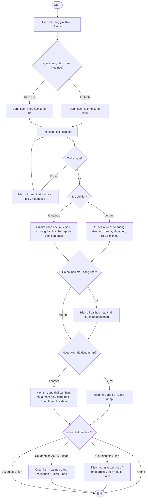

# AC - Public Catalog va Kham Pha Noi Dung

## Bieu do

## Chuc nang bao phu

- Trang gioi thieu Study.
- Danh sach va chi tiet lo trinh cong khai.
- Danh sach va chi tiet khoa hoc cong khai.
- Bai hoc mau.
- Dieu huong theo trang thai Guest/Learner.

## Quy tac

- Guest khong luu tien do, khong nop bai tap, khong xem link Zalo rieng tu.
- Chi noi dung `PUBLISHED` va duoc phep cong khai moi hien thi.
- Neu Learner chua xac thuc/onboarding, nut bat dau hoc phai dieu huong ve buoc con thieu.
- Neu Learner dang co lo trinh `ACTIVE`, khong cho kich hoat lo trinh moi.
