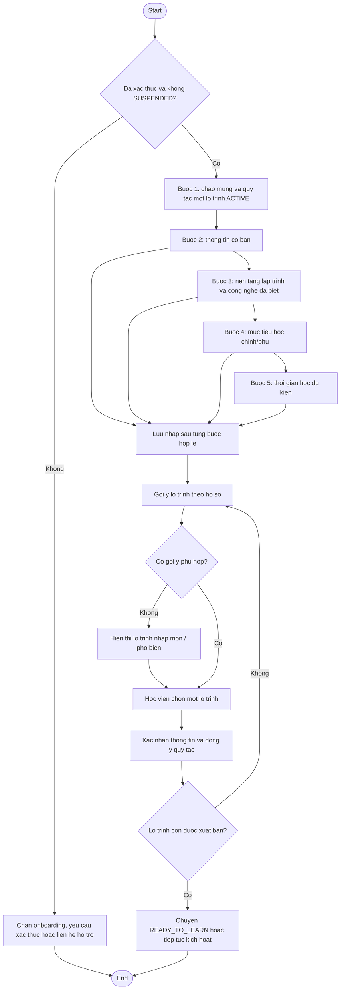

# AC - Onboarding Hoc Vien

## Bieu do

## Chuc nang bao phu

- Hien thi tien trinh onboarding.
- Luu nhap onboarding.
- Thu thap nen tang hoc tap.
- Thu thap muc tieu hoc.
- Goi y lo trinh.
- Xac nhan onboarding.

## Quy tac

- Onboarding bat buoc truoc khi kich hoat lo trinh va hoc noi dung rieng tu.
- Goi y lo trinh chi ho tro quyet dinh, khong tu dong ep buoc.
- Sau khi xac nhan, thong tin onboarding la co so cho dashboard va ho tro hoc tap.
