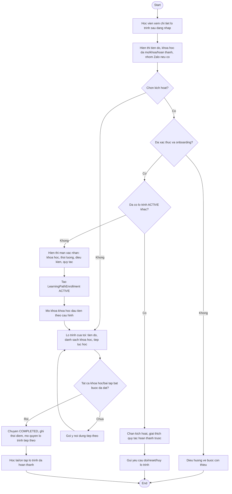

# AC - Lo Trinh Hoc va Dang Ky Lo Trinh

## Bieu do

## Chuc nang bao phu

- Xem chi tiet lo trinh sau dang nhap.
- Kich hoat lo trinh.
- Lo trinh cua toi.
- Mo khoa khoa hoc trong lo trinh.
- Hoan thanh lo trinh.
- Hoc lai lo trinh da hoan thanh.
- Yeu cau doi/reset lo trinh.

## Quy tac

- Hoc vien chi kich hoat lo trinh da xuat ban.
- Moi hoc vien chi co toi da mot lo trinh `ACTIVE`.
- Doi/reset/huy lo trinh la ngoai le do Admin xu ly va ghi ly do.
- Zalo khong phai dieu kien hoan thanh.
