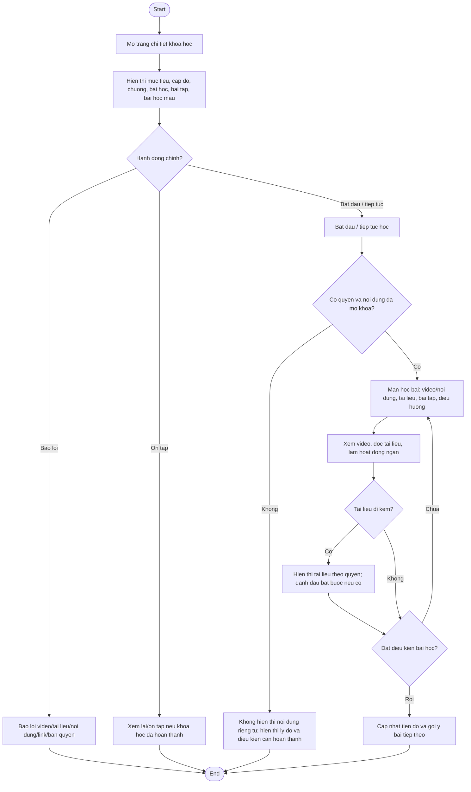

# AC - Khoa Hoc, Chuong, Bai Hoc va Noi Dung Hoc

## Bieu do

## Chuc nang bao phu

- Trang chi tiet khoa hoc.
- Danh sach chuong va bai hoc.
- Man hinh hoc bai.
- Tiep tuc hoc.
- Tai lieu di kem.
- Bao loi noi dung.

## Quy tac

- Hoc vien chi xem noi dung theo trang thai lo trinh/khoa hoc cua minh.
- Guest chi xem bai hoc mau hoac noi dung cong khai.
- Tai lieu tham khao khong tinh tien do neu khong duoc danh dau bat buoc.
- He thong phai giu moc tiep tuc hoc gan nhat.
