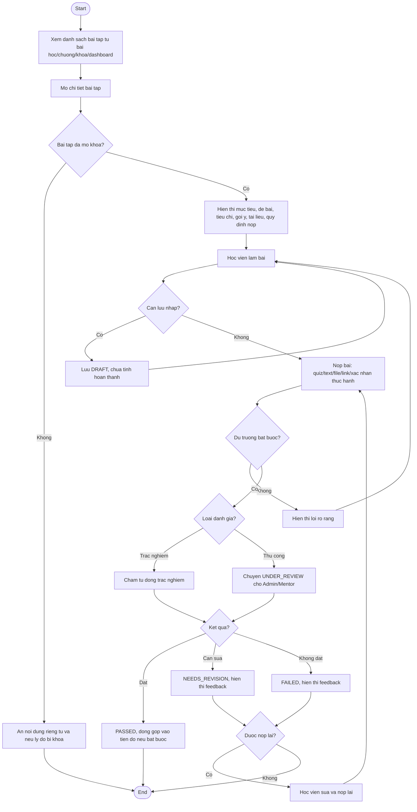

# AC - Bai Tap va Danh Gia

## Bieu do

## Chuc nang bao phu

- Xem danh sach bai tap.
- Xem de bai.
- Luu nhap bai lam.
- Nop bai.
- Cham bai va phan hoi.
- Nop lai bai.

## Quy tac

- Ban nhap khong duoc tinh la da nop.
- Bai tap bat buoc chi dat khi submission `PASSED`.
- Bai code cham tu dong quy mo lon nam ngoai V1.
- Feedback phai ro de hoc vien biet can sua gi.
