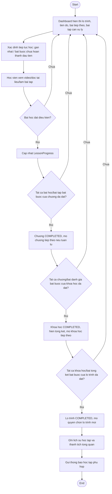

# AC - Tien Do Hoc Tap va Hoan Thanh

## Bieu do

## Chuc nang bao phu

- Dashboard hoc vien.
- Tiep tuc hoc.
- Tien do bai hoc.
- Tien do chuong.
- Tien do khoa hoc.
- Tien do lo trinh.
- Lich su hoc tap.

## Quy tac

- Tien do chi tinh noi dung bat buoc.
- Hoan thanh cap duoi phai cap nhat cac cap tien do lien quan.
- Hoc vien khong duoc sua truc tiep tien do.
- Khoa hoc co the tai su dung tien do neu cung phien ban xuat hien o nhieu lo trinh.
