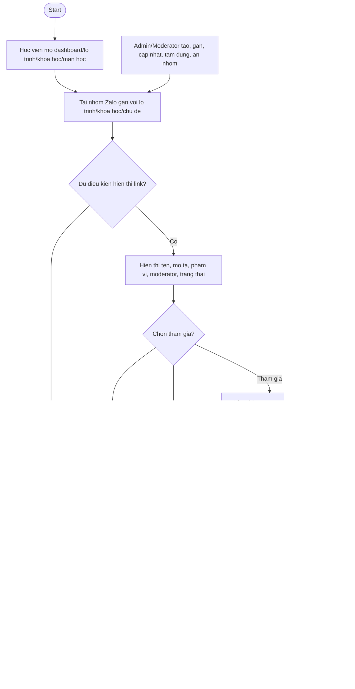

# AC - Cong Dong Zalo

## Bieu do

## Chuc nang bao phu

- Hien thi nhom phu hop.
- Dieu kien hien thi link Zalo.
- Xac nhan quy tac truoc khi mo link.
- Quy tac cong dong toi thieu.
- Bao cao van de cong dong.
- Quan ly nhom cong dong.

## Quy tac

- Study khong doc tin nhan/thanh vien Zalo trong V1.
- Guest khong xem link nhom rieng tu.
- Hoc vien phai xac nhan quy tac truoc khi mo link.
- Su kien mo link khong dong nghia da tham gia nhom.
