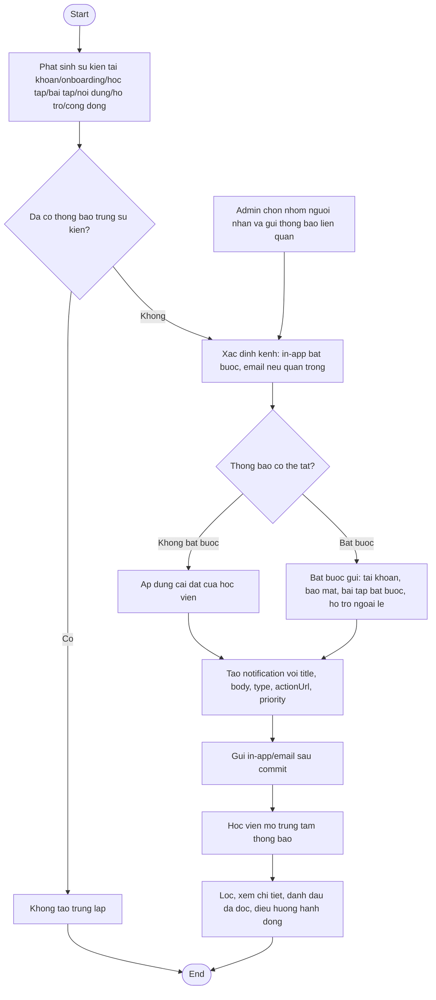

# AC - Thong Bao Nghiep Vu

## Bieu do

## Chuc nang bao phu

- Trung tam thong bao in-app.
- Email tai khoan.
- Nhac onboarding.
- Thong bao hoc tap.
- Thong bao bai tap.
- Thong bao cap nhat noi dung.
- Cai dat thong bao.
- Thong bao tu Admin.

## Quy tac

- In-app notification bat buoc trong V1.
- Email dung cho xac thuc, reset password va su kien quan trong.
- Tranh gui trung lap nhieu thong bao cho cung mot su kien.
- Admin chi gui thong bao den nhom hoc vien co lien quan.
