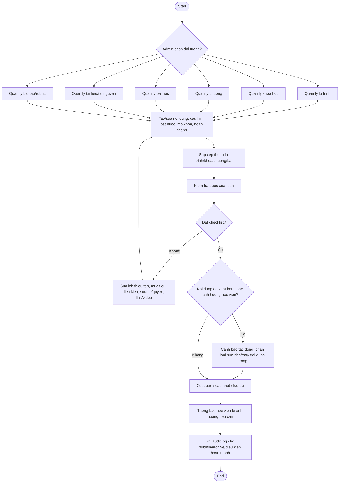

# AC - Admin Quan Tri Noi Dung

## Bieu do

## Chuc nang bao phu

- Quan ly lo trinh, khoa hoc, chuong, bai hoc, tai lieu, bai tap.
- Sap xep noi dung.
- Kiem tra truoc xuat ban.
- Cap nhat noi dung da xuat ban.

## Quy tac

- Noi dung chua `PUBLISHED` khong hien thi cho hoc vien.
- Noi dung bat buoc phai co dieu kien hoan thanh ro rang.
- Bai hoc mau phai cau hinh rieng, khong mac dinh cong khai.
- Thay doi noi dung da xuat ban phai canh bao tac dong.
