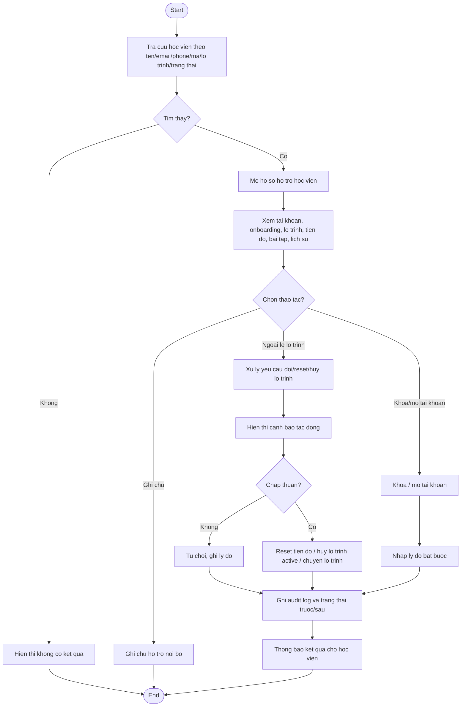

# AC - Admin Quan Ly Hoc Vien va Ho Tro Ngoai Le

## Bieu do

## Chuc nang bao phu

- Tra cuu hoc vien.
- Ho so ho tro hoc vien.
- Xem tien do hoc vien.
- Xu ly yeu cau doi lo trinh.
- Reset tien do.
- Huy lo trinh active.
- Khoa/mo tai khoan.
- Ghi chu ho tro.

## Quy tac

- Admin khong xem mat khau/OTP.
- Tien do khong duoc sua truc tiep ngoai quy trinh ngoai le.
- Doi/reset/huy lo trinh va khoa/mo tai khoan phai co ly do va audit log.
- Thao tac chuyen lo trinh khong duoc tao hai lo trinh `ACTIVE`.
