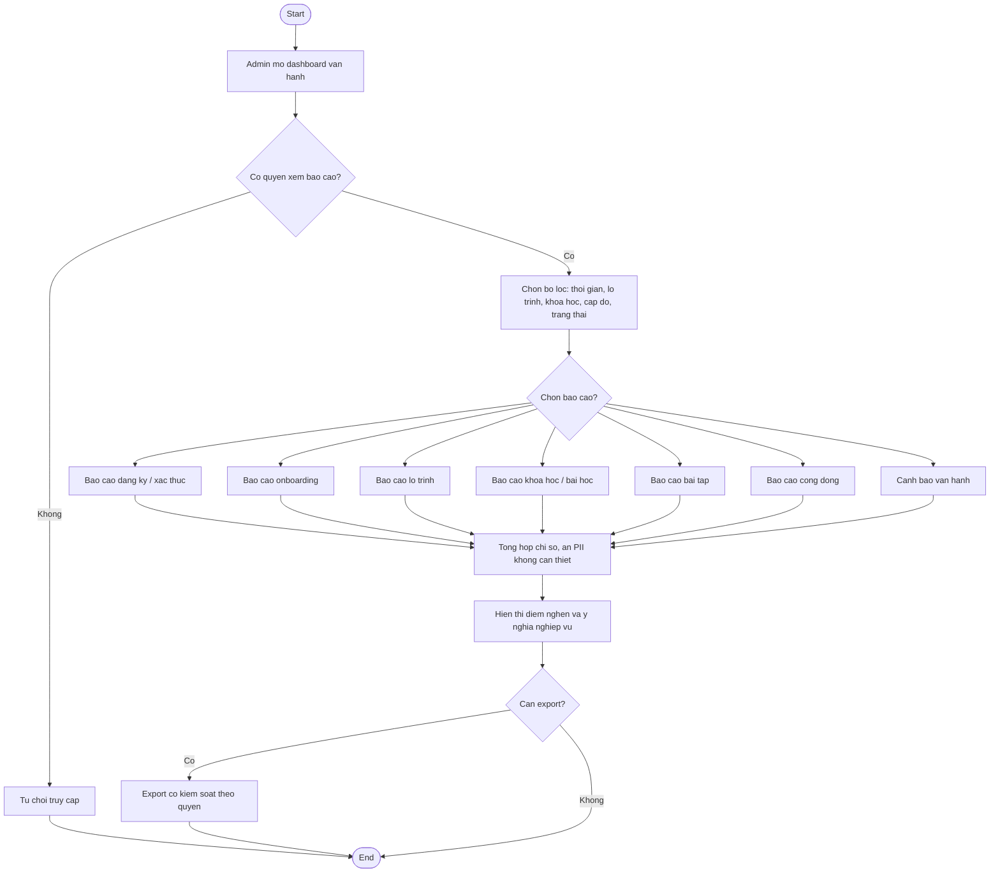

# AC - Admin Bao Cao va Chi So Van Hanh

## Bieu do

## Chuc nang bao phu

- Dashboard van hanh tong quan.
- Bao cao dang ky/xac thuc, onboarding, lo trinh, khoa hoc/bai hoc, bai tap, cong dong.
- Canh bao van hanh.

## Quy tac

- Chi so xem theo lo trinh, khoa hoc va thoi gian.
- Bao cao khong lam lo du lieu ca nhan khong can thiet.
- Luot mo link Zalo chi do nhu cau mo link.
- Bao cao ho tro quyet dinh, khong tu dong thay doi noi dung.
