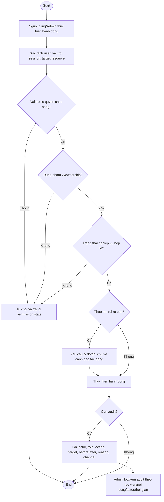

# AC - Vai Tro, Phan Quyen va Audit Log

## Bieu do

## Chuc nang bao phu

- Quyen Public, Learner, Content Admin, Learner Support, Community Moderator, Admin/Super Admin.
- Ma tran quyen tong quat.
- Thao tac can ghi audit.
- Xem audit log.

## Quy tac

- Quyen gan theo vai tro va muc dich nghiep vu, khong cap rong.
- Learner khong sua tien do/diem/trang thai lo trinh.
- Moderator khong sua noi dung hoc hoac tien do.
- Cap/thu hoi vai tro Admin/Support/Moderator va thao tac rui ro cao phai audit.
