# Study2Work Study - CLASS Diagram Mo Hinh Nghiep Vu

## Nguon phan tich

- Toan bo 14 tai lieu trong `S2W/docs/BD`.
- File nay la class diagram muc nghiep vu, co ghi ro kieu du lieu de lam co so trao doi truoc DD database/API chi tiet.

## Bieu do

```mermaid
classDiagram
    class User {
        +UUID id
        +String displayName
        +String email
        +String phone
        +AccountStatus accountStatus
        +Boolean contactVerified
        +DateTime createdAt
        +DateTime updatedAt
    }

    class UserProfile {
        +UUID id
        +UUID userId
        +String avatarUrl
        +String city
        +String schoolOrCompany
        +String currentMajorOrJob
        +String learningGoal
        +StringList knownTechnologies
        +Int weeklyStudyHours
        +DateTime updatedAt
    }

    class OnboardingRecord {
        +UUID id
        +UUID userId
        +ProgrammingLevel programmingLevel
        +StringList knownTechnologies
        +String mainGoal
        +StringList subGoals
        +Int weeklyStudyHours
        +UUID selectedLearningPathId
        +OnboardingStatus status
        +Int currentStep
        +DateTime confirmedAt
    }

    class Role {
        +UUID id
        +String code
        +String name
        +RoleScope scope
        +Boolean active
    }

    class UserRole {
        +UUID id
        +UUID userId
        +UUID roleId
        +DateTime assignedAt
    }

    class LearningPath {
        +UUID id
        +String slug
        +String title
        +String summary
        +String description
        +DifficultyLevel level
        +Int estimatedHours
        +PublishStatus publishStatus
        +UnlockMode unlockMode
        +DateTime publishedAt
    }

    class LearningPathCourse {
        +UUID id
        +UUID learningPathId
        +UUID courseId
        +Int orderIndex
        +Boolean required
    }

    class LearningPathEnrollment {
        +UUID id
        +UUID userId
        +UUID learningPathId
        +EnrollmentStatus status
        +Decimal progressPercent
        +DateTime startedAt
        +DateTime completedAt
        +String adminReason
    }

    class Course {
        +UUID id
        +String slug
        +String title
        +String summary
        +DifficultyLevel level
        +Int estimatedMinutes
        +PublishStatus publishStatus
        +DateTime publishedAt
    }

    class CourseEnrollment {
        +UUID id
        +UUID userId
        +UUID courseId
        +UUID learningPathEnrollmentId
        +CourseEnrollmentStatus status
        +Decimal progressPercent
        +DateTime startedAt
        +DateTime completedAt
    }

    class Chapter {
        +UUID id
        +UUID courseId
        +String title
        +String objective
        +Int orderIndex
        +Boolean required
        +UnlockCondition unlockCondition
    }

    class Lesson {
        +UUID id
        +UUID chapterId
        +String title
        +String objective
        +Int orderIndex
        +Boolean samplePublic
        +Boolean required
        +CompletionCondition completionCondition
        +PublishStatus publishStatus
    }

    class CourseMaterial {
        +UUID id
        +UUID lessonId
        +String title
        +MaterialType type
        +String resourceUrl
        +Boolean required
        +String source
        +UsageRightStatus usageRightStatus
    }

    class Exercise {
        +UUID id
        +UUID courseId
        +UUID chapterId
        +UUID lessonId
        +String title
        +ExerciseType type
        +Boolean required
        +DateTime dueAt
        +Boolean allowResubmit
        +Int maxScore
        +String rubric
        +PublishStatus publishStatus
    }

    class ExerciseSubmission {
        +UUID id
        +UUID exerciseId
        +UUID userId
        +SubmissionStatus status
        +Int attemptNo
        +String textAnswer
        +String fileUrl
        +String linkUrl
        +Int score
        +String feedback
        +DateTime submittedAt
        +DateTime reviewedAt
    }

    class LessonProgress {
        +UUID id
        +UUID userId
        +UUID lessonId
        +ProgressStatus status
        +Decimal videoWatchPercent
        +Boolean requiredMaterialsRead
        +Boolean selfMarkedDone
        +Boolean requiredExercisePassed
        +DateTime lastAccessedAt
        +DateTime completedAt
    }

    class CompletionRule {
        +UUID id
        +String targetType
        +UUID targetId
        +Boolean requiredItemsOnly
        +Int minimumScore
        +Decimal minimumVideoPercent
        +String description
    }

    class Notification {
        +UUID id
        +UUID userId
        +NotificationType type
        +String title
        +String body
        +NotificationPriority priority
        +ReadStatus readStatus
        +String actionUrl
        +DateTime createdAt
        +DateTime readAt
    }

    class NotificationSetting {
        +UUID id
        +UUID userId
        +Boolean optionalReminderEnabled
        +Boolean emailLearningReminderEnabled
        +Boolean mandatoryNoticeEnabled
        +DateTime updatedAt
    }

    class CommunityGroup {
        +UUID id
        +String name
        +CommunityScopeType scopeType
        +UUID scopeId
        +String joinLink
        +CommunityStatus status
        +String rules
        +UUID moderatorId
    }

    class CommunityJoinEvent {
        +UUID id
        +UUID userId
        +UUID communityGroupId
        +Boolean confirmedRules
        +String sourceScreen
        +DateTime openedAt
    }

    class SupportRequest {
        +UUID id
        +UUID userId
        +SupportRequestType type
        +String reason
        +UUID currentLearningPathId
        +UUID targetLearningPathId
        +SupportRequestStatus status
        +String adminDecision
        +DateTime resolvedAt
    }

    class AuditLog {
        +UUID id
        +UUID actorId
        +String actorRole
        +AuditAction action
        +String targetType
        +UUID targetId
        +Json beforeValue
        +Json afterValue
        +String reason
        +String channel
        +DateTime createdAt
    }

    class AccountStatus {
        <<enumeration>>
        REGISTERED_PENDING_VERIFICATION
        VERIFIED
        ONBOARDING_IN_PROGRESS
        READY_TO_LEARN
        ACTIVE
        SUSPENDED
    }

    class EnrollmentStatus {
        <<enumeration>>
        NOT_STARTED
        ACTIVE
        COMPLETED
        CANCELLED_BY_ADMIN
        RESET_BY_ADMIN
    }

    class SubmissionStatus {
        <<enumeration>>
        NOT_STARTED
        DRAFT
        SUBMITTED
        UNDER_REVIEW
        PASSED
        NEEDS_REVISION
        FAILED
    }

    class PublishStatus {
        <<enumeration>>
        DRAFT
        IN_REVIEW
        PUBLISHED
        UPDATED
        ARCHIVED
    }

    User "1" --> "1" UserProfile : has
    User "1" --> "0..1" OnboardingRecord : completes
    User "1" --> "*" UserRole : assigned
    Role "1" --> "*" UserRole : grants
    User "1" --> "*" LearningPathEnrollment : path history
    User "1" --> "*" CourseEnrollment : course progress
    User "1" --> "*" LessonProgress : lesson progress
    User "1" --> "*" ExerciseSubmission : submits
    User "1" --> "*" Notification : receives
    User "1" --> "1" NotificationSetting : configures
    User "1" --> "*" CommunityJoinEvent : opens link
    User "1" --> "*" SupportRequest : creates
    User "1" --> "*" AuditLog : performs

    LearningPath "1" --> "*" LearningPathCourse : orders
    LearningPathCourse "*" --> "1" Course : references
    LearningPath "1" --> "*" LearningPathEnrollment : enrolled by users
    LearningPath "1" --> "*" CompletionRule : completion rules
    LearningPath "1" --> "*" CommunityGroup : related groups

    LearningPathEnrollment "1" --> "*" CourseEnrollment : tracks courses
    Course "1" --> "*" Chapter : has
    Course "1" --> "*" CourseMaterial : has
    Course "1" --> "*" CompletionRule : completion rules
    Course "1" --> "*" CommunityGroup : related groups
    Course "1" --> "*" CourseEnrollment : enrolled by users

    Chapter "1" --> "*" Lesson : has
    Chapter "1" --> "*" Exercise : has
    Lesson "1" --> "*" CourseMaterial : uses
    Lesson "1" --> "*" Exercise : may require
    Lesson "1" --> "*" LessonProgress : tracked by
    Exercise "1" --> "*" ExerciseSubmission : receives

    CommunityGroup "1" --> "*" CommunityJoinEvent : records opens
    SupportRequest "*" --> "0..1" LearningPathEnrollment : affects
    AuditLog "*" --> "0..1" SupportRequest : traces
```

## Ghi chu kieu du lieu

| Kieu | Y nghia |
|---|---|
| `UUID` | Dinh danh duy nhat, khong dung email/slug lam khoa chinh. |
| `String` | Chuoi text ngan hoac dai tuy field; URL cung de dang String o muc BD. |
| `StringList` | Danh sach gia tri text, vi du cong nghe da biet. |
| `Int` | So nguyen, dung cho thu tu, diem, so gio/phut. |
| `Decimal` | So thap phan, dung cho ty le tien do hoac ty le xem video. |
| `Boolean` | Gia tri dung/sai. |
| `DateTime` | Moc thoi gian co timezone khi thiet ke API/DD chi tiet. |
| `Json` | Snapshot gia tri truoc/sau trong audit log. |
| `Enum` | Tap gia tri co gioi han, da the hien mot phan trong class diagram. |

## Quy tac nghiep vu gan voi class

- `LearningPathEnrollment` chi duoc co toi da mot ban ghi `ACTIVE` tren moi `User`.
- `Course` co the nam trong nhieu `LearningPath` thong qua `LearningPathCourse`.
- `LessonProgress` va `ExerciseSubmission` la du lieu he thong ghi; Learner khong duoc sua truc tiep.
- `CommunityJoinEvent` chi ghi nhan mo link Zalo, khong khang dinh tham gia nhom.
- `AuditLog` bat buoc cho thao tac Admin anh huong tai khoan, lo trinh, tien do, publish noi dung, quyen va thong bao thu cong.
