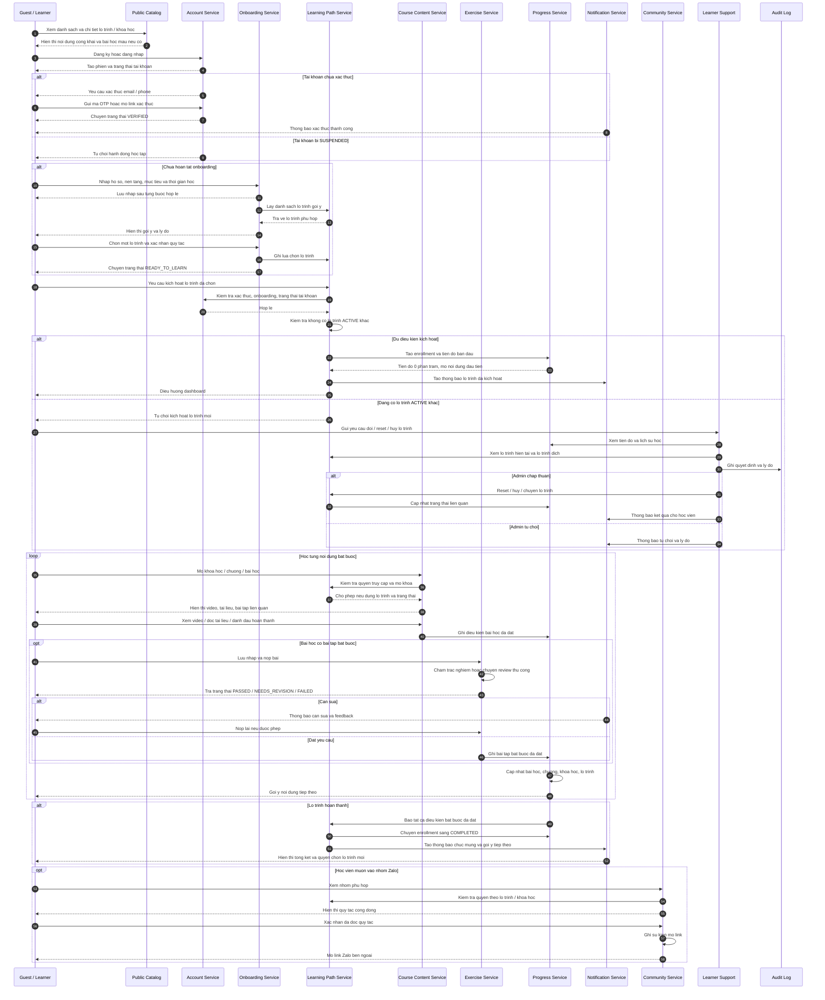

# Study2Work Study - SEQUENCE Diagram Hoc Vien Cot Loi

## Nguon phan tich

- Toan bo 14 tai lieu trong `S2W/docs/BD`.
- Trong tam: dang ky/xac thuc, onboarding, kich hoat lo trinh, hoc bai, nop bai, cap nhat tien do, hoan thanh, thong bao, Zalo va ho tro ngoai le.
- Day la sequence tong quan. Sequence chi tiet kem request/response JSON nam trong cac file `02` den `14` cung thu muc.

## Bieu do

## Giai thich chi tiet

### Pha kham pha va tai khoan

- `Public Catalog` chi tra ve noi dung cong khai: danh sach/chi tiet lo trinh, khoa hoc va bai hoc mau.
- `Account Service` quan ly dang ky, dang nhap, xac thuc kenh lien he va trang thai `SUSPENDED`.
- Tai khoan chua xac thuc khong duoc kich hoat lo trinh, hoc noi dung rieng tu, luu tien do chinh thuc hoac nop bai.

### Pha onboarding

- `Onboarding Service` luu nhap theo tung buoc, thu thap nen tang, muc tieu va thoi gian hoc.
- Goi y lo trinh den tu `Learning Path Service`, nhung hoc vien phai tu chon va xac nhan.
- Sau khi xac nhan, hoc vien dat trang thai `READY_TO_LEARN`.

### Pha kich hoat lo trinh

- `Learning Path Service` kiem tra xac thuc, onboarding, tai khoan khong bi tam ngung va khong co lo trinh `ACTIVE` khac.
- Neu hop le, he thong tao enrollment, tien do 0 phan tram, mo noi dung dau tien va gui thong bao.
- Neu da co lo trinh active, yeu cau moi bi tu choi. Doi/reset/huy chi di qua `Learner Support` va phai ghi `Audit Log`.

### Pha hoc va danh gia

- `Course Content Service` chi hien thi noi dung rieng tu neu quyen truy cap va dieu kien mo khoa hop le.
- `Progress Service` ghi nhan dieu kien bai hoc va cap nhat tien do tu bai hoc len chuong, khoa hoc, lo trinh.
- `Exercise Service` xu ly luu nhap, nop bai, cham trac nghiem, review thu cong va nop lai. Chi ket qua dat moi tinh cho bai tap bat buoc.

### Pha hoan thanh va cong dong

- Khi tat ca noi dung bat buoc dat yeu cau, lo trinh chuyen `COMPLETED`, he thong gui thong bao tong ket va mo quyen chon lo trinh moi.
- `Community Service` chi mo link Zalo sau khi hoc vien du quyen va xac nhan quy tac. Study khong doc thanh vien, tin nhan hay noi dung noi bo cua Zalo trong V1.
