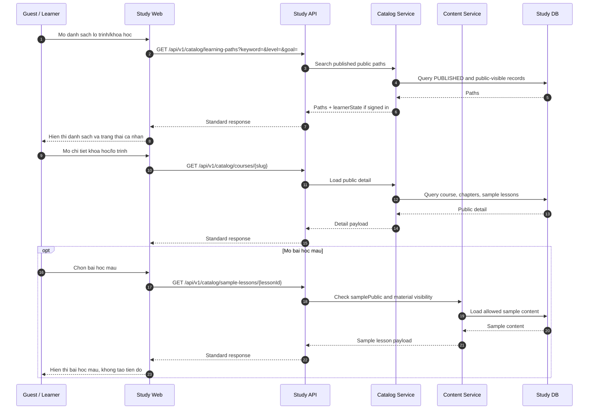

# SEQ - Public Catalog va Bai Hoc Mau

## Bieu do



## API duoc goi

### GET `/api/v1/catalog/learning-paths`

Request:

```json
{
  "query": {
    "keyword": "frontend",
    "goal": "frontend",
    "level": "BEGINNER",
    "durationMaxHours": 80,
    "page": 1,
    "pageSize": 20
  }
}
```

Response:

```json
{
  "success": true,
  "businessCode": "CATALOG_LEARNING_PATHS_LISTED",
  "message": "Learning paths loaded.",
  "data": [
    {
      "id": "uuid",
      "slug": "frontend-developer",
      "title": "Frontend Developer",
      "summary": "Lo trinh frontend cho nguoi moi.",
      "level": "BEGINNER",
      "estimatedHours": 80,
      "courseCount": 5,
      "publicStatus": "PUBLISHED",
      "learnerState": "NOT_JOINED"
    }
  ],
  "meta": {
    "pagination": {
      "page": 1,
      "pageSize": 20,
      "total": 1
    }
  },
  "traceId": "uuid"
}
```

### GET `/api/v1/catalog/sample-lessons/{lessonId}`

Request:

```json
{
  "path": {
    "lessonId": "uuid"
  }
}
```

Response:

```json
{
  "success": true,
  "businessCode": "CATALOG_SAMPLE_LESSON_LOADED",
  "message": "Sample lesson loaded.",
  "data": {
    "lessonId": "uuid",
    "title": "Bien va kieu du lieu",
    "samplePublic": true,
    "contentBlocks": [
      {
        "type": "VIDEO",
        "title": "Video gioi thieu",
        "url": "https://example.com/sample.mp4"
      }
    ],
    "materials": []
  },
  "meta": {},
  "traceId": "uuid"
}
```

## Ghi chu

- Guest khong tao tien do khi xem bai hoc mau.
- API chi tra noi dung `PUBLISHED` va public-visible.
