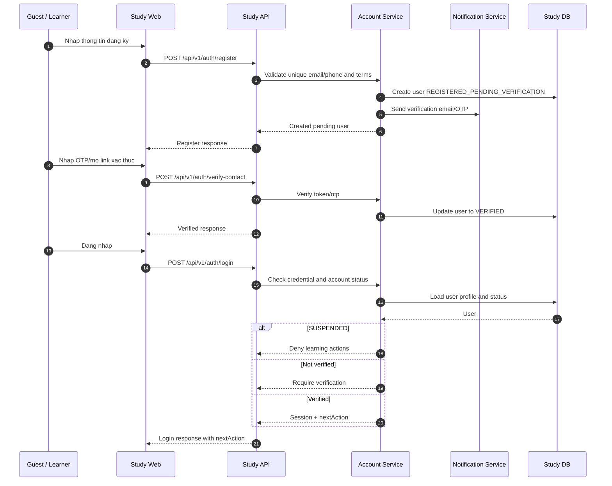

# SEQ - Dang Ky, Xac Thuc va Dang Nhap

## Bieu do



## API duoc goi

### POST `/api/v1/auth/register`

Request:

```json
{
  "displayName": "Nguyen Van A",
  "email": "learner@example.com",
  "phone": null,
  "password": "Secret123!",
  "acceptedTerms": true
}
```

Response:

```json
{
  "success": true,
  "businessCode": "ACCOUNT_REGISTERED_PENDING_VERIFICATION",
  "message": "Account created. Verification is required.",
  "data": {
    "userId": "uuid",
    "accountStatus": "REGISTERED_PENDING_VERIFICATION",
    "verificationChannel": "EMAIL",
    "nextAction": "VERIFY_CONTACT"
  },
  "meta": {},
  "traceId": "uuid"
}
```

### POST `/api/v1/auth/verify-contact`

Request:

```json
{
  "userId": "uuid",
  "channel": "EMAIL",
  "verificationCode": "123456"
}
```

Response:

```json
{
  "success": true,
  "businessCode": "ACCOUNT_CONTACT_VERIFIED",
  "message": "Contact verified.",
  "data": {
    "userId": "uuid",
    "accountStatus": "VERIFIED",
    "nextAction": "START_ONBOARDING"
  },
  "meta": {},
  "traceId": "uuid"
}
```

### POST `/api/v1/auth/login`

Request:

```json
{
  "identifier": "learner@example.com",
  "password": "Secret123!"
}
```

Response:

```json
{
  "success": true,
  "businessCode": "ACCOUNT_LOGIN_SUCCEEDED",
  "message": "Login succeeded.",
  "data": {
    "accessToken": "jwt",
    "user": {
      "id": "uuid",
      "displayName": "Nguyen Van A",
      "accountStatus": "READY_TO_LEARN"
    },
    "nextAction": "ACTIVATE_LEARNING_PATH"
  },
  "meta": {},
  "traceId": "uuid"
}
```

## Ghi chu

- Password/OTP khong hien thi cho Admin.
- Response that bai van dung envelope va `businessCode` on dinh.
