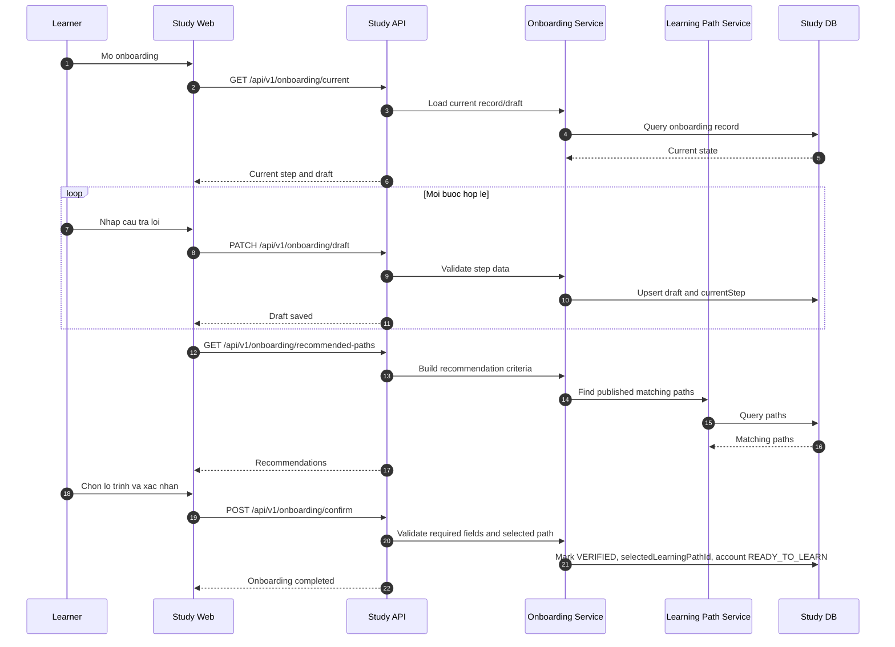

# SEQ - Onboarding va Goi Y Lo Trinh

## Bieu do



## API duoc goi

### PATCH `/api/v1/onboarding/draft`

Request:

```json
{
  "currentStep": 3,
  "basicInfo": {
    "city": "Ho Chi Minh",
    "schoolOrCompany": "S2W University"
  },
  "learningBackground": {
    "programmingLevel": "BEGINNER",
    "knownTechnologies": ["html-css", "git"]
  },
  "goals": {
    "mainGoal": "INTERNSHIP",
    "subGoals": ["FRONTEND"]
  },
  "weeklyStudyHours": 8
}
```

Response:

```json
{
  "success": true,
  "businessCode": "ONBOARDING_DRAFT_SAVED",
  "message": "Onboarding draft saved.",
  "data": {
    "recordId": "uuid",
    "status": "ONBOARDING_IN_PROGRESS",
    "currentStep": 3
  },
  "meta": {},
  "traceId": "uuid"
}
```

### POST `/api/v1/onboarding/confirm`

Request:

```json
{
  "selectedLearningPathId": "uuid",
  "confirmedInformation": true,
  "acceptedOneActivePathRule": true
}
```

Response:

```json
{
  "success": true,
  "businessCode": "ONBOARDING_COMPLETED",
  "message": "Onboarding completed.",
  "data": {
    "accountStatus": "READY_TO_LEARN",
    "selectedLearningPathId": "uuid",
    "nextAction": "ACTIVATE_LEARNING_PATH"
  },
  "meta": {},
  "traceId": "uuid"
}
```

## Ghi chu

- Goi y lo trinh khong tu dong kich hoat.
- Neu selected path bi go khoi publish truoc khi confirm, API tra loi loi business va yeu cau chon lai.
