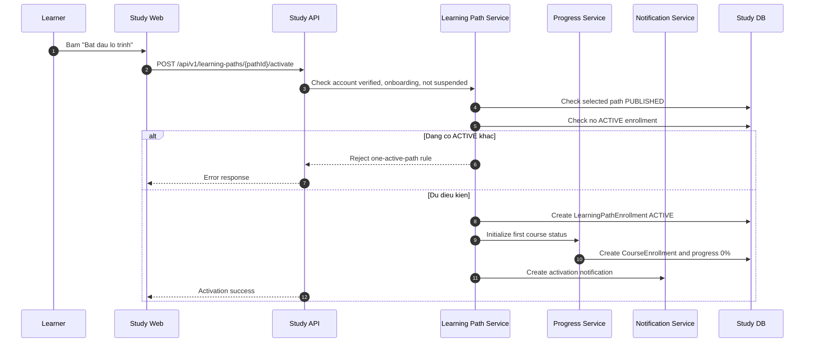

# SEQ - Kich Hoat Lo Trinh

## Bieu do



## API duoc goi

### POST `/api/v1/learning-paths/{pathId}/activate`

Request:

```json
{
  "path": {
    "pathId": "uuid"
  },
  "body": {
    "acceptedOneActivePathRule": true,
    "confirmedLearningPathSummary": true
  }
}
```

Response:

```json
{
  "success": true,
  "businessCode": "LEARNING_PATH_ACTIVATED",
  "message": "Learning path activated.",
  "data": {
    "enrollmentId": "uuid",
    "learningPathId": "uuid",
    "status": "ACTIVE",
    "progressPercent": 0,
    "firstCourse": {
      "courseId": "uuid",
      "status": "AVAILABLE"
    },
    "nextAction": {
      "type": "OPEN_DASHBOARD",
      "url": "/study/dashboard"
    }
  },
  "meta": {},
  "traceId": "uuid"
}
```

Error response:

```json
{
  "success": false,
  "businessCode": "LEARNING_PATH_ACTIVE_ALREADY_EXISTS",
  "message": "Complete or request support for the active path before activating another path.",
  "errors": [
    {
      "field": "pathId",
      "reason": "ACTIVE_ENROLLMENT_EXISTS"
    }
  ],
  "traceId": "uuid"
}
```

## Ghi chu

- API phai atomic: enrollment, first course unlock va notification event khong duoc lech trang thai.
- Khong cho kich hoat lo trinh chua publish/archived.
