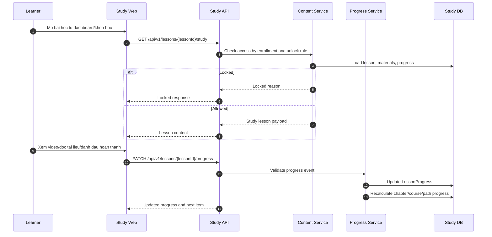

# SEQ - Hoc Bai va Cap Nhat Tien Do

## Bieu do



## API duoc goi

### GET `/api/v1/lessons/{lessonId}/study`

Request:

```json
{
  "path": {
    "lessonId": "uuid"
  }
}
```

Response:

```json
{
  "success": true,
  "businessCode": "LESSON_STUDY_LOADED",
  "message": "Lesson loaded.",
  "data": {
    "lessonId": "uuid",
    "title": "Vong lap for",
    "accessStatus": "ALLOWED",
    "content": {
      "videoUrl": "https://example.com/video.mp4",
      "readingMarkdown": "Lesson content"
    },
    "materials": [
      {
        "id": "uuid",
        "title": "Slide bai hoc",
        "type": "PDF",
        "required": true,
        "url": "https://example.com/slide.pdf"
      }
    ],
    "progress": {
      "status": "IN_PROGRESS",
      "videoWatchPercent": 45
    }
  },
  "meta": {},
  "traceId": "uuid"
}
```

### PATCH `/api/v1/lessons/{lessonId}/progress`

Request:

```json
{
  "eventType": "VIDEO_PROGRESS",
  "videoWatchPercent": 82,
  "requiredMaterialIdsRead": ["uuid"],
  "selfMarkedDone": false
}
```

Response:

```json
{
  "success": true,
  "businessCode": "LESSON_PROGRESS_UPDATED",
  "message": "Lesson progress updated.",
  "data": {
    "lessonId": "uuid",
    "lessonStatus": "COMPLETED",
    "chapterProgressPercent": 60,
    "courseProgressPercent": 35,
    "pathProgressPercent": 12,
    "nextItem": {
      "type": "LESSON",
      "id": "uuid",
      "title": "Vong lap while"
    }
  },
  "meta": {},
  "traceId": "uuid"
}
```

## Ghi chu

- Progress event chi duoc chap nhan khi lesson duoc mo khoa.
- Tai lieu bat buoc can doc/xac nhan moi tinh vao dieu kien neu Admin cau hinh.
