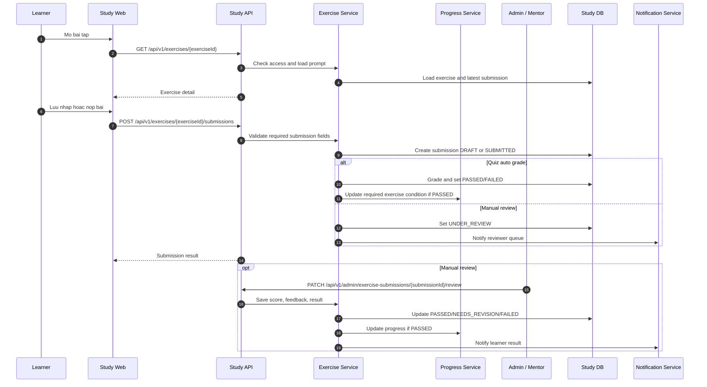

# SEQ - Bai Tap, Nop Bai, Cham Bai va Nop Lai

## Bieu do



## API duoc goi

### POST `/api/v1/exercises/{exerciseId}/submissions`

Request:

```json
{
  "path": {
    "exerciseId": "uuid"
  },
  "body": {
    "mode": "SUBMIT",
    "answers": [
      {
        "questionId": "uuid",
        "selectedOptionIds": ["uuid"]
      }
    ],
    "textAnswer": "Giai thich y tuong",
    "fileUrl": null,
    "linkUrl": "https://github.com/user/repo"
  }
}
```

Response:

```json
{
  "success": true,
  "businessCode": "EXERCISE_SUBMISSION_CREATED",
  "message": "Exercise submitted.",
  "data": {
    "submissionId": "uuid",
    "exerciseId": "uuid",
    "status": "UNDER_REVIEW",
    "attemptNo": 1,
    "submittedAt": "2026-07-05T10:00:00Z"
  },
  "meta": {},
  "traceId": "uuid"
}
```

### PATCH `/api/v1/admin/exercise-submissions/{submissionId}/review`

Request:

```json
{
  "path": {
    "submissionId": "uuid"
  },
  "body": {
    "result": "NEEDS_REVISION",
    "score": 65,
    "feedback": "Can bo sung test case va giai thich thuat toan.",
    "allowResubmitUntil": "2026-07-12T10:00:00Z"
  }
}
```

Response:

```json
{
  "success": true,
  "businessCode": "EXERCISE_SUBMISSION_REVIEWED",
  "message": "Submission reviewed.",
  "data": {
    "submissionId": "uuid",
    "status": "NEEDS_REVISION",
    "score": 65,
    "resubmitAllowed": true
  },
  "meta": {},
  "traceId": "uuid"
}
```

## Ghi chu

- `DRAFT` khong tinh hoan thanh.
- Chi `PASSED` moi thoa bai tap bat buoc.
- Review cua Admin/Mentor can quyen phu hop.
