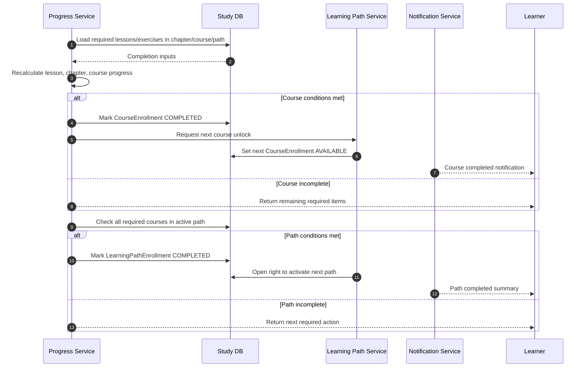

# SEQ - Hoan Thanh Khoa Hoc va Lo Trinh

## Bieu do



## API duoc goi

### GET `/api/v1/progress/summary`

Request:

```json
{
  "query": {
    "learningPathEnrollmentId": "uuid"
  }
}
```

Response:

```json
{
  "success": true,
  "businessCode": "PROGRESS_SUMMARY_LOADED",
  "message": "Progress summary loaded.",
  "data": {
    "learningPathEnrollmentId": "uuid",
    "pathStatus": "ACTIVE",
    "pathProgressPercent": 85,
    "courses": [
      {
        "courseId": "uuid",
        "status": "COMPLETED",
        "progressPercent": 100
      }
    ],
    "remainingRequiredItems": [
      {
        "type": "EXERCISE",
        "id": "uuid",
        "title": "Final lab"
      }
    ]
  },
  "meta": {},
  "traceId": "uuid"
}
```

### POST `/api/v1/progress/recalculate`

Request:

```json
{
  "learningPathEnrollmentId": "uuid",
  "trigger": {
    "type": "LESSON_COMPLETED",
    "id": "uuid"
  }
}
```

Response:

```json
{
  "success": true,
  "businessCode": "PROGRESS_RECALCULATED",
  "message": "Progress recalculated.",
  "data": {
    "courseStatusChanged": true,
    "completedCourseIds": ["uuid"],
    "pathStatus": "COMPLETED",
    "nextPathActivationAllowed": true
  },
  "meta": {},
  "traceId": "uuid"
}
```

## Ghi chu

- Endpoint recalculate co the la internal/application use case neu backend khong expose public API.
- Noi dung tuy chon khong chan hoan thanh.
