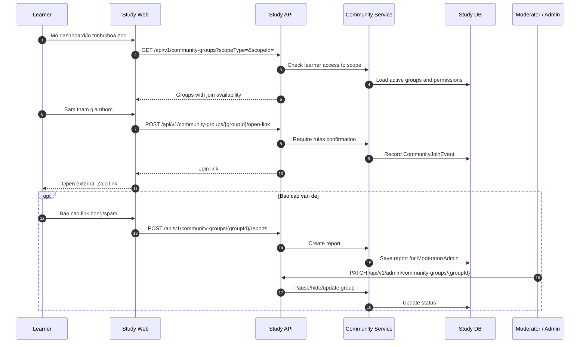

# SEQ - Mo Link Zalo va Bao Cao Cong Dong

## Bieu do



## API duoc goi

### POST `/api/v1/community-groups/{groupId}/open-link`

Request:

```json
{
  "path": {
    "groupId": "uuid"
  },
  "body": {
    "confirmedRules": true,
    "sourceScreen": "LEARNING_PATH_DETAIL"
  }
}
```

Response:

```json
{
  "success": true,
  "businessCode": "COMMUNITY_LINK_OPENED",
  "message": "Community link is ready.",
  "data": {
    "groupId": "uuid",
    "joinLink": "https://zalo.me/g/example",
    "eventId": "uuid",
    "meaning": "LINK_OPENED_ONLY"
  },
  "meta": {},
  "traceId": "uuid"
}
```

### POST `/api/v1/community-groups/{groupId}/reports`

Request:

```json
{
  "reason": "BROKEN_LINK",
  "description": "Link khong mo duoc."
}
```

Response:

```json
{
  "success": true,
  "businessCode": "COMMUNITY_REPORT_CREATED",
  "message": "Community report created.",
  "data": {
    "reportId": "uuid",
    "status": "OPEN"
  },
  "meta": {},
  "traceId": "uuid"
}
```

## Ghi chu

- `joinLink` chi tra ve khi hoc vien du quyen va da xac nhan quy tac.
- Study khong dong bo thanh vien/tin nhan Zalo trong V1.
