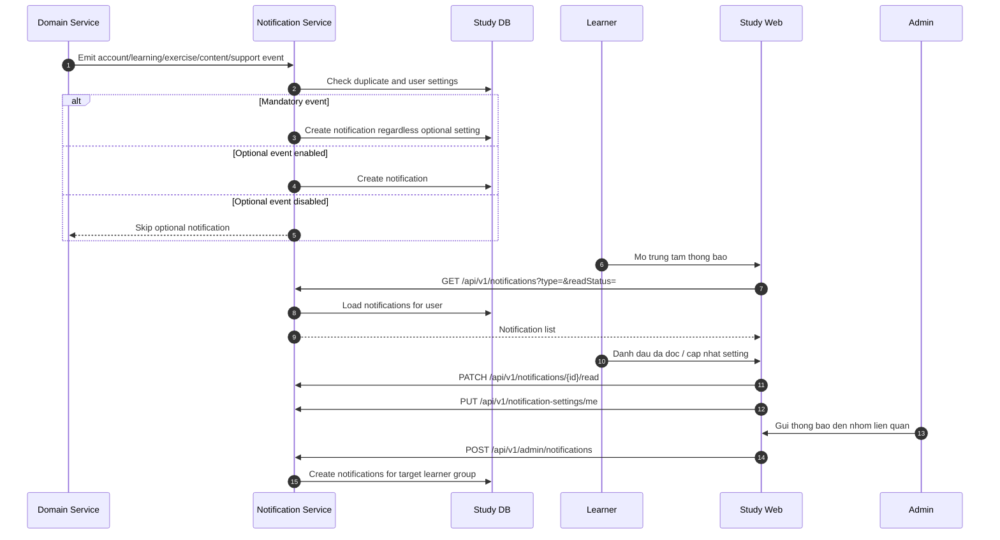

# SEQ - Trung Tam Thong Bao, Cai Dat va Thong Bao Admin

## Bieu do



## API duoc goi

### GET `/api/v1/notifications`

Request:

```json
{
  "query": {
    "type": "EXERCISE",
    "readStatus": "UNREAD",
    "page": 1,
    "pageSize": 20
  }
}
```

Response:

```json
{
  "success": true,
  "businessCode": "NOTIFICATIONS_LISTED",
  "message": "Notifications loaded.",
  "data": [
    {
      "id": "uuid",
      "type": "EXERCISE",
      "title": "Bai tap can sua",
      "body": "Ban can nop lai bai tap.",
      "readStatus": "UNREAD",
      "actionUrl": "/study/exercises/uuid"
    }
  ],
  "meta": {
    "pagination": {
      "page": 1,
      "pageSize": 20,
      "total": 1
    }
  },
  "traceId": "uuid"
}
```

### POST `/api/v1/admin/notifications`

Request:

```json
{
  "target": {
    "type": "LEARNING_PATH",
    "learningPathId": "uuid"
  },
  "channels": ["IN_APP"],
  "priority": "NORMAL",
  "title": "Noi dung da cap nhat",
  "body": "Khoa hoc cua ban co tai lieu moi.",
  "actionUrl": "/study/courses/slug"
}
```

Response:

```json
{
  "success": true,
  "businessCode": "ADMIN_NOTIFICATION_CREATED",
  "message": "Notification created for related learners.",
  "data": {
    "notificationBatchId": "uuid",
    "targetedLearnerCount": 120
  },
  "meta": {},
  "traceId": "uuid"
}
```

## Ghi chu

- Thong bao bat buoc khong nen cho tat hoan toan.
- Admin chi gui den nhom hoc vien lien quan.
