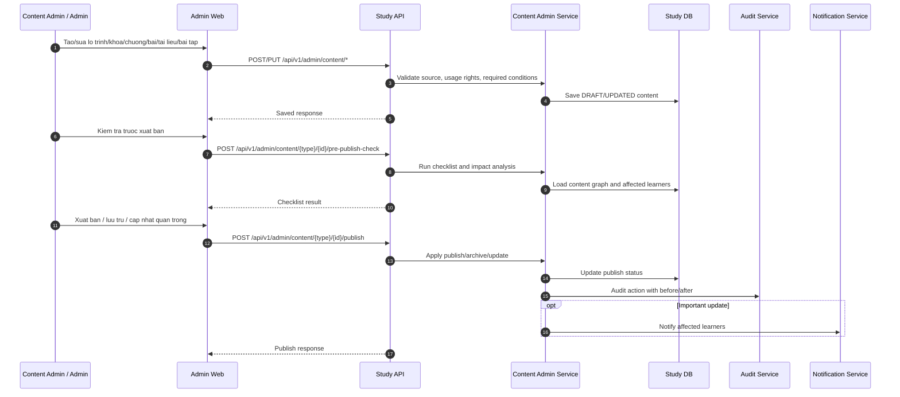

# SEQ - Admin Quan Tri Noi Dung va Xuat Ban

## Bieu do



## API duoc goi

### POST `/api/v1/admin/content/{type}/{id}/pre-publish-check`

Request:

```json
{
  "path": {
    "type": "COURSE",
    "id": "uuid"
  }
}
```

Response:

```json
{
  "success": true,
  "businessCode": "CONTENT_PRE_PUBLISH_CHECK_COMPLETED",
  "message": "Pre-publish check completed.",
  "data": {
    "passed": false,
    "issues": [
      {
        "code": "MISSING_COMPLETION_RULE",
        "message": "Required lesson must have completion condition."
      }
    ],
    "affectedLearnerCount": 0
  },
  "meta": {},
  "traceId": "uuid"
}
```

### POST `/api/v1/admin/content/{type}/{id}/publish`

Request:

```json
{
  "path": {
    "type": "COURSE",
    "id": "uuid"
  },
  "body": {
    "targetStatus": "PUBLISHED",
    "changeType": "IMPORTANT_UPDATE",
    "reason": "Cap nhat dieu kien hoan thanh va tai lieu moi.",
    "notifyAffectedLearners": true
  }
}
```

Response:

```json
{
  "success": true,
  "businessCode": "CONTENT_PUBLISHED",
  "message": "Content published.",
  "data": {
    "contentType": "COURSE",
    "id": "uuid",
    "publishStatus": "PUBLISHED",
    "auditLogId": "uuid",
    "notificationBatchId": "uuid"
  },
  "meta": {},
  "traceId": "uuid"
}
```

## Ghi chu

- Publish/archive/thay doi dieu kien hoan thanh phai audit.
- Noi dung khong ro nguon/quyen su dung khong duoc publish.
