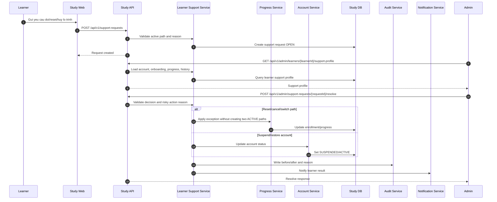

# SEQ - Admin Ho Tro Ngoai Le Lo Trinh va Tai Khoan

## Bieu do



## API duoc goi

### POST `/api/v1/support-requests`

Request:

```json
{
  "type": "CHANGE_LEARNING_PATH",
  "currentLearningPathId": "uuid",
  "targetLearningPathId": "uuid",
  "reason": "Em chon sai lo trinh ngay tu dau.",
  "note": "Muon doi sang Frontend."
}
```

Response:

```json
{
  "success": true,
  "businessCode": "SUPPORT_REQUEST_CREATED",
  "message": "Support request created.",
  "data": {
    "requestId": "uuid",
    "status": "OPEN"
  },
  "meta": {},
  "traceId": "uuid"
}
```

### POST `/api/v1/admin/support-requests/{requestId}/resolve`

Request:

```json
{
  "decision": "APPROVED",
  "action": "SWITCH_LEARNING_PATH",
  "targetLearningPathId": "uuid",
  "adminReason": "Hoc vien chon sai lo trinh trong 24h dau.",
  "notifyLearner": true
}
```

Response:

```json
{
  "success": true,
  "businessCode": "SUPPORT_REQUEST_RESOLVED",
  "message": "Support request resolved.",
  "data": {
    "requestId": "uuid",
    "status": "RESOLVED",
    "appliedAction": "SWITCH_LEARNING_PATH",
    "auditLogId": "uuid"
  },
  "meta": {},
  "traceId": "uuid"
}
```

## Ghi chu

- Reset/huy/chuyen lo trinh can canh bao tac dong va ly do.
- Suspend account chan hoc, nop bai va link Zalo rieng tu.
