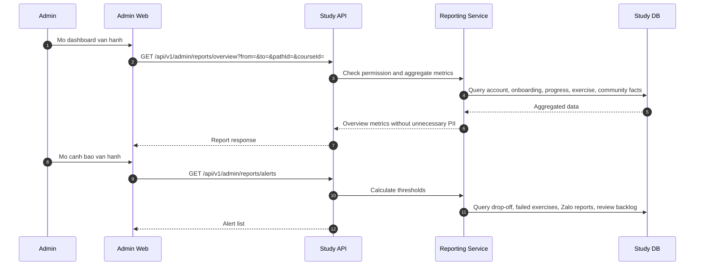

# SEQ - Bao Cao va Canh Bao Van Hanh

## Bieu do



## API duoc goi

### GET `/api/v1/admin/reports/overview`

Request:

```json
{
  "query": {
    "from": "2026-07-01",
    "to": "2026-07-31",
    "learningPathId": "uuid",
    "courseId": null
  }
}
```

Response:

```json
{
  "success": true,
  "businessCode": "ADMIN_REPORT_OVERVIEW_LOADED",
  "message": "Overview report loaded.",
  "data": {
    "newAccounts": 120,
    "verificationRate": 0.82,
    "onboardingCompletionRate": 0.74,
    "activatedLearners": 68,
    "pathCompletionRate": 0.18,
    "zaloLinkOpenCount": 240
  },
  "meta": {
    "filters": {
      "from": "2026-07-01",
      "to": "2026-07-31"
    }
  },
  "traceId": "uuid"
}
```

### GET `/api/v1/admin/reports/alerts`

Request:

```json
{
  "query": {
    "severity": "HIGH",
    "learningPathId": "uuid"
  }
}
```

Response:

```json
{
  "success": true,
  "businessCode": "ADMIN_OPERATION_ALERTS_LOADED",
  "message": "Operation alerts loaded.",
  "data": [
    {
      "type": "EXERCISE_HIGH_FAIL_RATE",
      "severity": "HIGH",
      "targetId": "uuid",
      "targetTitle": "Final lab",
      "metricValue": 0.62
    }
  ],
  "meta": {},
  "traceId": "uuid"
}
```

## Ghi chu

- Bao cao tong hop khong can tra ve PII.
- Canh bao ho tro quyet dinh, khong tu dong thay doi noi dung.
