# Study2Work Study - UC Diagram Tong Quan

## Nguon phan tich

- Toan bo 14 tai lieu trong `S2W/docs/BD`.
- Muc tieu cua file nay la trinh bay use case tong quan de de nhin; cac luong chi tiet nam trong thu muc `AC` va `SEQUENCE`.

## Bieu do

```mermaid
flowchart TB
    subgraph Actors["Actors"]
        direction LR
        Guest["Guest"]
        Learner["Learner"]
        ContentAdmin["Content Admin"]
        LearnerSupport["Learner Support"]
        Moderator["Community Moderator"]
        Admin["Admin / Super Admin"]
    end

    subgraph PublicArea["01. Public Catalog"]
        direction TB
        PC01["Xem gioi thieu Study"]
        PC02["Tim kiem / loc lo trinh"]
        PC03["Xem chi tiet lo trinh"]
        PC04["Tim kiem / loc khoa hoc"]
        PC05["Xem chi tiet khoa hoc"]
        PC06["Xem bai hoc mau"]
    end

    subgraph LearnerEntry["02-04. Tai khoan, Onboarding, Lo trinh"]
        direction TB
        ACC01["Dang ky / dang nhap"]
        ACC02["Xac thuc tai khoan"]
        ACC03["Quan ly ho so"]
        ONB01["Hoan tat onboarding"]
        LP01["Kich hoat mot lo trinh"]
        LP02["Xem lo trinh cua toi"]
        LP03["Yeu cau doi / reset lo trinh"]
    end

    subgraph LearningArea["05-07. Hoc tap, Bai tap, Tien do"]
        direction TB
        CRS01["Xem khoa hoc / chuong / bai hoc"]
        CRS02["Hoc video / tai lieu"]
        CRS03["Bao loi noi dung"]
        EX01["Xem / lam / nop bai tap"]
        EX02["Nhan cham bai / phan hoi"]
        PRG01["Theo doi dashboard va tien do"]
        PRG02["Hoan thanh khoa hoc / lo trinh"]
    end

    subgraph CommunityNotify["08-09. Cong dong va Thong bao"]
        direction TB
        COM01["Xem nhom Zalo phu hop"]
        COM02["Xac nhan quy tac va mo link"]
        COM03["Bao cao van de cong dong"]
        NOTI01["Xem trung tam thong bao"]
        NOTI02["Cai dat thong bao"]
    end

    subgraph AdminArea["10-13. Admin, Bao cao, RBAC, Audit"]
        direction TB
        ADM01["Quan tri lo trinh / khoa hoc / noi dung"]
        ADM02["Quan tri bai tap / rubric"]
        ADM03["Quan ly nhom cong dong"]
        ADM04["Tra cuu va ho tro hoc vien"]
        ADM05["Xu ly ngoai le lo trinh / tien do"]
        ADM06["Khoa / mo tai khoan"]
        ADM07["Gui thong bao Admin"]
        RPT01["Xem dashboard / bao cao van hanh"]
        RBAC01["Kiem tra vai tro / quyen"]
        AUD01["Ghi / xem audit log"]
    end

    Guest --> PublicArea
    Guest --> ACC01

    Learner --> PublicArea
    Learner --> LearnerEntry
    Learner --> LearningArea
    Learner --> CommunityNotify

    ContentAdmin --> ADM01
    ContentAdmin --> ADM02
    ContentAdmin --> ADM07
    Moderator --> ADM03
    Moderator --> COM03
    LearnerSupport --> ADM04
    LearnerSupport --> ADM05
    Admin --> AdminArea

    ACC02 -.->|required before onboarding accepted| ONB01
    ONB01 -.->|required before path activation| LP01
    LP01 -.->|opens learning access| CRS01
    CRS02 -.->|updates| PRG01
    EX01 -.->|passed required exercise| PRG01
    PRG01 -.->|all required items done| PRG02
    COM02 -.->|records open-link event only| COM01
    ADM05 -.->|must audit| AUD01
    ADM06 -.->|must audit| AUD01
    ADM01 -.->|publish/archive must audit| AUD01
    RBAC01 -.->|guards risky actions| AdminArea
```

## Giai thich chi tiet

### Cach bo cuc

- Bieu do dung `flowchart TB` va gom use case theo 5 vung nghiep vu de han che duong chi huong cat nhau.
- Actor chi noi vao vung chuc nang thay vi noi truc tiep toi moi use case nho. Cac quan he bat buoc duoc de bang duong dut net.
- Cac chi tiet cua tung vung duoc tach thanh file rieng trong `AC` va `SEQUENCE`.

### Actor va pham vi

- `Guest`: chi xem public catalog, bai hoc mau va thuc hien dang ky/dang nhap.
- `Learner`: hoc vien da co tai khoan, su dung onboarding, lo trinh, hoc tap, bai tap, tien do, cong dong va thong bao theo trang thai quyen.
- `Content Admin`: quan tri noi dung hoc tap va cau hinh bai tap.
- `Learner Support`: xem ho so ho tro va tham gia xu ly ngoai le.
- `Community Moderator`: quan ly nhom Zalo va bao cao cong dong.
- `Admin / Super Admin`: van hanh tong hop, bao cao, audit, tai khoan, quyen va thao tac rui ro cao.

### Quy tac chinh

- Xac thuc tai khoan va onboarding la dieu kien truoc khi kich hoat lo trinh.
- Mot hoc vien chi co toi da mot lo trinh `ACTIVE`.
- Tien do chi tinh noi dung bat buoc; bai tap bat buoc can dat moi duoc tinh.
- Zalo la cong dong ngoai he thong; su kien mo link khong dong nghia da tham gia nhom.
- Thao tac Admin anh huong tai khoan, lo trinh, tien do, publish noi dung, quyen va thong bao thu cong phai co audit log.
